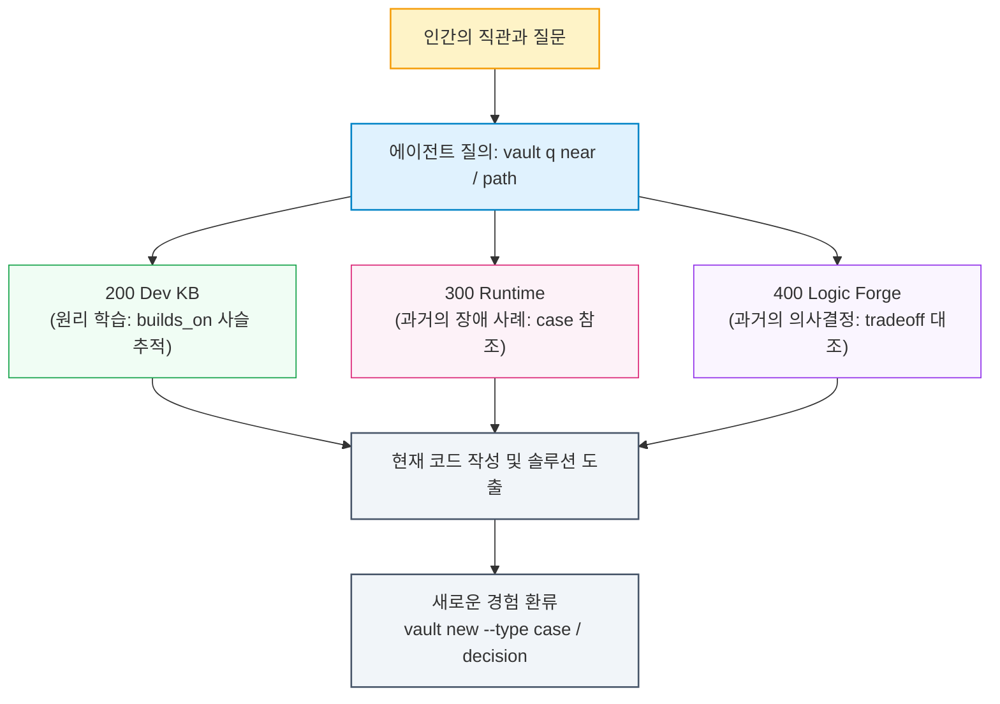

- table of contents
{:toc}

0편에서 나는 나 자신을 '기록의 악마'라고 소개했다. 군대 시절 600일간 하루도 빠짐없이 썼던 수기 일기에서 출발해 노션의 PARA 체계를 거쳐 지금의 옵시디언 볼트(Obsidian Vault)에 이르기까지, 나는 겪고 배운 모든 것을 기록으로 남겨왔다.

이 시리즈에서 우리는 참으로 먼 길을 걸어왔다. 즉각 구현을 금지하고([[1편]](/tech/1-agent-rules/)), TDD를 종교로 받아들였으며([[2편]](/tech/2-tdd-religion/)), 객체지향 설계로 에이전트를 가르치고([[3편]](/tech/3-teach-object-design/)), 'All Passed' 착시의 함정을 파괴했다([[4편]](/tech/4-all-passed-empty-screen/)). 그리고 다중 에이전트를 워크트리로 격리하고([[5편]](/tech/5-cmux-parallel-worktree/)), 세션의 망각을 극복하기 위해 저장소에 운영 대장을 세웠으며([[6편]](/tech/6-repo-governance/)), 비대해진 규칙집을 깎아내는 다이어트와 코드 청소([[7편]](/tech/7-rule-pruning/))를 거쳐, 혼자서 클라우드 인프라와 배포를 단순화하고([[8편]](/tech/8-cloud-infra-evolution/)), 거대한 프론트엔드 UI 스파게티를 FSD 아키텍처로 썰어냈다([[9편]](/tech/9-frontend-fsd/)).

하지만 이 모든 워크플로우의 심장부에는 언제나 하나의 거대한 질문이 도사리고 있었다. 
**"그렇게 매일 쏟아져 나오는 수천 개의 노트와 경험들은 지금 어디에서, 어떻게 살아 숨 쉬고 있는가?"**

기록을 좋아하는 사람이라면 누구나 한 번쯤 마주하는 악몽이 있다. 노트가 쌓일수록 지식이 늘어나는 것이 아니라, 오히려 거대한 '디지털 쓰레기 매립지'가 되어가는 악몽이다. 이 글은 수천 개의 파편화된 노트를 하나의 유기적인 지식 온톨로지로 엮어내기 위해 태그를 통제하고, 문서 사이의 관계를 정의하며, CLI 관문으로 스키마를 강제하기까지의 치열한 엔지니어링 기록이다.

이번 글에서는 최근에 내 Obsidian Vault에 도입한 Ontology 개념에 대해서만 소개하고, Obsidian을 통한 Personal Knowledge Managment System은 추후에 하나의 시리즈로 다뤄볼까 한다. <!-- Obsidian 시리즈 쓰면 링크 삽입 -->

---

## 1. 600일의 수기 일기에서 5,000개의 옵시디언 노트로: 고립된 노트들의 무덤

내가 기록을 시작한 이유는 당연하지만 나중에 다시 읽기 위해서다. 사람의 기억은 유한하니까, 그 때 내가 어떤 생각을 했고 어떤 지식을 얻었고 등등을 돌이켜보면 재미있을 뿐만 아니라 굉장히 유익할 거라 생각한 것이다.

기록하는 행위 자체에는 묘한 마력이 있다. 무언가를 적고 저장하는 순간, 우리는 그 지식을 온전히 소유했다고 착각한다. 군대에서 쓰던 일기가 서랍에 쌓여갈 때도 그랬고, 노션에 읽은 책과 플레이한 게임, 공부한 코드 스니펫들을 정리할 때도 그랬다.

특히 옵시디언으로 이주한 뒤 그 수집욕은 폭발했다. 매일의 작업 일지(Day Notes), 학습한 기술 문서(Dev KB), 장애 회고(Incident Response), 아키텍처 결정(Decision Node), 그리고 책과 유튜브의 필사 노트까지. 어느덧 볼트 안의 문서는 수천 개에 달했고, 위키링크는 2만 개를 훌쩍 넘어섰다.

하지만 어느 순간 서늘한 진실이 눈앞을 가렸다. **검색되지 않는 노트는 존재하지 않는 것이나 다름없었고, 맥락 없이 흩어진 노트는 쓰레기였다.** 즉, 결국 내 머릿속에서 해당 노트를 썼다는 사실 자체를 망각하게 되는 경우도 많았고, CLI Agent를 Obsidian Vault 안에서 활동하도록 할 때도 내가 원하는 정보를 얻기 위해서는 상당한 컨텍스트롤 소모하는 비효율이 존재했다. 이를 위해 최소한의 조치들은 당연히 취해져있었다. 그 중 가장 명확하다고 할 수 있는게 Obsidian에서 기본 제공하는 태그 시스템이다. 예를들어 AWS에 관련된 노트면 `#AWS` 이런식으로 적음으로서 해당 노트를 분류할 수 있는 기능이다.

분명 3개월 전에 Docker 멀티스테이지 빌드에서 마주친 에러를 해결하고 어딘가에 적어둔 기억이 나는데, 검색창(`Cmd+O`나 grep)에 떠오르는 키워드를 몇 개 쳐봐도 나오지 않는다. 당시에 내가 제목을 뭐라고 붙였는지, 어떤 단어로 요약했는지가 기억나지 않으면 그 노트는 영원히 디지털 심해 속으로 가라앉았다. 결국 나는 3개월 전의 내가 이미 풀어둔 문제를 구글링과 AI 검색을 통해 처음부터 다시 삽질하고 있었다.

옵시디언이 자랑하는 화려한 '그래프 뷰(Graph View)'를 켜보았다. 화면 가득 반짝이는 수천 개의 점과 선들. 수십개 수준의 노트라면 충분히 시각화해도 인지적으로 충분히 수용 가능하겠지만, 어떻게 수천개의 노트를 시각화했을 때 그것의 유기적인 연결을 사람의 머릿속에서 그릴 수 있겠는가? 그래프는 겉보기에는 인간의 뇌신경망처럼 경이로워 보였지만, 냉정하게 까뒤집어보면 그것은 그저 서로 어디로 이어지는지도 모르는 실타래 뭉치, 즉 **'예쁜 쓰레기 은하수'**에 불과했다 ~~*(근데 정말 예뻐서 감상하기 좋긴하다 흐흐흐)*~~. 노트를 무작정 많이 쓰는 것만으로는 아무것도 해결되지 않았다. 고립된 노트들의 무덤 위에서 나도, AI도 길을 잃었다.

{:width="700" loading="lazy"}

글을 적고 있는 현 시점의 Obsidian Graph View
{:.figcaption}

> **[기술적 사실 및 볼트 원천 근거]**
> - **볼트 실제 규모 측정치** (`vault CLI` 기준): 노드 3,974개, 엣지 12,256개, 위키링크 24,783개, 태그 3,311개 (263종 고유 어휘).
> - **스키마 정본의 문제의식** (`Vault 온톨로지 스키마 정본`): "위키링크 24,783개와 태그 263종이 있지만, 링크와 태그만으로는 문서의 역할과 관계를 기계가 일관되게 해석하기 어렵다."
> - **검색 4단계 이론**: 찾아보기(Lookup) ➔ 둘러보기(Browse) ➔ 태그(Tag) ➔ 뜻밖의 발견(Serendipity). 단순 전문 검색(Full-text search)과 키워드 매칭은 1·2단계만 해결할 뿐, 지식 간의 유기적 탐색(3·4단계)을 지원하지 못함.

---

## 2. 환각된 태그와 자유 태깅의 붕괴: `vault tags` 화이트리스트의 결단

고립을 탈출하기 위해 가장 먼저 손을 댔던 것은 대다수의 노트 작성자들이 그러하듯 **'태그(Tags)'**였다. 분류 폴더가 가진 경직성을 벗어나, 문서에 자유롭게 태그를 달면 다차원적인 연결이 일어날 것이라 믿었다.

하지만 자유에는 언제나 대가가 따랐다. 인간인 나 자신부터가 일관성이 없었다. 어떤 날은 `#python`이라고 달았다가, 어떤 날은 `#python3`, 또 어떤 날은 `#파이썬`이나 `#Python-Async`라고 달았다. 복수형과 단수형, 대소문자, 언어가 뒤섞이며 어휘 공간은 순식간에 난지도처럼 오염되었다.

진짜 대재앙은 **AI 에이전트에게 문서 정리를 맡기기 시작하면서** 폭발했다.
에이전트는 놀라운 언어적 창의력을 발휘해 매번 새로운 태그를 '환각'해냈다. 문서 하나를 요약시켰더니 `#효율적인_비동기_처리_패턴_모음`, `#초보자를_위한_도커_가이드` 같은 세상에 단 하나뿐인 1회용 문장형 태그들을 수백 개씩 만들어냈다. 태그의 존재 이유는 '모아서 묶어보기 위함'인데, 모든 문서가 저마다 유일한 태그를 갖고 있으니 태그의 검색 기능은 완전히 사망했다.

설상가상으로 마크다운 문법의 특성상 본문에 등장하는 헥스 색상 코드(예: `#6B4E8C`)나 이슈 번호(예: `\#15`), CSS 컬러 속성들까지 옵시디언 파서가 모조리 '태그'로 긁어모았다. 태그 창을 열면 수천 개의 색상 코드와 외계어 같은 기호들이 쓰레기처럼 넘쳐났다.

나는 결단을 내려야 했다. **자유 태깅을 폐지하고, 에이전트의 태그 생성권을 완전히 박탈하기로 했다.**

첫째, **`vault tags` 읽기 전용 화이트리스트**를 도입했다. 볼트 내에서 사용 가능한 태그 어휘는 오직 사전에 엄격히 등록된 화이트리스트 목록으로 한정된다. 에이전트는 이 목록에 '정확히 존재하는 문자열'만 문서에 붙일 수 있으며, 목록 밖에 있는 새 태그를 직접 생성하는 것은 전면 금지되었다. 새로운 어휘를 추가하는 권한은 오직 시스템의 주인인 인간에게만 남겨두었다. 에이전트가 새로운 태그가 필요하다고 판단하면 오직 "제안"만 할 수 있을 뿐이다.

둘째, **태그의 자리를 frontmatter의 `tags:` 블록 하나로 단일화**했다. 본문 한가운데 아무렇게나 `#태그`를 박아넣는 인라인 표기는 불법화되었으며, 이를 어길 시 `vault lint`가 즉각 빌드를 거부하도록 만들었다. 본문의 `#` 기호는 반드시 백틱으로 감싸거나 이스케이프(`\#`)하도록 강제했다.

태그를 '자유로운 연상의 도구'에서 '기계적으로 검증 가능한 통제된 어휘(Controlled Vocabulary)'로 격상시킨 순간, 비로소 태그 목록은 쓰레기통에서 정갈한 색인 카탈로그로 거듭났다.

> **[기술적 사실 및 볼트 원천 근거]**
> - **볼트 루트 규칙 3**: "`vault tags`가 **읽기 전용 화이트리스트**다. 이 목록에 정확히 있는 문자열만 붙이고, 밖은 전부 새 태그이므로 제안만 한다. 어휘 확장은 유저 권한이다. 붙인 태그는 반드시 보고한다. 자리는 frontmatter `tags:` 하나뿐이다. 본문 인라인 태그는 `vault lint`가 위반으로 잡는다. `#` 오인 주의(hex `#6B4E8C`, 번호 `\#15` 백틱 감싸기/이스케이프)."
> - **태그 위치 일원화 마이그레이션**: 본문 인라인 태그에서 frontmatter `tags:`로 정본 자리를 일원화하면서, 기존에 프론트매터에 숨어 있어 그래프 빌더가 읽지 못하던 태그 517개가 발굴되어 그래프 태그 수가 2,794개에서 3,311개로 정상화됨.
> - **태그 축과 값의 분리 정책**: 새로운 축(Axis) 추가는 금지, 지시형 네임스페이스(`Person/`, `Projects/`, `Source/`, `Stack/`)의 값 확장은 유연하게 허용하되 판단형 태그는 엄격한 근거 요구. `vault tags --judge <태그>`로 판정.

---

## 3. 단순 링크(`[[]]`)를 넘어 2계층 관계로: 구조(2종)와 의미(7종)

태그를 정돈했지만 여전히 풀리지 않는 깊은 갈증이 있었다. 바로 **문서와 문서 사이의 연결, 즉 위키링크(`[[]]`)의 문제**였다.

옵시디언의 가장 강력한 무기는 문서 이름을 대괄호 두 개로 묶기만 하면 연결되는 양방향 링크다. 나 역시 문서마다 관련 있어 보이는 링크를 수십 개씩 달아두었다. 네트워크 관련 노트를 쓰면서 `[[CIDR]]`, `[[서브넷 마스크]]`, `[[VPC]]`, `[[라우팅 테이블]]`을 링크하는 식이었다.

하지만 이 링크들은 기계에게, 그리고 1년 뒤의 나에게 아무런 설명도 해주지 못했다.
- 이 링크는 이 문서를 이해하기 위해 **먼저 읽어야 하는 선행 지식**인가?
- 아니면 단순히 **비슷한 주제를 다룬 참고 자료**인가?
- 그것도 아니면 이 문서가 저 문서의 주장을 **반박**하거나, 과거의 잘못된 설정을 **대체**했다는 뜻인가?

화살표에 이름이 없는 그래프는 그저 거대한 미로일 뿐이다. 링크가 2만 개가 넘어가자, 한 문서를 열었을 때 연결된 수십 개의 링크 중 지금 내게 필요한 문맥이 무엇인지 파악하는 데만 한참이 걸렸다.

그렇다고 시중의 시맨틱 웹(Semantic Web)이나 RDF 온톨로지처럼 2만 개의 링크 하나하나에 복잡한 온톨로지 술어(Predicate)를 달려고 덤벼드는 것은 1인 개발자에게 자살행위였다. 유지보수 비용이 지식의 가치를 압도해 버리기 때문이다.

나는 철저한 **2계층 최소주의(Minimalism)**를 택했다:
1. **일반 위키링크**: 예상치 못한 연결과 뜻밖의 발견(Serendipity)을 위한 자유로운 무명(untyped) 엣지로 그대로 남겨둔다.
2. **구조 관계 2종**: 시스템과 에이전트가 읽는 순서와 계보를 즉각 파악해야 하는 뼈대 관계다.
3. **의미 관계 7종**: 이 문서가 대체 왜 존재하는지 존재 이유를 증명하는 핵심 관계다.

```yaml
---
type: concept
summary: VPC 피어링의 동작 원리와 라우팅 정책
builds_on:
  - "[[VPC]]"
  - "[[라우팅 테이블]]"
derived_from:
  - "[[사내 멀티 테넌트 VPC 장애 회고]]"
applies:
  - "[[최소 권한의 원칙]]"
---
```

---

### 3.1. 구조 관계 2종: 읽는 순서와 대체 이력

구조 관계는 문서가 어떤 순서로 배치되고, 어떻게 역사를 이어받는가를 다룬다.

#### 1) `builds_on`: "무엇을 먼저 읽어야 하는가?" (학습 사슬과 이행 폐쇄)
`builds_on`은 지식의 선행 조건을 정의한다. "문서 A를 온전히 이해하기 위해 사전에 반드시 통과해야 하는 바탕 개념은 무엇인가?"에 답한다. 

수많은 관련 문서 중 어떤 것을 선행 개념으로 골라야 하는가? 무분별한 링크를 막기 위해 세 가지 엄격한 통과 테스트를 정의했다:
- **막힘 테스트**: "B를 모르면 A를 아예 읽을 수 없는가?" (알면 좋은 정도는 일반 위키링크의 몫이다)
- **비대칭 테스트**: "`B builds_on A`가 성립하지 않는가?" (양쪽 다 그럴듯하다면 그것은 개념적 선후가 아니라 대등한 연관이다)
- **이행 건전성 테스트**: "A→B이고 B→C일 때, A를 이해하려면 C가 반드시 참인가?" (가짜 간선을 걸러낸다)

여기에 **"직접 부모만 적는다"**는 불변식을 더했다. A가 B를 필요로 하고 B가 C를 필요로 한다면, A에는 C를 적지 않고 오직 B만 적는다. 상위 개념은 그래프 추론 엔진이 이행 폐쇄(Transitive Closure)를 타고 자동으로 계산해 도달하기 때문이다. 이 원칙 덕분에 선행 개념은 자연스럽게 1~3개로 좁혀지며, 오염을 막기 위한 '최대 3개' 상한선은 억지 제한이 아니라 규칙의 자연스러운 결과가 되었다.

이 관계는 SQLite 재귀 CTE(Common Table Expression)를 통해 단 0.5ms 만에 터미널에 선행 개념 체인을 정렬해 낸다 (`vault q path "VPC 피어링"` ➔ `CIDR` ➔ `서브넷 마스크` ➔ `라우팅 테이블` ➔ `VPC` ➔ `VPC 피어링`). 에이전트에게 맥락을 주입할 때 이보다 완벽한 순서는 없다.

#### 2) `supersedes`: "이 문서는 과거의 무엇을 대체했는가?" (지식의 진화와 폐기)
엔지니어링 지식은 영원하지 않다. 기술이 발전하고 아키텍처가 바뀌면 과거의 문서는 폐기되거나 더 나은 정본으로 통합된다.
- **판단 기준**: 원본이 볼트에 계속 남아있다면 `builds_on`이고, 옛 문서를 지우거나 완전히 흡수했다면 `supersedes`다.
- 따라서 `supersedes`가 가리키는 링크는 이미 삭제된 옛 문서이므로 린트 검사에서 미해결(Unresolved link)로 나오는 것이 정상이다. 
과거의 레거시 문서를 명시적으로 끊어냄으로써 볼트 안의 기술 부채를 청산하는 공식 폐기 선언이다.

---

### 3.2. 의미 관계 7종과 '시험 문장' 판정법

`builds_on`이 "무엇을 먼저 읽어야 하는가"를 묻는다면, 의미 관계는 **"이 문서가 대체 왜 존재하는가"**를 설명한다. 수십 개의 역량 질문을 분류하고 압축하여 엄선한 7가지 관계다.

관계의 판정은 자의적이어선 안 된다. 사람이 읽어서 참과 거짓을 즉각 가릴 수 있는 **'시험 문장(Test Sentence)'**을 통과할 때만 관계를 부여한다:

| 의미 관계 | 시험 문장 (이대로 읽어서 참일 때만) | 실전 용례 |
|---|---|---|
| **`derived_from`** | **"A는 B에서 나왔다"** | 원칙이나 설계의 뿌리가 된 실전 장애 사건(`case`)이나 도서 필사(`capture`) |
| **`contradicts`** | **"A와 B는 둘 다 참일 수 없다"** | 서로 다른 설계 원칙 간의 상충이나 양립 불가능한 결정 |
| **`diverges_from`**| **"A는 B를 바탕으로 삼되 일부를 바꿨다"** | 오픈소스나 표준 패턴을 우리 프로젝트의 특수성에 맞게 변형한 결정 |
| **`applies`** | **"A는 B라는 원칙을 적용했다"** | 실전 구현체나 설계서가 `299 Principles`의 특정 원칙을 채택한 것 |
| **`informed_by`** | **"A는 B의 영향을 받았다"** (직접 근거는 아님) | 직접적 도출은 아니지만 사고의 틀에 깊은 영감을 준 외부 아티클이나 강연 |
| **`expresses`** | **"A는 B라는 가치를 구현한다"** | 구체적 도구 체계나 규칙이 추상적인 엔지니어링 철학을 대변할 때 |
| **`answered_by`** | **"A라는 질문이 B에서 답을 얻는다"** | 호기심이나 고민을 담은 의문 노트가 해결 노트를 만났을 때 |

혼동하기 쉬운 관계는 단 한 줄의 질문으로 명쾌하게 갈라낸다:
- **`derived_from` vs `informed_by`**: "B가 없었으면 A를 아예 작성하지 못했는가?" 그렇다면 `derived_from`, 단순히 참고나 영감에 그쳤다면 `informed_by`.
- **`contradicts` vs `diverges_from`**: "두 주장이 한 시스템에서 동시에 참일 수 있는가?" 둘 다 양립할 수 없다면 `contradicts`, 일부분을 수정한 변형이라면 `diverges_from`.

#### 설계 비화 1: 한국어 시험 문장과 영어 문법이 싸우면 영어 문법이 이긴다
처음에는 「A가 B에게 영감을 주었다」라는 생각으로 `informs`라는 능동형 이름을 붙였다. 하지만 한국어 시험 문장은 「A는 B의 영향을 받았다」라는 수동태였고, RDF 상위 표준인 `prov:wasInfluencedBy` 역시 주어가 영향을 받는 구조였다. 이름과 실제 의미 방향이 정반대로 뒤집혀 있었던 것이다. 우리는 지체 없이 이름을 **`informed_by`**로 수정했다. 기계가 국제 표준 온톨로지와 결합하는 접점에서는 언제나 엄밀한 영어 문법이 우선해야 하기 때문이다.

#### 설계 비화 2: 「어겼다(`violates`)」는 관계가 아니다
온톨로지 초기 설계에는 `violates`라는 관계가 있었다. 하지만 수천 개 문서를 전수조사한 결과, `violates` 관계의 사용 빈도는 놀랍게도 **0회**였다.
이유는 단순했다. **원칙을 어긴 것은 과거의 코드나 실행이지, 문서 자체가 아니었기 때문이다.**
문서는 그 실패를 기록하고 교정한 결과물이다. 게다가 문서를 작성하는 과정에서 기존 원칙과의 어긋남을 발견하면 그 자리에서 내용을 수정해 조화를 이루므로, 시스템에는 영구적인 위반 관계가 남지 않는다. 쓰는 시점에 해소되어 사라질 것을 관계망으로 남길 필요는 없었다.

---

### 3.3. 문서보다 작은 단위: 섹션 앵커 (`#`) 문법

문서 단위의 링크만으로는 해결되지 않는 정밀도의 한계가 있었다. 
예를 들어 `Q1. Better Developer/_Insights.md`라는 단일 문서 안에 분기별 핵심 인사이트 24개가 빼곡하게 적혀 있을 때, 원칙 문서에서 단순히 문서 전체를 가리키면 24개 중 대체 어떤 내용에서 파생되었는지 맥락이 완전히 유실된다:

```yaml
# X: 24개 중 어느 것에서 나온 원칙인지 기계도 인간도 알 수 없다
derived_from: ["[[Q1. Better Developer/_Insights]]"]

# O: 3번 인사이트라는 핀포인트 맥락이 완벽히 보존된다
derived_from: ["[[Q1. Better Developer/_Insights#인사이트 3]]"]
```

우리는 인위적이고 가독성을 해치는 블록 ID(`^abc123`)를 배제하고, 옵시디언이 기본 지원하는 **섹션 앵커(`#헤딩`)**를 온톨로지 문법으로 흡수했다. 지난 수개월간의 이력을 전수조사했을 때 번호가 매겨진 핵심 헤딩은 수정되거나 삭제된 적이 단 한 번도 없었기 때문에, 섹션 앵커는 가장 안정적인 미세 식별자가 되어주었다.

---

### 3.4. AI의 폭주를 막는 `proposed:` 거버넌스와 메타 상태

아무리 엄격한 문법을 정의해도, AI 에이전트에게 관계 선언의 전권을 맡기면 순식간에 환각 관계가 침투한다. 이를 제어하기 위해 **'승인 대기 블록'**을 도입했다:

```yaml
derived_from:              # 인간이 확인하고 보증한 확정 관계 (asserted)
  - "[[사내 멀티 테넌트 VPC 장애 회고]]"
proposed:                  # 에이전트가 제안한 후보 관계 (승인 대기)
  derived_from:
    - "[[CIDR 서브넷 마이그레이션 일지]]"
```
에이전트는 새로운 관계를 발견했을 때 `proposed:` 블록에만 후보를 등록할 수 있다. 인간이 이를 검토하고 고개를 끄덕이면, 단 한 줄을 위로 옮기는 것만으로 공식 온톨로지로 승격된다.

여기에 정보의 성격을 명확히 규정하는 **네 가지 메타 상태**가 지식의 잡음을 걷어낸다:
- **`source_unknown: true` ("찾아보았으나 출처가 없었다")**: 단순히 값이 비어있는 것(null)과 "철저히 조사했으나 원천 기록이 유실되었음을 확인했다"는 것은 전혀 다르다. 이 불리언 플래그가 박힌 문서는 에이전트가 불필요하게 과거 커밋을 뒤지며 토큰을 낭비하는 헛발질을 영구히 차단한다.
- **`as_of: YYYY-MM-DD`**: 문서를 적은 날짜(`created`)와 구별하여, 그 사건이 실제로 발생했던 프로덕션 시점을 박제한다.
- **`status: archived`**: 흥미가 식거나 임무를 마쳐 보관함(900)으로 보낸 상태. 결코 오류(invalid)나 폐기(deprecated)가 아니므로 필요하면 언제든 복귀한다.
- **`needs_review: true`**: 아키텍처 변경으로 재검토가 필요한 문서를 즉시 수면 위로 올리는 알람.

단순한 메모장에 불과했던 텍스트 파일들이 정교한 구조 관계, 의미 관계, 섹션 앵커, 그리고 검증 메타데이터를 갖추면서, 볼트는 비로소 인간과 AI가 티끌 하나 없이 투명하게 소통할 수 있는 **'진짜 지식 온톨로지'**로 거듭났다.

---

## 4. CLI로 검증하는 온톨로지 스키마: `vault new`가 아니면 생성조차 되지 않는다

우리는 4편과 6편을 통해 값비싼 교훈을 얻었다. 
**"규칙을 문서에 적어두는 것만으로는 아무것도 지켜지지 않는다."**
에이전트에게 "앞으로는 프론트매터 규칙을 잘 지켜서 문서를 만들어줘"라고 시스템 프롬프트에 아무리 간곡히 적어봤자, 에이전트는 토큰 몇 개가 빗나가면 금세 필수 필드를 빼먹거나 유효하지 않은 `type`을 멋대로 지어냈다. 인간 역시 바쁘면 프론트매터를 대충 건너뛰고 본문부터 갈겨쓰기 일쑤였다.

스킬이나 프롬프트는 권고일 뿐이다. 모델이 무시하면 그만이다. 
**결정론적으로 시스템을 지탱하는 것은 오직 실패 시 프로세스를 멈춰 세우는 도구(CLI)와 훅(Hook)뿐이다.**

그래서 나는 볼트 전역 관리 도구인 `vault CLI`를 만들고, 에이전트 교칙에 철칙 하나를 못 박았다.
> **"새 문서는 반드시 `vault new`로 만든다. Write 도구로 볼트에 `.md` 파일을 직접 생성하는 것을 일절 금지한다."**

```bash
vault new --type concept --title "이벤트 루프" --dir "200 Dev Knowledge Base/201 CS" --summary "비동기 I/O 처리를 위한 이벤트 루프의 동작 원리" --builds-on "[[동시성과 병렬성]]"
```

이 규칙이 작동하는 방식은 매정할 정도로 엄격하다.
1. `vault new` 명령어는 파일 시스템에 마크다운을 쓰기 전에, 파이썬으로 작성된 스키마 검증 엔진(`validate_frontmatter`)을 먼저 구동한다.
2. 스키마를 단 하나라도 통과하지 못하면(예: 허용되지 않은 `type`, 80자를 초과한 `summary`, 화이트리스트에 없는 태그, 해결되지 않은 `builds_on` 등), **파일은 생성조차 되지 않고 즉시 프로세스가 에러 코드(1)를 뱉으며 중단된다.**
3. 에이전트는 파일 생성을 거부당하고 쏟아지는 에러 로그를 마주한 뒤에야, 자신이 무엇을 잘못 입력했는지를 깨닫고 올바른 메타데이터를 갖추어 명령을 다시 실행한다.

### 설계 불변식 세 가지
이 CLI 도구를 구축하며 세운 세 가지 불변식(Invariants)은 온톨로지 운영의 척추가 되었다.

1. **생성과 검사가 코드를 공유한다 (`vault new`와 `vault lint`의 단일 검증 함수)**
   문서를 생성하는 `vault new`와 기존 문서를 검사하는 `vault lint`는 토씨 하나 다르지 않은 완전히 동일한 검증 함수(`validate_frontmatter`)를 호출한다. 생성 단계와 사후 검증 단계의 규칙이 다르면 시간이 지나며 필연적으로 기준이 어긋난다. 코드를 공유함으로써 **"새로 생성된 문서는 동일한 조건의 lint를 무조건 100% 통과한다"**는 공리를 수학적으로 보장했다.
2. **필수 규칙 위반은 경고가 아니라 '거부'로 처리한다**
   "좋은 게 좋은 거지"라며 워닝(Warning)만 띄우고 넘어가면, 인간도 에이전트도 워닝을 공기처럼 무시한다. 유일한 예외는 디렉토리와 타입이 완벽히 1:1로 매칭되지 않는 현실을 감안한 라우팅 검사뿐이며, 그 외 모든 스키마 위반은 가차 없이 작업 거부(Hard Reject)로 단절한다.
3. **파생 가능한 사실은 저장하지 않는다**
   디렉토리 위치에서 유도할 수 있는 `part_of`, Git 커밋 로그에서 계산할 수 있는 `updated` 같은 정보는 프론트매터에 중복해서 적지 않는다. 중복은 언젠가 불일치를 낳기 때문이다. 그래프 빌더가 런타임에 계산할 수 있는 것은 프론트매터에서 과감히 걷어냈다.

### 엄격한 13개 `type`과 타이브레이커
온톨로지의 핵심인 문서 분류 체계는 단 **13개의 `type`**으로 고정되었다.
`concept`(개념), `procedure`(절차), `principle`(원칙), `decision`(결정), `tradeoff`(비교), `case`(실제 사건 및 장애), `capture`(타인의 글 필사), `review`(내 감상과 비평), `reflection`(성찰), `project-doc`(프로젝트 문서), `reference`(참조 사실), `log`(시간 기록), `hub`(인덱스).

애매한 경계를 가르기 위한 실전 타이브레이커(Tie-breaker)도 명문화했다:
- *concept vs procedure*: "읽으면서 터미널이나 설정 화면을 여는가?" 열면 procedure, 아니면 concept.
- *case vs procedure*: 시간 순서의 서사(Narrative)가 있으면 case, 재현 가능한 절차면 procedure.
- *capture vs review*: 남의 말을 옮겨 적은 게 본문이면 capture, 내 비판과 감상이 본문이면 review.
- *hub 판정*: "본문에서 링크를 전부 지웠을 때 빈 껍데기만 남는가?" 그렇다면 hub.

어느 유형에도 속하지 않는 문서를 위한 '기타(etc)'나 'fallback' 값은 의도적으로 만들지 않았다. 탈출구를 열어두면 분류하기 까다로운 모든 문서가 그 쓰레기통으로 도망치기 때문이다. 
엄격한 관문이 세워지자, 볼트는 단 한 장의 오염된 문서도 허락하지 않는 무균실이 되었다.

> **[기술적 사실 및 볼트 원천 근거]**
> - **vault CLI 구현 스펙**: 단일 파이썬 파일, 의존성 제로(Python 표준 라이브러리 `sqlite3`, `pathlib`, `re`, `urllib`만 사용). iCloud 동기화 환경에서 외부 가상환경 의존성 배제.
> - **성능 실측**: 그래프 빌드 `vault build` 0.8초, 단일 질의 40ms.
> - **거부 조건 목록**: type 13값 이탈, summary 누락 또는 80자 초과, builds_on 미해결, created 날짜 포맷 에러(`2026-13-99` 같은 허수 탐지), 인라인 태그 잔존, 파일명 특수문자(백틱, 대괄호 등), 중복 파일명.
> - **Git pre-commit 훅 연동**: `vault install-hook`을 통해 커밋 시점에 파일 삭제 및 급격한 용량 감소를 감지하여 유실 방지.

---

## 5. 인간의 뇌와 AI 에이전트의 공통 메모리: 지식 온톨로지가 만든 공생

이렇게 온톨로지 스키마를 세우고, 태그를 정제하며, CLI 관문으로 지식 베이스를 방어한 결과, 우리는 무엇을 얻었는가?

처음 이 시스템을 구축할 때 내 목표는 '나의 두 번째 뇌(Second Brain)'를 깨끗하게 청소하는 것이었다. 그러나 시스템이 완성되어 갈수록, 이 볼트가 향하고 있는 진짜 대상은 나 혼자가 아니라는 사실을 깨달았다.
**이 온톨로지 볼트는 바로 나와 AI 에이전트가 공유하는 단 하나의 '신뢰할 수 있는 단일 원천(SSOT, Single Source of Truth)'이자 공통 메모리(Shared Brain)였다.**

에이전트와 일할 때 가장 큰 문제는 '맥락의 단절'이다. 5편과 6편에서 다루었듯, 에이전트는 터미널 세션이 닫히는 순간 모든 기억을 잃어버린다. 새로 뜬 에이전트는 백지상태다. 이때 에이전트에게 프로젝트 전체 코드를 쏟아붓는 것은 엄청난 토큰 낭비이자 환각의 지름길이다.

하지만 온톨로지가 구축된 지금, 에이전트의 온보딩은 완전히 달라졌다.
에이전트는 볼트의 구역별 온톨로지 성격을 이해하고 탐색을 시작한다:
- **`200 Dev KB`**: 객관적 사실과 범용적인 컴퓨터 공학 원리 (예: "PostgreSQL 커넥션 풀링의 일반 원리")
- **`300 Runtime`**: 우리가 실제 프로젝트에서 피 흘리며 겪었던 생생한 사건과 경험 (`type: case`) (예: "프로덕션 트래픽 폭주 당시 커넥션 고갈 사건")
- **`400 Logic Forge`**: 우리가 수많은 고민 끝에 내렸던 의사결정과 트레이드오프 (`type: decision`, `tradeoff`) (예: "풀 크기 vs 지연 시간의 결정 노드")



에이전트에게 "지금 이 결제 모듈 리팩토링에서 발생할 동시성 문제를 검토해줘"라고 지시하면, 에이전트는 `vault q near`를 통해 연관된 원칙과 과거의 `case` 문서를 스스로 질의해 찾아낸다. 그리고 `builds_on` 사슬을 따라 우리가 과거에 정립해 둔 '낙관적 락 vs 비관적 락'의 트레이드오프 문서를 읽어 들인 뒤, 우리 팀의 철학에 완벽히 부합하는 코드를 작성해 낸다.

작업이 끝나면 에이전트가 새롭게 배운 교훈은 다시 `vault new` 관문을 거쳐 새로운 `case`와 `principle`로 볼트에 환류된다. 
기억을 잃어버리는 기계는 영속적인 온톨로지 저장소에서 맥락을 길어 올리고, 망각에 취약한 인간은 엄격한 스키마로 정렬된 지식 그래프를 통해 과거의 나를 만난다. 이것이 바로 1인 개발자가 수십 명 규모의 엔지니어링 팀에 필적하는 일관성을 유지할 수 있는 비밀이다.

> **[기술적 사실 및 볼트 원천 근거]**
> - **스키마 정본 사용 시나리오**: 200 Dev KB(객관적 사실) vs 300 Runtime(실제 사건) vs 400 Logic Forge(선택의 trade-off). 에이전트가 문서의 물리적 위치뿐 아니라 역할과 성격을 구분해 질의.
> - **`type: case`의 event 독법**: `case`는 단순 장애(incident)에 국한되지 않고, "원칙, 결정, 인사이트를 낳은 실제 사건의 전말(Event)" 전체를 포괄. 방금 겪은 프로덕션 사건은 그 자리에서 `vault new`로 생성.
> - **Second Brain 핵심 철학의 코드화**: "미래의 나 = 까다로운 고객" (어떤 질문에 답하는지 모르는 필드는 삭제), "정리는 장소가 아니라 쓰임" (`type`은 문서 형식이 아니라 '어떤 상황에서 찾는가'로 결정).

---

## 6. 닫는 생각: 기록의 악마는 노트를 무작정 쌓지 않는다

군대 시절, 불침번을 서고 돌아와 관물대 아래에서 작은 수첩에 펜으로 꾹꾹 눌러쓰던 600일의 일기장을 떠올린다. 그때의 나는 무언가를 적기만 하면 내가 더 나은 사람이 되고, 더 많은 것을 기억할 수 있을 거라 믿었다.

하지만 개발자로서 프로덕션 시스템을 마주하고, AI라는 거대한 파도와 함께 일하면서 배운 것은 정반대였다. 
**기록은 쌓아두는 것만으로는 아무런 힘이 없다.** 
분류되지 않고, 검증되지 않으며, 서로 연결되지 않은 채 방치된 노트는 지식이 아니라 부채일 뿐이다. 고립된 노트는 과거의 자신을 가두는 감옥이 되거나, 에이전트의 눈을 멀게 만드는 환각의 먹이가 될 뿐이다.

우리는 태그의 자유를 내려놓고 화이트리스트의 규율을 택했다.
끝없는 링크의 거미줄 대신 `builds_on`이라는 뚜렷한 학습의 족보를 세웠다.
그리고 인간과 기계 모두가 넘어야만 하는 엄격한 문지기로서 `vault new` CLI를 세웠다.

그 결과 내 손끝에서 탄생한 것은 더 이상 파편화된 메모들의 공동묘지가 아니다. 
필요할 때마다 과거의 통찰을 번개처럼 쏘아 올려주는 살아 숨 쉬는 지식 그래프이자, AI 에이전트와 내가 한 몸처럼 호흡하는 가장 단단한 외골격이다.

기록의 악마는 고립된 노트의 꿈을 꾸지 않는다. 
우리는 어제보다 더 단단하게 연결된, 살아있는 지식의 우주를 짓는다.

---

### [시리즈의 다음 이야기]
다음 글인 **[[11편] 누군가의 워크플로우에서 나의 운영체계를 본다](/tech/11-external-workflow-and-ai-os/)**에서는, 외부의 실전 에이전트 워크플로우를 해부하고 나의 체계와 대조해보며, 스스로 숨 쉬는 자가 갱신형 거버넌스(Living Wiki)와 미래의 AI Agent OS라는 거대한 질문으로 나아가 본다.
