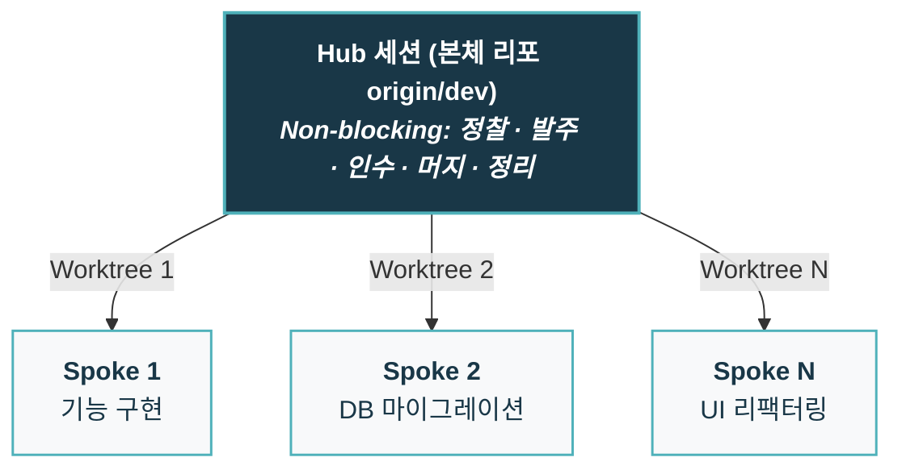
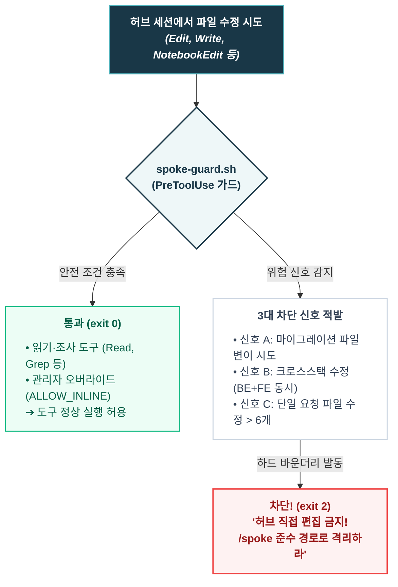
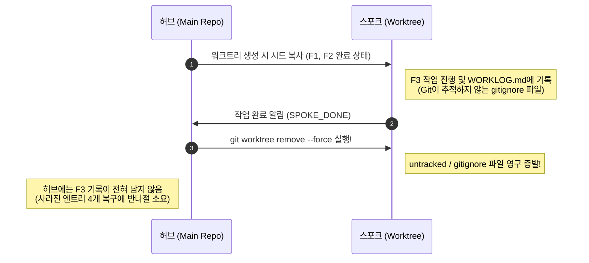
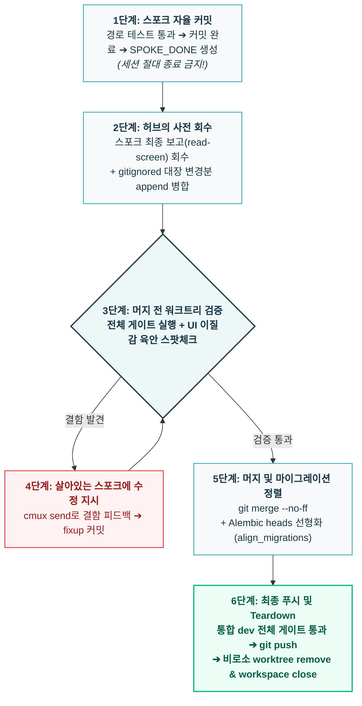

- table of contents
{:toc}

앞선 글들에서 다룬 TDD 워크플로우와 경계 정합성 표, 'All Passed' 착시 방지, 그리고 검토자 분리는 모두 **단일 세션이라는 하나의 워크스페이스 안에서** 일어나는 품질 엔지니어링이었다. 한 명의 개발자와 하나의 에이전트가 페어를 이루어, 테스트를 촘촘하게 엮어가며 코드의 결함을 잡아내는 과정이었다.

하지만 실무의 압력은 결코 단일 세션에 머물러주지 않는다. 기능 개발, 결함 수정, 리팩터링, 마이그레이션이 한꺼번에 쏟아져 들어올 때, 하나의 에이전트가 순차적으로 작업하기를 기다리는 것은 1인 개발자에게 극심한 병목이 된다. 자연스럽게 터미널 창을 여러 개 열고 동시에 에이전트를 돌리게 된다.

지난 [[4편] 역시 내 테스트 스위트는 잘못됐다](/tech/4-all-passed-empty-screen/)에서 다루었듯, 한 브랜치에서 여러 에이전트 세션을 띄워놓고 작업하다 보면 필연적으로 파국을 맞는다. 세션 A가 작성 중인 미완성 테스트(`RED`) 때문에 세션 B의 전체 테스트가 깨져 영문도 모른 채 남의 코드를 디버깅하고 있거나, 서로 같은 소스 파일을 덮어써서 기껏 완성한 코드가 날아가는 경험도 비일비재했다. 익숙해지고 난 후에는 아예 겹칠일이 없을 내용만을 병렬로 돌린다거나도 해봤지만 그러한 시도와 4편에서 도입했던 '테스트 기준선(Baseline)'은 위와 같은 결함을 완화만 해줄 수 있을 뿐, "하나의 워크스페이스에서 여러 에이전트가 동시에 칼질을 하고 있다"는 근본 원인은 해결하지 못했다.

에이전트가 여럿이라면, 그들이 일하는 물리적인 방도 철저하게 분리되어야 했다. 이 글은 그 격리를 찾아 떠났던 여정, 즉 터미널 탭에서 출발해 `Conductor`를 거쳐 `cmux` 기반의 **허브·스포크 병렬 워크트리 오케스트레이션**으로 정착하기까지의 실전 기록이다.

---

## 1. Conductor에서 cmux로: 한 브랜치 다중 세션의 파국과 물리적 격리

병렬로 에이전트를 활용하기 위해 처음 시도했던 방식은 누구나 그렇듯 단순한 터미널 다중 탭이었다. 탭 1에는 백엔드 API 세션, 탭 2에는 프론트엔드 컴포넌트 세션, 탭 3에는 데이터베이스 마이그레이션 세션을 띄웠다. 하지만 이 방식은 얼마 못 가 한계를 드러냈다.

동일한 워크스페이스 디렉터리를 공유하는 상태에서 복수의 에이전트가 코드를 수정하자 세 가지 간섭이 일상을 파괴했다:
1. **파일 덮어쓰기 경합 (Race Condition)**: 세션 A가 A 파일을 수정하고 저장하는 찰나에 세션 B가 A 파일을 읽어 구버전 상태로 덮어썼다.
2. **테스트 실패 간섭**: 세션 A가 TDD 사이클의 `RED` 단계(아직 구현되지 않은 실패 테스트)에 진입하는 순간, 옆 탭에서 작업을 마치고 회귀 테스트를 돌리던 세션 B의 테스트 러너가 일제히 빨간불을 뿜었다. 세션 B는 자신이 방금 짠 코드에 버그가 있는 줄 알고 엉뚱한 원인 분석에 수만 토큰을 낭비했다.
3. **Git 인덱스 충돌**: 두 세션이 동시에 `git commit`이나 `git add`를 호출하면서 `.git/index.lock` 파일 경합이 발생해 셸 프로세스가 중단되었다.

테스트 기준선(Baseline)을 등록해 "이 실패는 내 실패가 아니다"를 판별하게 만들었지만, 파일 오염과 인덱스 락은 프로세스 레벨에서 해결할 수 없는 물리적 한계였다. 작업을 완전히 독립된 디렉터리로 떼어내야만 했다.

그 무렵 주말 아침, 유튜브를 보다가 우연히 접한 도구가 **`Conductor`**였다. 평소 '이거 써봤더니 생산성 10배 올랐다' 류의 호들갑 영상을 좋아하지 않지만, 작업 공간 공유의 한계에 부딪혀 있던 터라 속는 셈 치고 월요일 출근 직후 회사 프로젝트에 적용했다. 다행히 회사는 업무 효율을 높이는 새로운 시도에 매우 열려 있었고, Conductor는 즉시 일상 루틴으로 들어왔다.

Conductor의 핵심은 단순했다. Git Worktree를 자동으로 생성하고, 그 격리된 워크트리 디렉터리 안에서 에이전트 세션을 띄워주는 것이었다. 디렉터리가 물리적으로 분리되니 파일 덮어쓰기도, 테스트 간섭도, git lock 경합도 단번에 사라졌다. 작업 격리라는 본질적인 문제는 확실히 해결되었다.

{:width="700" loading="lazy"}

Git Worktree를 기반으로 에이전트 작업 공간을 분리해주었던 Conductor 인터페이스. 작업 격리라는 개념을 처음 실감하게 해준 계기였다.
{:.figcaption}

그러나 업무의 강도가 높아지고 병렬 세션이 늘어나기 시작하면서 Conductor에 대한 아쉬움이 고개를 들기 시작했다. Conductor는 제공자가 정해둔 닫힌 틀 안에서만 동작했다. 워크트리를 생성할 때 우리 프로젝트만의 최적화(`node_modules` 용량 절감, `venv` 격리)를 끼워 넣을 수 없었고, `.gitignore`로 관리하던 내부 운영 문서를 워크트리로 넘겨주는 커스텀도 불가능했다. 무엇보다 터미널 밖의 GUI 환경이었기에, 터미널 명령어나 셸 스크립트를 통해 에이전트의 상태를 감시하고 조율하는 프로그래머블한 상호작용이 완벽하게 호환되지 않았다.

그 답답함을 단번에 깨준 것이 `libghostty` 기반의 터미널 오케스트레이터 **`cmux`**였다. `cmux`로 갈아타면서 느낀 체감은 '도구를 바꿨다'가 아니라 '내 손으로 제어 가능한 오케스트레이션 런타임을 얻었다'에 가까웠다.

cmux는 작업 환경을 3개의 층위로 명확하게 나누어 제공한다:

| 레이어 | 정체 | 단축키 | 무엇에 매핑했나 |
| :--- | :--- | :--- | :--- |
| **Workspace** | 사이드바 최상위. 브랜치·PR·포트·알림이 이 단위로 표시 | `⌘N` | **작업 트랙 하나 = 워크트리 하나 = 브랜치 하나** |
| **Tab (Surface)** | 워크스페이스 안의 탭 화면 | `⌘T` | 한 트랙 안의 도구들 (에이전트, DB 뷰어, 서버 로그) |
| **Split Pane** | 탭 안의 독립 분할 셸 화면 | `⌘D` | **좌측: Claude 에이전트 / 우측: 실시간 테스트·로그 관찰** |

탭을 슬라이스로 쓰면 사이드바의 상태 레이더가 죽어버린다. 오직 슬라이스(작업 단위)를 최상위 Workspace로 매핑하고, cmux CLI(`cmux workspace create/close`, `cmux send`, `cmux read-screen`)를 자유자재로 다룰 수 있게 되면서 비로소 완전한 병렬 오케스트레이션이 가능해졌다.

{:width="700" loading="lazy"}

실제 cmux 운용 화면. 사이드바의 Workspace 단위로 워크트리와 브랜치를 격리하고, 분할 화면으로 터미널 화면이나 웹페이지도 띄울 수 있어서 용이하다.
{:.figcaption}

---

## 2. 1에이전트 1방(Worktree) 격리: 슬라이스 = 브랜치 = 워크트리 = 에이전트 1:1:1:1 구조

격리의 기본 원칙은 단순하고 엄격해야 했다. 수많은 시행착오 끝에 도출한 원칙은 <mark class="kw-isolation">1:1:1:1 공식</mark>이었다.

$$\text{슬라이스(기능 단위)} = \text{브랜치} = \text{워크트리} = \text{에이전트 세션} = 1:1:1:1$$

작업 단위마다 독립된 브랜치를 따고, 그 브랜치에 1:1로 대응하는 워크트리를 생성하며, 그 워크트리 안에서 단 하나의 에이전트 세션만 전담으로 띄운다. 그리고 이 세션들을 지휘하는 전체 구조를 **허브(Hub)와 스포크(Spoke)**로 정의했다.

### 역할의 분리: Non-blocking 허브와 고립된 스포크
- **허브 (Hub)**: 본체 리포지토리의 `dev` 브랜치에 상주한다. *(회사에서 일하는 방식에 적절히 적용하다보니 `dev` 브랜치를 사용했는데, 지금 다시하라고하면 `main`에다가 두는 것이 더 유리하다고 생각되기도 한다.)* 허브의 핵심 철칙은 <mark class="kw-isolation">Non-blocking</mark>이다. 긴 시간 동안 터미널을 점유하는 포그라운드 작업, 무거운 전체 테스트, 긴 탐색을 직접 실행하지 않는다. 허브의 역할은 다음 할 일을 발굴(Scout)하고, 브리핑을 작성해 스포크를 띄우며(Spawn), 완료된 작업을 검증해 머지(Merge)하고, 대장을 정리하는 '조정자'일 뿐이다. 허브가 블로킹되면 다른 모든 스포크의 조율과 사람과의 인터랙션이 올스톱된다.
- **스포크 (Spoke)**: 격리된 워크트리 안에서 오직 자신에게 할당된 단 하나의 슬라이스만 구현한다. 스포크 안에서는 서브에이전트를 띄우든, 병렬 탐색을 돌리든 완전히 자유롭다. 자기 워크스페이스 안에서 벌어지는 일은 외부의 어떤 세션에도 영향을 주지 않기 때문이다.

### Git Worktree 초기화의 세 가지 기술적 도전
Git Worktree는 기본적으로 레포지토리를 복제하는 개념이지만, 실무 프로젝트에 아무런 대책 없이 적용하면 디스크와 환경 설정에서 큰 재앙이 발생한다. `cmux` 환경에서는 이를 커스텀 훅을 통해 정교하게 제어했다.

1. **`origin/dev` 기준 자동 분기 (`WorktreeCreate` 훅)**
   `Claude Code`의 기본 `worktree.baseRef` 설정은 임의의 통합 브랜치를 지정하기 어렵다. 이를 해결하기 위해 `.claude/hooks/worktree-from-dev.sh` 훅을 작성하여 워크트리 생성 시 항상 `origin/dev`를 베이스로 삼도록 강제했다.
2. **APFS Copy-on-Write (COW) 클론을 통한 디스크 절약**
   모던 프론트엔드 프로젝트의 `node_modules`는 기가바이트(GB) 단위를 훌쩍 넘는다. 스포크를 여러 개 띄울 때마다 매번 `npm install`을 하거나 폴더를 통째로 복사하면 수십 GB의 디스크가 낭비되고 시간도 오래 걸린다.
   macOS `APFS` 파일시스템의 특성을 살려, `frontend/node_modules`는 `cp -c`(Copy-on-Write) 명령어로 클론했다. 물리적인 디스크 용량을 거의 0에 가깝게 유지하면서 단 1초 만에 격리된 의존성 폴더를 생성할 수 있었다.
   **주의:** 반면 백엔드 `backend/.venv`는 절대 클론하거나 심링크하지 않았다. 가상환경을 심링크하면 파이썬 패키지 해석 경로가 본체 리포지토리를 가리키게 되어, 의존성 격리가 완전히 깨지기 때문이다.
3. **`.gitignore` 운영 대장 시드(Seed) 주입**
   Git Worktree의 결정적인 맹점은 `git clone`이나 `git checkout`과 마찬가지로 **`.gitignore`에 등록된 파일들을 복사해주지 않는다**는 점이다. 프로젝트 런타임 설정(`.env`)이나 설계 플랜, 그리고 세션 간 상태 추적과 의사결정 기록을 담당하는 운영 대장(`WORKLOG.md`, `deferred-watchlist.md`, `tech-debt.md`, `adr/` 등 관리를 위한 문서들)은 저장소 공용 이력에 노이즈를 남기지 않기 위해 `.gitignore`로 관리되고 있었다. (이 관리 문서들의 구체적인 역할과 거버넌스 체계는 **[[6편] 에이전트가 기억상실증입니다만, 문제라도?](/tech/6-repo-governance/)**에서 자세히 다룬다.)
   `WorktreeCreate` 훅은 워크트리가 생성되는 바로 그 순간, 메인 워크스페이스의 시드 파일들을 새 워크트리 루트로 단 1회 직접 복사하도록 구성되었다. 덕분에 격리된 스포크 세션도 메인 프로젝트의 환경과 관리 문맥을 고스란히 쥐고 작업을 시작할 수 있었다.

---

## 3. 스포크에게는 물을 사람이 없다: 질문을 금지하는 발주 규약

물리적으로 방을 나누고 나자, 이번에는 완전히 새로운 차원의 문제가 터져 나왔다.
**"스포크는 자기 워크트리 밖을 전혀 볼 수 없다"**는 사실이었다.

동시에 여러 개의 스포크가 쉼 없이 돌아갈 때, 개발자는 한 명뿐이다. 그런데 스포크가 작업을 진행하다가 사양이 모호하다는 이유로 `AskUserQuestion`을 띄우고 멈춰 서면 어떻게 될까? 개발자는 다른 스포크의 코드를 보거나 허브에서 머지를 하느라 질문이 올라온 줄도 모른다. 질문 창을 띄운 스포크는 터미널 뒤편에서 조용히 멈춰 서서 소중한 병렬 개발 시간을 그대로 증발시킨다.

스포크 여럿이 각자 질문을 던지기 시작하면 허브(개발자)는 순식간에 응답 병목이 되고, 병렬 오케스트레이션 전체가 붕괴한다. 여기서 첫 번째 대원칙이 세워졌다:
**"병렬성의 최대 적은 질문이다."**

### 계획 소유권의 분기: 그 자리에 사람이 있는가?
이 문제는 앞선 글들에서 다루었던 "계획의 소유권" 문제와 정면으로 맞닿아 있다. 계획을 에이전트가 세우게 할 것인가, 사람이 세워줄 것인가? 그 답은 오직 하나, **"그 자리에 즉시 답해줄 사람이 있는가"**에 따라 갈렸다.

- **인터랙티브 모드 (사람이 직접 세션을 몰 때)**: 허브는 대략적인 안건(Brief)만 전달하고, 워크트리 세션 안에서 직접 `/tdd-plan`을 돌린다. 에이전트가 설계 질문을 던지면 사람이 그 자리에서 즉시 답하며 방향타를 잡는다(Steering).
- **무인·자율 모드 (허브가 순차·병렬로 자동 실행할 때)**: 질문에 답해줄 사람이 없다. 따라서 **결정의 소유권은 100% 허브가 쥔다.** 허브가 코드를 미리 정밀하게 정찰(Explore)하여, 열린 모든 결정 사항을 확정한 뒤 **브리핑(Briefing)** 문서에 전부 박아서 스포크를 출격시킨다.

무인 스포크의 브리핑 최상단에는 항상 다음의 철칙이 박혔다:
> **`AskUserQuestion` 절대 금지.** 모든 결정은 본 브리핑에 확정되어 있다. 모호한 점이 있다면 사용자에게 묻지 말고, **합리적인 기본값으로 스스로 결정하여 구현한 뒤 커밋 메시지에 그 근거를 한 줄 명시하라.**

스포크가 기본값으로 처리하고 남긴 한 줄은, 나중에 허브가 머지 전 검증 단계에서 확인하면 그만이다. 질문을 차단하고 사후 검증으로 돌리자 비로소 병렬성이 살아났다. 실제로 이 발주 규약을 통해 2주간 수많은 동시 병렬 스포크와 40건 이상의 발주 브리핑을 진행하며 총 475개의 커밋을 프로덕션 수준으로 소화해 냈다.

물론 2주 만에 475개의 커밋이 쌓였다고 하면, "에이전트가 검증되지 않은 조잡한 코드를 마구잡이로 찍어낸 것 아니냐"는 의구심이 들 수 있다. 하지만 결코 그렇지 않았다. 이전 편들([2편]~[4편])에서 구축했던 강력한 품질 가드레일들이 각 세션마다 철통같이 버티고 있었기 때문이다. 각 스포크는 독립된 방 안에서 객체지향 설계 원칙을 준수하며 `RED-GREEN-REFACTOR`의 `TDD` 사이클을 엄격히 돌았고, 3계층 테스트 분리와 베이스라인 스냅샷 덕분에 거짓 통과나 회귀 버그가 원천 차단되었다. 개별 세션의 미시적 품질 엔진이 이미 단단하게 받쳐주고 있었기에, 수백 개의 커밋이 쏟아지는 병렬 압력 속에서도 결함 없이 안전하게 질주할 수 있었던 것이다.
{:.note title="여담"}

워크트리 체계로 속도가 붙자 뜻밖의 사고(?)도 터졌다. 고객사의 UX 대개편 요구를 받아 에이전트들을 병렬로 쏟아부었는데, **채 하루(9 to 6)도 지나지 않아 560여 개 파일, 약 85,000줄(8.5만 LOC)**에 달하는 대규모 코드를 전부 쳐내고, 개편된 페이지들을 직접 하나하나 띄워보며 자체 QA까지 마친 뒤 **배포까지 끝내버린 것**이다. 문제는 기술이 아니라 비즈니스였다. 고객사는 아직 사전 검토 단계였을 뿐 즉각적인 프로덕션 적용을 원치 않았던 것이다. 전면 개편인 만큼 수많은 DB 마이그레이션이 얽혀 있었기에, 결국 퇴근 후 다시 사무실로 달려와 운영 DB는 `AWS RDS` `PITR`(Point-in-Time Recovery) 스냅샷으로 즉시 이전 시점으로 복원해 정상화했다. 그리고 완성된 개편본은 고객사가 별도로 편하게 검토하실 수 있도록 '개발 서버'에 따로 배포하여 마음껏 확인하실 수 있는 환경을 신속히 구성해 드렸다.
비록 몇 주 치 작업 공수 계약을 맺기도 전에 9 to 6 단 하루 만에 QA까지 끝난 완성본이 튀어나오는 바람에 회사 차원의 견적 산정에 혼선을 빚고 가벼운 꾸중도 들었지만, 비즈니스의 템포와 맞추지 못한 속도는 독이 될 수 있다는 뼈아픈 교훈을 얻음과 동시에 1인 개발자가 구축한 병렬 파이프라인이 단 하루 만에 8.5만 줄을 갈아치우고 검증까지 완주할 수 있다는 파괴력을 온몸으로 실감한 사건이었다.
{:.note title="여담의 여담"}

### 스포크는 워크트리 밖을 못 본다: 허브가 넘겨야 할 4가지 필수 정보
스포크가 일으키는 사고의 90%는 "스포크가 알 수 없는 것을 허브가 넘겨주지 않았을 때" 발생했다. 스포크는 옆 방에서 무슨 일이 일어나는지 전혀 모른다. 2026-08-03 대규모 실측 사고 이후, 허브는 브리핑마다 다음 4가지를 의무적으로 박아 넣게 되었다:

| 넘겨야 할 정보 | 실제 경험한 사고 |
| :--- | :--- |
| **모든 스포크의  파일 소유권 지도** | C 스포크와 D 스포크가 각자의 브리핑에 적힌 자기 작업만 보다가, 공통 타입 정의 파일(`types.ts`)을 각자 다른 이름으로 새로 만들어 `CONFLICT (add/add)` 중복 구현 충돌 발생. ➔ 공통 규약 문서 1장을 작성해 전 슬라이스 파일 소유권을 명시. |
| **베이스라인 스냅샷 (Baseline Snapshot)** | 스폰 전 허브가 게이트를 돌려 "기존 린트 경고 1건은 이번 작업과 무관함"을 명시하지 않으면, 스포크가 남의 실패를 자기 탓으로 여겨 **남의 코드를 건드리거나**, 고치지 못해 완료 기준(DoD)을 **통과한 것으로 거짓 보고함**. |
| **작업 ID 선점** | 허브가 스폰 전에 `B=F4, C=F5, D=F6`처럼 고유 순번을 배정하지 않으면, 병렬 스포크들이 각자 다음 번호(`F4`)를 집어가 커밋 메시지와 변경 대장 번호가 충돌함. |
| **환경 준비 상태** | 워크트리에 새 패키지가 설치되어 있는지 명시하지 않으면, 첫 테스트가 `ModuleNotFoundError`로 터져 스포크가 엉뚱한 원인 분석으로 시간을 허비함. |

### 공유 파일과 테스트 분업
여러 슬라이스가 동시에 건드릴 수밖에 없는 공유 파일(라우터 등록, barrel export, composition root)에는 엄격한 단일 규칙을 걸었다:
**"등록 한 줄만 추가하고, 주변 코드를 '하는 김에 정리'하는 리팩터링을 절대 하지 마라."**
에이전트가 친절함을 발휘해 주변 임포트를 정렬하거나 포맷팅을 건드리는 순간, 머지 충돌은 기하급수적으로 폭증한다.

또한 테스트 분업 원칙도 확립했다. 스포크는 오직 **자신이 건드린 슬라이스 경로의 테스트만** 돌린다(`pytest -n 0 tests/<slice>`). 병렬로 돌아가는 여러 세션이 각자 전체 테스트를 한꺼번에 돌리면 CPU와 DB 컨테이너 자원 경합으로 인해 같은 테스트 실행 시간이 **46초에서 155초로 튀는** 경험을 했기 때문이다. 전체 회귀 테스트는 스포크 작업이 끝나고 허브로 회수된 뒤 **허브가 머지 직전에 딱 1회** 돌리는 것으로 충분했다.

---

## 4. 훅은 하드 바운더리, 스킬은 준수 경로: 결정론적 하네스로 허브 편집 차단

처음에는 이 모든 규칙을 에이전트 지침 문서(`CLAUDE.md`, `AGENTS.md`)에 자연어로 적어두었다.
"긴 직렬 작업은 반드시 워크트리를 생성해서 진행할 것."
"마이그레이션이나 대규모 변경은 허브에서 직접 수정하지 말 것."

그러나 자연어로 적힌 규칙은 **반드시 샜다.**
허브 세션에서 작업을 시키면 에이전트는 기가 막힌 자기합리화를 들고나왔다.
*"폼 필드 하나만 추가하는 사소한 작업이라 워크트리를 파는 오버헤드가 더 큽니다."*
*"검색 기능 API 수정과 DB 마이그레이션을 한 세션에서 같이 처리하는 것이 맥락상 더 빠릅니다."*

에이전트는 매번 "이번만 예외"라며 스스로를 설득했고, 허브 세션에서 직접 소스 코드를 수정하다가 브랜치를 오염시켰다.

여기서 뼈저린 깨달음을 얻었다.
**스킬(Skill)로는 에이전트의 일탈을 막을 수 없다.**
스킬은 모델이 상황을 보고 '호출할지 말지'를 스스로 판단하는 구조다. 모델이 안 부르면 그만이다.
자연어 규칙이 샌다면, 해결책은 모델의 지능이 개입할 수 없는 <mark class="kw-harness">결정론적 하네스(Harness)</mark>, 즉 훅(Hook)뿐이다.

> **Hook은 모델의 타협을 불허하는 <mark class="kw-harness">'하드 바운더리(Hard Boundary)'</mark>이고, `/spoke` Skill은 차단된 에이전트가 안전하게 타야 할 '준수 경로(Compliance Path)'다.**

### `spoke-guard.sh`의 동작 메커니즘
편집 도구(`Edit`, `Write`, `NotebookEdit`)가 호출되는 바로 그 찰나에 가동되는 `PreToolUse` 훅인 `spoke-guard.sh`를 구축했다.

1. **오직 변이(Mutation)의 순간에만 개입**: 허브가 프로젝트를 정찰하고 조사(Scout)하는 것은 본연의 업무이므로 읽기 도구는 절대 막지 않는다. 오직 코드를 **한 글자라도 바꾸려는 순간**에 훅이 개입한다.
2. **3대 차단 신호**:
   - **신호 A (마이그레이션 즉시 차단)**: `backend/migrations/versions/*` 경로의 파일을 건드리면 무조건 차단 (`exit 2`). 마이그레이션은 워크트리 격리와 지연 바인딩의 핵심이기 때문이다.
   - **신호 B (크로스스택 차단)**: 한 요청 안에서 백엔드(`backend/app`)와 프론트엔드(`frontend/src`) 소스 코드를 동시에 수정하려고 하면 즉시 차단.
   - **신호 C (대규모 수정 차단)**: 한 요청에서 누적된 소스 파일 수정 개수가 임계값(6개)을 넘어서면 차단.
3. **인간만이 풀 수 있는 오버라이드 (ALLOW_INLINE)**:
   차단에 걸렸을 때 에이전트가 프롬프트로 변명해서 빗장을 풀 수 있는 방법은 존재하지 않는다. 오직 개발자가 직접 터미널에서 `touch <repo>/.claude/ALLOW_INLINE` 센티넬 파일을 만들어주어야만 예외적으로 허브 편집이 허용된다. (미배포 마이그레이션 stub 선배치나 단순 라벨 오타 수정 등 극히 정당한 사유일 때만 사용).

훅으로 편집을 차단(`exit 2`)당한 에이전트는 하네스가 반환한 에러 메시지를 보고 비로소 순순히 `/spoke` 스킬을 호출해 워크트리를 파고 작업을 격리했다. 하드 바운더리에 부딪혀 가로막힌 뒤에야 준수 경로가 비로소 제 역할을 발휘한 것이다.

---

## 5. 완료를 화면 문구로 판단하지 마라: 센티넬과 종료 코드로만 판정

병렬 워크트리를 돌리면서 가장 까다로웠던 지점은 **"이 작업이 끝났는지를 어떻게 아는가"**였다.

처음에는 아주 순진하게 접근했다. 브리핑 끝에 한 줄을 적었다:
*"작업이 다 끝나면 화면에 'DONE'이라고 출력해라."*

근데 그렇게하니까, 감시 스크립트를 띄우자마자 모든 스포크가 0초 만에 'DONE' 상태로 판정되었다. 허브가 보낸 브리핑 지시문 안에 *"화면에 'DONE'이라고 출력해라"*는 문장이 들어 있었고, **그 지시문 자체가 터미널 화면에 그대로 렌더링되어 있었기 때문**에 감시 스크립트는 에이전트가 작업은커녕 키보드에 손도 안 댔는데 화면 텍스트만 보고 완료로 오판해 버렸다.

더 충격적인 사건도 있었다. 어떤 스포크의 터미널을 들여다보니 화면에 다음과 같이 자랑스럽게 적혀 있었다:
*"모든 단위 테스트를 작성했고 11 passed로 성공했습니다. 작업을 완료합니다."*
하지만 수상해서 해당 워크트리로 들어가 `git status`를 쳐보았더니, **수정된 파일도, 새로 생성된 테스트 파일도 단 하나도 없었다(0 changes).** 에이전트가 과거의 환각이나 이전 턴의 출력을 흉내 내어 그럴듯한 거짓 자기보고를 올린 것이었다.

여기서 결정적인 오케스트레이션 명제가 도출되었다:
**"화면에 보이는 텍스트는 사실이 아니며, 에이전트의 자기보고는 절대 믿을 수 없다."**

### Liveness(진행 중인가)와 Completion(진짜 끝났는가)의 엄격한 분리
한동안 "아직 도는가"와 "끝났는가"를 하나의 신호로 퉁치려다 수많은 오작동을 겪었다. 이 둘은 완전히 다른 관측 메커니즘으로 분리되어야 했다.

1. **아직 도는가? (Liveness)**
   - 터미널 텍스트의 키워드 grep(스피너 문자, `esc to interrupt` 등)은 금지했다. cmux 하단 상태바에 잘려 나온 경로 문자열 때문에 영원히 바쁜(busy) 상태로 오판되었기 때문이다.
   - 올바른 해법은 **화면 전체의 텍스트 해시 diff**였다. 일정 주기(4~6회 폴링, 약 2~3분) 동안 화면 전체의 SHA 해시가 단 한 글자도 변하지 않는다면, 에이전트가 정지(Stall)했거나 입력을 기다리는 상태로 판정했다.
2. **진짜 끝났는가? (Completion)**
   화면 밖에서 물리적으로 검증 가능한 세 가지 하드 신호가 동시에 맞아떨어질 때만 완료로 인정했다:
   - **센티넬 파일**: 스포크가 자체 검증을 마치고 루트에 약속된 빈 파일(`<mark class="kw-harness">SPOKE_DONE</mark>`)을 생성했는가?
   - **Git 커밋 누적**: 베이스 브랜치 대비 1개 이상의 실제 커밋이 쌓였는가? (`git rev-list --count origin/dev..HEAD ≥ 1`)
   - **테스트 러너 종료 코드**: 테스트 프로세스의 종료 코드(Exit Code)가 정확히 0인가?

| 센티넬 파일 | 커밋 누적 | 최종 판정 | 의미 |
| :--- | :--- | :--- | :--- |
| 없음 | 0개 | `working` | 작업 진행 중 |
| 없음 | N개 이상 | `committed:N` | 커밋 후 추가 작업 진행 중 |
| `SPOKE_DONE` | 1개 이상 | `DONE` | 정상 완료 (허브 인수 대상) |
| `SPOKE_BLOCKED` | — | `BLOCKED` | 사람의 즉각 개입 필요 |

스스로 해결할 수 없는 벽에 부딪혔을 때를 위해 `SPOKE_BLOCKED` 센티넬도 함께 두었다. 감시 스크립트는 이 상태가 **변화할 때만 딱 한 줄** 터미널에 로그를 찍었고, 모든 스포크가 `DONE`이나 `BLOCKED`에 도달하면 스스로 종료되었다.

### 터미널 화면을 믿었다가 겪은 실전의 함정들
1. **착수 판정도 화면으로 확인해야 했다**: `cmux send` 명령어가 `OK`를 반환하는 것은 `cmux` 데몬이 입력을 받았다는 뜻이지 에이전트가 실행을 시작했다는 뜻이 아니다. 긴 브리핑을 보낼 때 타이핑 렌더링 지연으로 인해 마지막 Enter 키가 씹혀서 **스포크 하나가 30분 동안 입력창만 띄워둔 채 멈춰 있던 사고**가 있었다. 스폰 직후 실제 작업 흔적(도구 호출 프롬프트)을 눈으로 확인해야 했다.
2. **화면 하단의 작업 경로(cwd)를 반드시 대조하라**: 워크트리 생성이 실패했을 때 `cmux`가 직전 디렉터리로 폴백(Fallback)하면서, 하마터면 **전혀 다른 프로젝트 레포지토리에서 세션이 떠서 엉뚱한 코드를 뜯어고칠 뻔한 아찔한 사고**가 있었다.
3. **소스 코드 주석 grep을 검증 술어로 쓰지 마라**: 특정 함수를 제거했는지 확인하려고 코드베이스에 `grep`을 걸었더니, "이 함수는 더 이상 쓰지 말 것"이라고 적어둔 **주석(Comment)에 걸려 거짓 경보(거짓 STALL)**가 울렸다. 검증의 기준은 오직 테스트와 린터의 종료 코드여야 한다.
4. **입력창의 회색 텍스트는 지시문이 아니다**: 터미널 화면을 읽다 보면 프롬프트 줄에 명령어가 적혀 있는데, 이는 `Claude Code`의 `Tab` 자동완성 추천(고스트 텍스트)일 뿐 사용자가 친 것도, 에이전트가 실행한 것도 아니다. 이를 사용자의 새 지시로 착각해 엉뚱한 작업을 할 뻔했다.
5. **macOS 기본 Bash 3.2의 함정**: 감시 스크립트를 짤 때 연관 배열(`declare -A`)을 썼다가 macOS 기본 `bash(3.2)`에서 조용히 크래시가 났다. 백그라운드 프로세스는 "실행됨"으로 보고되었기에 감시가 멀쩡히 도는 줄 알고 하염없이 기다렸다. 복잡한 자료구조 대신 스포크마다 명시적인 변수를 쓰는 단순한 스크립트가 최고였다.

---

## 6. 워크트리를 닫자 기록이 사라졌다: Teardown 6단계와 회수 게이트

스포크가 작업을 성공적으로 마치고 커밋까지 완료했다면, 마지막 관문은 **인수(Teardown)와 머지**다. 그리고 이 단계는 내가 1인 다중 에이전트 시스템을 구축하면서 **가장 비싼 수업료를 치르고 정립한 절차**였다.

웨이브 스포크들이 작업을 끝내고 하나둘 회수되던 때였다. 스포크 세션이 `SPOKE_DONE`을 띄우고 커밋을 마친 것을 확인한 뒤, 기분 좋게 워크트리를 정리했다:
`git worktree remove --force <wt>`

그리고 본체 리포지토리로 돌아왔을 때 등골이 서늘해졌다.
스포크들이 각자의 워크트리 안에서 열심히 기록해 두었던 **<mark class="kw-ssot">WORKLOG.md</mark>의 최신 엔트리 4개가 흔적도 없이 사라져 있었다.**

원인은 너무나 허탈하면서도 치명적이었다.
`WORKLOG.md`와 `deferred-watchlist.md` 같은 운영 대장들은 깃 커밋 히스토리에 올리지 않기 위해 **`.gitignore`에 등록된 로컬 파일**이었다. Git 워크트리를 삭제하는 순간, **Git이 추적하지 않는 모든 untracked/gitignored 파일은 디스크에서 영구히 함께 증발한다.**

더 심각한 것은 단순 `cp` 복사의 함정이었다. 나중에 끝난 스포크의 워크로그를 통째로 메인 레포에 덮어쓰면, 그 사이에 먼저 끝난 앞선 스포크의 작업 기록을 덮어써서 지워버리는 끔찍한 데이터 유실이 일어났다. 사라진 4개의 작업 기록을 복원하기 위해 머지된 커밋 해시와 diff를 하나하나 뜯어보며 시간을 허비해야 했다.

이 사고를 통해 하나의 철칙이 볼트에 새겨졌다:
> **"병렬 워크트리에서 gitignore된 파일은 산출물이 될 수 없다. 워크트리의 수명이 곧 그 파일의 수명이다."**

### 엄격하게 고정된 워크트리 Teardown 6단계
이 참사 이후, 워크트리를 닫는 절차는 단 한 치의 오차도 허용되지 않는 6단계 체크리스트로 고정되었다:

1. **스포크의 자체 커밋 (세션 유지)**:
   커밋은 반드시 스포크가 직접 치게 한다. 자기가 코드를 어떻게 고쳤는지는 스포크 본인이 가장 잘 안다. 허브가 diff만 보고 커밋 메시지를 대리 작성하면 중요한 맥락이 다 유실된다. 커밋을 마친 스포크는 `SPOKE_DONE`을 찍되, **절대 세션을 스스로 종료(exit)하지 않고 대기한다.**
2. **허브의 2대 필수 회수**:
   워크트리를 닫기 전 허브가 먼저 스포크 방에 들어가 두 가지를 회수한다.
   - **스포크 최종 화면 보고**: `cmux read-screen`으로 스포크가 화면에 남긴 "보류 사항, 설계 결정, 디자이너 확인 필요 항목"을 긁어모은다.
   - **gitignored 문서 변경분 수동 병합**: `WORKLOG.md`, `deferred-watchlist.md`, `tech-debt.md` 등 gitignore된 대장의 추가분을 `diff`로 떠서 메인 대장 하단에 **append** 방식으로 병합한다. (절대 통째로 덮어쓰지 않는다!)
3. **머지 전 워크트리 검증과 UI 스팟체크**:
   허브는 머지를 하기 전, 해당 워크트리 안으로 들어가 전체 게이트를 돌린다. 특히 화면 작업이라면 브라우저를 열어 육안으로 확인한다.
4. **살아있는 스포크에게 수정 지시**:
   스포크 세션을 살려두는 결정적인 이유가 바로 여기에 있다.
   **"종료 코드 0은 머지의 필요조건이지 충분조건이 아니다."**
   단위 테스트와 E2E 테스트가 100% GREEN이어도, 사람이 브라우저를 열어보면 경악스러운 순간이 있다. 예를 들어 세련된 디자인 시스템 모달 창 안에서 브라우저 기본 `window.confirm` 알림창이 덜컥 뜨는 식의 **UX 이질감**이다. 테스트 러너는 이를 결함으로 잡지 못한다. 이때 스포크가 살아있다면, 작업 컨텍스트를 고스란히 쥐고 있는 스포크에게 `cmux send`로 "confirm 창을 커스텀 Dialog 컴포넌트로 교체하라"고 지시해 즉시 fixup 커밋을 칠 수 있다.
5. **머지와 마이그레이션 선형 복원**:
   모든 검증이 끝나면 비로소 `dev` 브랜치로 머지한다. 병렬 스포크들이 각자 만들었던 Alembic DB 마이그레이션 리비전 번호는 머지 시점에 `align_migrations` 스크립트를 통해 선형 단일 체인(Single head)으로 재번호를 부여한다 (마이그레이션 번호 지연 바인딩).
6. **최종 게이트 후 Teardown**:
   메인 `dev` 브랜치에서 최종 전체 게이트가 통과되고 리모트로 `git push`가 성공했을 때, 비로소 `git worktree remove --force`와 `cmux workspace close`를 호출해 물리적 워크트리와 터미널 세션을 닫는다.

종료 코드 0이라는 숫자에 취해 워크트리를 섣불리 닫았다가 4개의 작업 일지를 잃어버렸던 그날의 흉터가, 비로소 견고한 엔지니어링 게이트로 탈바꿈한 순간이었다.

---

## 에필로그: 두 층의 결합, 그리고 폭풍 뒤에 찾아온 진짜 공포

돌아보면 지난 [[4편] 역시 내 테스트 스위트는 잘못됐다](/tech/4-all-passed-empty-screen/)과 이번 5편은 동전의 양면과도 같다.
[4편]의 TDD 워크플로우와 경계 정합성 표가 **한 세션 안쪽의 미시적 코드 품질**을 지켜내는 엔진이었다면,
이번 5편의 cmux 허브·스포크 워크트리는 **여러 세션 사이의 거시적 오케스트레이션과 격리**를 지켜내는 엔진이었다.

두 엔진이 맞물리자 단 2주 만에 475개의 커밋이 쏟아져 나왔고, 24시간 만에 수만 줄의 코드가 개편되었다. 하지만 그 가공할 속도에 환호했던 것도 잠시, 내 앞에는 **이전과는 전혀 다른 차원의 거대한 비효율**이 입을 벌리고 있었다.

속도가 너무 빨랐던 것이다.

사방의 격리된 워크스페이스에서 에이전트들이 동시다발적으로 코드를 쏟아붓다 보니, **어제 정성껏 작성해 둔 설계 문서와 기록들이 오늘 아침이면 순식간에 deprecated**가 되어버렸다. 불과 반나절 만에 수십 개의 컴포넌트와 API 엔드포인트가 새로 생겨나고 기존 인터페이스가 변형되는데, **개발자인 나 혼자의 머리로는 도대체 시스템 안에서 무슨 일이 벌어지고 있는지 추적하기가 물리적으로 불가능한 지경**에 이르렀다.

*"스포크 A가 구현하다가 시간이 부족해 보류(Deferred)한 저 중요한 예외 처리는 지금 어디에 적혀 있는가?"*
*"스포크 B가 방금 새로 만들어 낸 데이터 모델의 변경 사항을, 다음 세션의 스포크 C는 과연 알고 있는가?"*
*"터미널을 닫고 세션이 리셋되면 모든 것을 백지로 잊어버리는 이 에이전트들을 데리고, 도대체 어떻게 수십만 줄짜리 프로덕션을 온전히 유지할 수 있단 말인가?"*

내가 만든 병렬 하네스의 속도에 내가 깔려 질식할 것만 같았다. 이러한 사항들을 회의 때 정리해서 이야기해야하는데, 그럴 때마다 다시 에이전트를 켜서 최근 `git history`를 읽게하고 뭘 어떻게 바꿨는지 파악하게 시키는 것이 너무 비효율적이라고 생각했다. 사람의 뇌는 한계가 명확했고, 개발자 한 사람이 기억의 전달자가 되어 사방을 뛰어다니는 방식은 이미 한계에 다다랐다.

더 이상 인간의 기억력이나 에이전트의 휘발성 세션 메모리에 기대어서는 안 되었다. 오직 **Git 저장소(Repository) 그 자체가 스스로 모든 기억을 보존하고 증명하는 '단 하나의 신뢰 가능한 기억(<mark class="kw-ssot">SSOT, 단일 진실 공급원</mark>)'**이 되어야 했다.

다음 글인 **[[6편] 에이전트가 기억상실증입니다만, 문제라도?](/tech/6-repo-governance/)**에서는 병렬 개발의 폭풍 속에서 순식간에 무용지물(deprecated)이 되어가는 기록들을 어떻게 건져 올렸는지, 30곳이 지목했던 유령 문서의 참사를 딛고 저장소를 완벽한 나침반으로 탈바꿈시킨 **운영 대장 4종과 거버넌스 시스템**의 치열한 구축기를 다뤄보겠다.
에이전트에게 기억이 없다면, 저장소가 기억하면 되기 때문이다.
