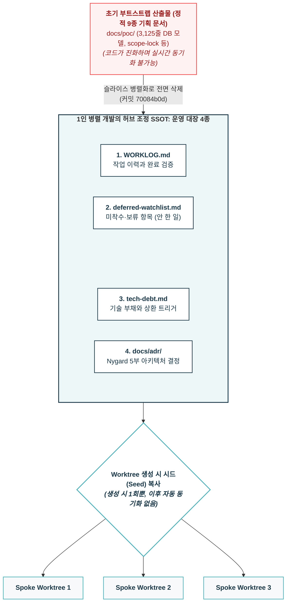
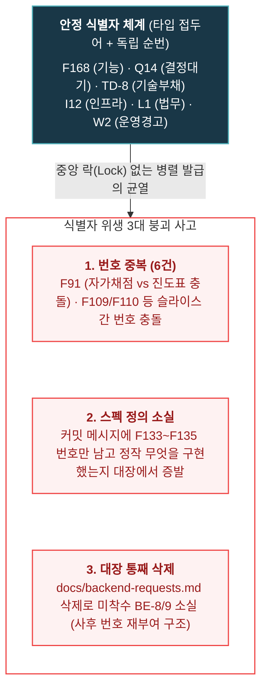

- table of contents
{:toc}

지난 [[5편] 같은 브랜치에서 에이전트끼리 사이좋게 코딩할 리가 없어](/tech/5-cmux-parallel-worktree/)에서 다루었듯, `cmux`와 Git Worktree를 통해 에이전트마다 독립된 워크스페이스를 제공함으로써 물리적 파일 충돌과 간섭은 완벽히 해결할 수 있었다. 단 2주 만에 475개의 커밋을 찍어내며 15개 슬라이스를 병렬로 밀어붙였으니, 생산성 측면에서는 분명 경이로운 승리였다.

하지만 그 압도적인 속도에 도취되었던 기쁨은 며칠 지나지 않아 서늘한 공포로 바뀌었다.

병렬로 마구마구 개발이 돌아가다 보니, **기존에 작성해 두었던 모든 기록과 문서들이 무서운 속도로 폐기(deprecated)**되기 시작한 것이다. 불과 며칠 전에 공들여 정리한 기획서와 DB 명세서는 이미 거짓말이 되어 있었고, 사방의 워크트리에서 수십 개의 API와 컴포넌트가 번개처럼 새로 생겨나고 수정되었다. **인간인 나 혼자의 머리로는 도대체 저장소 안에서 무엇이 새로 생겼고 무엇이 바뀌었는지 추적하는 것 자체가 물리적으로 불가능했다.**

여기에 에이전트 특유의 고질병인 '기억상실(Stateless)'이 결합하자 상황은 아비규환이 되었다. 터미널 창을 닫거나 컨텍스트가 리셋되는 순간, 에이전트는 백지상태가 된다. 방금 전까지 나와 함께 아키텍처의 한계를 치열하게 고민하고 수십 개의 테스트 케이스를 격파했던 그 '천재적인 동료'는 온데간데없고, 새로 열린 창에는 아무것도 기억하지 못하는 백지상태의 에이전트가 정중하게 첫인사를 건넬 뿐이다. (물론 최근에는 벤더사들의 resume 기능이 생겼지만, 동시 다중 세션을 운용할 때는 부차 세션의 세부 대화가 덮어써지거나 유실되는 등 한계가 명확했다.)

새로 띄운 에이전트는 다른 워크트리에서 이미 논의 끝에 보류(Deferred)하기로 결정한 사안을 멋대로 다시 들쑤셔 코드를 엎어버리거나, 방금 추가된 최신 모듈의 존재조차 모른 채 중복 코드를 작성하기 일쑤였다.

이것은 사소한 불편함이 아니었다. **"내가 만든 병렬 하네스의 속도를 통제하지 못한다면, 시스템은 조만간 내가 쏟아낸 코드의 무게를 감당하지 못할 것"**이라는 절박한 진화의 압력이었다.

인간 개발자가 일일이 기억의 전달자가 되어 프롬프트로 복기해 주는 방식은 완전히 한계에 부딪혔다. 살아남기 위해서는 고려해낸 방법은:

**"사람의 기억도, 에이전트의 세션 메모리도 믿지 마라. 오직 Git 저장소(Repository) 그 자체가 스스로 모든 맥락과 부채를 증명하게 만들어라."**
이었다.

나는 필사적으로 소프트웨어 아키텍처 방법론들을 찾아 헤매기 시작했다. 거대한 정적 문서를 버리고, 터미널이 닫혀도 새로 투입된 에이전트가 10초 만에 지난 3주간의 결정과 보류 항목을 완벽하게 이어받을 수 있는 **저장소 거버넌스와 운영 대장 4종**은 바로 이 절박한 생존 압력의 산물이었다.

---

## 1. 터미널을 닫으면 너의 기억은 사라진다: 기억의 외주화

에이전트와의 협업에서 가장 위험한 착각은 "에이전트가 이전 대화의 암묵지를 공유하고 있을 것"이라는 믿음이다. 컨텍스트 윈도우가 아무리 커져도 세션은 언젠가 종료된다. 대화창이 리셋되는 순간, 에이전트가 품고 있던 모든 맥락(Context)은 비휘발성 저장 매체에 기록되지 않은 채 허공으로 날아간다.

사람 개발팀이라면 커피를 마시며 나눈 대화나 슬랙 스레드의 잔상이 사람 뇌의 '장기 기억'에 남는다. 하지만 AI 에이전트는 Stateless다. 에이전트에게 장기 기억이란 존재하지 않는다.

처음에는 이를 극복하려고 거대한 프롬프트 템플릿을 만들어 붙여넣거나, 세션을 바꿀 때마다 이전 작업 요약을 사람이 직접 쳐서 먹여주었다. 하지만 이것은 전형적인 병목이었다. 개발자가 에이전트의 '외부 기억 장치' 역할을 하느라 정작 시스템 설계를 고민할 에너지를 탕진했다.

이에 대한 나의 해법은 기억의 주체를 **저장소(Repository)**로 완전히 외주화하는 것이었다. 코드는 "지금 시스템이 어떻게 동작하는가"만 보여줄 뿐이다:
- "이 기능은 왜 이렇게 구현되었는가?" (결정)
- "이 코드는 어떤 타협과 빚을 지고 있는가?" (부채)
- "왜 이 작업은 지금 하지 않고 미루어 두었는가?" (보류)
- "누가 언제 이 스펙을 손대고 지나갔는가?" (이력)

이 질문들에 대한 답이 코드베이스 내부 문서로 격리되어 <mark class="kw-ssot">정본(SSOT, Single Source of Truth)</mark>으로 관리되지 않는다면, 새로 투입된 에이전트는 과거의 결정을 무시하고 코드를 제멋대로 엎어버리거나, 미뤄둔 작업을 이미 끝난 것으로 오판해 건너뛰게 된다. 터미널을 닫아도 저장소는 남는다. 에이전트의 휘발성 두뇌 대신 Git 커밋이 보증하는 텍스트 파일에 모든 기억을 강제로 밀어 넣기 시작한 이유다.

---

## 2. 저장소에 무엇을 두는가: 부트스트랩 산출물 9종과 운영 대장 4종

프로젝트를 시작할 때 우리는 보통 많은 문서를 쓴다. 내가 진행했던 학원 관리 SaaS 프로젝트 초창기에도 거대한 부트스트랩 산출물 9종이 존재했다:
- `docs/poc/scope-lock.md`: 제품의 절대적 스코프 경계
- `docs/poc/decision-ledger.md`: Q1~Q32에 이르는 초기 정책 결정 원장
- `docs/poc/page-map.md` 및 S0~S7 슬라이스 설계서
- `docs/poc/data-model-v0.md`: 무려 3,125줄에 달하는 초기 DB 모델 정의서
- 아키텍처 스탠스, 기술 스택 결정서, 경쟁사 갭 분석, AI 모델 비용 전략 문서

이 문서들은 프로젝트의 뼈대를 세우는 데는 유용했다. 하지만 실제 코드가 수만 줄로 불어나고, 기능 슬라이스 단위로 여러 에이전트가 병렬로 붙어 개발을 가속하기 시작하자 거대한 기획 문서는 거추장스러운 짐이 되었다. 코드는 매일 진화하는데 3,000줄짜리 데이터 모델 문서를 최신으로 유지할 수 있는 사람은 아무도 없었다. 결국 나중에 이 초기 산출물들은 한꺼번에 삭제했다.

그렇다면 문서를 다 없애고 코드만 남겨야 했을까? 아니었다. 정적인 기획 문서를 걷어낸 자리에, **동적인 상태를 조율하는 "운영 대장 4종"**이 들어섰다.



1. **`WORKLOG.md`**: 작업 이력과 완료 검증. 누가 어떤 슬라이스에서 어떤 기능을 끝냈는지 추적한다.
2. **`docs/deferred-watchlist.md`**: 아직 하지 않은 일, 차단된 일, 의도적으로 보류한 일의 SSOT.
3. **`docs/tech-debt.md`**: 이미 친 코드 안의 타협과 빚, 그리고 상환 트리거.
4. **`docs/adr/`**: 아키텍처 결정 기록. Nygard 5부 형식으로 남긴 구조적 선택들.

이 4종의 대장은 단순한 문서가 아니라 **"허브 조정 SSOT"**였다.

지난 [[5편] 같은 브랜치에서 에이전트끼리 사이좋게 코딩할 리가 없어](/tech/5-cmux-parallel-worktree/)에서 다루었듯, 병렬 워크트리 환경에서 스포크 에이전트는 자기 방 밖을 보지 못한다. 허브 에이전트가 새 워크트리를 딸 때, 이 4종의 대장이 해당 워크트리로 '시드(Seed)'로서 복사된다. 중요한 규칙은 **"시드는 생성 시 1회뿐이며, 이후 자동 동기화는 없다"**는 점이다.

스포크 에이전트는 자신이 파견된 시점의 대장 스냅샷을 들고 작업에 들어간다. 슬라이스를 진행하다가 "내 범위 밖"의 작업이나 미뤄야 할 항목이 생기면 폭증하는 defer들을 대장에 차곡차곡 쌓아 올린다. 그리고 작업이 끝나 머지될 때 허브가 이를 다시 메인 대장으로 흡수한다. 병렬 착수 전에 허브가 대장을 항상 최신화해야 했던 이유가 여기에 있었다.

---

## 3. 안 한 일을 어디에 적는가: watchlist의 차단 분류와 복원 신뢰도 3단

개발을 하다 보면 "지금은 이 작업을 할 수 없다"는 순간이 끊임없이 찾아온다:
- 외부 카카오톡 푸시 API 계약이 아직 체결되지 않아서 (`F85`)
- 원장의 실제 화면 UX 선호도를 인터뷰하기 전이라서 (`F37`)
- 고교 지원 과목 스코프를 담당자가 아직 넘겨주지 않아서 (`Q14`)
- `spaCy` 문법 검사기가 어문 의존 범주를 잡지 못해 오라클이 고갈되어서 (`F40`)

보통의 1인 개발이라면 코드 구석에 `// TODO: 나중에 원장님 피드백 받고 수정할 것` 같은 주석을 남기거나, 메모장에 대충 적어둔다. 그러나 병렬 에이전트 환경에서 인라인 TODO 주석은 독약이다. 에이전트는 코드베이스 전체의 TODO를 맥락 없이 읽어 들여 엉뚱한 리팩토링을 시도하거나, 반대로 자기가 해야 할 작업인지 모르고 영원히 방치한다.

안 한 일은 오직 단 하나의 장소, `docs/deferred-watchlist.md`에만 적어야 했다. 이 watchlist는 단순한 할 일 목록이 아니라 **차단 여부(Blocker)**에 따라 엄격하게 분류되었다:

| 분류 | 의미 | 실례 |
|:---|:---|:---|
| **착수 가능 (Unblocked)** | 선행 조건이 해결되어 즉시 구현에 들어갈 수 있는 항목 | `F52` 강사 모바일 진도 로스터 진입점 배선 |
| **차단 사유별 보류** | 인프라 미비, 외부 계약, 실측 데이터 부재로 멈춰 있는 항목 | `F106` 리포트 전국 평균 지표 (데이터 소스 부재), `I9` 이미지 인프라 apply 대기 |
| **범위 밖 (Out of Moat)** | 기술적으로 불가능하거나 제품 철학상 의도적으로 안 하기로 한 항목 | `O1` 증명·기하·서술형 자동 생성 (자동 검증 불가 = 해자 없음) |

watchlist의 각 행은 반드시 **[항목 ID / 구체적 내용 / 왜 보류하는가 / 신뢰도 / 출처 문서]**를 갖추어야 했다. 그리고 가장 중요한 철칙: **"종결되었다고 목록에서 행을 삭제하지 않는다."**

작업이 끝났다고 행을 지워버리면, 과거 커밋 메시지나 다른 브랜치의 PR에 남겨진 `defer F109`, `ref BE-8` 같은 수많은 참조가 단숨에 부모를 잃고 미아(Dangling pointer)가 되어버리기 때문이다. 종결된 것은 반드시 `## 5. 종결된 것` 섹션으로 내려 취소선과 함께 닫힌 방식을 명시했다.

### 휴리스틱한 나침반: 118개 기능의 현재와 역사를 기록한 docs/features/

운영 대장 4종이라는 거버넌스 체계를 도입하기 훨씬 전부터, 내게는 자연스럽게 몸에 밴 오래된 습관 하나가 있었다. 바로 저장소 루트의 `docs/features/` 디렉터리다.

사수도 리뷰어도 없는 1인 개발 환경에서, 나는 항상 두 가지 질문을 마음에 품고 있었다:
1. *"언젠가 새로운 개발자가 합류했을 때, 어떻게 해야 사수 없이도 이 방대한 프로덕션을 온전히 인수인계받을 수 있을까?"*
2. *"세션이 리셋된 CLI 에이전트에게 작업을 시킬 때, 어떻게 해야 최소한의 토큰과 탐색 비용으로 작업 대상 파일들을 정확히 짚어줄 수 있을까?"*

이 체계는 거창한 소프트웨어 공학 이론이나 외부의 설계 압력을 받아서 만든 것은 아니었다. 그저 하루하루 쏟아지는 기능을 구현하면서 **어떻게 하면 조금이라도 덜 헤매고, 더 효율적으로 일할 수 있을까를 고민하다가 본능적으로 깎아 낸 '휴리스틱(Heuristic)한 결과물'**이었다.

`docs/features/` 아래에는 비즈니스 도메인별 디렉터리(`student`, `admin`, `parent`, `notifications`, `infra` 등)를 파고, 각 기능마다 하나의 독립된 마크다운 문서를 작성했다. 그리고 루트에는 전체 현황을 한눈에 조망하는 `index.md` 색인표를 두었다.

```
docs/features/
├── index.md             # 118개 기능 전체 현황(완료율 100%) 및 복잡도 색인표
├── _template.md         # 일관된 문서 작성을 위한 표준 템플릿
├── student/             # 학생 도메인 (study-planner.md, assessment.md 등 27종)
├── admin/               # 학원 관리자 도메인 (18종)
├── parent/              # 학부모 도메인
└── ...                  # 총 15개 도메인 서브디렉터리
```

각 기능 문서는 단순히 "이 기능은 이렇다"는 기획 설명에 그치지 않고, CLI 에이전트가 즉각 코드로 직행할 수 있도록 철저하게 **엔지니어링 중심의 청사진**으로 설계되었다:

1. **관련 소스 파일의 1:1 매핑**:
   - 백엔드는 `Model → CRUD → Schema → Service → API`에 이르는 5단계 계층의 실제 파일 경로를 명시했다.
   - 프론트엔드는 FSD(Feature-Sliced Design) 아키텍처에 맞춰 `pages → widgets → features → entities → shared`의 컴포넌트 및 훅 파일 경로를 정확히 박아 넣었다.
2. **아키텍처 및 시스템 데이터 흐름**:
   - 사용자 액션부터 백엔드 처리와 외부 AI 연동(예: GPT-4o-mini 비동기 평가)까지 이어지는 데이터 흐름을 아스키 다이어그램으로 도식화했다.
3. **누적된 변경 이력 (Changelog)**:
   - 문서 하단에는 최초 작성(`v1.0`)부터 요구사항 변경(`v1.1`), 그리고 실제 운영 중 발견된 미세 버그 패치(`v1.2` — 타이머 초 단위 carry-over 보존 등)에 이르기까지 **날짜별 버전 히스토리**를 집요하게 누적했다.

이 휴리스틱한 기능 문서화는 CLI 에이전트와의 실전 협업에서 진가를 발휘했다.

새로운 터미널 창을 열고 기억을 잃은 에이전트에게 "학습 일정 관리 모듈의 목표 설정 로직 수정해줘"라고 명령할 때, 에이전트에게 수만 줄의 전체 코드베이스를 무작정 grep하며 방황하게 할 필요가 없었다. 그저 `docs/features/learning-scheduler.md` 파일 하나만 컨텍스트로 읽히면 끝이었다.

에이전트는 단 10초 만에 백엔드와 프론트엔드의 어떤 파일들을 건드려야 하는지, API 계약이 어떻게 정의되어 있는지, 그리고 이 기능이 과거에 어떤 버그를 겪으며 현재 구조로 진화했는지를 완벽하게 파악하고 정확한 구현에 착수했다.

운영 대장 4종이 여러 워크트리 사이에서 끊임없이 변하는 '동적 상태(State)와 기술 부채'를 조율하는 관제탑이었다면, `docs/features/`는 시스템의 모든 부품들이 어디에 있고 어떻게 살아왔는지를 증명하는 **가장 오래되고 든든한 정적 베이스캠프**였던 셈이다.

---

## 4. 작업에 번호를 붙인다는 것: 식별자 위생과 대장의 아카이빙

에이전트들에게 "학생 자가채점 기능 좀 만들어줘"라고 자연어로 지시하는 것은 병렬 환경에서 재앙을 부른다. 어떤 에이전트는 그것을 "학생 모바일 채점"이라 부르고, 어떤 에이전트는 "자가채점 UI", 또 다른 에이전트는 "과제 제출 검수"라고 부른다. 이름이 제각각이니 중복 구현이 일어나고, 커밋 메시지를 검색해도 히스토리가 하나로 꿰어지지 않는다.

그래서 우리는 작업에 고유한 번호를 붙이기 시작했다. 이른바 **`타입 글자 + 독립 순번`** 체계다:
- `F<n>`: 기능 단위 (Feature) — `F1`부터 `F168`까지 가장 광범위하게 사용
- `Q<n>`: 질문 및 정책 결정 대기 (Question)
- `M<n>`: 실측 지표 (Measurement)
- `I<n>`: 인프라 작업 (Infra)
- `L<n>`: 법무 및 라이선스 (Legal)
- `O<n>`: 스코프 밖 (Out of moat)
- `W<n>`: 운영 경고 및 품질 이슈 (Warning/Ops)
- `TD-<n>`: 기술 부채 (Tech Debt)

여기서 한 가지 중요한 엔지니어링 철학이 도출된다. **"안정 식별자는 Git 커밋 SHA가 아니라 커밋 텍스트여야 한다."**

Git의 커밋 해시(SHA)는 브랜치를 리베이스(Rebase)하거나, 커밋을 합치거나(Squash), 메시지를 고치는(`amend`) 순간 영원히 변해버린다. SHA에 의존하는 문서 참조는 리베이스 한 번에 전부 깨진 링크가 된다. 하지만 커밋 메시지와 문서 본문에 박아 넣은 `F91`, `BE-8`, `TD-10` 같은 텍스트 ID는 어떤 깃 역사 조작 속에서도 살아남아 커밋과 문서를 영구적으로 이어주는 닻(Anchor) 역할을 한다.



### 식별자 위생의 붕괴: 번호 중복 6건과 대장 증발

그러나 이 체계 역시 사람이 방심하고 병렬 에이전트들이 중앙 락(Lock) 없이 번호를 따기 시작하자 균열이 갔다.

첫째는 **번호 중복**이었다. 서로 다른 워크트리에서 일하던 에이전트들이 각자 다음 번호를 매기면서 동일한 ID가 두 개의 전혀 다른 작업에 붙어버렸다:
- `F91`: 한쪽에서는 "학생 자가채점 모바일 UI"로 구현해 종결시켰는데, 다른 쪽에서는 "진도표 배정 덮어쓰기 UX"로 열려 있었다.
- `F109`·`F110`: 학생 관리 슬라이스에서는 "자가 비번 변경 및 부모폰 백필"이었는데, 공지 슬라이스에서는 "FCM 실전송 및 모바일 공지탭"에 같은 번호를 달았다.
- `F121`, `F143`, `F50`까지 무려 6건의 번호가 한 지붕 두 가족처럼 충돌하고 있었다.

둘째는 **규약의 함정으로 인한 대장 소실**이었다. 프론트엔드가 백엔드에 요구하는 스펙을 정리하던 `docs/backend-requests.md`라는 대장이 있었다 (`BE-1`~`BE-13`). 이 대장에는 "완료된 항목은 그 자리에서 삭제한다"는 잘못된 청소 규약이 걸려 있었다. 결국 커밋 `7aa9962c`에서 이 파일 자체가 통째로 삭제되어 버렸다. 아직 미착수 상태로 남아 있던 `BE-8`과 `BE-9`는 영문도 모른 채 존재 자체가 지워졌다가, 8월 7일 복구 작업 때 간신히 `I12`와 `Q14`라는 새 번호를 얻어 구조되었다.

셋째는 **대장의 비대화**였다. 5주 만에 watchlist 엔트리가 80개를 넘어서고 파일 크기가 62KB에 육박하자, 에이전트에게 매번 이 대장을 읽히는 것 자체가 심각한 토큰 낭비이자 컨텍스트 오염을 일으켰다. 결국 끝난 항목을 월별로 아카이빙하고 활성 항목만 슬림하게 유지하는 수명 주기 관리가 추가되어야 했다.

---

## 5. 결정과 부채를 남기는 법: ADR 충돌과 기술 부채 4분면

### ADR: 코드는 '왜'를 말하지 않는다

이제껏 설명했다싶이, AI를 높은 농도로 사용하며 개발을 진행하니 "어떠한 기술 결정을 내릴 때, 나 자신이 그에 대해서 설명할 수 있는가?"라는 의문이 들었다. 일차원적으로는 곧장 회의에서 그 내용을 설명해야한다는 압박이 있었고, 조금 더 거시적으로 고민했을때는 기술 면접 등에서 결국 내가 결정한 사항에 대해서 '왜'를 이야기할 수 있을까라는 생각이 들었다. 비록 경력은 짧지만 나도 엔지니어라서 그런지 최적화된 시스템을 구축하고 싶다는 갈망이 있기도했고 말이다. AI와 이러한 논의를 하고 추천 받은 시스템이 ADR이다.

Michael Nygard는 **"코드는 무엇을 만들었는지는 말해주지만, 왜 그렇게 만들었는지는 말해주지 않는다."**라고 이야기했다.

우리는 중요한 아키텍처 선택이 있을 때마다 Nygard 5부 형식을 따른 <mark class="kw-term">ADR(Architecture Decision Record)</mark>을 남겼다:
- **Title**: 결정을 지시하는 간결한 명사구
- **Status**: `proposed` ➔ `accepted` ➔ `superseded by ADR-NNNN`
- **Context**: 가치중립적인 사실과 힘들의 긴장 상태 (결론을 미리 쓰지 않는다)
- **Decision**: 능동태 완전문 ("We will...")
- **Consequences**: 결정으로 인해 얻은 것과 감수해야 하는 비용

프로젝트에서는 총 17건의 ADR이 작성되었다. 그런데 문서가 늘어나자 ADR끼리 충돌하는 일이 일어났다. 문항 이미지를 어떻게 서빙할지 결정한 `ADR-0016(problem-image-asset-serving)`이 이미 머지되어 있었는데, 며칠 뒤 다른 에이전트가 "저장 시점 인간 검수(HITL) 태깅"을 다룬 결정을 내리면서 똑같이 `ADR-0016` 번호를 달고 들어온 것이다.

사람이라면 덮어쓰거나 하나를 지웠을지 모른다. 하지만 우리는 ADR의 대원칙을 지켰다. **"결정은 결코 덮어쓰지 않으며, append-only로 관리한다."**

저장 시점 태깅 문서는 즉시 `ADR-0017`로 번호를 올려 재부여되었고, 과거의 결정과 새로운 결정은 둘 다 온전히 저장소에 남았다. 심지어 커밋 `5968c4b4`에서 실수로 `docs/adr/` 디렉터리 전체가 날아갔을 때도, 8월 7일 전수 복구를 통해 17개의 결정을 모두 복원해 냈다.

### 기술 부채: 빚을 지는 것은 죄가 아니다, 모르고 지는 것이 죄다

Martin Fowler의 기술 부채 4분면(Tech Debt Quadrant)은 부채를 바라보는 시각을 완전히 바꾸어 놓았다:

| 구분 | 신중함 (Prudent) | 무모함 (Reckless) |
|:---|:---|:---|
| **의도적 (Deliberate)** | "지금은 이걸로 출시하고 결과를 감당한다"<br/>➔ **기한·트리거와 함께 보유** | "설계할 시간 없어, 일단 돌아가게만 해"<br/>➔ **즉시 상환 대상** |
| **우발적 (Inadvertent)** | "이제 와 보니 더 나은 방법이 보인다"<br/>➔ **학습 신호** | "레이어링이 뭔지도 몰랐다"<br/>➔ **즉시 상환 + 학습** |

기술 부채 대장(`docs/tech-debt.md`)에 등재되는 모든 부채는 네 가지 필수 속성을 가져야 했다:
1. **분면**
2. **만든 이유**
3. **이자 (무엇이 비싸지는가)**
4. **상환 트리거 (언제 갚는가)**

실제 코드베이스에 남겨졌던 부채들을 보면 이 원칙이 얼마나 냉정하게 작동했는지 알 수 있다:
- **`TD-1` (HS256 대칭키 JWT)**:
  - *4분면*: 의도적·신중
  - *이유*: 20개 이하 테넌트의 단일 백엔드 규모에 비대칭키(RS256)와 키 회전 인프라는 과설계다 (`ADR-0002`).
  - *상환 트리거*: 백엔드가 2개 이상으로 분리되거나 외부 서비스가 토큰 검증을 요구할 때.
- **`TD-4` (상담 챗봇 공개 경로의 국외이전 동의 미구현)**:
  - *4분면*: 의도적·신중 ➔ **단, 공개 출시 시 즉시 무모(Reckless)로 전환**
  - *이유*: 컴플라이언스 일괄 처리를 위해 내부 테스트 단계에서 생략함 (`L1`).
  - *상환 트리거*: **공개 위젯 출시 전 필수 상환.** 미상환 시 법적 리스크 발생.
- **`TD-8` (생성 엔진 해상도 < 유형 해상도)**:
  - *4분면*: 의도적·신중
  - *이유*: 엔진은 '정수 사칙연산'이라는 단원급인데, 교재 유형은 '정수의 덧셈'이라는 소단원급이다. 억지로 물리면 덧셈을 골랐는데 곱셈식이 나온다.
  - *처리*: 코드로 때우지 않고, 정확히 일치하는 유형만 바인딩하고 나머지는 **422 에러로 정직하게 거부**했다.

"지금 바쁘니까 나중에 고치자"는 메모는 쓰레기통으로 가지만, "이 부채는 의도적·신중 분면이며, 백엔드가 쪼개지는 날 상환한다"는 대장의 기록은 살아남아 팀과 시스템을 지킨다.

---

## 6. 시스템의 나침반을 세우다: 아키텍처 문서화 3대 기준 (arc42 · C4 · ADR)

앞서 다룬 4대 운영 대장(`WORKLOG`, `deferred-watchlist`, `tech-debt`, `ADR`)은 병렬 에이전트들과 매일 치고받으며 프로젝트의 '동적 상태(로그, 보류 항목, 부채, 의사결정)'를 추적하기 위해 현장에서 직접 깎아내어 이미 단단하게 굴리고 있던 실전 체계였다.

하지만 프로젝트가 커질수록 또 다른 갈증이 생겼다. 새로운 세션의 에이전트와 나 자신이 길을 잃지 않게 해줄 **정적 시스템의 지도(Map)**를 어떻게 그려야 하는가의 문제였다.

많은 개발자들이 "문서화를 해야 한다"고 말하지만 실패하는 이유는 명확하다. **무엇을, 어디에, 얼마나 깊게 그려야 하는지 기준이 없기 때문이다.** 마크다운 한 파일에 인프라 다이어그램과 클래스 구조, API 스펙을 뒤섞어 두면 첫 달이 지나자마자 코드와 어긋나 폐기물이 된다.

고민하던 중, 유튜브 **'코딩하는 기술사'**님의 영상([아키텍처 문서화 3대 기준 — C4 · ADR · arc42](https://www.youtube.com/watch?v=LaLtZsRWFMc))을 접하게 되었다. 그가 던진 한마디는 깊은 울림을 주었다:

> *"코드는 무엇을 만들었는지는 설명하지만, 왜 그렇게 만들었는지는 설명하지 않는다."*

그리고 영상에서는 공신력 있는 **아키텍처 문서화의 3대 기준**을 명쾌하게 정의하고 있었다:

> **"구조는 arc42, 그림은 C4 Model, 근거는 ADR."**  
> 세 기준은 결코 경쟁하지 않으며 철저하게 역할을 나눈다.

이 공식을 보는 순간 퍼즐이 맞춰졌다.
- **근거(ADR)**는 이미 우리가 Nygard 포맷으로 치열하게 적고 있던 영역이었다.
- 그렇다면 비어 있던 **구조(arc42)**와 **그림(C4 Model)**의 기준을 이 공신력 있는 체계에서 발췌해 접목하면 완벽하겠다는 판단이 섰다:

1. **구조는 arc42 (문서의 뼈대)**:
   - 독일의 Gernot Starke와 Peter Hruschka가 정립한 12개 섹션 템플릿. 
   - 12개를 다 채우려다 지치지 않고, 영상에서 권장하는 **공식 최소 5개 핵심 섹션**을 가져왔다:
     - §1. 요구사항 및 목표 (Context & Quality Goals)
     - §3. 컨텍스트 및 경계 (Context & Scope)
     - §5. 빌딩 블록 뷰 (Building Block View)
     - §7. 배포 뷰 (Deployment View)
     - §9. 아키텍처 결정 (Architecture Decisions ➔ 우리가 쓰는 ADR로 링크)
2. **그림은 C4 Model (다이어그램의 줌인)**:
   - 사이먼 브라운(Simon Brown)의 추상화 4단계 모델. 복잡한 시스템을 한 장의 거대한 다이어그램에 구겨 넣지 않는다.
   - **Context (시스템 문맥)**: 외부 사용자와 타 시스템 간의 거시적 관계
   - **Container (컨테이너 뷰)**: 웹 앱, 데이터베이스, 백엔드 API 등 실제 실행 단위
   - **Component (컴포넌트 뷰)**: 컨트롤러, 서비스, 리포지토리 간의 내부 의존성
   - 지도 앱에서 전국 지도(Context)를 보다가 특정 도시(Container)로, 골목길(Component)로 확대해 들어가듯 에이전트에게 필요한 깊이의 다이어그램만 제공한다.

이미 실전에서 검증된 4대 운영 대장이 '매일 돌아가는 현장 엔진'이라면, arc42와 C4 Model은 현재 새로운 프로젝트와 도메인에 **신중하게 실험 단계(Pilot)로 적용하며 효용성을 검증해 나가고 있는 중**이다. 동적 대장과 정적 지도가 온전히 맞물릴 때, 새로 투입된 에이전트는 C4 컨텍스트로 지형을 파악하고 arc42로 코드 뼈대를 이해하며 단 10초 만에 완벽한 맥락 속에서 올바른 코드를 작성하게 될 것이다.

---

## 에필로그: 혼자 하는 사람에게 대장이 필요해지는 순간

돌이켜보면 기묘한 일이다.
나는 회사에서 사수도, 부사수도 없는 1인 개발자였다. 내 양옆에는 지식을 나눌 동료 개발자가 한 명도 없었다. 그런데 내 Git 저장소에는 웬만한 규모의 엔지니어링 조직보다 더 깐깐한 4종의 운영 대장과 ADR, C4 다이어그램과 arc42 뼈대, 그리고 80개가 넘는 watchlist 항목이 숨 쉬고 있었다.

혼자 개발하는데 왜 이토록 지독하게 장부를 적고 지도를 그려야 했을까?
답은 역설적이다:

> **"혼자 하는 사람에게 대장이 필요해지는 시점은, 혼자가 아니게 되는 순간이었다."**

물리적인 내 몸은 혼자였지만, 터미널 속에서 나는 결코 혼자가 아니었다. 워크트리마다 하나씩 띄워놓은 다수의 에이전트들, 어제 새벽까지 함께 코드를 짜다 세션 종료와 함께 사라져 버린 과거의 에이전트, 그리고 내일 아침 아무것도 모른 채 투입될 미래의 에이전트까지 — 나는 매일 수십 명의 '기억상실증에 걸린 천재 개발자들'을 이끄는 가상 엔지니어링 팀의 **테크 리드이자 허브**였다.

그들에게 일관된 맥락을 부여하고, 서로의 코드를 밟지 않게 교통정리를 하며, 시스템의 철학을 훼손하지 못하도록 묶어두는 유일한 고삐는 사람이 치는 채팅이 아니라 저장소에 단단히 박힌 마크다운 문서들뿐이었다.

에이전트가 기억상실증이어도 상관없다. 저장소가 기억하면 되기 때문이다. 저장소가 스스로 기억하고 스스로를 증명하기 시작할 때, 1인 개발자는 비로소 망각의 공포에서 벗어나 온전한 병렬 개발의 자유를 누릴 수 있다.

나아가 이 정적 카탈로그와 운영 대장들이 에이전트의 작업 루프와 결합하여 '스스로 갱신되는 살아있는 위키(Living Wiki)'로 어떻게 진화하게 되는지는, 이후 [[11편] 누군가의 워크플로우에서 나의 운영체계를 본다](/tech/11-external-workflow-and-ai-os/)에서 외부 워크플로우와의 대조를 통해 본격적으로 다룬다.

하지만 이렇게 꼼꼼하게 규칙과 대장을 쌓아 올리자, 이번에는 또 다른 역설적인 위기가 찾아왔다. 에이전트가 지켜야 할 규칙이 60개를 넘어가자, 규칙 자체가 컨텍스트 윈도우를 집어삼키며 에이전트가 정작 코드를 짜기도 전에 지쳐 쓰러지는 '규칙 과잉의 재앙'이 발생한 것이다.

다음 글인 **[[7편] 규칙을 지키기 위해 규칙부터 버리기로 했다](/tech/7-rule-pruning/)**에서는 64개에 달하던 거대한 규율집을 과감히 쳐내고, 정적 검진 스킬(`/sweep`)과 Git Churn 분석을 통해 에이전트의 일탈을 가볍고 우아하게 통제해 낸 규칙 다이어트의 실전을 다뤄보겠다.
