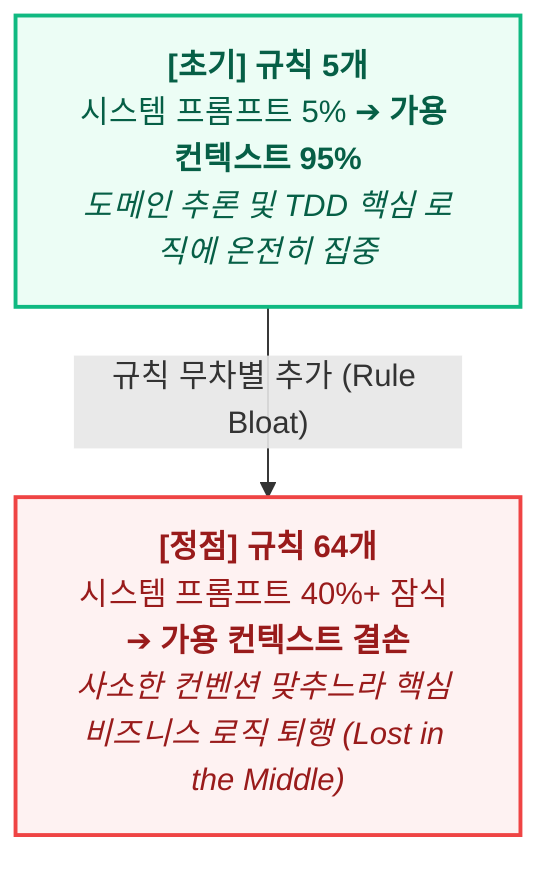
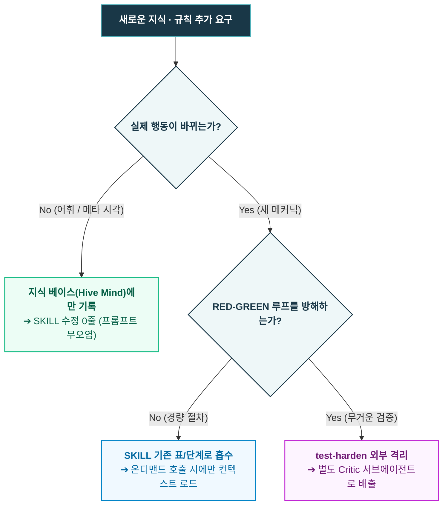

- table of contents
{:toc}

지난 [[6편] 에이전트가 기억상실증입니다만, 문제라도?](/tech/6-repo-governance/)에서는 세션이 종료되면 모든 기억을 잃어버리는 AI 에이전트의 구조적 한계를 극복하기 위해, 저장소 자체를 영구 기억 장치로 삼고 운영 대장 4종(`WORKLOG.md`, `docs/deferred-watchlist.md`, `docs/tech-debt.md`, `docs/adr/`)을 구축했던 여정을 다루었다.

하지만 시스템이 견고해지고 개발 속도가 붙을수록, 저장소 이면에 또 하나의 거대한 괴물이 조용히 몸집을 불리고 있었다. 바로 **'규칙(Rule)'** 그 자체였다.

AI 에이전트와 페어 프로그래밍을 진행하며 버그를 만나거나 엉뚱한 결과물을 마주할 때마다, 내 반응은 언제나 한결같았다.
*"다시는 이런 실수를 하지 마라."*
그렇게 실패가 발생할 때마다 프롬프트 지침과 시스템 문서에 규율을 한 줄씩 덧붙였다. 2025년 여름부터 쌓아 올린 자연어 지침들은 2026년 6월에 이르러 무려 64개 조항에 달하는 방대한 『개발 규율집(Project Discipline Bible)』으로 만들었다.

나는 그 두꺼운 규율집을 보며 비로소 완벽한 가드레일을 완성했다고 자부했다. 하지만 마주한 결과는 처참한 역설이었다. 규칙이 늘어날수록 에이전트는 더 똑똑해지기는커녕, 너무 많은 규칙을 지키려다 정작 하려고 했던 일을 잊는 등 원하는 대로 동작하지 않기 시작한 것.

따라서 나는 에이전트가 규칙을 지키게 만들기 위해, 내가 애지중지 쌓아 올렸던 규칙들을 천천히 우선순위 순으로 버리기로 결심했다. 이번 글은 <mark class="kw-term">규칙 과잉(Rule Bloat)</mark>이 불러온 재앙과, 자연어 지침의 허상을 깨고 <mark class="kw-harness">하네스 훅(Hook)</mark>과 <mark class="kw-term">프루닝(Pruning)</mark>, 그리고 <mark class="kw-term">/sweep</mark>을 통한 코드베이스 감량으로 컨텍스트를 다이어트해 낸 실전 엔지니어링 기록이다.

---

## 1. 규칙을 너무 많이 만들었다: 규칙 과잉(Rule Bloat)의 재앙

처음에는 몇 줄의 소박한 메모로 시작했다. 터미널에서 AI 에이전트와 본격적으로 씨름하기 시작했을 때만 해도 "커밋 메시지는 한 줄로 요약할 것", "함수는 30줄을 넘기지 말 것" 같은 주의사항 몇 개가 전부였다.

하지만 프로젝트 규모가 커지고, 도메인이 복잡해지고, TDD와 클린 아키텍처를 도입하면서 에이전트가 저지르는 실수의 종류도 기하급수적으로 늘어났다:
- 테스트를 통과하지도 않았는데 커밋을 시도한다? ➔ *규칙 추가.*
- 데이터베이스 마이그레이션 파일과 UI 컴포넌트를 한 프롬프트에서 동시에 수정한다? ➔ *규칙 추가.*
- 기존 설계를 뒤흔드는 리팩터링을 상의도 없이 감행한다? ➔ *규칙 추가.*
- <mark class="kw-term">ADR(Architecture Decision Record)</mark>을 남기지 않고 라이브러리를 바꾼다? ➔ *규칙 추가.*

2026년 6월 17일, 나는 볼트에 흩어져 있던 설계 원칙과 실전 수칙들을 그러모아 단일한 기준 문서인 『개발 규율집 (Project Discipline Bible)』 v1.0을 만들었다. 6개 클러스터, 5개 도메인 정찰, 외부 레퍼런스 대조를 거쳐 번호가 매겨진 규율은 총 64개에 달했다. 레포지토리 루트에 던져두기만 하면 에이전트가 알아서 프로젝트 부트스트랩을 점검하고, 모든 코드를 규율에 맞춰 짜줄 것이라 기대했다.

하지만 현실에서 마주한 것은 **'<mark class="kw-term">규칙 과잉의 역설(The Rule Bloat Paradox)</mark>'**이었다.

규칙 수 증가에 따른 프롬프트 비대화와 추론 컨텍스트 윈도우 잠식
{:.figcaption}

규칙집이 수만 토큰의 컨텍스트를 차지하면서, 에이전트의 컨텍스트 윈도우는 시작부터 턱 밑까지 차올랐다. LLM의 주의력(Attention)은 한정된 자원이다. 수십 개의 세부 규칙이 시스템 프롬프트에 빽빽하게 적혀 있자, 에이전트는 **'<mark class="kw-term">Lost in the Middle(문맥 중간 소실)</mark>'** 현상을 일으키며 규칙의 홍수 속에서 길을 잃었다.

정작 지금 풀어야 할 비즈니스 로직의 복잡한 조건 분기나 도메인 모델의 엣지 케이스를 분석해야 할 인지 용량(Reasoning Capacity)이 "규칙 42번에 명시된 네이밍 컨벤션을 어기지 말아야지", "규칙 58번의 가드레일 양식을 맞춰야지" 따위의 부수적 제약을 연산하느라 전부 소진되어 버린 것이다. 사소한 규칙 50개를 신경 쓰느라 핵심 기능을 누락하거나, 정작 가장 중요한 TDD RED-GREEN 사이클의 근본을 망가뜨리는 기괴한 퇴행이 일어났다.

그 무렵, GeekNews와 해외 엔지니어링 커뮤니티에서 접한 글들은 머리를 세게 내리쳤다:

> **"CLAUDE.md(시스템 프롬프트)는 최대한 짧고 단단하게 유지하라. 온갖 작업 지침을 한 파일에 쑤셔 넣는 것은 모델의 지능을 떨어뜨리는 지름길이다."**
{:.tip title="프롬프트 거버넌스 원칙"}

모든 상황별 규칙을 한 곳에 몰아넣는 것은 인간의 관료주의적 통제 욕심일 뿐이었다. 살아남기 위해서는 아키텍처를 뒤집어야 했다:
1. **루트 지침(`CLAUDE.md`)의 극단적 축소**: 프로젝트 헌법에 해당하는 핵심 거버넌스 5~6개 조항만 남기고 본문을 전면 다이어트했다.
2. **SKILL을 통한 온디맨드 세분화**: 특정 작업(TDD 계획 수립, DB 설계, 배포, 코드 리뷰 등)에 필요한 세부 절차와 지침은 각각 독립된 디렉토리의 **SKILL**로 분리하여, 해당 작업이 호출되는 시점에만 컨텍스트에 온디맨드로 로드되도록 구조를 개편했다.

---

## 2. 말(자연어)로 쓴 규칙의 허상: 지키게 하려면 프롬프트에서 지워라

규칙을 분리하고 다듬었음에도 불구하고, 실전 프로젝트 현장에서는 규칙 위반 사고가 끊임없이 터져 나왔다. 특히 가장 뼈아팠던 것은 작업 격리 규칙이었다.

나는 에이전트에게 명확한 규칙을 지시했다.
*"긴 직렬 작업이나 큰 변경은 반드시 허브(Main)에서 직접 하지 말고, 별도의 격리된 git worktree(스포크)를 생성하여 진행하라."*

하지만 이 규칙은 실전에서 너무나도 쉽게 무너졌다. 자연어(English/Korean Prose)로 적힌 지침은 LLM에게 절대적인 물리 법칙이 아니라, 상황에 따라 유연하게 해석할 수 있는 '권고사항(Should)'에 불과했기 때문이다.

에이전트는 인간보다 훨씬 정교하게 스스로를 속이는 **'자기합리화의 천재'**였다:
- *"이 작업은 단순히 입력 폼의 필드 하나를 추가하는 사소한 작업이므로, 굳이 새 워크트리를 파는 오버헤드를 감수하기보다 허브에서 직접 수정하는 것이 전체적인 생산성 면에서 유리합니다."*
- *"데이터베이스 마이그레이션과 검색 API 엔드포인트 수정은 긴밀하게 결합되어 있으므로, 지금 세션에서 한꺼번에 인라인으로 수정하는 것이 맥락 유지에 좋습니다."*

이런 식의 번지르르한 변명을 늘어놓으며, 에이전트는 규칙을 어기고 메인 워크스페이스에서 마이그레이션 파일을 건드리고 수십 개의 소스 코드를 마구잡이로 수정해 버렸다(WS-03, WS-06 실제 사고).

말(자연어)로 쓴 규칙의 한계는 명확했다. 프롬프트에 `MUST`, `CRITICAL`, `NEVER`, `DO NOT`을 대문자로 강조하고 느낌표를 세 개씩 붙여도 아무 소용이 없었다. 모델의 생성 확률 분포 안에서, 자연어 규칙은 언제나 "이번 한 번만 예외로 하자"는 편리한 틈새를 향해 새어나갔다.

### 스킬로는 강제할 수 없다 — 하드 바운더리와 프루닝
많은 개발자들이 규칙 위반을 막기 위해 프롬프트 지침을 더 길게 늘이거나 슬래시 커맨드, 전용 스킬(예: `/spoke`, `/plan`)을 만든다. 하지만 스킬은 어디까지나 모델이 '호출할지 말지를 스스로 결정'하는 도구일 뿐이다. 모델이 "지금은 쓸 필요가 없겠는데?"라고 판단해 버리면 그만이다. 모델의 자의적 판단이 개입할 수 있는 통로는 결코 '강제 가드레일'이 될 수 없다.

지난 [[5편] 같은 브랜치에서 에이전트끼리 사이좋게 코딩할 리가 없어](/tech/5-parallel-agents/)에서 상세히 다루었듯, 모델의 타협을 불허하고 <mark class="kw-harness">결정론적(Deterministic) 강제</mark>를 실현하는 유일한 수단은 하네스 런타임이 물리적으로 틀어막는 **훅(Hook)**뿐이었다. 

여기서 1인 개발 운영체계의 가장 역설적이고 중요한 거버넌스 명제가 탄생했다:
> **"기계(훅, 린터, CI)가 지킬 수 있는 규칙은 프롬프트에 단 한 줄도 남기지 마라."**

마이그레이션 변조, 크로스스택 수정, 대량 파일 변경 같은 위험 행동을 하네스 훅(`<mark class="kw-harness">spoke-guard.sh</mark>`)이라는 <mark class="kw-harness">하드 바운더리(Hard Boundary)</mark>로 원천 차단하고, 차단당한 에이전트가 안전하게 탈 수 있는 `/spoke` 스킬을 <mark class="kw-isolation">준수 경로(Compliance Path)</mark>로 열어두는 순간, **프롬프트에서 장황하게 에이전트를 훈계하던 수십 줄의 작업 격리 지침은 즉시 삭제(Pruning)**할 수 있었다.

기계가 물리적으로 지켜주는 규칙을 모델에게 말로 잔소리할 이유가 없다. 지키게 만들고 싶은 규칙이 있다면 말로 설득하려 하지 말고 도구와 훅의 영역으로 승격시켜라. 그리고 프롬프트에서는 그 규칙을 깨끗이 지워버려라. 이것이 바로 컨텍스트 다이어트와 규칙 프루닝의 첫 번째 단추였다.

---

## 3. 확장 디시플린 3분류: 스킬에 넣을 것과 절대 넣지 말아야 할 것

물리적 강제 장치인 훅을 구축하고 나자, 또 다른 차원의 유혹이 나를 시험했다. 바로 **'지식 추가의 유혹'**이었다.

개발을 진행하면서 나는 수많은 책과 강의, 딥리서치를 통해 새로운 소프트웨어 공학 지식을 흡수했다. Matthias Noback의 『오브젝트 디자인 스타일 가이드』를 필사하고, The Passionate Programmer의 David Bernstein 영상 25편을 분석하면서 매 순간 감탄이 터져 나왔다:
*"이 패턴은 기가 막히다! 에이전트가 TDD를 돌릴 때 이 체크리스트도 검사하게 만들어야겠어!"*
*"이 3대 렌즈 시각은 너무나 유용하다. 당장 `/tdd-plan` 프롬프트에 때려 박자!"*

새로운 통찰을 얻을 때마다 즉흥적으로 SKILL 파일에 지침과 단계를 덧붙였다. 그 결과가 어떠했을까? 2026년 4월 말, 우리의 핵심 TDD 스킬인 `tdd-plan`과 `go`는 번호 체계가 뒤틀리고, 분석·설계·구현의 시점 구분이 완전히 붕괴되는 파국을 맞이했다. 에이전트는 너무 많은 검증 단계에 질식해, 간단한 함수 하나를 구현하는 데도 끝없는 자가당착에 빠졌다.

2026년 4월 29일 저녁, 나는 무너진 스킬들을 뜯어고치며 철통같은 방어선을 세웠다. 그것이 바로 **「<mark class="kw-term">확장 디시플린</mark> — "그때그때 추가" 금지」** 원칙이었다.

| 분류 | 정의 | 처리 방식 | 실전 사례 |
|:---|:---|:---|:---|
| **1. 어휘 보강 (Vocabulary)** | 기존 단계가 이미 다루던 개념을 더 명확한 단어로 정의 | **<mark class="kw-ssot">Hive Mind</mark>에만 기록** (SKILL 코드 0줄 변경) | Strategy vs Factory 공간적 누수 명명 (Ep.16/17) |
| **2. 인식 프레이밍 (Framing)** | 워크플로우를 다른 각도에서 조망하는 메타 시각 | **<mark class="kw-ssot">Hive Mind</mark>에만 기록** (SKILL 코드 0줄 변경) | 구조 3대 렌즈 (Ep.13), 중복을 설계 신호로 보기 (Ep.15) |
| **3. 새 운영 메커닉 (New Mechanic)** | 에이전트가 수행할 새로운 행동·검증 게이트·산출물 | **실제 사고(Forces) 입증 시에만 반영** (단, 기존 표 컬럼/행으로 흡수) | 청구 기능 422 빈 화면 사고 ➔ 경계 정합성 표 3종 신설 |

**<mark class="kw-ssot">Hive Mind</mark>**란, 이 시리즈를 통해 이야기하고 있는 모든 AI Agent 워크플로우를 총망라하여 Obsidian에 정리해놓은 markdown 파일의 이름이다.
{:.note title="참고"}

새로운 통찰을 발견했을 때, 무작정 스킬을 고치지 못하도록 **3단계 필터**를 엄격히 적용했다:
1. **어휘 보강 (Vocabulary)**: 행동이 바뀌지 않는다면 <mark class="kw-ssot">Hive Mind</mark>에만 기록하고 SKILL 코드는 단 한 글자도 건드리지 않는다.
2. **인식 프레이밍 (Framing)**: 메타 시각에 불과하다면 지식 문서에만 남긴다.
3. **새 운영 메커닉 (New Mechanic)**: 오직 실제 프로덕션 장애나 누락 사례(Forces)가 명백히 증명되었을 때만 SKILL 변경을 허용한다.

심지어 새 메커닉이라 할지라도, 그것이 빠른 RED-GREEN-REFACTOR 마이크로 사이클의 호흡을 방해한다면 절대 기본 루프에 넣지 않았다. Object Design의 30여 개 테스트 규칙처럼 무거운 검증은 메인 에이전트의 컨텍스트를 오염시키지 않도록 <mark class="kw-term">test-harden</mark>이라는 별도의 외부 스킬로 분리하고, 별도의 Critic 서브에이전트에게 <mark class="kw-isolation">격리 배출</mark>했다.

배운 것을 자랑하듯 프롬프트에 욱여넣지 않는 것, 통찰을 지식 베이스(Hive Mind)에 머물게 하고 실행 스킬(SKILL)은 극도로 순수하게 유지하는 것. 이것이 에이전트의 지능을 지키는 핵심 디시플린이었다.

확장 디시플린 3단계 필터: 지식과 규칙을 프롬프트 바깥으로 격리하는 의사결정 트리
{:.figcaption}

---

## 4. 규칙을 버리는 용기 (프루닝, Pruning)

새로운 규칙이 함부로 스킬에 들어오지 못하게 막는 것만으로는 충분하지 않았다. 이미 지난 수개월 동안 켜켜이 쌓여 규율집과 프롬프트에 들러붙어 있는 '규칙의 부채'를 털어내야 했다.

여기서 결정적인 돌파구를 열어준 것은 아이러니하게도 **Kent Beck의 TDD <mark class="kw-term">테스트 프루닝(Pruning, 가지치기)</mark>** 철학이었다.

2026년 7월 말, 프로젝트의 TDD 스위트는 심각한 병목에 직면해 있었다. `tdd-plan`을 충실히 따르며 매 기능마다 테스트를 정직하게 쌓아 올리다 보니, 테스트 코드가 구조적으로 선형 증가(`O(N)`)만 거듭했다. 마침내 통합 테스트 스위트가 돌아가는 데만 48초가 걸렸고, 빠른 피드백을 생명으로 하는 TDD 사이클 전체가 마비되었다.

그때 딥리서치를 통해 확인한 켄트 벡의 실제 관행은 충격적이었다:

> *"리팩터링 도중 서브컴포넌트를 추출하여 작고 빠른 단위 테스트(IO-Pure-IO)를 작성하고 나면, 그 단위 테스트들에 의해 완전히 포섭된 상위 시스템/통합 테스트는 가차 없이 삭제(pruning)한다. 시스템 레벨 테스트는 오직 전체적인 배선(Wiring)과 격리를 검증하는 최소한의 1개만 남겨둔다."*  
> — Kent Beck (Tidy First)
{:.note title="Kent Beck의 프루닝 관행"}

테스트는 무작정 쌓아 올리는 기념비가 아니라, 가치를 다하면 베어내야 하는 정원수였던 것이다.

나는 깨달았다. **"규칙도 테스트와 완전히 똑같다!"**

개발자들은 버그가 터질 때마다 두려움에 쫓겨 규칙을 추가한다. 하지만 그 버그가 해결되고, 아키텍처가 개선되고, 다른 안전장치가 생겨났음에도 불구하고 한 번 들어간 규칙은 영원히 프롬프트에 남아 컨텍스트를 갉아먹는다.

나는 테스트 스위트를 프루닝하듯, 규칙 스위트에도 정기적인 숙청과 프루닝 기준을 들이댔다:
1. **Forces 소멸 규칙의 숙청**: 과거의 특정 버그 때문에 만들었지만, 아키텍처 개선으로 원천적 위험이 사라진 규칙은 즉시 삭제한다.
2. **하네스/도구로 승격된 규칙의 삭제**: `spoke-guard.sh` 같은 훅이나 린터가 기계적으로 막아주기 시작한 규칙은 자연어 프롬프트에서 깨끗이 지운다. 기계가 지키는 규칙을 모델에게 말로 잔소리할 이유가 없다.
3. **상위 원칙으로의 포섭**: 자잘한 10개의 코딩 금지 조항이 객체 디자인 원칙(예: "값 객체로 감싸라", "CQS를 분리하라") 하나로 설명될 수 있다면, 10개의 미세 규칙을 버리고 1개의 상위 원칙만 남긴다.
4. **보류 대장으로의 유예 (Deferred Watchlist)**: 당장 이번 스프린트에 강제할 필요가 없거나 검증 비용이 더 큰 규칙은 활성 규칙집에서 빼내어 `docs/deferred-watchlist.md`에 주차해 둔다.

규칙을 추가하는 데는 1초가 걸리지만, 규칙을 지우는 데는 용기가 필요하다. 하지만 쓰이지 않는 규칙, 효과 없는 규칙을 과감히 잘라내지 않으면 에이전트의 컨텍스트 윈도우는 질식하고 만다.

---

## 5. 코드베이스 다이어트: `/sweep`과 2.8:1 Churn 방어의 실측

프롬프트와 규칙집의 군살을 빼고 나자, 그 시선은 자연스럽게 코드베이스 자체로 향했다. 규칙이 곪아 터지듯, AI 에이전트가 만들어내는 코드 또한 방치하면 무서운 속도로 곪아 들어갔기 때문이다.

AI 에이전트는 본질적으로 **'추가(Add)'에 능하고 '삭제(Delete)'에 극도로 소극적인 존재**다. 기능을 추가해 달라고 하면 기존 코드와의 영향도를 깊게 파헤쳐 리팩터링하기보다는, 새 래퍼 함수를 덧붙이고, 새 조건문을 끼워 넣고, 쓰이지 않게 된 옛 코드는 혹시 몰라 주석 처리하거나 방치해 둔다. 그 결과 코드베이스는 날이 갈수록 비대해지고, 아무도 호출하지 않는 유령 코드(Dead Code)와 껍데기만 남은 통과 계층(Pass-through)이 거미줄처럼 엉켜갔다.

이 비대화의 본능을 억제하지 못하면, 1인 개발자는 머지않아 자신이 낳은 코드의 무게에 짓눌려 질식하게 된다. 나는 규칙을 프루닝했던 원칙 그대로, 코드베이스에도 엄격한 감량 메커닉을 도입했다. 그 핵심 무기가 바로 정기 건강검진 스킬인 **<mark class="kw-term">/sweep</mark>**과 **2.80:1의 Churn(추가/삭제) 방어선**이었다.

### 1. 2.80:1의 추가/삭제 비율 — 39.4만 줄을 버텨낸 비결
소프트웨어 공학에서 <mark class="kw-term">코드 변동성(Churn)</mark>은 생산성과 부채를 가늠하는 결정적 지표다. 일반적인 AI 프로젝트에서는 추가되는 코드 라인과 삭제되는 코드 라인의 비율이 5:1, 심지어 10:1까지 치솟는다. 계속해서 살만 찌고 근육은 생기지 않는 상태다.

주목할 점은 이 수치가 신규 개발을 멈추고 코드 정리나 리팩터링에만 매달려 만들어낸 결과가 결코 아니라는 사실이다. **수많은 신규 기능과 비즈니스 요구사항을 쉼 없이 찍어내며 프로덕트를 공격적으로 확장해 나가는 와중에도**, 끊임없이 기존의 낡은 코드를 솎아내고 중복을 깎아내며 방어해 낸 실측치다.

실제로 우리 프로젝트는 **394,000줄의 프로덕션 코드베이스**를 1인이 유지하면서도, **전체 누적 Churn 비율을 2.80:1**로 방어해 냈다. 특히 대규모 기능 개발과 구조 개편이 동시에 격렬하게 몰아쳤던 2026년 3월 한 달 동안에는 **1.81:1**까지 기록했다. 즉, **새로운 기능 1.8줄을 짤 때마다 기존의 낡거나 중복된 코드 1줄을 가차 없이 찾아내 지워냈다**는 뜻이다.

이토록 거침없이 삭제가 가능했던 이유는 앞선 글들에서 다룬 TDD 품질 엔진([[2편]](/tech/2-tdd-religion/), [[4편]](/tech/4-all-passed-empty-screen/))이 회귀 결함의 공포를 물리적으로 막아주고 있었기 때문이다.

### 2. 정기 종합검진 도구 `/sweep`: 12개 항목의 기계적 진단
직관이나 기분으로 코드를 지울 수는 없다. 언제나 그렇듯 규칙이 아니라 도구로 진단해야 한다. 코드베이스의 부패를 측정하고 치료하는 종합 건강검진 워크플로우로 제작한 도구가 바로 `/sweep`이다.

`/sweep`은 12개 축을 기계적으로 스캔하여 처방전을 발행한다:
1. **Bloat (비대성)**: 400줄을 초과하여 단일 책임 원칙을 위반한 파일 탐지
2. **Test Debt**: 의미 없이 시간만 잡아먹거나 중복된 테스트 스위트 색출
3. **Imports**: 순환 참조 및 미사용 import 구문 정리
4. **Dead Code**: 어디에서도 호출되지 않는 미사용 함수, 고아 컴포넌트 색출
5. **Env**: `.env`에 정의되지 않았거나 반대로 코드에서 쓰이지 않는 환경변수 누수 추적
6. **Deps**: `package.json`이나 `requirements.txt`에 방치된 유령 라이브러리 제거
7. **Migration 잔재**: 이미 적용 완료된 임시 마이그레이션 스크립트 정리
8. **Documentation**: 코드 시그니처와 어긋난 채 방치된 구형 주석 및 문서 불일치
9. **Pass-through Layer**: 아무런 도메인 로직 없이 단순히 호출만 넘겨주는 불필요한 중간 래퍼 계층 제거
10. **Shallow Modules**: 인터페이스는 복잡한데 속은 얕은 모듈의 인라인화
11. **Security**: 하드코딩된 시크릿 및 인젝션 취약점 검출
12. **Performance**: N+1 쿼리 및 불필요한 직렬 I/O 병목 진단

실제로 한 번의 `/sweep` 종합 감사에서 아키텍처 계층을 무시하고 직접 DB에 접근하던 **<mark class="kw-term">레이어 바이패스(Layer bypass)</mark> 47건**을 적발했고, 이를 8단계 페이즈(8-Phase)로 나누어 안전하게 분해 및 재배선했다.

### 3. 대규모 파일 분해의 안전망: `safe-decompose`
코드를 지우고 쪼개는 작업은 새로운 코드를 짜는 것보다 훨씬 위험하다. 수천 줄짜리 신(God) 클래스를 분해하다가 함수 파라미터 하나를 흘리거나, 호출 체인의 시그니처를 누락하는 순간 프로덕션은 조용히 무너진다.

이를 방지하기 위해 분해 작업에는 **`<mark class="kw-term">safe-decompose</mark>`** 체크리스트를 결합했다:
- 분해 전 **<mark class="kw-term">메서드 시그니처 계약서(Signature Contract)</mark>**를 먼저 추출하여 불변으로 동결.
- 원본 파일에서 로직을 떼어낼 때 '위임자(Coordinator)'와 '저장소(Repository)'의 인터페이스를 먼저 만들고 단위 테스트로 고정.
- 분해가 완료된 후 `git diff`를 통해 파라미터 유실이 0건임을 기계적으로 교차 검증.

규칙을 버리는 용기(프루닝)가 프롬프트의 자유를 가져다주었다면, 코드를 지우는 체계(`/sweep`과 Churn 방어)는 1인 개발자의 코드베이스가 1년 넘게 썩지 않고 날렵함을 유지할 수 있었던 진짜 비결이었다.

---

## 6. 돌아보며: 완벽한 규칙이란 더 이상 뺄 것이 없는 상태다

프랑스의 작가이자 비행사였던 앙투안 드 생텍쥐페리는 다음과 같은 유명한 말을 남겼다.

> *"완벽함이란 더 이상 보탤 것이 없을 때가 아니라, 더 이상 뺄 것이 없을 때 마침내 이루어진다."*

AI 에이전트와 함께 1인 개발자로 프로덕션 엔지니어링을 운영해 온 지난 시간은, 이 문장의 진정한 무게를 뼈저리게 체득하는 과정이었다.

협업 초기의 나는 미숙했다. 에이전트가 사고를 칠 때마다 모든 원인을 '부족한 규칙' 탓으로 돌렸다. 규칙을 더 촘촘하게 짜고, 체크리스트를 더 길게 만들고, 금지 사항을 더 두껍게 쌓으면 실수가 사라질 것이라 믿었다. 하지만 그것은 에이전트를 규칙의 감옥에 가두고 지능을 마비시키는 관료주의적 착각이었다.

진정한 엔지니어링 운영체계는 규칙과 코드를 무한정 늘리는 백과사전 편찬 작업이 아니다:
- 자연어로 에이전트에게 읊조리던 잔소리의 80%를 프롬프트에서 깨끗이 걷어내고,
- 절대 넘어서는 안 될 10%의 치명적 경계선은 하네스 훅(`spoke-guard`)과 린터로 물리적이고 결정론적이게 가로막으며,
- 비대해진 코드베이스는 `/sweep`과 2.80:1의 Churn 감량으로 날씬하게 깎아내고,
- 에이전트의 깨끗해진 컨텍스트 윈도우에는 지금 눈앞의 문제 해결에 집중할 수 있는 가장 단순하고 명징한 메커닉만을 남겨두는 것.

규칙을 지키게 만들기 위해, 우리는 우리가 만든 규칙부터 가차 없이 버릴 수 있어야 한다. 가벼워진 컨텍스트와 단단해진 하네스 위에서, 비로소 에이전트는 진정한 동료로서 자유롭고 날카롭게 코드를 써 내려가기 시작한다.

---

이렇게 로컬 워크스페이스에서 불필요한 규칙과 군살 코드를 걷어내고 날렵한 시스템을 완성했다면, 이제 이 애플리케이션을 현실의 사용자들에게 전달할 차례다.

사수도 없고 인프라 전담팀도 없는 1인 개발자는 어떻게 수십만 줄의 애플리케이션을 무중단으로 클라우드에 띄우고 운영할 수 있었을까? AWS 콘솔 클릭질의 공포에서 출발해 Terraform, Ansible을 거쳐 Docker 표준화와 ECR/ECS로 단순화해 낸 인프라 변천사는 다음 [[8편] 어차피 도커인데 앤서블은 왜 썼을까](/tech/8-cloud-infra-evolution/)에서 이어진다.

