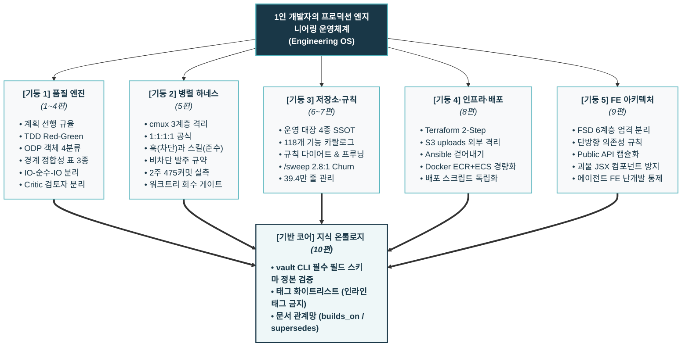

- table of contents
{:toc}

## 전체 시리즈 로드맵 안내 (1편 ~ 11편 정주행 가이드)

아래는 이 시리즈에서 이야기하는 운영체계를 구성하는 11편의 실전 에세이와 다루는 핵심 주제 안내이다. 관심 있는 주제부터 먼저 살펴보면 되겠다.

<!-- ═══════════════════════════════════════════════════════════════
     [로드맵 표 작성 및 유지 가이드라인]
     작성 원칙:
      - 'AI'라는 단어를 매 행마다 남발하지 않는다.
      - [실무 위험·결함(Pain Point) ➔ 엔지니어링적 통제 및 아키텍처 솔루션(Engineering Solution)]
        구조로 2개의 구(phrase)를 명쾌하게 대비시켜, 기술적 깊이와 문제 해결 역량에
        채용 담당자의 구미가 당겨 클릭하도록 작성한다.
      - 정통 소프트웨어 엔지니어링 어휘(TDD, 객체지향, CQS, 인터페이스 계약, 독립 검토)를
        사용하여 프로덕션 품질을 온전히 통제하는 1인 풀사이클 엔지니어의 품격을 드러낸다.
     ═══════════════════════════════════════════════════════════════ -->

| 글 제목 | 핵심 주제 |
|:---|:---|
| [[1편] AI에게 욕하던 신입이 선생님을 위한 규칙을 만들기까지](/tech/1-ground-rules/) | 사수 없는 현장의 첫 실패, 무작정 코딩을 멈추고 계획(Plan)을 선행시키는 작업 규율의 확립 |
| [[2편] 토큰 낭비라던 TDD가 어느새 제 종교가 되었습니다](/tech/2-tdd-religion/) | 비효율이라는 편견을 깬 TDD 개발 루틴, 책·영상·실전 지식을 모듈형 검진 시스템으로 자산화 |
| [[3편] 객체지향을 배웠으니 선생님을 가르쳐보겠습니다](/tech/3-teach-object-design/) | 파편화된 로직과 원시값 집착(Primitive Obsession)을 구조적으로 해결하는 객체 4분류, 계획 단계에 주입하는 CQS와 5단계 설계 압력 |
| [[4편] 역시 내 테스트 스위트는 잘못됐다](/tech/4-all-passed-empty-screen/) | FE-BE 계약을 대조하는 경계 정합성 표 3종, IO-Pure-IO 분리와 확증 편향을 깨는 독립 검토자 |
| [[5편] 같은 브랜치에서 에이전트끼리 사이좋게 코딩할 리가 없어](/tech/5-cmux-parallel-worktree/) | 동시 세션의 브랜치 충돌과 일탈을 원천 차단하는 cmux 워크트리 1:1:1:1 격리, 하드 바운더리 훅과 2주 475커밋을 견인한 Non-blocking 발주 체계 |
| [[6편] 에이전트가 기억상실증입니다만, 문제라도?](/tech/6-repo-governance/) | 세션 종료와 함께 사라지는 에이전트의 망각, 저장소 SSOT 운영 대장 4종과 arc42·C4 아키텍처 나침반으로 완성한 10초 온보딩 체계 |
| [[7편] 규칙이 64개나 있는데 왜 코드를 못 짜니](/tech/7-rule-pruning/) | 64개 규칙 과잉(Rule Bloat)이 부른 컨텍스트 질식, 프롬프트에서 도구·린터로 지워내는 규칙 거버넌스와 끊임없는 신규 기능 개발 속에서도 2.8:1 Churn을 방어한 /sweep |
| [[8편] 어차피 도커인데 앤서블은 왜 썼을까](/tech/8-cloud-infra-evolution/) | 마우스 클릭질의 공포와 배포 참사를 끝낸 Terraform 2-Step 도입, Ansible을 걷어내고 Docker ECR+ECS와 3중 안전망 스크립트로 완성한 1인 인프라 파이프라인 |
| [[9편] 어차피 프론트엔드인데 아키텍처가 왜 필요해?](/tech/9-frontend-fsd/) | 13만 줄 괴물 컴포넌트와 104건의 도메인 순환 참조 지옥, FSD 6계층 단방향 의존성과 Public API 방화벽으로 614개 테스트를 지켜낸 무결 마이그레이션 |
| [[10편] 기록의 악마는 고립된 노트의 꿈을 꾸지 않는다](/tech/10-knowledge-ontology/) | 5천 개 노트의 고립과 환각된 태그 오염, 읽기 전용 화이트리스트와 2계층 관계망(구조 2종·의미 7종), 거부 기반 vault CLI로 세운 인간·기계 공통 지식 온톨로지 |
| [[11편] 우리는 이미 각자의 운영체제를 짜고 있었다](/tech/11-external-workflow-and-ai-os/) | 폭발하는 작업 속에서 사람이 겪는 문서화 병목, 외부 실전 파이프라인과의 수렴 확인과 파일시스템 저널링 방식의 자가 갱신형 거버넌스(Living Wiki) 구축 |

## 이 글을 읽는 분들께

2025년 여름, 사수도 코드 리뷰어도 인수인계 문서도 없는 초기 스타트업에서 유일한 엔지니어로 첫 개발 커리어를 시작했다. 손에 쥔 것은 대표님이 찍어준 몇 편의 AWS 콘솔 녹화 영상과, 당시 막 시장에 등장하기 시작한 초기 AI 에이전트 도구들뿐이었다.

기초적인 CS 지식도 프로덕션 경험도 부족했던 내게, AI는 모든 문제를 해결해 줄 구원투수처럼 보였다. 하지만 기대는 순식간에 참담한 실패로 바뀌었다. 에이전트에게 기능을 맡길수록 쏟아져 나온 것은 그럴듯한 외형 뒤에 숨은 엉망진창 스파게티 코드, 끝없는 런타임 에러, 그리고 언제 서비스가 멈출지 몰라 가슴을 졸이던 살얼음판 같은 배포의 연속이었다. 똑똑하다는 에이전트를 마음껏 사용할 수 있었음에도, 나는 매일 내가 쏟아낸 코드의 부채에 허덕이고 있었다.

그 처참한 실패의 구렁텅이에서 나를 건져 올린 것은 무슨 거창한 깨달음이 아니었다. 단지 어제보다 오늘 덜 헤매고 덜 고통받고 싶다는 절박함, 문제가 터질 때마다 원인을 물고 늘어져 기어코 고쳐내는 **'<mark class="kw-term">개선의 관성</mark>'** 하나였다.

에이전트가 엉뚱한 코드를 짜내면 구현 전에 계획(Plan)을 승인받게 강제했고, 코드가 자꾸 깨지니 TDD와 객체 설계를 악착같이 공부해 가드레일로 둘렀으며, 422 에러가 터지면 경계 정합성 표를 만들어 끼워 넣었다. 문제가 터질 때마다 포기하는 대신, 도구를 깎고 시스템을 보강하며 하나씩 벽돌을 쌓아 올렸다.

그렇게 하루하루 치열하게 부딪히며 1년이 좀 넘는 시간이 흘렀을 때, 나는 지난 궤적을 돌아보며 가장 본질적인 진실을 마주하게 되었다.

**"AI에게 코드를 맡겼을 때, 내가 지난 1년 동안 집요하게 고치고 통제해 온 대상은 결국 코드가 아니었다."**

코드를 고치는 것은 지엽적인 미봉책에 불과했다. 정작 고쳐야 했던 것은 코드가 작성되기 전의 계획과 검증 체계, 코드가 살아 숨 쉬는 클라우드 인프라의 경계, 여러 에이전트가 충돌 없이 작업할 수 있는 워크스페이스 격리 하네스, 그리고 기계의 망각을 극복하기 위한 저장소의 영구 거버넌스였다. 지엽적인 코드를 붙잡고 씨름하는 대신, 환경과 시스템을 관성처럼 하나하나 개선해 나갔던 무수한 시도들이 모여 비로소 하나의 단단한 운영체계가 되어 있었던 셈이다.

이 글은 비전공자 1인 개발자가 사수 없는 현장에서 생존하기 위해, 오직 개선하고자 하는 관성 하나로 밑바닥부터 쌓아 올린 **'1인 풀사이클 프로덕션 <mark class="kw-term">엔지니어링 운영체계(Engineering OS)</mark>'**의 1년 연대기를 집약한 종합 회고록이자, 전체 시리즈의 정주행 로드맵이다.

---

## 한눈에 보는 엔지니어링 운영체계 5대 기둥 + 기반 온톨로지

---

## 첫 번째 코어: 코드보다 계획과 검증 (1~4편 요약)

AI에게 "이 기능 구현해줘"라고 입력하면 몇 초 만에 수백 줄의 코드가 쏟아진다. 화면상으로는 완벽해 보이지만, 실행하는 순간 오류가 터지거나 기존 기능이 깨진다. AI의 큰 위험성 중 하나는 **"엉터리인 코드를, 자신감 넘치고 그럴듯한 어조로 출력한다"**는 점에 있다. 이는 에이전트의 컨텍스트 한계때문에 특히 레포지토리가 비대해질 수록 더 부각되는 부분이다.

나는 기술 서적과 강의에서 흡수한 이론과 실전 경험을 결합했다. 그리고 코드 구현 전의 계획(Plan)과 검증(Test) 단계에 통제력을 집중시켜, 저장소 차원의 아키텍처 무결성을 지켜내는 **'품질 엔진'**을 구축했다.

{:width="700" loading="lazy"}

실제 코드 작성 전 가변성과 결합도를 진단하고 불필요한 패턴 과설계를 배제한 TDD 계획서. '있으면 좋을 것 같은' 패턴을 거부하고 최소 구조를 선택하는 엔지니어링 의사결정이 계획 단계에 못 박힌다.
{:.figcaption}

첫째, **[즉각 구현 금지와 계획(Plan)의 선행 (1편)](/tech/1-ground-rules/)**이었다. 사수도 가이드도 없던 초기, AI를 만능 프로그래머라 생각하고 비대해진 레포지토리에서 정리되지 않은 다양한 요구사항을 쏟아부었을 때 돌아온 것은 정돈되지 않은 스키마에서 비롯된 엉망진창 스파게티 코드와 참담한 실패뿐이었다. 에이전트에게 화를 내는 대신, **"AI는 코드를 짜주는 하인이 아니라, 엄격한 입력과 검증 규칙으로 통제해야 하는 강력한 연산 기계"**라는 엔지니어링적 인식 전환의 첫걸음을 뗐다. 기계가 성급히 코드를 찍어내지 못하도록 즉각 구현을 금지하고, 계획(Plan)을 먼저 세우게 한 뒤 인간이 검토·승인하는 작업 규율을 확립했다.

둘째, **[TDD의 전격 도입 (2편)](/tech/2-tdd-religion/)**이었다. 한때는 "AI에게 테스트 코드까지 짜게 하면 토큰 낭비 아닌가?"라고 생각했다. 하지만 구현 전에 실패하는 테스트(RED)를 작성하게 만들어서 스콥을 명확히하자, **AI Agent는 큰 레포지토리에서도 작업을 적확하고 빠르게 처리할 수 있는 최고의 파트너로 바뀌었다**. 테스트는 에이전트가 벗어나선 안 될 물리적 가드레일이 되었고, 나는 TDD의 열렬한 신봉자가 되었다.

셋째, **[객체 설계 규칙(ODP 4분류)의 계획 단계 주입 (3편)](/tech/3-teach-object-design/)**이었다. Matthias Noback의 『Object Design Style Guide』를 필사하며, 객체를 서비스(Service), 개체(Entity), 값 객체(Value Object), 데이터 전송 객체(DTO)로 4분류하는 원칙을 정립했다. 이를 작업 워크플로우 중 초반부인 `tdd-plan`의 메타 구조에 심어, 코드를 짜기 전에 객체의 역할과 테스트 전략(명령은 Mock, 쿼리는 Stub)을 표로 선언하게 했다. AI가 빈약한 도메인 모델이나 무분별한 Setter를 만들지 못하도록 설계 수준에서 봉쇄한 것이다.

넷째, **[경계 정합성 표 3종(계약·셰이프·트리거) (4편)](/tech/4-all-passed-empty-screen/)**이었다. 사내 학원 관리 서비스의 청구 기능에서 사고가 터졌다. 단위 테스트는 전부 GREEN이었지만, 브라우저를 열자 첫 화면은 422 Unprocessable Entity 에러와 빈 학생 목록뿐이었다. 프론트엔드의 빈 문자열 기본값(`''`)과 백엔드의 필수 쿼리(`Query(...)`)가 충돌했고, "매월 자동 청구"라는 행위 사양을 실제로 호출하는 진입점 코드가 누락된 것이었다. 이 뼈아픈 실패를 딛고, 코드 작성 전 프론트-백엔드 정합성을 1:1로 대조하는 3종 표를 만들어 시스템 경계의 불일치와 누락을 사전에 차단했다.

다섯째, **['All Passed'의 착시와 자가 검토자 해고 (4편)](/tech/4-all-passed-empty-screen/)**이었다. 테스트가 통과했다고 해서 안심할 수 없었다. Mock을 남발하여 자기가 만든 가짜 데이터만 확인하고 끝나는 '동어반복 테스트(Mock Tautology)'가 넘쳐났다. Gary Bernhardt의 경계 이론에 따라 비즈니스 규칙을 `IO-Pure-IO` 구조로 분리하여 순수 단위 테스트로 속도를 확보하고, 상위 통합 테스트를 프루닝했다. 그리고 가장 결정적으로, **"자신이 짠 코드를 자신이 검토하면 합격률은 언제나 100%다"**라는 확증 편향을 깨기 위해, 구현을 맡은 Builder와 완전히 격리된 별도의 Critic Agent를 투입해 상호 검증하는 Coordinator Pattern을 완성했다.

---

## 두 번째 코어: 한 세션보다 병렬 하네스 (5편 요약)

단일 에이전트와 터미널 한 칸에서 대화하며 코드를 짜는 것은, 장인의 훌륭한 '수공업'일 수는 있어도 폭발하는 프로덕션의 요구를 감당하는 '엔지니어링'은 되지 못했다. 한 브랜치에서 여러 세션을 띄우자, A 작업이 만들어낸 실패하는 테스트(RED)를 B 작업이 자신의 에러로 착각하고 엉뚱한 코드를 고치는 참사가 벌어졌다.

병렬화의 첫 번째 열쇠는 **'완벽한 공간적 격리'**였다. Git Worktree를 활용해 에이전트마다 완전히 독립된 물리 디렉토리를 제공하는 Conductor를 거쳐, 마침내 터미널 멀티플렉서 기반의 **`cmux` 워크트리 하네스**로 진화했다. 이를 통해 **`작업 단위 = 브랜치 = 워크트리 = 에이전트 = 1:1:1:1`**이라는 공식을 정립하게 되었다.

{:width="700" loading="lazy"}

실제 git worktree 기반 물리적 격리를 구현한 cmux 작업 환경. 사이드바의 워크스페이스마다 독립된 Git 워크트리를 매핑하고, 분할 화면으로 에이전트 실행과 실시간 테스트·로그 관찰을 병행한다.
{:.figcaption}

하지만 격리된 방을 만들어주는 것만으로는 부족했다. 에이전트들은 "이번 작업은 사소하니까 허브(Main)에서 바로 할게요"라며 끊임없이 격리 규칙을 탈출하려 했다. 여기서 나는 **"훅(Hook)은 타협 없는 하드 바운더리(Hard Boundary)이고, 스킬(SKILL)은 안전한 준수 경로(Compliance Path)다"**라는 결정적 교훈을 얻었다. 모델이 호출 여부를 판단하는 자연어 지침이나 스킬은 유연하지만 쉽게 샌다. 반면 하네스가 가로채는 `PreToolUse` 같은 훅은 모델의 판단과 무관하게 실행되는 '물리적 차단'이다. 작업 유출은 오직 훅이라는 하드 바운더리로만 막을 수 있었다.

나아가 병렬 처리의 최대 적인 '대기'를 없애기 위해 **'질문 없는 허브-스포크 발주 규약'**을 수립했다. 인간이 자리를 비운 사이 스포크 에이전트가 사소한 설계 질문을 던지는 순간, 병렬 파이프라인은 그 자리에서 올스톱된다. 허브 에이전트가 모든 결정권을 행사해 계획을 던지고, 스포크는 질문 없이 기본값으로 질주하며 커밋 메시지에 결정 근거를 기록하는 <mark class="kw-isolation">비차단(Non-blocking)</mark> 발주 체계를 완성했다.

여기에 화면의 "11 passed" 같은 거짓 성공 문구에 속지 않기 위해 **<mark class="kw-harness">센티넬 파일</mark>과 git status 0건을 대조하는 결정론적 완료 검증**을 세웠고, 워크트리를 삭제하는 순간 gitignored 운영 대장이 통째로 증발했던 사고(2026-08-03)를 겪은 뒤에는 **'대장 사전 회수 ➔ 통합 테스트 ➔ 안전 삭제'로 이어지는 엄격한 <mark class="kw-term">6단계 Teardown 회수 게이트</mark>**를 못 박았다.

그 결과, **단 2주 만에 475개의 커밋을 생성하고 24시간 만에 561개 파일·8.5만 줄에 달하는 대규모 프론트엔드 개편을 15개 병렬 슬라이스로 무결하게 완수**하는 압도적인 1인 프로덕션 생산성을 증명해 냈다. 1:1:1:1 물리적 격리 하네스와 비차단 발주 규약의 구체적인 구축기는 **[[5편] 같은 브랜치에서 에이전트끼리 사이좋게 코딩할 리가 없어](/tech/5-cmux-parallel-worktree/)**에서 상세히 다룬다.

---

## 세 번째 코어: 사람의 기억보다 저장소와 규칙 거버넌스 (6~7편 요약)

병렬 워크트리로 수많은 에이전트를 띄우자, 이번에는 **'기억의 휘발'**과 **'규칙의 비대화'**라는 두 개의 새로운 문제가 생겼다.

세션이 끝나면 에이전트는 모든 것을 잊는다. "그때 왜 그 결정을 내렸는지", "미처 해결하지 못한 기술 부채는 어디 있는지"를 사람이 일일이 기억하고 설명하는 것은 불가능했다. 나는 기억의 주체를 사람이 아닌 **저장소(Repository)**로 외주화했다.
- 진행 중인 작업과 직전 마디를 기록하는 `WORKLOG.md`
- 당장 해결하지 않고 유예한 보류 목록인 `docs/deferred-watchlist.md`
- 시스템의 기술 부채와 상환 트리거를 관리하는 `docs/tech-debt.md`
- 핵심 구조 결정을 Nygard 5부 구조로 기록하는 `docs/adr/`
여기에 **arc42(5개 핵심 섹션)**와 **C4 Model(3단계 줌인)** 기준을 결합하여, 에이전트가 세션 시작 10초 만에 시스템의 전체 지형을 파악할 수 있는 **<mark class="kw-ssot">운영 대장 4종</mark> + 아키텍처 나침반**을 완성했다 (**[[6편] 에이전트가 기억상실증입니다만, 문제라도?](/tech/6-repo-governance/)**).

{:width="700" loading="lazy"}

세션이 리셋된 에이전트에게 10초 온보딩 지도가 되어준 실제 아키텍처 문서화 체계. docs/adr/ 의사결정 기록과 arc42·C4 Model 기반의 시스템 컨텍스트 다이어그램이 코드베이스 내 단일 진실 공급원(SSOT)으로 살아 숨 쉰다.
{:.figcaption}

동시에, 문제가 생길 때마다 `Agents.md/Claude.md`에 덧붙여 무려 64개 조항까지 비대해진 '규칙의 괴물'을 마주했다. 규칙이 길어질수록 에이전트는 컨텍스트 질식(Lost in the Middle)을 일으켰다. 나는 켄트 벡의 테스트 프루닝 철학을 규칙에 적용했다.
- 중요도가 낮은 규칙의 가차 없는 숙청
- 자연어 지침의 린터(`eslint-plugin-boundaries`) 및 하네스 훅 승격
- 당장 쓰이지 않는 규칙의 Watchlist 유예
- 그리고 수많은 신규 기능들을 쉼 없이 만들어가는 개발 폭풍 속에서도, 정기 종합검진 도구인 **`/sweep`**을 가동하여 39.4만 줄의 코드베이스에서 **누적 2.80:1(월간 1.81:1)의 건강한 Churn(추가:삭제) 방어선**을 유지해 내며 코드와 규칙 모두를 날렵하게 깎아냈다 (**[[7편] 규칙이 64개나 있는데 왜 코드를 못 짜니](/tech/7-rule-pruning/)**).

---

## 네 번째 코어: 콘솔 클릭보다 통제 가능한 파이프라인 (8편 요약)

로컬 하네스와 저장소 거버넌스를 완벽히 정립했더라도, 그 코드로 만든 애플리케이션이 배포될 프로덕션 인프라가 흔들린다면 1인 개발자는 서비스 운영의 늪에서 헤어 나오지 못한다.

{:width="700" loading="lazy"}

실제 Terraform ecs.tf 코드. 배포 파이프라인과의 충돌 및 구버전 롤백 참사를 막기 위해 ignore_changes로 소유권을 엄격히 분리하고, 서킷 브레이커로 1인의 배포 안전망을 세웠다.
{:.figcaption}

대표님께 전달받은 AWS 콘솔 클릭 녹화본은 언제든 클릭 실수 하나로 서비스를 마비시킬 수 있는 시한폭탄이었으며 직관적으로 항상 모니터링하고 있기에도 버거웠다. 나는 이 비효율을 없애기 위해 **<mark class="kw-term">Terraform IaC</mark>**를 도입하여 VPC부터 ECS 클러스터까지 모든 기반 인프라를 코드로 선언했다. 특히 고객 자산의 영속성을 지키기 위해 **S3 uploads 버킷을 Terraform 밖으로 과감히 격리**하는 경계를 세우기도 하였다.

또한 서버 설정 관리로 도입했던 **Ansible이 1인 개발자에게 과도한 오버헤드**를 유발함을 깨닫고 전격 폐기한 뒤, **Docker 불변 이미지 기반의 ECR + ECS Fargate 구조로 인프라를 극도로 단순화**했다. 나아가 불변 인프라 프로비저닝(Terraform)과 빈번한 애플리케이션 배포(배포 셸 스크립트)의 관리 주체를 엄격히 분리하여, 1인 개발자가 오직 비즈니스 제품 개발에만 집중할 수 있는 최소한의 안전한 배포 파이프라인을 완성했다 (**[[8편] 어차피 도커인데 앤서블은 왜 썼을까](/tech/8-cloud-infra-evolution/)**).

---

## 다섯 번째 코어: 화면 구현보다 계층적 아키텍처 (9편 요약)

백엔드와 인프라를 단단히 다져놓았더라도, 사용자 인터페이스를 담당하는 프론트엔드가 무너지면 프로덕션은 온전히 성립하지 못한다. 특히 AI 에이전트에게 프론트엔드를 맡겼을 때 가장 빈번하게 발생하는 재앙은 1,000줄이 넘어가는 괴물 JSX 컴포넌트 생성과, 도메인 간의 경계를 무시하고 마구잡이로 import를 질러대는 **'지옥의 순환 참조(Cross-domain circular import)'**였다. 지금와서 생각해보면 이러한 비대한 컴포넌트는 에이전트가 멍청해지는 가장 빠른 지름길이기도 했다.

{:width="700" loading="lazy"}

실제 프로덕션 프론트엔드 작업 환경. 좌측 탐색기의 FSD 6계층(app, pages, widgets, features, entities, shared)과 에디터의 steiger.config.js 설정, 그리고 터미널에서 steiger 린터가 계층 위반을 기계적으로 전수 검증하고 통과(No problems found!)한 모습이다.
{:.figcaption}

사내 핵심 서비스의 프론트엔드(132K LOC, 635개 파일)에서 무려 104건의 도메인 교차 참조 위반이 식별되었을 때, 나는 **Feature-Sliced Design(FSD)**을 전격 도입했다.
- `app ➔ pages ➔ widgets ➔ features ➔ entities ➔ shared`로 이어지는 **엄격한 6계층 단방향 의존성 규칙**을 세우고,
- 슬라이스별 **Public API(`index.ts`)** 뒤로 내부 구현을 완벽히 캡슐화하여,
- 에이전트가 다른 모듈의 내부를 훔쳐보거나 계층을 거스르는 참조를 시도할 때 `eslint-plugin-boundaries` 린터가 빌드 단계에서 물리적으로 차단하도록 만들었다.

기존 레거시 도메인을 임시 완충 계층으로 활용하는 전략을 통해, 614개의 테스트가 단 하나도 깨지지 않는 무회귀 상태로 **단 이틀(26 커밋 / 25 Phase) 만에 13만 줄 전체를 FSD로 완벽하게 분해·이전**했다. 이로써 6편의 118개 기능 카탈로그와 맞물려 에이전트가 단 1줄의 스파게티도 만들어내지 못하도록 프론트엔드 난개발을 통제하는 견고한 UI 레일을 완성했다 (**[[9편] 어차피 프론트엔드인데 아키텍처가 왜 필요해?](/tech/9-frontend-fsd/)**).

---

## 기반 코어: 고립된 기록보다 연결된 온톨로지 (10편 요약)

수천 개의 마크다운 노트를 작성해도 연결되지 않으면 고립된 섬에 불과하다.

{:width="700" loading="lazy"}

실제 Obsidian Vault Graph View. 글을 적고 있는 현시점 기준 4,400여 개의 노드와 1만 2천 개의 엣지가 유기적으로 결합된 모습이다. 단순한 메모 수집이 아닌, 엄격한 스키마 검증과 온톨로지 관계망을 통해 코드베이스 저장소 거버넌스와 프로젝트 고도화를 견인하는 단일 진실 공급원(SSOT)의 역할을 수행한다.
{:.figcaption}

나는 볼트 전역 CLI(`vault`/`vo`)를 구축하여 13가지 문서 타입의 스키마를 기계적으로 검증하고 통과분만 파일로 생성되게 만들었다. 태그는 읽기 전용 화이트리스트로 엄격히 통제하고, 문서 간에 `builds_on`과 `supersedes` 관계망을 명시하여, 인간과 AI가 언제든 신뢰할 수 있는 단일한 <mark class="kw-term">Second Brain</mark>을 완성했다 (**[[10편] <mark class="kw-devil">기록의 악마</mark>는 고립된 노트의 꿈을 꾸지 않는다](/tech/10-knowledge-ontology/)**).

---

## 미래 지향: 단순한 도구 연동보다 나만의 엔지니어링 OS (11편 요약)

시스템을 고도화하던 중 접한 외부의 실전 워크플로우(우주초월의 `기획 ➔ 개발 ➔ QA ➔ 위키` 파이프라인)와 랄프가 제시한 `AI Agent OS` 비전은, 내가 지난 1년간 구축해온 체계가 필연적인 방향이었음을 재확인시켜 주었다.

나는 여기서 한 걸음 더 나아가, 6편의 4대 운영 대장 및 118개 기능 카탈로그와 10편의 자동화 위키 루프를 결합한 **'자가 갱신형 거버넌스(Living Wiki Engine)'**를 구상했다. 스포크 에이전트가 작업을 마칠 때 코드 diff와 사양을 바탕으로 자신의 기능 명세서와 운영 대장을 스스로 저널링하고 퇴장하는 구조다. 리눅스 커널이 파일시스템 메타데이터를 백그라운드에서 트랜잭션 단위로 갱신하듯, 에이전트 운영체제 스스로 숨 쉬고 갱신되는 궁극의 거버넌스를 향한 다음 질문을 던진다 (**[[11편] 우리는 이미 각자의 운영체제를 짜고 있었다](/tech/11-external-workflow-and-ai-os/)**).

---

## 1인 풀사이클 엔지니어링의 정체성: "개발자는 코더가 아니라 아키텍트다"

지난 1년간의 치열했던 여정을 돌아보며, 나는 AI 시대의 개발자가 가져야 할 정체성에 대해 확고한 결론에 도달했다.

많은 이들이 "AI가 코딩을 다 해주면 개발자는 이제 필요 없어지는 것 아니냐"고 묻는다. 또는 "프롬프트를 얼마나 잘 작성하느냐 개발자의 핵심 역량"이라고 말하기도 한다. 하지만 사수 없이 프로덕션 시스템 전체를 홀로 감당하며 증명해 낸 내 대답은 단호히 **"아니다"**다.

AI에게 코드를 맡겼을 때, 내가 고쳐야 했던 것은 결코 코드가 아니었다.
- 코드가 나오기 전에 무엇을 검증할지 정의하는 **사양과 테스트 계획**을 고쳐야 했다.
- 작성자와 검토자의 확증 편향을 제거하는 **에이전트 역할 분리 구조**를 고쳐야 했다.
- 어떤 실수가 발생해도 고객 데이터가 날아가지 않는 **클라우드 인프라의 경계**를 고쳐야 했다.
- 여러 에이전트가 충돌 없이 달릴 수 있는 **작업 격리 하네스와 물리적 훅**을 고쳐야 했다.
- 기계의 망각과 인간의 한계를 지탱해 주는 **저장소 대장과 지식 온톨로지**를 고쳐야 했다.

작성하는 코드의 의미를 이해하고 전체 조감도를 그릴 수 있는 능력은 매우 중요하다라고 생각하지만, 더 이상 한 줄의 코드를 키보드로 타이핑하는 속도는 더 이상 엔지니어의 무기가 아니다. 코드를 짜는 비용이 0에 수렴할수록, **"무엇을 만들 것인가", "어떤 경계를 세울 것인가", "결과물이 프로덕션의 가치와 부합하는지 어떻게 결정론적으로 검증할 것인가"**를 판단하는 아키텍처적 사고의 가치는 오히려 무한대로 치솟는다.

AI 시대의 1인 개발자는 코드를 대신 짜주는 요술 방망이를 구걸하는 '코더'가 아니다.  
**시스템의 경계를 설계하고, 엄격한 제약을 부여하며, 다중 에이전트와 클라우드 인프라가 한 치의 오차도 없이 맞물려 돌아가도록 자신만의 엔지니어링 운영체계(OS)를 구축하고 지휘하는 '시스템 아키텍트'이자 '오케스트레이터'다.**

사수 없는 스타트업에서 수많은 실패와 야근 속에서도 타협하지 않고 쌓아 올린 이 운영체계는, 앞으로 마주할 그 어떤 거대한 복잡성 앞에서도 흔들리지 않을 나의 가장 단단한 엔지니어링 무기다.

---
