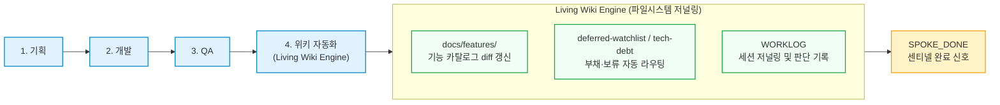

- table of contents
{:toc}

이 시리즈는 지난 10편에 걸쳐 하나의 긴 여정을 기록해왔다. 이 시리즈는 완결을 못 박는 구성이 아니다. 운영체계라는 것 자체가 매일 쓰면서 매일 고치는 물건이고, 쓸 만한 경험이 쌓이면 그때그때 기록을 보태는 것이 이 시리즈의 방식이다. 10편까지 쓰고 나서도 워크플로우를 다듬는 일상은 계속됐고, 그 과정에서 흥미로운 것을 하나 발견했다.

한 유튜브 영상을 보다가, 묘한 기시감에 사로잡혔다.

**"이 사람이 보여주는 워크플로우, 내가 만든 것과 너무나 닮아 있다."**

---

## 1. 우주초월의 에이전트 워크플로우

유튜브 채널 **'우주초월'**의 발표 영상([에이전트 워크플로우의 실체](https://www.youtube.com/watch?v=woSiT_kytXo))은 에이전트 워크플로우를 회사 동료들 앞에서 시연한 실전 기록이다. AI를 잘 모르던 동료가 "40년 인생이 부정당한 느낌"이라며 불쾌감을 드러낼 정도로 충격적인 반응이 나왔다고 한다.

영상에서 소개된 핵심 구조를 요약하면 이렇다:

1. **마스터 AI 오케스트레이션**: 기획 ➔ 개발 ➔ QA ➔ 위키. 사람은 마스터 AI와만 대화하고, 나머지는 마스터 AI가 알아서 진행
2. **교차 검수 체계**: Codex가 작업하고, Claude가 읽기 전용으로 검수. 승인(Approve)될 때까지 반복
3. **증거 기반 완료 판정**: TODO 체크 시 완료 근거를 반드시 명시. QA에서 실제 조작 결과를 캡처하여 증거 제출
4. **비용 최적화**: 단계별 모델 선택 + Forked Session(Seed AI)으로 캐시 히트율 극대화
5. **병렬 분기**: 큰 작업을 마스터 AI가 분할하여 동시 실행, 완료 후 합쳐서 재검증

그리고 이 구조를 보면서, 내가 지난 1년간 구축해온 체계의 설계 원칙들이 하나하나 겹쳐 보이기 시작했다.

> **[기술적 사실 및 원천 영상]**
> - **참조 영상**: 유튜브 우주초월, [에이전트 워크플로우의 실체](https://www.youtube.com/watch?v=woSiT_kytXo) (회사 발표 시연)
> - **자체 워크플로우 체계**: `Development Philosophy (Hive Mind)`, `cmux worktree workflow`

---

## 2. 겹치는 설계 원칙들: 우연의 일치인가, 필연인가

남의 워크플로우를 자기 것과 대조하는 일은 단순한 벤치마킹이 아니다. **같은 문제를 풀기 위해 독립적으로 도달한 설계가 겹친다면, 그것은 그 설계가 필연적이라는 방증이다.**

### 2.1. 교차 검수 = Coordinator Pattern의 Builder/Critic 분리

우주초월의 워크플로우에서 가장 눈에 띄는 것은 "Codex가 작업하고 Claude가 읽기 전용으로 검수"하는 구조였다. **검수 AI는 절대 직접 코드를 손대지 않는다.** 훈수만 두고, 수정은 작업자 AI가 한다.

이것은 우리가 정립한 Builder/Critic 분리 원칙과 정확히 같은 방향이다. "자기 코드를 자기가 검증하지 않는다", 즉 확증 편향을 구조적으로 제거하기 위해 컨텍스트를 분리하는 것이다. 우주초월은 이를 "다른 모델"로, 나는 "다른 에이전트 역할"로 구현했을 뿐, 근본 원리는 동일하다.

### 2.2. 증거 기반 완료 판정 = 센티넬 파일 + 완료 게이트

"거짓말하지 말고 근거를 제시하라"는 프롬프팅은, cmux 워크트리 워크플로우의 완료 판정 원칙, 즉 **에이전트의 자기보고를 신뢰하지 않고 센티넬 파일(`SPOKE_DONE`) + 커밋 수 + 테스트 종료코드로 판정**하는 것과 같은 불신의 철학에서 출발한다.

### 2.3. 마스터 AI 오케스트레이션 = 허브/스포크 발주 규약

마스터 AI가 전체를 관리하고 사람은 마스터와만 대화하는 구조는, 우리의 "허브 1(조정) + 스포크 N(격리 구현)" 체계와 본질적으로 같다. 단, 우리의 체계에는 **결정-완결 브리핑**이라는 더 정교한 발주 규약이 있다. 스포크에게 질문을 금지(`AskUserQuestion 금지`)하고, 모든 결정을 사전에 확정하여 브리핑에 기재함으로써 병렬성의 마비를 원천 차단한다.

### 2.4. 비용 최적화 = 모델 선택 + 캐시 전략

우주초월이 "단계별로 다른 모델을 지정하고, Forked Session으로 캐시 히트율을 높인다"고 말한 부분은, 우리 체계에서는 cmux의 Seed Session 관리와 모델별 토큰 예산 배분으로 구현되어 있다.

> **[기술적 사실 및 볼트 원천 근거]**
> - **Coordinator Pattern 4역할 분리**: Analyst ➔ Architect ➔ Builder ➔ Critic
> - **cmux Completion 판정**: 센티넬 파일 + git rev-list + 테스트 종료코드 (화면 텍스트 grep 금지)
> - **허브/스포크 규약**: 질문 금지, 결정-완결 브리핑, 2주 475커밋 실전
> - **Development Philosophy**: "결정과 실행을 분리하라"

---

## 3. 겹치지 않는 지점들: 내 체계가 더 깊이 파고든 곳

대조하다 보면 겹치는 것만큼이나 **갈라지는 지점**이 선명해진다. 이 차이가 단순한 취향인지, 규모나 환경의 차이에서 비롯된 것인지, 아니면 설계 철학의 근본적인 분기점인지를 구분하는 것이 중요하다.

### 3.1. 사양 무결성(Specification Integrity): "테스트는 통과했는데 서비스가 안 돈다"

우주초월의 워크플로우에는 **경계 정합성 표**(계약 표, 셰이프 표, 트리거 표)에 해당하는 장치가 보이지 않는다. 4편에서 다루었듯, 단위/통합 테스트가 모두 통과해도 사용자 진입점에서 422 에러와 빈 목록이 발생하는 사고는 교차 검수만으로는 잡을 수 없다. **Plan과 Code를 1:1로 재대조하는 사양 무결성 검증**이 필요한 지점이다.

### 3.2. 하드 바운더리 훅 vs 프롬프트 의존

"검수 AI는 읽기 전용"이라는 규칙을 프롬프팅으로 권고하는 것과, cmux 워크트리 워크플로우의 `spoke-guard.sh` 훅처럼 **PreToolUse 단계에서 exit 2로 원천 차단**하는 것은 본질적으로 다르다. 모델은 "이번만 예외"라며 규칙을 어기는 경향이 있고, 프롬프트만으로는 이를 막을 수 없다는 것을 우리는 실전에서 뼈아프게 배웠다.

### 3.3. 저장소 SSOT와 운영 대장

위키 시스템이 "전체 큰 그림과 구조 중심"으로 정리된다는 점은 유사하지만, 6편에서 다룬 운영 대장 4종(`WORKLOG`, `deferred-watchlist`, `tech-debt`, `ADR`)의 생존 규약, 즉 워크트리 teardown 전 반드시 diff 기반으로 회수하는 절차는 워크플로우의 지속성을 보장하는 핵심 장치다.

---

## 4. 랄프의 꿈: AI Agent OS라는 다음 질문

얼마 전, 2편에서 소개한 과천 모임에서 대화를 나누다가 랄프(Ralph) 창시자가 구상 중인 비전에 대한 이야기가 나왔다. 그가 만들고자 하는 것은 AI Agent를 다루기 위한 일종의 **운영체제(OS)**라는 이야기였다.

Linux가 컴퓨터의 CPU, 메모리, 디스크를 효율적으로 분배하듯, 이 AI OS는 **토큰이라는 자원을 관리**한다. 핵심 아이디어는 이렇다:

- **요청 라우팅**: 사용자의 요청이 들어왔을 때, 그 요청의 성격에 따라 최적의 모델로 보낸다.
  - 검색에 강점을 가진 모델: 빠른 속도의 출력이 방향성
  - 정밀 코딩에 강점을 가진 모델: 깊은 추론과 정밀한 코드 생성
  - 각 모델의 고유 강점을 살려 효율화하는 것이 라우팅의 본질이다.
- **토큰 매니지먼트**: Linux의 프로세스 스케줄러가 CPU 시간을 분배하듯, 토큰 예산을 작업 단위로 적절히 분배한다.
- **목표**: 최소한의 토큰으로 최고 퀄리티의 결과물을 뽑아내는 것이다.

이 비전을 듣는 순간, 내가 만들어온 워크플로우의 궤적이 하나의 선으로 이어지는 느낌을 받았다.

생각해보면 우리가 지금까지 해온 일이 바로 그것 아닌가?

- **5편의 cmux 하네스**는 에이전트 세션이라는 "프로세스"를 워크트리라는 격리된 메모리 공간에 배치하는 프로세스 매니저다.
- **마스터 AI(허브)**는 스포크들에게 작업을 발주하고 결과를 회수하는 스케줄러다.
- **모델 선택과 Seed Session**은 토큰이라는 컴퓨팅 자원의 예산 배분이다.
- **검수 체계와 센티넬 파일**은 프로세스 간 통신(IPC)과 시그널 핸들링이다.

우주초월님이 이야기하는 워크플로우도 마찬가지다. "단계별로 모델을 다르게 지정"하고, "마스터 AI가 병렬 분기를 관리"하며, "Forked Session으로 캐시를 최적화"하는 것, 이 모든 것이 결국 **토큰이라는 자원을 효율적으로 스케줄링하는 행위**다.

우리는 각자의 프로젝트에서 손수 프로세스 스케줄러를 짰고, 메모리 관리자를 만들었으며, IPC 프로토콜을 설계했다. 그리고 이 수작업 운영체제들이, 언젠가는 Linux처럼 범용화되고 추상화될 수 있다는 것, 그것이 랄프 창시자가 보고 있는 방향이다.

> **[기술적 사실 및 볼트 원천 근거]**
> - **Linux 커널 아날로지**: 프로세스 스케줄링(CFS) ↔ 토큰 예산 분배, 가상 메모리 격리 ↔ 워크트리/세션 격리, 시스템 콜 ↔ 에이전트 도구 호출
> - **cmux 3계층과 OS 3계층의 대응**: Workspace = 프로세스, Surface = 스레드, Split Pane = 파이프
> - **허브/스포크**: init 프로세스 / 자식 프로세스

---

## 5. 거버넌스의 최종 진화: 저장소 대장과 위키 루프가 만날 때

남의 체계를 관찰하고 AI OS라는 비전을 곱씹는 과정에서, 내 머릿속을 스친 가장 강렬한 번뜩임은 바로 **"거버넌스의 자동화"**였다.

6편에서 우리는 세션 리셋의 공포를 이겨내기 위해 저장소에 4대 운영 대장(`WORKLOG`, `deferred-watchlist`, `tech-debt`, `ADR`)과 118개의 기능 카탈로그(`docs/features/`)라는 거대한 SSOT 인프라를 구축했다. 덕분에 에이전트가 기억상실증에 걸려도 저장소의 문서를 읽고 즉시 맥락을 이어받을 수 있었다.

하지만 실전에서 병렬 스포크 에이전트들을 극한으로 몰아붙이며 겪었던 또 다른 현실적인 고통이 있었다. **에이전트의 생산 속도가 폭발할수록, 문서의 정합성을 유지하는 비용도 비례해서 폭발한다는 점**이었다.

에이전트들이 1시간 만에 서너 개의 기능 슬라이스를 쳐낼 때, 그 변경 사항을 `docs/features/` 카탈로그의 변경 이력(Changelog)에 반영하고, 코드 작업 중 발생한 부채와 보류 항목을 운영 대장에 적재하는 일은 고스란히 사람(테크 리드)의 병목으로 되돌아왔다. 코드는 기계가 짰는데, 그 뒤치다꺼리를 하느라 사람이 문서와 씨름하는 역전 현상이 일어난 것이다.

바로 이 지점에서 우주초월의 파이프라인이 결정적인 힌트를 주었다.

우주초월의 워크플로우에서 **'위키'는 사람이 개발 끝나고 나중에 쓰는 부가 작업이 아니라, 에이전트가 거쳐야 하는 라이프사이클의 마지막 공식 관문**이었다.

"그렇다면 왜 우리는 이 위키 단계를 개괄적인 설명 작성에만 머물게 하는가? 6편에서 만들어둔 치밀한 엔지니어링 메타데이터 구조체와 결합하면 어떨까?"

그 질문 끝에 구상하게 된 것이 바로 **자가 갱신형 거버넌스(Living Wiki Engine)**다.

스포크 에이전트가 QA를 통과하고 종료 신호(`SPOKE_DONE`)를 생성하기 직전, 작업의 마무리 관문으로 다음 세 단계를 에이전트 스스로 완결 짓도록 강제하는 것이다:

1. **기능 카탈로그 자동 갱신 (`docs/features/`)**:
   자신이 수정한 코드 diff와 사양을 바탕으로, 해당 기능 문서의 구현 상태, 엔드포인트/컴포넌트 바인딩, 그리고 변경 이력(Changelog)을 직접 작성한다.
2. **부채와 보류 사항의 자동 라우팅 (`deferred-watchlist`, `tech-debt`)**:
   구현 과정에서 불가피하게 발생한 타협점이나 즉시 풀지 않은 이슈를 정해진 스키마(F-식별자, Fowler 4분면 분류, 상환 트리거)에 맞춰 대장에 스스로 등록한다.
3. **세션 저널링 (`WORKLOG`)**:
   이번 세션에서 수행한 판단과 커밋 해시 요약을 저널에 기록한 뒤에야 비로소 센티넬 파일을 남기고 퇴장한다.

이것은 앞서 살펴본 **AI Agent OS의 관점에서 보면 '파일시스템 메타데이터 저널링(Journaling File System)'과 완벽히 대응**한다.

리눅스 커널이 파일 쓰기 트랜잭션을 마칠 때 inode와 디렉터리 메타데이터를 백그라운드에서 트랜잭션 단위로 자동 갱신하듯, 에이전트 운영체제 역시 작업이 끝나는 순간 저장소 거버넌스 메타데이터를 스스로 갱신하고 완결 짓는 것이다.

인간이 일일이 문서를 복사하고 싱크를 맞출 필요가 없다. 저장소는 에이전트의 호흡과 함께 스스로 갱신되는 살아 숨 쉬는 위키(Living Wiki)가 되고, 다음 투입되는 에이전트는 단 1초의 설명 없이도 가장 완벽한 최신 상태의 뇌를 물려받는다. 6편의 저장소 기억 체계와 10편의 자동화 위키 루프가 만나는 궁극의 교차점이 바로 여기에 있다.

---

## 6. 곱연산의 재확인: 이론이 도구를 결정한다

우주초월이 발표에서 강조한 "개인 역량 x AI 활용 능력 = 시너지"라는 곱연산 구조는, 이 시리즈 전체를 관통하는 메시지와 정확히 일치한다.

이론이 높은 사람(시니어, 경력직)은 AI를 조금만 써도 시너지가 크게 나타나고, 이론이 낮은 사람은 AI를 아무리 잘 다뤄도 산출 가치에 한계가 있다. 이것이 경력직과 주니어 사이의 격차가 크게 벌어져 보이는 이유다.

그런데 이것은 동시에 희망적인 메시지이기도 하다. **이론 학습은 비용이 크지만, AI 활용 학습은 상대적으로 비용이 낮다.** 이론을 탄탄히 쌓아둔 사람에게 AI는 레버리지가 된다. 그리고 그 이론이란, 1편에서 시작한 계획 선행 규율, 2편의 TDD, 3편의 객체지향 설계, 4편의 경계 정합성, 이 시리즈가 기록해온 바로 그 여정이다.

나는 이 시리즈를 쓰면서, 그리고 우주초월의 발표를 보면서, 하나의 확신에 도달했다.

**에이전트 워크플로우를 만드는 것은 프로그래밍 능력이 아니다. 자신의 업무를 구조화하는 능력이다.** 기획 ➔ 개발 ➔ QA ➔ 위키라는 흐름을 정의하고, 각 단계의 입력과 출력을 명세하며, 실패 시의 롤백 경로를 설계하는 것, 이것은 프로그래머가 매일 하는 일이지만, 프로그래머만 할 수 있는 일은 아니다.

다만, 프로그래머는 이 구조화를 **코드와 시스템으로 구현하고 반복 가능하게 만드는 데 유리하다.** 그리고 그 구현의 기반이 되는 것은 결국 이론이다.

---

## 7. 닫는 생각: 운영체제는 멈추지 않는다

나만의 워크플로우를 구축하다 보면 비슷한 구조에 독립적으로 도달한 사람들을 발견하게 된다. 우주초월의 발표 영상은 그 가장 선명한 사례였다.

마스터/워커 분리, 교차 검수, 증거 기반 완료 판정, 단계별 모델 선택, 병렬 분기, 이 패턴들이 반복적으로 등장한다는 것은, **에이전트와 협업하는 엔지니어링에는 아직 이름이 붙지 않은 어떤 '정석'이 형성되고 있다**는 뜻이다. 그리고 그 정석이 충분히 성숙하면, 누군가는 그것을 운영체제로 추상화할 것이다.

Linux가 하드웨어의 복잡성을 감추고 프로그래머에게 깔끔한 추상화를 제공했듯, AI OS는 토큰의 복잡성을 감추고 사용자에게 "최적의 결과를 최소 비용으로"라는 약속을 제공할 것이다.

이 영상을 보면서 참고할 것은 참고하고, 우리 체계에 적용할 수 있는 것은 적용해나갈 생각이다. QA 단계에서 화면 캡처를 증거로 첨부하는 방식이라든가, Forked Session을 활용한 캐시 최적화 전략 같은 것들은 직접 실험해볼 가치가 있다. 반대로, 우리가 이미 더 깊이 파고든 지점들, 사양 무결성 검증이나 하드 바운더리 훅이 왜 필요했는지를 다시 한번 확인하는 계기이기도 했다.

운영체계는 계속 진화하고, 쓸 만한 이야기가 쌓이면 또 기록한다. 그것이 이 시리즈의 방식이다.
