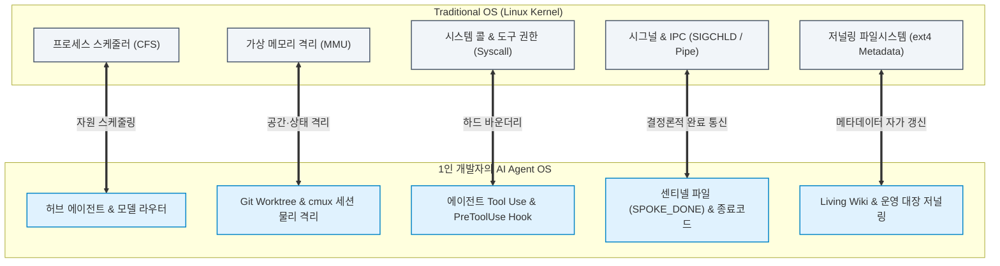
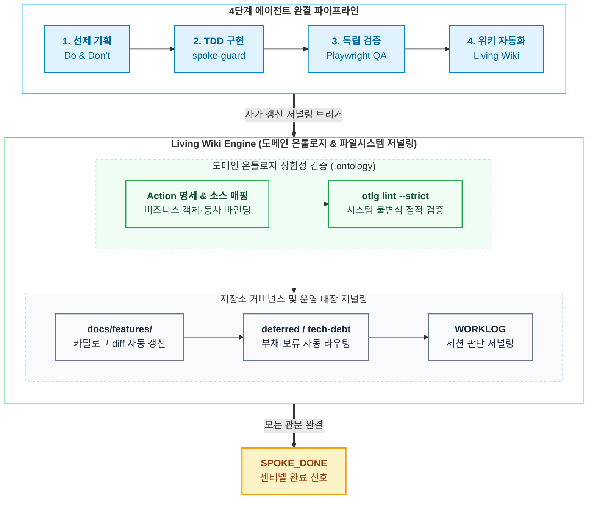

- table of contents
{:toc}

이 시리즈는 지난 10편에 걸쳐 워크플로우의 진화에 대한 긴 여정을 기록해왔다. 이 시리즈는 완결을 못 박는 구성이 아니다. 운영체계라는 것 자체가 매일 쓰면서 매일 고치는 물건이고, 쓸 만한 경험이 쌓이면 그때그때 기록을 보태는 것이 이 시리즈의 방식이다. 10편까지 쓰고 나서도 워크플로우를 다듬는 일상은 계속됐고, 그 과정에서 흥미로운 것을 하나 발견했다.

한 유튜브 영상을 보다가, 묘한 기시감에 사로잡혔다.

**"이 사람이 보여주는 워크플로우, 내가 만든 것과 너무나 닮아 있다."**

---

## 1. 우주초월님의 에이전트 워크플로우

유튜브 채널 **'우주초월'**님의 발표 영상([에이전트 워크플로우의 실체](https://www.youtube.com/watch?v=woSiT_kytXo))은 에이전트 워크플로우를 회사 동료들 앞에서 시연한 실전 기록이다. AI를 잘 모르던 동료가 "40년 인생이 부정당한 느낌"이라며 불쾌감을 드러낼 정도로 충격적인 반응이 나왔다고 한다.

영상에서 소개된 핵심 구조를 요약하면 이렇다:

1. **<mark class="kw-term">마스터 AI 오케스트레이션</mark>**: 기획 ➔ 개발 ➔ QA ➔ 위키. 사람은 마스터 AI와만 대화하고, 나머지는 마스터 AI가 알아서 진행
2. **<mark class="kw-term">교차 검수 체계</mark>**: Codex가 작업하고, Claude가 읽기 전용으로 검수. 승인(Approve)될 때까지 반복
3. **<mark class="kw-term">증거 기반 완료 판정</mark>**: TODO 체크 시 완료 근거를 반드시 명시. QA에서 실제 조작 결과를 캡처하여 증거 제출
4. **비용 최적화**: 단계별 모델 선택 + <mark class="kw-term">Forked Session(Seed AI)</mark>으로 캐시 히트율 극대화
5. **<mark class="kw-term">병렬 분기</mark>**: 큰 작업을 마스터 AI가 분할하여 동시 실행, 완료 후 합쳐서 재검증

그리고 이 구조를 보면서, 내가 지난 1년간 구축해온 체계의 설계 원칙들이 하나하나 겹쳐 보이기 시작했다.

> **[기술적 사실 및 원천 영상]**
> - **참조 영상**: 유튜브 우주초월님, [에이전트 워크플로우의 실체](https://www.youtube.com/watch?v=woSiT_kytXo) (회사 발표 시연)
> - **자체 워크플로우 체계**: `Development Philosophy (Hive Mind)`, `cmux worktree workflow`

---

## 2. 겹치는 설계 원칙들: 우연의 일치인가, 필연인가

남의 워크플로우를 자기 것과 대조하는 일은 단순한 벤치마킹이 아니다. **같은 문제를 풀기 위해 독립적으로 도달한 설계가 겹친다면, 그것은 그 설계가 필연적이라는 방증이다.**

### 2.1. 교차 검수 = Coordinator Pattern의 Builder/Critic 분리

우주초월님의 워크플로우에서 가장 눈에 띄는 것은 "Codex가 작업하고 Claude가 읽기 전용으로 검수"하는 구조였다. **검수 AI는 절대 직접 코드를 손대지 않는다.** 훈수만 두고, 수정은 작업자 AI가 한다.

이것은 우리가 정립한 <mark class="kw-term">Builder/Critic 분리</mark> 원칙과 정확히 같은 방향이다. "자기 코드를 자기가 검증하지 않는다", 즉 <mark class="kw-term">확증 편향</mark>을 구조적으로 제거하기 위해 컨텍스트를 분리하는 것이다. 우주초월님은 이를 "다른 모델"로, 나는 "다른 에이전트 역할"로 구현했을 뿐, 근본 원리는 동일하다. 나는 회사에서 제공해주는 벤더사가 하나밖에 없어서 Claude만 사용했지만, 이렇게 여러 벤더사의 에이전트들을 적절히 사용해보는 것도 나중에 실험으로 적용을 시켜볼만한 부분이라는 생각이 들었다.

### 2.2. 증거 기반 완료 판정 = 센티넬 파일 + 완료 게이트

"거짓말하지 말고 근거를 제시하라"는 프롬프팅은, cmux 워크트리 워크플로우의 완료 판정 원칙, 즉 **에이전트의 자기보고를 신뢰하지 않고 <mark class="kw-term">센티넬 파일(`SPOKE_DONE`)</mark> + 커밋 수 + 테스트 종료코드로 판정**하는 것과 같은 불신의 철학에서 출발한다.

### 2.3. 마스터 AI 오케스트레이션 = 허브/스포크 발주 체계

마스터 AI가 전체를 관리하고 사람은 마스터와만 대화하는 구조는, 우리의 "<mark class="kw-term">허브 + 스포크</mark>" 체계와 본질적으로 같다. 작업을 분할하여 자식 프로세스에게 위임하고, 결과를 통합하여 다음 단계로 넘기는 구조는 병렬 에이전트 환경에서 피할 수 없는 공통 분모다.

---

## 3. 겹치지 않았던 설계 원칙들: 뼈아픈 빈틈과 흡수의 결단

남의 뛰어난 워크플로우를 보며 공통점을 발견하는 것보다 훨씬 더 중요한 것은, **"지금 내 체계에는 무엇이 결핍되어 있는가?"**를 냉정하게 직시하는 일이다.

내 워크플로우(<mark class="kw-term">Hive Mind TDD</mark>와 <mark class="kw-term">cmux 워크트리</mark>)는 단위 테스트의 신뢰성과 물리적 격리성 면에서는 단단한 틀을 갖추고 있었다. 하지만 매일 수십 개의 슬라이스를 쳐내야 하는 프로덕션 현장에서는 여전히 몇 가지 심각한 구조적 병목과 누수 현상에 시달리고 있었다. 

우주초월님의 발표 영상을 보면서 나는 내 체계가 안고 있던 뼈아픈 빈틈들을 정면으로 마주했다. "아, 저 문제를 저렇게 풀어낼 수 있었구나!" 하고 감명깊게 봤던 네 가지 결핍이었다.

### 3.1. 스포크의 스코프 팽창과 무언의 추측(Guessing) ➔ 선제 Do & Don't 명세표

당시 내 체계에서는 허브가 안건을 던지면, 스포크가 독립된 워크트리 안에서 `/tdd-plan`을 직접 수립하며 구현 계획을 세웠다. 하지만 에이전트에게 구현 계획의 백지를 온전히 맡기면 필연적으로 **<mark class="kw-term">스코프 팽창(Scope Creep)</mark>**이 일어났다. 지시하지도 않은 공용 모듈을 "친절하게" 리팩터링하다가 다른 컴포넌트의 회귀 버그를 터뜨리거나, 명세에 빈틈이 보이면 혼자서 임의로 합리화하여 DB 스키마나 권한 로직을 멋대로 추측(Guessing)해 구현해버렸다.

스포크가 사람에게 질문하면 병렬 작업이 마비되고, 질문을 금지하면 엉뚱한 코드를 짜내는 딜레마였다. 

우주초월님의 워크플로우는 이를 **'선제 기획'**으로 돌파하고 있었다. 마스터 AI가 개발에 들어가기 전, 작업의 범위를 닫힌 형태로 완전히 규정했다. 구현해야 할 핵심 비즈니스 로직(Do)과, 절대로 건드려서는 안 되는 공용 모듈 및 호출 금지 라이브러리(Don't)를 명시적인 **<mark class="kw-term">Do & Don't 명세표</mark>**로 사전에 못 박아 스포크의 월경을 원천 차단했다. 스포크에게 계획 수립의 자유를 주는 대신, 좁고 단단한 가드레일을 쥐여주는 지혜였다.

### 3.2. 매번 백지에서 시작하는 에이전트 ➔ Seed Session과 Context Caching

cmux로 새로운 워크트리와 세션을 띄울 때마다 스포크 에이전트는 완전한 백지(<mark class="kw-term">Cold Start</mark>) 상태로 깨어났다. 프로젝트 전체 구조, DB 스키마, 아키텍처 규칙, 코딩 컨벤션을 파악하기 위해 파일 검색과 읽기 도구를 수십 번 호출하며 세션 초반에만 수만 토큰을 날리기 십상이었다.

토큰 낭비도 뼈아팠지만, 에이전트가 탐색 과정에서 컨텍스트 윈도우를 소모하여 정작 중요한 구현 단계에서 집중력을 잃거나 TPM/RPM 한도에 걸리는 병목이 일어나는 것을 목격한 적도 있다.

우주초월님은 이를 **<mark class="kw-term">Forked Session(Seed AI)</mark>**으로 우아하게 해결하고 있었다. 레포지토리의 핵심 지식과 위키를 미리 완벽히 읽어둔 공통의 'Seed 세션'을 베이스라인으로 띄워두고, 작업 단위마다 이를 Fork하여 기동함으로써 프롬프트 캐시 적중률(**<mark class="kw-term">Context Caching</mark>** 75~90%)을 극한으로 뽑아내고 있었다. "왜 나는 매번 에이전트에게 똑같은 프로젝트 구조를 처음부터 읽게 만들고 있었을까?" 머리를 세게 얻어맞은 기분이었다.

### 3.3. 'All Passed' 착시와 화면의 침묵 ➔ 브라우저 조작과 스냅샷 증거 (Playwright QA)

4편에서 다루었듯, 단위/통합 테스트가 녹색 불(`exit code 0`)을 띄우고 센티넬 파일이 떨어져도, 정작 브라우저를 열어보면 422 에러가 터지거나 하얀 빈 화면(<mark class="kw-term">Empty Screen</mark>)만 덩그러니 나오는 참사를 겪었다. 백엔드 API 계약과 프론트 컴포넌트의 가짜 성공 문구("11 passed")에 속지 않기 위해 정합성 표 3종을 세웠지만, UI 렌더링과 사용자 인터랙션의 실제 동작을 기계적으로 '입증'하는 물리적 장치는 여전히 부족했다.

우주초월님의 QA는 에이전트의 텍스트 보고를 단 1%도 믿지 않는 **'철저한 불신 기반 검증'**이었다. QA 단계에서 단순히 테스트 코드를 돌리는 것에 그치지 않고, **실제 브라우저를 띄워 클릭하고 입력한 뒤 결과 화면의 스크린샷 캡처를 '물리적 증거'로 남기는 검증**을 수행하고 있었다.

"화면 캡처 증거가 없으면 완료가 아니다." 백엔드의 exit code 0을 넘어, 프론트엔드의 실제 렌더링 상태를 <mark class="kw-term">Playwright 스냅샷</mark>이라는 물리적 증거로 못 박는 장치가 내 체계에 절실했던 퍼즐 조각이었다.

### 3.4. 사람의 손에 머물던 뒤처리 ➔ 위키 저널링과 자율 회복 루프

스포크들이 작업을 끝내고 나오면, `docs/features/` 카탈로그에 변경 이력을 적고, 미처 해결하지 못한 부채를 <mark class="kw-term">운영 대장</mark>(`deferred-watchlist.md`, `tech-debt.md`)에 수동으로 라우팅하는 뒤치다꺼리는 여전히 나의 몫이었다. 코드는 기계가 짰는데 뒷감당은 사람이 하는 역전 현상이었다. 또한 API <mark class="kw-term">Rate Limit</mark>에 걸리면 터미널에서 루프를 돌며 sleep하거나 사람이 개입해 기다려야 했다.

우주초월님에게 위키는 개발의 부산물이 아니라, 에이전트가 퇴장하기 전 반드시 갱신해야 하는 **공식 생명주기 관문**이었다. 그리고 Rate Limit을 백그라운드 스케줄러로 처리해 토큰 리셋 시점에 <mark class="kw-term">자율 복구(Self-healing)</mark>하는 체계가 갖춰져 있었다.

---

부러워만 할 이유가 없었다. 내게 없는 것이 무엇인지 명확해졌다면, 남은 것은 오직 하나, **흡수하여 내 것으로 만드는 것**뿐이었다. 

그렇다면 이 흡수한 장치들을 기존의 TDD 종교, cmux 하네스, 그리고 볼트 온톨로지와 어떻게 유기적으로 결합할 것인가? 바로 이 고민의 와중에, 나는 과천에서 랄프(Ralph) 창시자를 만나 **'<mark class="kw-term">AI Agent OS</mark>'**라는 거대한 질문과 마주하게 된다.

---

## 4. 랄프의 꿈: AI Agent OS라는 다음 질문

얼마 전, 2편에서 소개한 과천 모임에서 대화를 나누다가 랄프(Ralph) 창시자가 구상 중인 비전에 대한 이야기가 나왔다. 그가 만들고자 하는 것은 AI Agent를 다루기 위한 일종의 **운영체제(OS)**라는 이야기였다.

Linux가 컴퓨터의 CPU, 메모리, 디스크를 효율적으로 분배하듯, 이 AI OS는 **토큰이라는 자원을 관리**한다. 핵심 아이디어는 이렇다:

- **<mark class="kw-term">요청 라우팅(Request Routing)</mark>**: 사용자의 요청이 들어왔을 때, 그 요청의 성격에 따라 최적의 모델로 보낸다.
  - 검색에 강점을 가진 모델: 빠른 속도의 출력이 방향성
  - 정밀 코딩에 강점을 가진 모델: 깊은 추론과 정밀한 코드 생성
  - 각 모델의 고유 강점을 살려 효율화하는 것이 라우팅의 본질이다.
- **<mark class="kw-term">토큰 매니지먼트(Token Management)</mark>**: Linux의 프로세스 스케줄러가 CPU 시간을 분배하듯, 토큰 예산을 작업 단위로 적절히 분배한다.
- **목표**: 최소한의 토큰으로 최고 퀄리티의 결과물을 뽑아내는 것이다.

이 비전을 듣는 순간, 내가 만들어온 워크플로우의 궤적이 하나의 선으로 이어지는 느낌을 받았다.

생각해보면 우리가 지금까지 해온 일이 바로 그것 아닌가?

- **5편의 cmux 하네스**는 에이전트 세션이라는 "프로세스"를 워크트리라는 격리된 메모리 공간에 배치하는 <mark class="kw-term">프로세스 매니저</mark>다.
- **마스터 AI(허브)**는 스포크들에게 작업을 발주하고 결과를 회수하는 <mark class="kw-term">스케줄러</mark>다.
- **모델 선택과 Seed Session**은 토큰이라는 컴퓨팅 자원의 예산 배분이다.
- **검수 체계와 센티넬 파일**은 <mark class="kw-term">프로세스 간 통신(IPC)</mark>과 시그널 핸들링이다.

```mermaid
flowchart TB
    subgraph KERNEL ["Traditional OS (Linux Kernel)"]
        direction TB
        K1["프로세스 스케줄러 (CFS)"]
        K2["가상 메모리 격리 (MMU)"]
        K3["시스템 콜 & 도구 권한 (Syscall)"]
        K4["시그널 & IPC (SIGCHLD / Pipe)"]
        K5["저널링 파일시스템 (ext4 Metadata)"]
    end

    subgraph AGENT_OS ["1인 개발자의 AI Agent OS"]
        direction TB
        A1["허브 에이전트 & 모델 라우터"]
        A2["Git Worktree & cmux 세션 물리 격리"]
        A3["에이전트 Tool Use & PreToolUse Hook"]
        A4["센티넬 파일 (SPOKE_DONE) & 종료코드"]
        A5["Living Wiki & 운영 대장 저널링"]
    end

    K1 <===>|"자원 스케줄링"| A1
    K2 <===>|"공간·상태 격리"| A2
    K3 <===>|"하드 바운더리"| A3
    K4 <===>|"결정론적 완료 통신"| A4
    K5 <===>|"메타데이터 자가 갱신"| A5

    classDef kernelStyle fill:#f1f5f9,stroke:#475569,stroke-width:1.5px
    classDef agentStyle fill:#e0f2fe,stroke:#0284c7,stroke-width:1.5px

    class K1,K2,K3,K4,K5 kernelStyle
    class A1,A2,A3,A4,A5 agentStyle
```

우주초월님이 이야기하는 워크플로우도 마찬가지다. "단계별로 모델을 다르게 지정"하고, "마스터 AI가 병렬 분기를 관리"하며, "Forked Session으로 캐시를 최적화"하는 것, 이 모든 것이 결국 **<mark class="kw-term">토큰 스케줄링</mark>** 행위다.

우리는 각자의 프로젝트에서 손수 프로세스 스케줄러를 짰고, 메모리 관리자를 만들었으며, IPC 프로토콜을 설계했다. 그리고 이 수작업 운영체제들이, 언젠가는 Linux처럼 범용화되고 추상화될 수 있다는 것, 그것이 랄프 창시자가 보고 있는 방향이다.

---

## 5. 거버넌스의 최종 진화: 저장소 대장과 위키 루프가 만날 때

남의 체계를 관찰하고 AI OS라는 비전을 곱씹는 과정에서, 내 머릿속을 스친 가장 강렬한 번뜩임은 바로 **"거버넌스의 자동화"**였다.

6편에서 우리는 세션 리셋의 공포를 이겨내기 위해 저장소에 <mark class="kw-term">4대 운영 대장</mark>(`WORKLOG`, `deferred-watchlist`, `tech-debt`, `ADR`)과 118개의 <mark class="kw-term">기능 카탈로그</mark>(`docs/features/`)라는 거대한 <mark class="kw-term">SSOT</mark> 인프라를 구축했다. 덕분에 에이전트가 기억상실증에 걸려도 저장소의 문서를 읽고 즉시 맥락을 이어받을 수 있었다.

하지만 실전에서 병렬 스포크 에이전트들을 극한으로 몰아붙이며 겪었던 또 다른 현실적인 고통이 있었다. **에이전트의 생산 속도가 폭발할수록, 문서의 정합성을 유지하는 비용도 비례해서 폭발한다는 점**이었다.

에이전트들이 1시간 만에 서너 개의 기능 슬라이스를 쳐낼 때, 그 변경 사항을 `docs/features/` 카탈로그의 변경 이력(Changelog)에 반영하고, 코드 작업 중 발생한 부채와 보류 항목을 운영 대장에 적재하는 일은 고스란히 사람(테크 리드)의 병목으로 되돌아왔다. 코드는 기계가 짰는데, 그 뒤치다꺼리를 하느라 사람이 문서와 씨름하는 역전 현상이 일어난 것이다.

바로 이 지점에서 우주초월님의 파이프라인과, 최근(2026년 9월 27일) 접한 변우철 본부장(KT 피테크 본부장)의 팔란티어 온톨로지 인터뷰가 결정적인 열쇠를 쥐여주었다.

우주초월님의 워크플로우에서 **'위키'는 사람이 개발 끝나고 나중에 쓰는 부가 작업이 아니라, 에이전트가 거쳐야 하는 라이프사이클의 마지막 공식 관문**이었다. 그리고 변우철 본부장이 설명한 <mark class="kw-term">팔란티어 AIP(Artificial Intelligence Platform)</mark>의 메커니즘은, LLM이 시스템을 안전하게 실행하기 위해 반드시 **데이터(Objects), 규칙(Logic), 그리고 행동(Action)**이라는 <mark class="kw-term">3대 온톨로지 레이어</mark> 위에서 움직여야 함을 설파하고 있었다.

"그렇다면 왜 우리는 이 위키 단계를 개괄적인 설명 작성에만 머물게 하는가? 6편에서 만들어둔 치밀한 엔지니어링 메타데이터, 그리고 팔란티어식 3대 온톨로지 구조체와 결합하면 어떨까?"

그 질문 끝에 구상하게 된 것이 바로 **<mark class="kw-term">자가 갱신형 거버넌스(Living Wiki Engine)</mark>**이자 **<mark class="kw-term">코드 바인딩 도메인 온톨로지(Repo Ontology, otlg)</mark>**다.
<!-- [온톨로지 엔지니어링 시리즈 링크 메모] [1편] 팔란티어 3세대 플랫폼 (/tech/1-palantir-3rd-generation-platform/), [4편] Repo Ontology (otlg) (/tech/4-repo-ontology-primitives-and-trace/) 발행 시 상세 연계 링크 추가 -->

### 5.1. 팔란티어 3계층의 SDLC 이식: 정적 위키에서 동사 명세(Action Spec)로

팔란티어가 전사 비즈니스 데이터를 객체(Objects & Links)로 모델링하고 그 위에 불변 규칙(Logic)과 실행 단위(Action)를 얹어 AI의 오작동을 통제하듯, 우리는 이 철학을 **소프트웨어 개발 라이프사이클(SDLC)**이라는 우리만의 도메인에 정밀하게 이식했다.

10편에서 다룬 볼트 온톨로지가 지식의 엔트로피를 통제하는 '<mark class="kw-term">개인 지식 온톨로지(Personal Knowledge Ontology)</mark>'였다면, 코드베이스 안의 `.ontology/`는 에이전트의 코드 파괴를 막는 **'<mark class="kw-term">코드 바인딩 도메인 온톨로지 명세(Code-bound Domain Ontology Specification)</mark>'**다:
1. **Data Layer (Objects & Code Mapping)**: 비즈니스 도메인 객체가 실제 소스 코드의 어느 파일, 어떤 엔드포인트와 바인딩되는지 명시한다.
2. **Logic Layer (Rules & Preconditions)**: 결코 깨져서는 안 되는 시스템 전역 불변식과 선행조건을 선언한다.
3. **Action Layer (Action Specification)**: 에이전트가 수행할 수 있는 상태 전이 동사(예: 청구 생성, 결제 취소)의 입출력 계약과 대상 코드를 명세한다.

여기서 가장 중요한 엔지니어링적 정직성이 있다. 나는 팔란티어 AIP와 똑같은 런타임 트랜잭션 엔진을 만들었다고 과장하지 않는다. 팔란티어의 온톨로지는 ERP나 물류 시스템의 상태를 직접 변경하는 '런타임 실행 엔진'이지만, 우리의 Repo Ontology는 런타임 물리 상태(코드, DB 제약, 마이그레이션)를 설명하고 변경 영향을 찾아주는 **'<mark class="kw-term">검증 가능한 접지 명세(Grounding Specification)</mark>'**다.

실제 쓰기(Write-back) 실행은 온톨로지 자체가 아니라, `spoke-guard` 훅이라는 <mark class="kw-term">하드 바운더리</mark>를 차고 TDD 사이클과 Playwright 브라우저 검증을 통과한 **에이전트와 테스트 파이프라인**이 완결 짓는다. 온톨로지는 엄격한 법전(Spec)을 제시하고, 에이전트는 그 법전 안에서만 안전하게 코드를 집행하는 완벽한 분업 구조다.
<!-- [온톨로지 엔지니어링 시리즈 링크 메모] [5편] 온톨로지는 헌법이고 에이전트는 집행관이다: AIP 액션 철학과 SDLC 하네스 (/tech/5-aip-action-and-sdlc-harness/) 발행 시 상세 연계 링크 추가 -->

```mermaid
flowchart TD
    subgraph Pipeline ["<b>4단계 에이전트 완결 파이프라인</b>"]
        direction LR
        P1["<b>1. 선제 기획</b><br/>Do & Don't"] --> P2["<b>2. TDD 구현</b><br/>spoke-guard"] --> P3["<b>3. 독립 검증</b><br/>Playwright QA"] --> P4["<b>4. 위키 자동화</b><br/>Living Wiki"]
    end

    Pipeline ==>|"자가 갱신 저널링 트리거"| LivingWiki

    subgraph LivingWiki ["<b>Living Wiki Engine (도메인 온톨로지 & 파일시스템 저널링)</b>"]
        direction TB
        subgraph OTLG ["도메인 온톨로지 정합성 검증 (.ontology)"]
            direction LR
            W1["<b>Action 명세 & 소스 매핑</b><br/>비즈니스 객체·동사 바인딩"] --> W2["<b>otlg lint --strict</b><br/>시스템 불변식 정적 검증"]
        end
        subgraph CATALOG ["저장소 거버넌스 및 운영 대장 저널링"]
            direction LR
            W3["<b>docs/features/</b><br/>카탈로그 diff 자동 갱신"] --> W4["<b>deferred / tech-debt</b><br/>부채·보류 자동 라우팅"] --> W5["<b>WORKLOG</b><br/>세션 판단 저널링"]
        end
        OTLG --> CATALOG
    end

    LivingWiki ==>|"모든 관문 완결"| Done["<b>SPOKE_DONE</b><br/>센티넬 완료 신호"]

    classDef flowNode fill:#e0f2fe,stroke:#0284c7,stroke-width:1.5px,color:#0369a1
    classDef otlgNode fill:#f0fdf4,stroke:#16a34a,stroke-width:1.5px,color:#14532d
    classDef catNode fill:#f8fafc,stroke:#64748b,stroke-width:1.5px,color:#1e293b
    classDef doneNode fill:#fef3c7,stroke:#f59e0b,stroke-width:2px,color:#92400e

    class P1,P2,P3,P4 flowNode
    class W1,W2 otlgNode
    class W3,W4,W5 catNode
    class Done doneNode

    style Pipeline fill:#ffffff,stroke:#38bdf8,stroke-width:1.5px
    style LivingWiki fill:#ffffff,stroke:#4ade80,stroke-width:1.5px
    style OTLG fill:#f0fdf4,stroke:#86efac,stroke-dasharray: 4 4
    style CATALOG fill:#f8fafc,stroke:#cbd5e1,stroke-dasharray: 4 4
```

스포크 에이전트가 QA를 통과하고 종료 신호(`SPOKE_DONE`)를 생성하기 직전, 작업의 마무리 관문으로 다음 네 단계를 에이전트 스스로 완결 짓도록 강제한다:

1. **도메인 온톨로지 무결성 검증 (`otlg lint --strict`)**:
   자신이 수정한 코드가 `.ontology/`에 선언된 객체, 불변식, 액션 경로와 일치하는지 정적 린터로 검증한다.
2. **기능 카탈로그 자동 갱신 (`docs/features/`)**:
   자신이 수정한 코드 diff와 사양을 바탕으로, 해당 기능 문서의 구현 상태, 엔드포인트/컴포넌트 바인딩, 그리고 변경 이력(Changelog)을 직접 작성한다.
3. **부채와 보류 사항의 자동 라우팅 (`deferred-watchlist`, `tech-debt`)**:
   구현 과정에서 불가피하게 발생한 타협점이나 즉시 풀지 않은 이슈를 정해진 스키마(F-식별자, Fowler 4분면 분류, 상환 트리거)에 맞춰 대장에 스스로 등록한다.
4. **세션 저널링 (`WORKLOG`)**:
   이번 세션에서 수행한 판단과 커밋 해시 요약을 저널에 기록한 뒤에야 비로소 센티넬 파일을 남기고 퇴장한다.

이것은 앞서 살펴본 **AI Agent OS의 관점에서 보면 '<mark class="kw-term">파일시스템 메타데이터 저널링(Journaling File System)</mark>'과 완벽히 대응**한다.

리눅스 커널이 파일 쓰기 트랜잭션을 마칠 때 inode와 디렉터리 메타데이터를 백그라운드에서 트랜잭션 단위로 자동 갱신하듯, 에이전트 운영체제 역시 작업이 끝나는 순간 저장소 거버넌스 메타데이터를 스스로 갱신하고 완결 짓는 것이다.

인간이 일일이 문서를 복사하고 싱크를 맞출 필요가 없다. 저장소는 에이전트의 호흡과 함께 스스로 갱신되는 살아 숨 쉬는 위키(<mark class="kw-term">Living Wiki</mark>)가 되고, 다음 투입되는 에이전트는 단 1초의 설명 없이도 가장 완벽한 최신 상태의 뇌를 물려받는다. 6편의 저장소 기억 체계와 10편의 지식 온톨로지가 실전 개발 하네스와 만나는 궁극의 교차점이 바로 여기에 있다.
<!-- [온톨로지 엔지니어링 시리즈 링크 메모] [6편] 문서는 스스로 숨 쉰다: Living Wiki Engine과 메타데이터 저널링 (/tech/6-living-wiki-and-metadata-journaling/) 발행 시 상세 연계 링크 추가 -->

---

## 6. 곱연산의 재확인: 이론이 도구를 결정한다

우주초월님이 발표에서 강조한 "<mark class="kw-term">개인 역량 x AI 활용 능력 = 시너지</mark>"라는 곱연산 구조는, 이 시리즈 전체를 관통하는 메시지와 정확히 일치한다.

이론이 빠삭한 사람(시니어, 경력직)은 AI를 조금만 써도 시너지가 크게 나타나고, 이론이 낮은 사람은 AI를 아무리 잘 다뤄도 산출 가치에 한계가 있다. 이것이 경력직과 주니어 사이의 격차가 크게 벌어져 보이는 이유다.

그런데 이것은 동시에 희망적인 메시지이기도 하다. **이론 학습은 비용이 크지만, AI 활용 학습은 상대적으로 비용이 낮다.** 이론을 탄탄히 쌓아둔 사람에게 AI는 레버리지가 된다. 그리고 그 이론이란, 1편에서 시작한 계획 선행 규율, 2편의 TDD, 3편의 객체지향 설계, 4편의 경계 정합성, 이 시리즈가 기록해온 바로 그 여정이다.

나는 이 시리즈를 쓰면서, 그리고 우주초월님의 발표를 보면서, 하나의 확신에 도달했다.

**에이전트 워크플로우를 만드는 것은 프로그래밍 능력이 아니다. 자신의 <mark class="kw-term">업무를 구조화하는 능력</mark>이다.** 기획 ➔ 개발 ➔ QA ➔ 위키라는 흐름을 정의하고, 각 단계의 입력과 출력을 명세하며, 실패 시의 롤백 경로를 설계하는 것, 이것은 프로그래머가 매일 하는 일이지만, 프로그래머만 할 수 있는 일은 아니다.

다만, 프로그래머는 이 구조화를 **코드와 시스템으로 구현하고 반복 가능하게 만드는 데 유리하다.** 그리고 그 구현의 기반이 되는 것은 결국 이론이다.

---

## 7. 마치며: 운영체제는 멈추지 않는다

나만의 워크플로우를 구축하다 보면 비슷한 구조에 독립적으로 도달한 사람들을 발견하게 된다. 우주초월님의 영상은 그 가장 선명한 사례였다.

마스터/워커 분리, 교차 검수, 증거 기반 완료 판정, 단계별 모델 선택, 병렬 분기, 이 패턴들이 반복적으로 등장한다는 것은, **에이전트와 협업하는 엔지니어링에는 아직 이름이 붙지 않은 어떤 '정석'이 형성되고 있다**는 뜻이다. 그리고 그 정석이 충분히 성숙하면, 누군가는 그것을 운영체제로 추상화할 것이다.

Linux가 하드웨어의 복잡성을 감추고 프로그래머에게 깔끔한 추상화를 제공했듯, AI OS는 토큰의 복잡성을 감추고 사용자에게 "최적의 결과를 최소 비용으로"라는 약속을 제공할 것이다.

내 체계에 없던 빈틈들을 정면으로 마주하고, 우주초월님의 탁월한 해법들(선제 Do & Don't 명세, Seed Session 캐싱, Playwright QA 스냅샷, 위키 라이프사이클)을 적극적으로 흡수한 결단은 내 워크플로우를 한 단계 높은 차원으로 끌어올렸다. 여기에 6편의 저장소 거버넌스와 도메인 온톨로지(otlg)가 결합하면서, 우리는 비로소 파일시스템 메타데이터 저널링까지 스스로 완결 짓는 진정한 1인 개발자만의 '<mark class="kw-term">에이전트 운영체제</mark>'를 손에 쥐게 되었다.

운영체계는 계속 진화하고, 쓸 만한 이야기가 쌓이면 또 기록해보도록 하겠다. 그것이 이 시리즈의 방식이니까...
