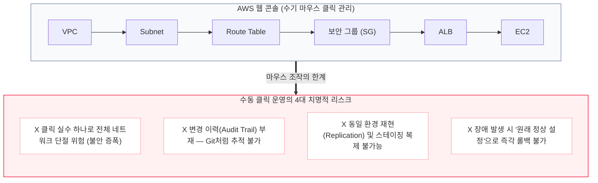
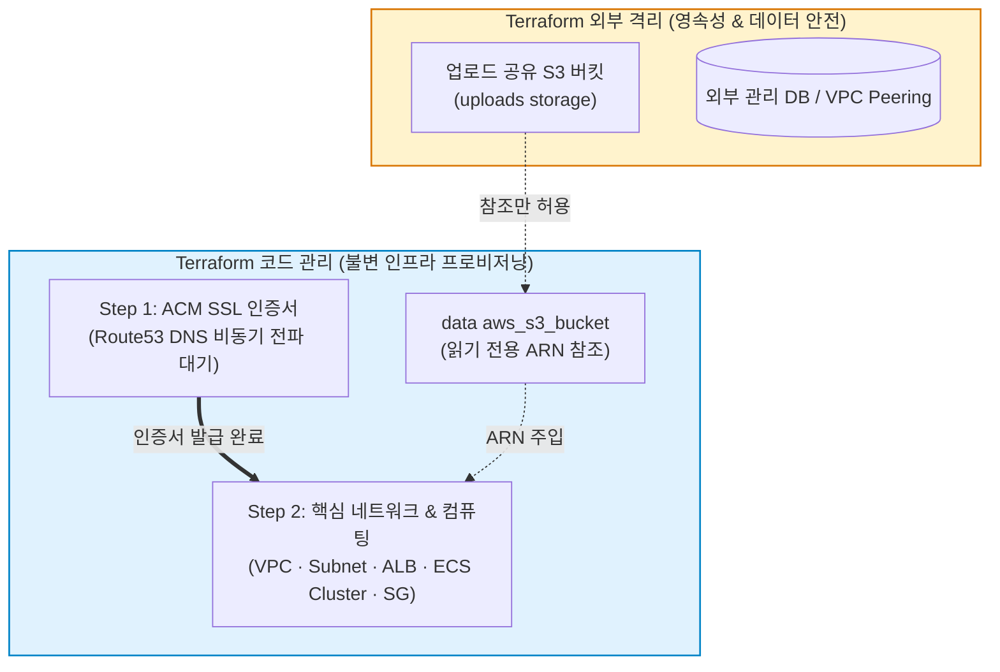
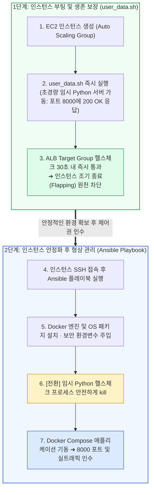
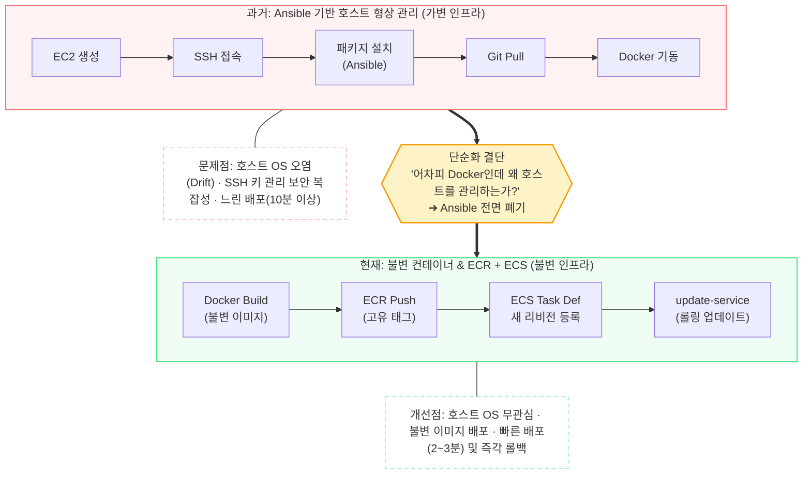
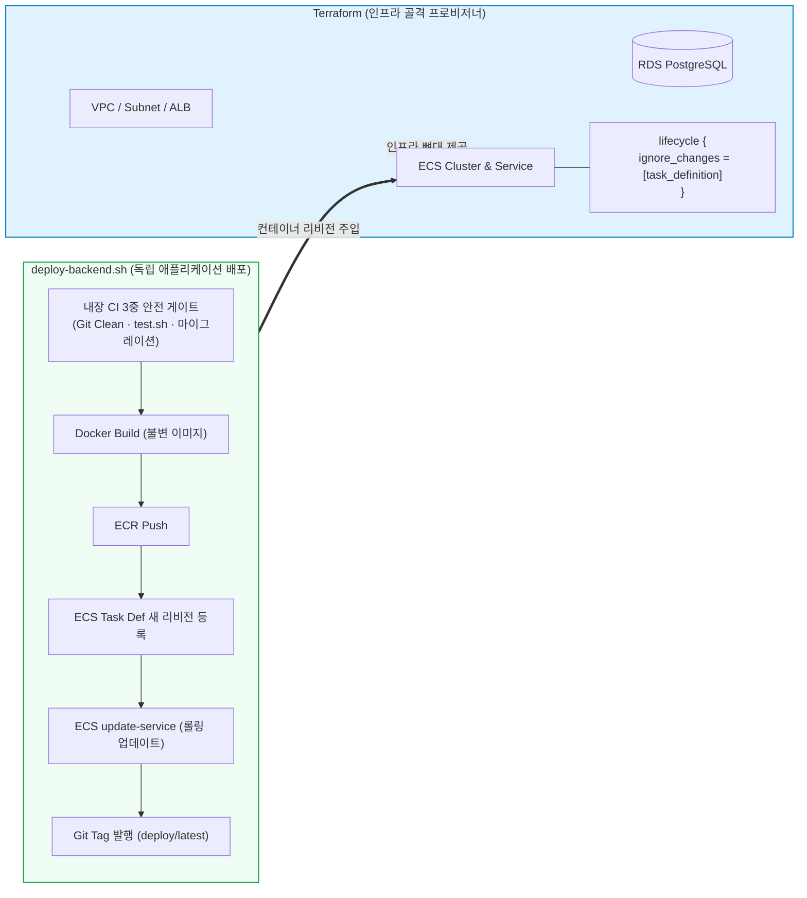

- table of contents
{:toc}

인프라 엔지니어나 SRE 전담 팀이 따로 존재하는 조직이라면, 개발자는 잘 닦인 배포 파이프라인에 코드만 푸시하면 그만이다. 하지만 사수가 없는 스타트업의 1인 개발자에게 인프라는 피할 수 없는 현실이자, 매 순간 살얼음판을 걷는 듯한 불안의 근원이었다.

지난 [[7편] 규칙이 64개나 있는데 왜 코드를 못 짜니](/tech/7-rule-pruning/)에서 다루었듯 로컬 워크스페이스에서 규칙과 코드의 군살을 깎아내고 TDD([[2편]](/tech/2-tdd-religion/), [[4편]](/tech/4-all-passed-empty-screen/))로 객체 설계를 단단하게 다듬었더라도, 그 코드가 살아 숨 쉬는 클라우드 환경이 삐걱거리면 프로덕션 서비스는 단 한 줄의 요청도 받아내지 못한다.

AWS 웹 콘솔 화면의 수많은 체크박스를 하나하나 마우스로 클릭해가며 시작했던 인프라 구축이, 어떻게 <mark class="kw-term">Terraform</mark>이라는 코드가 되고, <mark class="kw-term">Ansible</mark>이라는 자동화 도구를 거쳐, 마침내 <mark class="kw-term">Docker 불변 이미지</mark> 기반의 ECR + ECS 태스크 정의와 독립된 배포 스크립트로 단순화되었는가.

이 글은 화려한 최신 클라우드 기술 유행을 쫓아간 이야기가 아니다. 오히려 감당할 수 없는 복잡성에 부딪혀 스스로 기술을 덜어내고, **"1인 개발자가 혼자서 온전히 통제 가능한 최소한의 파이프라인"**을 찾아낸 치열한 생존의 기록이다.

---

## 1. AWS 콘솔 클릭질의 공포: 비전공 신입이 맞닥뜨린 클라우드

이전 글에서 설명했듯 나는 2025년 6월, 회사에 입사했다. 지원하여 들어간 포지션은 LLM 엔지니어였지만, 회사는 이제 막 첫 웹 애플리케이션 서비스를 준비하던 참이었고 당장 가장 시급했던 것은 서비스를 세상에 띄울 인프라 세팅(DevOps)이었다.

네트워크 기초 지식도 거의 없던 비전공·ML/DL부트캠프 출신의 쌩신입에게 주어진 것은 대표님이 AWS 웹 콘솔에서 마우스로 이것저것 클릭하며 설정했던 화면을 녹화해 둔 영상 몇 편이 내가 인계받은 인프라의 전부였다.

영상 화질 너머로 보이는 AWS 웹 콘솔은 그야말로 거대한 미궁이었다.
- VPC, 서브넷(Subnet), 인터넷 게이트웨이(IGW), 라우팅 테이블(Route Table)
- 보안 그룹(Security Group), 로드밸런서(ALB), 타깃 그룹(Target Group), 오토스케일링 그룹(ASG)

거의 모든 용어가 생소했고, 이 리소스들이 배후에서 어떻게 유기적으로 엮여 트래픽을 흘려보내는지 감을 잡기조차 어려웠다. 게다가 서비스 요구사항은 여러 교육 기관이 함께 사용할 멀티테넌트 SaaS 구조였다. 대표님은 트래픽 분산을 위해 로드밸런서(ALB)를 반드시 써야 하고, 유연한 확장을 위해 MongoDB를 사용해야 한다는 것을 전제조건으로 걸었다.

나중에 알게된건데, 우리 서비스 정도 수준이면 로드밸런서는 전혀 필요가 없었다. 겨우 몇개 학원에서 사용하는, 많아야 수백명 정도 수준의 트래픽을 감당하는데 ALB라니... 또, MongoDB도 맹목적으로 좋다며 사용하라고 종용하셨었는데, 이 또한 비효율의 극치였다. MongoDB를 사용함에 있어서 매니지드 서비스를 이용하기 위해 결국 MongoDB Atlas를 이용했는데 이 덕분에 VPC Peering등 아키텍처적으로 복잡해진 것은 물론, 우리 서비스는 Document DB를 도입할 명분이 전혀 없었다. 이 내용은 대표의 기술적 이해도에 실망하게된 일화이기도하다.
{:.note title="여담"}

나는 살기 위해 2~3주간 AWS와 네트워크 관련 서적, 기술 블로그, 유튜브 강의, GPT와의 대화를 총동원해 밤낮없이 파고들었다. 구조를 머릿속에 넣기 위해 종이 위에 VPC 대역과 서브넷, ALB와 EC2 간의 패킷 흐름도를 직접 볼펜으로 그려가며 개념을 하나씩 메워나갔다.

하지만 개념을 익히고 콘솔 화면을 조작할 수 있게 되었음에도, 마우스로 인프라를 만지는 행위는 비직관적이었고 개발자스럽지 못하다고 느꼈다.
1. **Audit Trail(변경 이력)의 부재**: 내가 어제 어떤 보안 그룹의 인바운드 규칙을 건드렸는지, 로드밸런서의 리스너 룰을 어떻게 바꿨는지 Git 커밋처럼 기록이 남지 않는다.
2. **트래픽 단절의 공포**: 콘솔의 체크박스 하나, 서브넷 라우팅 테이블 연결 하나를 마우스로 잘못 클릭하는 순간 실서비스 트래픽이 통째로 블랙홀로 사라질 수 있다는 심리적 압박감이 짓눌렀다.
3. **환경 복제(Replication)의 불가능**: 스테이징 환경이나 신규 고객사 테넌트를 위해 똑같은 인프라를 하나 더 구축해야 할 때, 콘솔에서 수백 번의 클릭을 오차 없이 재현하는 것은 불가능에 가까웠다.



"이대로 마우스 클릭에 의존하다가는, 언젠가 내 손으로 프로덕션을 날려 먹는 대형 사고를 치고 말 것이다."  
인프라 관리법에 대한 명확한 방법이 절실했다.

---

## 2. 콘솔에서 코드로: Terraform 도입과 인프라 경계 선언

마우스 클릭의 비효율과 공포에서 벗어나기 위해 GPT에게 실마리를 물었다. 돌아온 답은 명확했다. **<mark class="kw-term">Terraform(테라폼)</mark>**을 사용한 코드형 인프라(IaC)였다.

때마침 대표님이 2~3일간 외부 출장을 가게 되었다. 눈치를 보지 않고 새로운 기술을 온전히 실험해 볼 수 있는 절호의 기회였다. 나는 그 기간 동안 유튜브의 테라폼 강의와 공식 문서를 집요하게 파고들며 사내 AWS 계정에 적용할 테라폼 코드를 한 줄 한 줄 작성했다.

이때 **<mark class="kw-term">Terraform</mark>**을 공부하면서 봤던 강의들에서 종종 **<mark class="kw-term">Ansible</mark>**을 언급하였었고 이후에 Ansible을 도입하게 된 계기가 되었다.
{:.note title="여담"}

마침내 터미널에서 `terraform apply`를 입력하고 엔터를 눌렀을 때의 장면은 지금도 잊히지 않는다. VPC, 서브넷, 인터넷 게이트웨이, 라우팅 테이블, 보안 그룹, ALB, ECS 클러스터에 이르는 수십 개의 AWS 리소스가 HCL 코드로 선언된 순서와 의존성에 따라 일사불란하게 클라우드 위에 프로비저닝되었다.

더 이상 웹 콘솔을 뒤적이며 메뉴를 헤맬 필요가 없었다. 인프라의 모든 형상이 Git 저장소 안에서 텍스트로 보존되고, 변경사항은 `terraform plan`의 diff로 사전에 검증할 수 있었다. 엄청난 기술적 카타르시스와 함께 1인 개발자로서 인프라를 통제할 수 있다는 자신감이 생겼다.

하지만 모든 것을 코드로 옮겨가는 과정에서 아주 중대한 아키텍처적 의사결정을 내려야 했다.

### 2.1. ACM SSL 인증서의 2-Step 분리
처음에는 모든 리소스를 단 하나의 `apply`로 끝내려 했다. 하지만 `aws_acm_certificate`를 발급하고, Route53 CNAME 레코드를 생성하여 검증하는 `aws_acm_certificate_validation`을 메인 인프라와 한 번에 묶자 반복적인 타임아웃 에러가 발생했다.

DNS 전파(Propagation)와 인증서 발급은 수 분에서 길게는 수 시간이 걸릴 수 있는 비동기 프로세스다. 반면 테라폼은 즉각적인 동기적 검증을 기대하다가 실패를 뱉어낸 것이었다.

나는 이를 `step1-certificates/`(인증서 및 도메인 DNS 전파)와 `step2-app/`(ALB 및 메인 컴퓨팅 인프라)의 **2-Step 파이프라인으로 물리 분리**했다. 인증서가 온전히 발급된 뒤 메인 인프라가 이를 참조하게 만듦으로써 프로비저닝의 결정론적 안정성을 확보했다.

### 2.2. ★ 핵심 판단: S3 uploads 버킷을 Terraform 밖으로 뺀 이유
IaC를 처음 도입할 때 흔히 빠지는 함정이 있다. **"인프라의 모든 자원은 100% 테라폼 코드 안에 들어가야 완벽하다"**는 순수주의적 강박이다.

하지만 나는 고객들의 업로드 이미지와 파일들이 저장되는 **`uploads` S3 버킷을 의도적으로 테라폼 관리 영역 밖으로 제외**했다. 테라폼 코드에서는 오직 `data "aws_s3_bucket"` 데이터 소스를 통해 이미 존재하는 버킷의 ARN만 읽어오도록 선을 그었다.

이 경계를 그은 세 가지 결정적 근거는 다음과 같았다:
1. **데이터 영속성과 재앙 방지 (비즈니스 크리티컬)**: 인프라 코드는 리팩터링되거나 교체될 수 있다. 만약 인프라를 재구축하거나 실수로 `terraform destroy`를 실행했을 때, 고객 자산인 영구 데이터 버킷까지 함께 증발하는 사태를 물리적으로 원천 차단해야 했다.
2. **라이프사이클의 불일치 (Cross-Project Shared Resource)**: 애플리케이션 서버나 네트워크는 수시로 변경되고 교체되는 일회성 자원이지만, 고객 업로드 저장소는 서비스의 시작부터 끝까지 불변으로 유지되어야 하는 최상위 영속 자원이다.
3. **하이브리드 아키텍처의 일관성**: 이미 외부 관리형 DB(MongoDB Atlas)나 VPC Peering처럼 테라폼 밖에서 관리되는 자원들과 운영 방식을 일관되게 맞추었다.



**"모든 것을 코드로 감싸는 것이 기술적 완성도가 아니다. 무엇을 코드로 묶고, 무엇을 데이터 안전을 위해 코드 밖으로 격리할지 '경계'를 긋는 것이 진짜 아키텍처 설계다."**  
비전공 신입이었던 내가 클라우드 인프라를 마주하며 얻은 가장 값진 첫 깨달음이었다.

---

## 3. 서버 초기화의 시행착오: user data의 한계와 Ansible의 도입

테라폼으로 네트워크와 EC2 인스턴스를 띄우는 데는 성공했다. 하지만 인스턴스 안에서 애플리케이션 코드를 실행하고 환경을 갖추는 것은 또 다른 차원의 문제였다.

### 3.1. EC2 user data와 오토스케일링(ASG) Flapping 참사
초기에는 단순하게 생각했다. EC2 기동 시 실행되는 `user_data.sh` 스크립트에 필요한 모든 초기화 명령을 밀어 넣었다:
- 시스템 패키지 업데이트 (`apt update`)
- Docker 및 Docker Compose 설치
- Git 레포지토리 클론 및 환경변수(`.env`) 세팅
- `docker compose up -d --build`

결과는 끔찍했다. 서버가 켜졌다 꺼졌다를 영원히 반복하는 **인스턴스 Flapping(플래핑) 무한 루프**가 터진 것이었다.

원인은 **로드밸런서(ALB) 헬스체크와 인스턴스 부트스트랩 간의 시간차**였다:
1. EC2 인스턴스가 켜지자마자 ALB는 즉시 인스턴스의 헬스체크 엔드포인트(`/health`)로 프로브를 찌르기 시작한다.
2. 하지만 `user_data.sh`가 무거운 시스템 패키지를 깔고, 도커 이미지를 빌드해 컨테이너를 올리기까지는 최소 3~5분이 걸렸다.
3. ALB는 응답이 오지 않자 인스턴스를 즉시 **"Unhealthy"**로 판정했다.
4. Auto Scaling Group(ASG)은 비정상 인스턴스를 감지하고 즉시 인스턴스를 **강제 종료(Terminate)**한 뒤 새 인스턴스를 생성했다.
5. 새 인스턴스에서 또다시 user data가 돌다가 시간이 초과되어 다시 종료되었다.

게다가 `user_data.sh`가 도중에 실패하기라도 하면 에러를 확인하기 위해 SSH로 인스턴스에 접속해 `/var/log/cloud-init-output.log`를 뒤져야 했고, 스크립트를 고칠 때마다 인스턴스를 재생성해야 하는 고통이 뒤따랐다.

### 3.2. 임시 Python 헬스체크와 Ansible을 통한 배포 제어권 회수
이 Flapping 참사를 끊어내기 위해 나는 두 가지 조치를 취했다.

첫째, **`user_data.sh`의 역할을 극단적으로 축소**했다. 인스턴스가 기동되자마자 백그라운드에서 8000번 포트로 즉시 `HTTP 200 OK`를 응답하는 **초경량 임시 Python HTTP 서버** 하나만 띄우게 했다:

```bash
# user_data.sh 내부: ALB 헬스체크를 통과시켜 인스턴스를 안정화하는 임시 프로세스
python3 -c "
import http.server, socketserver
class H(http.server.SimpleHTTPRequestHandler):
    def do_GET(self):
        self.send_response(200)
        self.end_headers()
        self.wfile.write(b'warming up')
socketserver.TCPServer(('', 8000), H).serve_forever()
" &
```

이 임시 프로세스 덕분에 인스턴스가 뜨자마자 ALB 헬스체크가 즉시 통과되었고, ASG가 인스턴스를 죽이지 않고 차분하게 살려두었다.

둘째, 인스턴스가 안전하게 살아있는 상태에서 **<mark class="kw-term">Ansible(앤서블)</mark>** 플레이북을 실행하여 실제 환경 구성을 통제했다.
- 시스템 패키지와 Docker 엔진 설치
- 환경변수 및 보안 시크릿 파일 주입
- **실제 서비스 컨테이너 기동 직전, 임시 Python 헬스체크 프로세스를 안전하게 kill**
- Docker Compose로 실제 애플리케이션 컨테이너를 올리고 포트 8000번을 인수



Ansible의 **멱등성(Idempotency)** 덕분에, 설정을 변경할 때마다 인스턴스를 새로 띄울 필요 없이 동일한 형상으로 안전하게 수렴시킬 수 있게 되었다.

---

## 4. 단순화의 결단: "어차피 Docker로만 배포하는데 Ansible이 왜 필요한가?"

하지만 시간이 흐르고 프로젝트가 성숙해지면서, 또 다른 회의감이 고개를 들기 시작했다. 

이 무렵은 내 개발자 커리어에 대단히 중요한 변곡점이 찾아온 시기이기도 했다. 사수 없이 홀로 고군분투하던 내 곁에, 개발을 정말 잘하고 실전 경험이 풍부한 동료 한 분이 합류한 것이다. 그와 칠판 앞에서 시스템 아키텍처를 직접 그려가며 치열하게 토론하던 시간은, 혼자서 인터넷 강의나 GPT를 뒤적일 때는 결코 얻을 수 없었던 '진짜 엔지니어링 대화와 관점의 확장'을 경험하게 해 준 값진 순간이었다.

{:width="380" loading="lazy"}

시야를 넓혀준 소중한 동료에게 바치는 진심 어린 헌사 (압도적 감사...!)
{:.figcaption}

그전까지의 나는 업계에서 권장하는 모던 인프라 도구들을 어떻게든 학습하고 적용하느라 바빴다. 하지만 그는 단순히 도구의 사용법을 넘어, '우리가 해결하려는 문제의 본질이 무엇인가?', '이 도구가 우리 시스템에 실제로 주는 가치와 지불해야 하는 운영 비용은 무엇인가?'를 끊임없이 되묻게 해주었다.

당시 나는 AWS ECS와 ECR을 새롭게 도입하며 인프라를 한창 고도화하고 있었는데, 그와 함께 화이트보드에 EC2 호스트 OS와 컨테이너 런타임, 배포 흐름의 경계를 그려가며 시스템 구조를 논의하던 중, 머리를 강하게 치는 근본적인 질문을 마주하게 되었다.

> **"로컬에서도 Docker 컨테이너로 개발하고, 운영 서버에서도 Docker 컨테이너로 돌아가는데, 내가 왜 EC2 호스트 OS에 SSH로 들어가서 Ansible로 패키지를 깔고 형상 관리를 하고 있어야 하지?"**

1인 개발자에게 Ansible은 점차 커다란 **운영 오버헤드**가 되어가고 있었다:
- **동적 인벤토리(Dynamic Inventory)의 불안정성**: 오토스케일링으로 늘어난 EC2의 IP를 동적으로 수집하다가 네트워크 타임아웃이 발생하면 배포가 멈췄다.
- **SSH 키 관리와 보안 복잡성**: CI 러너나 로컬 터미널에서 EC2 내부로 접속하기 위해 SSH 키를 유지하고 보안 그룹 인바운드를 열어두어야 했다.
- **환경 오염(Configuration Drift)**: 호스트 OS 위에 파이썬 라이브러리나 OS 패키지가 누적되며 서버마다 미세하게 환경이 달라졌다.
- **느린 배포 속도**: 배포할 때마다 수십 개의 Ansible 태스크를 순차 실행하느라 10분 이상의 긴 시간이 소요되었다.

나는 과감하게 결단을 내렸다. **Ansible을 전면 폐기**하기로 했다.

어렵게 공부해서 세팅해 둔 기술이었지만, 1인 개발자에게 불필요한 레이어라면 미련 없이 걷어내는 것이 맞았다. 호스트 머신의 OS 관리는 AWS가 책임지는 Fargate나 최소한의 ECS 최적화 AMI(Amazon ECS-optimized AMI)에 완전히 맡기고, 나는 오직 **<mark class="kw-isolation">불변 아티팩트(Immutable Artifact)</mark>**인 **Docker 이미지** 하나만 바라보기로 했다.

배포 절차는 극적으로 단순해졌다:
1. 로컬(또는 CI)에서 소스코드를 빌드하여 불변의 Docker 이미지 생성
2. 고유 태그를 달아 AWS ECR에 Push
3. 새 이미지 URI를 가리키는 ECS Task Definition 리비전 등록
4. ECS 서비스 롤링 업데이트 (`aws ecs update-service`) 호출



수백 줄의 Ansible 플레이북과 복잡한 인벤토리 설정이 한순간에 지워졌다.  
"서버 호스트를 유지보수하는 관리자"에서 **"불변의 컨테이너 이미지를 던지는 배포자"**로 패러다임이 완전히 전환된 순간이었다.

---

## 5. IaC와 배포 스크립트의 소유권 충돌: "IaC의 경계는 누가 바꾸는가로 그어야 한다"

하지만 인프라를 단순화한 뒤에도 예상치 못한 치명적인 사고 위기가 찾아왔다. 바로 **Terraform과 애플리케이션 배포 스크립트 간의 '관리 주체 충돌'**이었다.

### 5.1. 드리프트 경고: 최신 프로덕션을 구버전으로 되돌리겠다고?
2026년 4월, 인프라 설정을 변경하기 위해 터미널에서 `terraform plan`을 실행했다. 그런데 화면에 경악할 만한 변경 예고(diff)가 쏟아져 나왔다.

내가 건드리지도 않은 ECS 서비스의 `task_definition`과 주요 Lambda 함수의 `image_uri`를, 현재 실서버에서 돌고 있는 최신 리비전(예: `:66`)에서 **무려 수십 개 이전의 구버전(예: `:37` 혹은 초기 `:latest`)으로 강제 다운그레이드하겠다**는 빨간 diff가 출력된 것이었다!

만약 이 상태에서 무심코 `terraform apply`를 승인했다면? **실제 고객들이 사용 중인 운영 서비스가 한순간에 수개월 전 과거 코드로 롤백되는 초대형 참사**가 터질 뻔한 순간이었다.

### 5.2. 원인: 두 주체가 한 필드를 동시에 소유하려 했다
사건의 배후에는 **한 자원의 동일한 속성을 두 개의 시스템이 각자 다른 라이프사이클로 제어하려 했던 구조적 결함**이 있었다:
- **Terraform**: 최초 인프라 구축 시 선언했던 이미지 태그(초기 버전 혹은 `:latest`)를 불변의 상태로 기억하고 유지하려 한다.
- **배포 스크립트(`deploy-backend.sh`)**: 코드 변경이 일어날 때마다 새 Docker 이미지를 빌드해 ECR에 푸시하고, ECS Task Definition의 새 리비전을 생성하여 서비스를 업데이트한다. 테라폼은 이 배포 호출을 전혀 모른다.

그렇다면 "배포할 때마다 이미지 버전을 변수로 넘겨 `terraform apply`를 실행하면 되지 않는가?"라는 의문이 들 수 있다. 하지만 이는 절대로 택해서는 안 될 안티패턴이었다:
1. **변경 주기의 불일치**: 인프라 프로비저닝(수 분 소요, 고도의 신중함 필요)과 애플리케이션 배포(하루에도 수차례 발생, 신속성 요구)는 라이프사이클이 완전히 다르다.
2. **배포 속도의 극단적 저하**: 코드 한 줄 고쳐 배포하는데 전체 테라폼 상태 검사(State Refresh)가 돌아가며 배포 파이프라인이 마비된다.
3. **긴급 롤백의 마비**: 장애 발생 시 즉시 이전 태스크 리비전으로 되돌려야 하는데, 이것이 테라폼 코드 수정과 state 변경 작업으로 변질된다.

### 5.3. 해결: `ignore_changes`는 회피가 아니라 경계 선언이다
해결책은 명확했다. Terraform 코드의 ECS 서비스 선언부에 다음 설정을 못 박았다:

{:width="700" loading="lazy"}

실제 Terraform ecs.tf 코드. task_definition의 소유권을 배포 파이프라인(`deploy-backend.sh`)에 넘겨 인프라 코드와의 충돌을 원천 차단하고, circuit_breaker로 배포 실패 시 자동 롤백되도록 안전망을 구축했다.
{:.figcaption}

```hcl
resource "aws_ecs_service" "app" {
  name            = "production-backend"
  cluster         = aws_ecs_cluster.main.id
  task_definition = aws_ecs_task_definition.app.arn
  desired_count   = 2

  lifecycle {
    ignore_changes = [
      task_definition, # 애플리케이션 배포 파이프라인이 전담 소유
      desired_count    # 오토스케일링 정책이 동적으로 소유
    ]
  }
}
```

이 코드는 단순히 "성가신 diff를 가리기 위한 꼼수"가 아니다.  
**"VPC, 클러스터, 네트워크 뼈대는 Terraform이 소유하지만, 그 위에서 실행되는 컨테이너 리비전의 관리 주체는 배포 파이프라인이다"**라고 선언하는 **엄격한 소유권 경계의 획정**이었다.



### 5.4. GitHub Actions의 병목을 넘어: 셸 스크립트에 CI의 본질을 내재화하다

처음에는 업계 표준처럼 여겨지는 **GitHub Actions 기반의 CI/CD 파이프라인**을 구축해 배포 자동화를 시도했다. 하지만 빠르게 기능을 실험하고 기민하게 배포해야 하는 1인 개발 환경에서, 원격 CI/CD 플랫폼은 곧 **치명적인 생산성 병목**으로 다가왔다.

커밋을 푸시할 때마다 원격 러너가 할당되길 멍하니 기다려야 했고, 무거운 도커 레이어와 의존성을 원격 환경에서 다운로드받고 빌드하느라 매 배포마다 7~10분의 긴 대기 시간이 발생했다. 게다가 때때로 발생하는 원격 러너의 네트워크 타임아웃이나 시크릿 환경변수 누락 오류로 파이프라인이 멈추면, 원격 로그를 뒤적거리며 원인을 찾느라 정작 중요한 개발 컨텍스트가 완전히 깨져버렸다.

> **"로컬 터미널에서 즉각적인 피드백을 받으며 가장 빠르게 프로덕션에 가치를 전달해야 하는데, 왜 원격 러너의 느린 대기열과 불투명성에 내 개발 호흡이 묶여 있어야 하는가?"**

결국 나는 복잡한 GitHub Actions 원격 파이프라인을 과감히 걷어내고, **로컬 터미널에서 단 1초의 지체 없이 실행할 수 있는 간결한 단일 셸 스크립트(`deploy-backend.sh`)**로 배포 체계를 전면 재편했다.

그렇다고 CI(지속적 통합)의 가치를 포기한 것은 결코 아니었다. 외부 SaaS나 Actions YAML이라는 도구의 껍데기가 중요한 것이 아니라, **"코드가 프로덕션에 나가기 전 거쳐야 할 검증 게이트를 자동화하고 타협 없이 강제하는 것"**이야말로 CI의 진짜 본질이기 때문이다. 

나는 지속적 통합이 요구하는 모든 핵심 품질 검증을 이 셸 스크립트 안에 단단하게 내재화했다:

1. **1단계 (Git 워킹 디렉토리 청결 강제)**: `git status --porcelain`으로 검사하여 커밋되지 않은 코드나 untracked 파일이 남아있으면 배포를 즉시 차단한다. 로컬의 `.venv` 가상환경이나 임시 디버깅 파일이 Docker 컨테이너 안으로 딸려 들어가 이미지가 수 GB로 폭증하는 사고(ADR-0012)를 원천 차단하기 위함이다.
2. **2단계 (마이그레이션 안전성 검증)**: Alembic 마이그레이션 파일에 다중 head가 존재하거나, 의도치 않게 테이블을 날려버리는 `op.drop_table()` 같은 위험 코드가 들어있는지 `check_migration_safety.sh` 정적 검사로 걸러낸다. 통과된 마이그레이션은 서비스 롤아웃 직전 일회성 ECS Fargate 태스크로 안전하게 선행 실행된다.
3. **3단계 (TDD 회귀 테스트 전수 통과)**: `test.sh`의 모든 테스트가 100% 통과(`set -e`)해야만 비로소 빌드가 시작된다. 빈약한 원격 러너 대신 로컬 머신의 강력한 자원을 활용하므로, 수백 개의 단위·통합 테스트가 불과 수십 초 만에 전수 검증된다.
4. **4단계 (결정론적 배포 추적성 확보)**: 배포가 성공하면 `deploy/{timestamp}` 및 `deploy/latest` Git Tag를 자동으로 발행하여 원격에 푸시한다. 이를 통해 "지금 프로덕션에 떠 있는 코드가 정확히 어느 커밋인가"를 단 1초 만에 추적할 수 있게 했다.

원격 러너의 대기열을 바라보며 10분씩 소모되던 배포 주기는, 로컬 터미널에서 스크립트 한 줄을 실행하는 것만으로 **불과 2~3분 만에 모든 CI 검증을 완벽히 통과하고 무중단 프로덕션 롤링 업데이트까지 끝마치는 고속 파이프라인**으로 거듭났다. 화려한 외부 CI 도구 없이도, 필요한 모든 검증을 내재화한 이 간단한 스크립트 하나로 우리는 단 한 번의 배포 사고 없이 안전하게 프로덕션을 서빙할 수 있었다.

---

## 6. 1인 개발자의 인프라 철학: "혼자서 통제 가능한 최소한의 파이프라인"

쿠버네티스(Kubernetes), 서비스 메시(Istio), 수십 개의 마이크로서비스, 복잡한 분산 이벤트 버스... 업계에는 언제나 엔지니어의 눈을 유혹하는 화려하고 세련된 인프라 유행이 넘쳐난다.

하지만 사수 없는 스타트업에서 제품 전체를 혼자 책임져야 하는 1인 개발자에게, **스스로 완전히 이해하고 감당할 수 없는 복잡성은 곧 기술부채라는 시한폭탄**일 뿐이다.

내가 수많은 시행착오와 장애 위기를 겪으며 도달한 최종 파이프라인은 놀라울 만큼 단순하다:
1. **인프라의 뼈대는 Terraform으로**: 언제든 필요할 때 완벽하게 동일한 환경을 100% 재현해낼 수 있는 결정론적 불변 인프라. 단, 영구 데이터(S3 uploads)는 코드 밖으로 격리한다.
2. **실행 환경은 Docker + ECS로**: OS 레벨의 지저분한 형상 관리와 패키지 오염을 완전히 소멸시키고, 불변의 컨테이너 이미지 하나로 롤아웃과 롤백을 제어한다.
3. **배포는 내장 CI를 갖춘 단일 셸 스크립트로**: Git 상태 검증, 마이그레이션 안전 검사, TDD 전체 통과를 만족해야만 컨테이너를 올리는 투명하고 단단한 파이프라인.

놀라운 사실은, 이 모든 인프라의 격변과 진화가 **채 반년도 되지 않는 짧은 시간(그해 6월부터 10~11월까지)** 동안 폭풍처럼 일어났던 일이라는 점이다.

입사 직후 마주했던 웹 콘솔의 비효율과 마우스 클릭의 공포를 떨쳐내기 위해 6월에 Terraform을 적극적으로 도입했고, EC2 User Data의 한계를 느끼며 "서버 형상 관리는 Ansible이 맞다"고 판단해 플레이북을 깎아 올렸다. 그리고 몇 달 지나지 않아 "어차피 Docker로 개발하고 배포하는데, 내가 왜 Ansible로 호스트 OS를 관리하고 있는가?"라는 근본적 회의에 도달하여 ECR과 ECS로 축을 옮기고 Ansible을 과감히 걷어냈다. 이어 테라폼과의 관리 주체 충돌을 겪으며 소유권 경계를 나누고, 원격 CI의 병목을 뚫기 위해 셸 스크립트에 모든 검증을 내재화하기까지, 이 빽빽한 아키텍처적 변천사가 불과 5개월 남짓한 시간 동안 쉼 없이 몰아쳤다.

돌이켜보면, 내가 서비스와 애플리케이션 전체를 관통하는 **'소프트웨어 아키텍처에 대한 최초의 감각'을 익히기 시작한 것도 바로 이 치열했던 인프라 구축의 여정 덕분**이었다.

코드 레벨에서만 머물 때는 파일과 함수라는 미시적인 나무만 보였다. 하지만 인프라를 바닥부터 세우며 불변(Immutable) 인프라와 가변(Mutable) 애플리케이션을 가르고, 무상태(Stateless) 컨테이너와 영속성(Persistence) 데이터의 경계를 긋고, '누가 무엇을 소유하고 언제 바꾸는가'를 분리했던 이 원초적인 훈련이야말로, 훗날 백엔드의 TDD와 객체 설계([[2편]](/tech/2-tdd-religion/), [[3편]](/tech/3-teach-object-design/)), 그리고 프론트엔드의 FSD 아키텍처([[9편] 어차피 프론트엔드인데 아키텍처가 왜 필요해?](/tech/9-frontend-fsd/))를 세우는 데 있어 가장 단단한 설계적 감각의 뿌리가 되어 주었다.

이 압축적인 변천을 거쳐 구조가 확립된 이후, 인프라는 마침내 개발자의 시야 뒤편으로 조용히 물러났다. 나는 더 이상 웹 콘솔을 두려운 마음으로 열어보지 않는다. 서버가 죽을까 봐 가슴을 졸이지도 않는다. 인프라가 든든한 배경이 되어준 덕분에, 나는 오직 사용자에게 가치를 전달할 비즈니스 로직과 제품 아키텍처에 내 모든 집중력을 쏟아부을 수 있게 되었다.

> **"좋은 인프라란 화려한 최신 기술의 집합체가 아니다. 장애가 발생했을 때 1인 개발자가 터미널을 열고 5분 안에 로그와 원인을 찾아낼 수 있는, 내 손바닥 안에서 온전히 통제되는 가장 단순하고 단단한 시스템이다."**

---

## 다음 이야기: 어차피 프론트엔드인데 아키텍처가 왜 필요해?

백엔드와 클라우드 인프라, 그리고 안전한 배포 파이프라인까지 단단하게 빗장을 걸어 잠갔다. 하지만 시스템의 최전선에서 사용자를 맞이하는 프론트엔드가 무너진다면 프로덕션은 온전히 완성될 수 없다.

특히 AI 에이전트에게 프론트엔드 개발을 맡겼을 때 마주했던 가장 끔찍한 재앙은, 수천 줄에 달하는 '괴물 JSX 컴포넌트'와 도메인 간의 경계를 마구잡이로 넘나들며 import를 질러대는 '순환 참조의 지옥'이었다.

다음 **[[9편] 어차피 프론트엔드인데 아키텍처가 왜 필요해?](/tech/9-frontend-fsd/)**에서는, 13만 줄에 달하는 프론트엔드 코드베이스에서 104건의 순환 참조를 걷어내고 Feature-Sliced Design(FSD) 6계층 단방향 의존성 규칙으로 에이전트의 프론트엔드 난개발을 통제한 치열한 아키텍처 리팩터링 여정을 공개한다.
