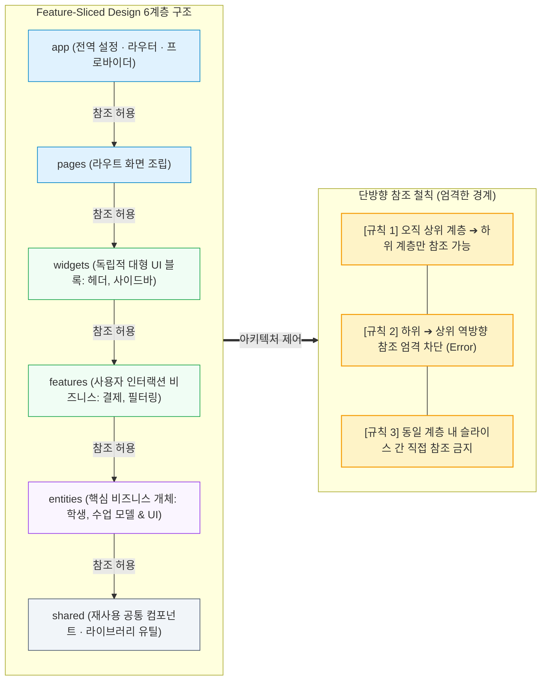

- table of contents
{:toc}

백엔드에서 계획을 먼저 세우는 규율을 확립하고([[1편]](/tech/1-agent-rules/)), TDD와 객체 4분류로 도메인을 가두었으며([[2편]](/tech/2-tdd-religion/), [[3편]](/tech/3-teach-object-design/)), 경계 정합성 표와 2중 가드레일로 인터페이스를 맞추었다([[4편]](/tech/4-all-passed-empty-screen/)). 이어 cmux 기반 1:1:1:1 병렬 워크트리와 저장소 대장으로 다중 에이전트 협업 거버넌스를 묶었고([[5편]](/tech/5-cmux-parallel-worktree/), [[6편]](/tech/6-repo-governance/), [[7편]](/tech/7-rule-pruning/)), 인프라 역시 Docker 불변 이미지와 ECS로 군더더기 없이 경량화했다([[8편]](/tech/8-cloud-infra-evolution/)).

이쯤 되면 시스템의 모든 것이 순조롭게 굴러가야 마땅했다. 하지만 실전 프로덕션의 최전선에는 아직 가장 흉폭하고 제어하기 힘든 복병이 남아있었다. 바로 사용자의 눈과 손이 닿는 **'프론트엔드(Frontend)'**였다.

"어차피 프론트엔드 화면인데 아키텍처가 왜 필요해? AI한테 화면 하나 그려달라고 시키면 알아서 뚝딱 만들어주는 거 아니야?"

사수 없는 스타트업에서 비전공 신입 개발자로 고군분투하던 시절, 회사도 나 자신도 그렇게 믿었던 때가 있었다. 그리고 그 안일한 믿음의 대가는 실로 참혹했다. 

이 글은 104건의 도메인 교차 참조 위반에 시달리던 13만 줄 규모의 레거시 프론트엔드를, **Feature-Sliced Design(FSD)** 6계층 구조로 단 2일(25 Phase) 만에 무결하게 분해하고, Public API 방화벽을 세워 에이전트의 프론트엔드 난개발을 완벽히 통제해 낸 실전 아키텍처 연대기다.

---

## 1. "누구긴 누구야 나지": 디자이너와 1인 풀스택의 눈물의 순회공연

내가 입사한 지 한 달 뒤, 회사에 디자이너분이 새로 합류했다. 그날 이후 우리 둘은 사내의 거의 모든 신규 프로젝트를 순회공연하듯 함께 도맡아 만드는 단짝 페어가 되었다.

여기서 아주 치명적인 현실적 문제가 하나 발생했다. 나는 지난 [[8편] 어차피 도커인데 앤서블은 왜 썼을까](/tech/8-cloud-infra-evolution/)에서 설명했듯, 입사하자마자 회사의 전체 인프라를 클라우드에 올리는 작업에 매달리고 있었고, 애플리케이션 구동에 필요한 백엔드 비즈니스 로직과 API 개발까지 도맡고 있었다. 

그런 상황에서 회사에서는 "우리 서비스도 이제 겉모습 때깔이 좋아야 한다"라며 디자이너를 채용한 것이었다. 하지만 당연한 이야기지만, 디자이너분이 들어왔다고 해서 프론트엔드 코드를 쳐낼 리가 만무했다. 

그렇다면 디자인 시안을 실제 웹 서비스 코드로 구현하는 일은 과연 누가 봐야 했을까? 

**누구긴 누구겠는가, 바로 나였다.** ~~*(ㅅㅂ...)*~~

"요즘 프론트엔드는 AI 에이전트한테 시키면 다 알아서 잘해주는 거 아니냐?"

대표님과 팀장님의 순진한 환상 섞인 지시에 맞춰, 우리는 프론트엔드에 대한 아무런 엔지니어링 사전 지식도, 아키텍처적 가이드라인도 없이 AI에게 화면 개발을 통째로 내맡기는 양상으로 프로젝트를 밀어붙였다. 

그리고 그 결과는 정말이지 이루 말할 수 없을 정도로 처참했다.

---

## 2. 수십 초가 걸리는 대시보드: '누더기 거인'의 탄생과 MongoDB 스키마의 앙상블

디자이너분도 개발 지식이 깊었던 것은 아니었기에, 웹 퍼블리셔처럼 마크업과 CSS 코드 작업을 점차 배워가며 고군분투했고, 나는 브라우저 뒤편의 데이터 바인딩과 상태 로직을 전담했다.

당연하게도 AI에게 "이 버튼 누르면 저 API 호출해서 표에 뿌려줘"라고 프롬프트를 치면 그럴듯한 화면이 몇 초 만에 튀어나왔다. 겉보기에는 개발 속도가 엄청나게 빠른 것처럼 보였다.

하지만 진짜 재앙은 회의 때마다 크게 바뀌는 요구사항과, 이를 지탱해 줄 **관리 체제의 완전한 부재**에서 비롯되었다.

기획이 바뀔 때마다 AI에게 수정을 맡기면, AI는 이전 코드의 컨텍스트를 이해하지 못한 채 기존 컴포넌트 밑바닥에 새로운 `useState`와 인라인 비즈니스 로직, 임시 땜질용 CSS를 덕지덕지 이어 붙였다. 

이러한 프론트엔드 코드에 대한 관심 부족에 더해, 앞서 [[8편]](/tech/8-cloud-infra-evolution/)에서도 언급했던 무분별한 MongoDB 비정규화 스키마 관리 문제가 악마적인 시너지를 일으켰다. 프론트엔드 컴포넌트 하나가 렌더링되기 위해 서로 다른 수십 개의 비정규화 도큐먼트를 비동기로 찔러대고, 컴포넌트 내부에서 이를 무한 루프로 정렬하고 필터링하는 아비규환이 펼쳐진 것이다.

그 결과물은 가히 전설적이었다. **학원의 관리자 대시보드 화면 하나에 접근할 때마다 브라우저가 멈춰 서며 로딩에 무려 수십 초가 소요되는 거대한 '누더기 거인'**이 탄생하고 만 것이다. 

간단한 화면을 열 때마다 아주 길게 스피너가 도는 누더기 거인 앞에서, 우리는 참담함을 금할 수 없었다.

---

## 3. 동료의 향상심, 그리고 '도망치고 싶던 프론트'를 마주하기까지

솔직히 고백하자면, 그때까지 나는 프론트엔드에 일절 관심이 없었다. 

인프라와 백엔드는 원리를 파고드는 과정이 너무나 재미있어서 자발적인 열정으로 밤을 새워가며 시스템을 궤도에 올려놓았지만, 이상하게 프론트엔드는 도무지 정이 가지 않았다. 브라우저 위에서 화면을 맞추고 CSS와 씨름하는 과정이 그저 번거롭게만 느껴졌다.

"아니, 그냥 프론트엔드 개발자 한 명 좀 뽑아주면 안 되나?"

이 생각이 하루에도 수십 번씩 습관처럼 머릿속을 맴돌았다. 하지만 회사는 "사람은 더 안 뽑을 테니 네가 알아서 AI 써서 하라"는 완강한 스탠스였고, '기술을 너무 쉽게만 생각하는 것은 아닌가'라는 생각에 리더십의 태도에 대한 답답함과 불평불만이 나날이 쌓여가고 있었다.

그 절망적인 혼돈 속에서 나를 뒤흔든 것은 함께 페어로 일하던 디자이너분의 눈부신 태도였다.

내가 인프라와 백엔드를 맨땅에 헤딩하며 배웠듯, 그분 역시 향상심이 대단히 뛰어난 분이었다. 버전 관리 도구인 `git`의 기초 사용법부터 시작해서, 본인 나름의 체계적인 '디자인 시스템'을 구축하여 회사 차원에 적용하고, 일관된 CSS 아키텍처 관리법을 밤낮으로 공부하여 프로젝트에 묵묵히 적용해 나갔다. 프로젝트가 하나둘 진행될수록 동료 디자이너의 엔지니어링적 성장은 곁에서 보기에도 눈이 부실 정도였다.

뜬금없지만 나는 불교를 좋아한다. 내가 아는 불교의 가르침 중에 **"상황에 불평불만 하지 말고, 지금 네가 서 있는 현재에 온전히 힘을 쏟아라"**라는 이야기가 있다. 

'내가 아무리 프론트엔드에 관심이 없었고, 기술을 대하는 리더십의 태도가 불만이었을지라도, 언제까지 남의 탓만 하며 프론트엔드를 외면할 것인가? 피할 수 없는 현실이라면, 나도 이제 프론트엔드를 제대로 들여다봐야겠다.'

남을 탓하던 마음을 거두고 온전히 현재의 문제에 몰입하기로 결심하자, 놀랍게도 프론트엔드의 세계가 완전히 다르게 보이기 시작했다.

React를 기초부터 정면으로 파고들었다. 컴포넌트의 라이프사이클, 훅(Hook)의 내부 동작 원리, 불변성을 기반으로 단방향으로 흐르는 State와 Props의 철학. 이런 굵직한 핵심 개념들을 제대로 짚어가며 공부하자 프론트엔드가 단순한 '화면 그리기'가 아니라 정교한 상태 머신이라는 사실이 눈에 들어왔다.

공식 튜토리얼(Tic-Tac-Toe 게임 만들기)부터 직접 손으로 한 줄 한 줄 코드를 짜보았고, 코드가 브라우저 화면 위에 시각적인 인터랙션으로 즉각 구현되는 쾌감에 푹 빠져들었다. 그 재미에 탄력을 받아 개인 가계부 앱([tomato-vault/household_ledger](https://github.com/tomato-vault/household_ledger))을 React와 FastAPI를 조합해 직접 처음부터 끝까지 빌드해보는 사이드 프로젝트를 진행하기도 했다.

더 나아가 "혹시 우리 회사의 서비스 특성상 React 외에 다른 프론트엔드 스택을 도입하는 것이 구조적으로 더 유리하지는 않을까?"라는 실용적인 고민에 이르러 Ruby on Rails(Hotwire/Turbo)나 Svelte까지 깊이 있게 들여다보았다. 실제로 앞서 만들었던 가계부 앱을 전면적으로 Ruby on Rails로 다시 재작성해보며 프레임워크 간의 상태 관리 철학을 비교 실습하기도 했다.

지금 돌이켜보면, 이렇게 다양한 기술 스택을 넓은 시야에서 비교하고 탐색하는 과정은 나에게 결정적인 깨달음을 안겨주었다. 백엔드와 마찬가지로, 프론트엔드 역시 **'소프트웨어 아키텍처'**라는 견고한 공학적 토대 위에서만 지속 가능하다는 본질을 비로소 온몸으로 이해하게 된 것이다.

---

## 4. 13만 줄 프론트엔드의 비명: 도메인 난개발과 104건의 교차 침범

초기 우리 레포지토리의 프론트엔드는 사실상 아무런 아키텍처적 규칙도 없이 AI에게 온전히 내맡겨진 무질서의 극치였다. 구조가 아예 없었다고 봐도 무방했다.

이때 지난 [[8편]](/tech/8-cloud-infra-evolution/)에서도 큰 귀감이 되었던 개발 잘하는 동료분의 든든한 조언이 있었다. 그는 수익화 중인 자신만의 사이드 프로젝트를 탄탄하게 운영하고 있었고, 프론트엔드도 직접 깊이 있게 다뤄본 실력자였다. 

그가 처음 내게 추천해 준 방향은 **Domain-Driven Design(DDD, 도메인 주도 설계)** 관점의 도메인 모듈화였다. 비즈니스 도메인별로 디렉토리를 쪼개어 독립적으로 개발해보라는 것이었다. 

무질서 속에서 고통받던 나에게 이는 대단히 실용적인 해답으로 다가왔고, 나는 곧바로 프론트엔드에 `src/domains/{auth, organization, data-management, student, ...}` 형태의 도메인 분할 구조를 전격 도입했다. 도메인별로 폴더가 묶이자, 아무런 기준이 없던 이전 상태에 비하면 확실히 한결 정돈된 모양새를 갖추게 되었다.

### 4.1. 하지만 DDD는 프론트엔드의 구체적인 배치 지침이 아니었다

하지만 프로젝트가 점점 커지며 서비스를 본격적으로 확장해 나가자, 이 도메인 분할 구조는 금세 뼈아픈 한계에 부딪혔다.

첫째, **DDD는 비즈니스 모델링을 위한 설계 철학이자 개발 방법론이지, 프론트엔드 파일의 물리적 배치와 의존성 계층을 규정해 주는 지침이 아니었다.** 
백엔드에서는 Bounded Context와 Aggregate, Layered Architecture를 통해 책임과 경계를 단단히 묶을 수 있다. 하지만 프론트엔드에서 무작정 "도메인별로 구성해주세요"라고 요청해 버리니, 18개 도메인 폴더가 저마다 `api`, `services`, `contexts`, `hooks`, `components`, `pages`, `utils`를 자체 보유하며 모든 살림을 한 방에 차려버리는 **비대 도메인(Fat-Domain)** 구조로 굳어져 버렸다. "어떤 역할의 코드를 어디에 두고, 누구를 볼 수 있는가"에 대한 명확한 규칙이 없었던 것이다. 물론 이렇게 만들어진 구조는 이전에 비하면 훨씬 나은 것이긴 했고, 디자이너분도 전보다 훨씬 작업하기 편하다며 호평했었다.

둘째, **도메인 간의 수평적 배치로 인한 상하 계층의 부재였다.**
처음에 동료에게 DDD에 대한 설명을 듣고 직관적으로 "기능별로 폴더를 쪼개서 관리하면 되겠구나"라고 이해했던 방식은, 사실 나중에 알고 보니 DDD라기보다는 **Feature-Sliced Design(FSD)**의 맹아에 가까웠다. 
문제는 FSD처럼 '계층(Layer)'의 엄격한 상하 단방향 규칙 없이 그저 18개의 도메인 폴더를 수평으로 나열해 두었다는 점이었다. 도메인들 사이에 수직적인 상하 관계가 전혀 없다 보니, AI 에이전트의 눈에는 모든 폴더가 서로 동등한 높이의 무법지대로 보이기 시작했다.

### 4.2. 13만 줄 코드베이스의 정기 검진: `/sweep`이 울린 104건의 비명

개인적인 각성과 학습을 거쳐 단단한 기본기를 갖춘 뒤, 2026년 5월 사내 프로덕션 코드베이스를 정기 코드 종합검진 도구인 `/sweep`으로 정밀 진단했다. 당시 프론트엔드의 규모는 **132,454 LOC(132K 라인), 635개 파일, 18개 도메인**에 달해 있었다.

터미널 화면에 찍힌 진단 수치는 1인 개발자의 등골을 서늘하게 만들기에 충분했다:
- **도메인 간 교차 참조(cross-domain import) 위반**: `104건`
- **shared에서 도메인 내부를 역참조하는 역방향 오염**: `26건`
- **양방향(순환) 의존성**: `27건`
- **상위 4개 거대 도메인이 전체 코드의 60%를 독점**

구조적 모순은 심각했다. "수업" 비즈니스는 테넌트 관리 도메인에 있고, "수업 데이터 분석"은 데이터 관리 도메인에 쪼개져 있다 보니 두 도메인이 서로의 내부를 마구 import하며 양방향 순환 참조를 일으키고 있었다. 공용이어야 마땅한 인증 유틸은 한 도메인 깊숙이 갇혀 있어 5개 도메인이 상대 경로(`../../auth/hooks/useToken`)로 안방을 침범하고 있었다. 심지어 전역에 한 번만 떠야 할 데이터 공급자(Provider)들이 하위 계층인 `shared`에 잘못 마운트되어 계층 규칙을 위반하고 있었다.

그중에서도 가장 기괴했던 것은 **Page가 다른 도메인의 Page를 컴포넌트처럼 부품으로 삼는 안티패턴**이었다. 핵심 사용자 대시보드 화면 하나가 테넌트 관리 도메인의 통화면 컴포넌트 6개를 통째로 lazy import하여 화면 안에 화면을 덕지덕지 박아 넣고 있었던 것이다.

위반 건수 104건. 이 수치는 파일 몇 개를 손으로 고쳐서 해결할 수 있는 문제가 아니었다. "다음 신규 기능 하나만 더 추가되면, 프론트엔드 전체 의존성 그래프가 뒤엉켜 빌드조차 되지 않거나 런타임 렌더링 루프에 빠져 영원히 복구할 수 없다"는 명백한 붕괴 경고였다.

운영 중인 프로덕션 서비스가 멈추지 않으면서도, 13만 줄 전체를 안전하게 되돌릴 수 있는 완전히 새로운 아키텍처적 관문이 절실했다.

---

## 5. 왜 에이전트는 프론트엔드에서 더 쉽게 폭주하는가?

백엔드에서는 Clean Architecture나 3계층 레이어드 구조를 세워두면 `Controller ➔ Service ➔ Repository`라는 물리적 데이터 흐름이 명확하다. 객체 디자인 원칙([[3편]](/tech/3-teach-object-design/))에 따라 객체의 역할을 나누어주면 에이전트도 비교적 질서 있게 코드를 작성한다.

하지만 프론트엔드는 본질적으로 에이전트가 통제력을 잃기 가장 쉬운 구조적 취약점을 안고 있다:

1. **책임과 역할의 무제한 혼재**:
   컴포넌트 하나가 화면 렌더링(View), 복잡한 상태 관리(Model), 서버 통신(IO), 사용자 인터랙션 이벤트(Controller)를 모두 한 파일에 욱여넣어도 브라우저는 아무런 불평 없이 화면을 띄운다. 백엔드라면 컴파일러나 타입 검사기가 튕겨냈을 수많은 월권 행위가 프론트엔드에서는 '동작하는 코드'라는 착시 뒤로 숨어버린다.

2. **도메인 간 수직적 상하 관계의 부재**:
   단순히 "도메인별로 폴더를 나눠라"라는 자연어 규칙만으로는, `Student` 도메인이 `Course` 도메인을 가져다 써도 되는지, 아니면 그 반대인지 에이전트가 판단할 수 없다. 둘 다 동등한 레벨의 '도메인'으로 보이기 때문에, 에이전트는 가장 타이핑하기 편한 상대 경로로 남의 도메인 코드를 가져다 쓰며 거미줄 같은 순환 참조를 만든다.

3. **컨텍스트 윈도우 한계와 땜질식 덮어쓰기**:
   단일 JSX 파일이 500줄, 1,000줄을 넘어서는 순간, 에이전트는 파일 상단의 상태 흐름과 하단의 렌더링 사이클을 하나의 시야에 온전히 담지 못한다(Lost in the Middle). 결국 기존 로직을 리팩터링하지 못하고, 파일 하단에 새로운 `useState`와 `useEffect`를 덕지덕지 덧붙이며 컴포넌트를 돌이킬 수 없는 누더기 괴물로 만들어버린다.

에이전트에게 "남의 도메인 코드를 함부로 참조하지 마라", "컴포넌트를 작게 쪼개라"라는 자연어 프롬프트를 백날 읊어봐야 아무 소용이 없었다. 에이전트의 프론트엔드 난개발을 원천 차단하기 위해 절실했던 것은, **"누가 누구를 참조할 수 있고 누구는 절대로 볼 수 없는가"를 기계적으로 강제하는 엄격한 계층 헌법**이었다.

---

## 6. 구원투수 FSD (Feature-Sliced Design): 6계층의 단방향 규율

이 절체절명의 위기에서 구원투수로 도입한 아키텍처가 바로 **Feature-Sliced Design (FSD)**이었다.

FSD는 프론트엔드 애플리케이션의 모든 코드를 명확한 책임과 관심사에 따라 **6개의 수직 계층(Layers)**으로 엄격히 분할한다:



FSD가 가진 가장 위대한 엔지니어링 미덕은 **"단방향 의존성의 절대 규칙"**에 있다:

1. **상위 계층은 하위 계층만 참조할 수 있다**:
   - `pages`는 `widgets`, `features`, `entities`, `shared`를 자유롭게 조합하여 화면을 완성한다.
   - `features`는 `entities`의 데이터 모델과 기본 UI를 알 수 있지만, `entities`는 상위의 `features`나 `pages`의 존재를 결코 알지 못한다.
   - 하위 계층이 상위 계층을 import하려는 시도는 아키텍처 레벨에서 원천 차단된다.

2. **동일 계층 내 슬라이스 간 직접 참조는 절대 금지된다**:
   - `features/add-student`는 같은 레이어에 있는 `features/enroll-course`를 절대로 직접 import할 수 없다.
   - 두 기능 사이에 공유되어야 하는 데이터나 UI가 있다면, 그것은 반드시 하위 계층인 `entities`나 `shared`로 내려보내거나, 상위 계층인 `widgets`나 `pages`에서 조합해야 한다.

이 규칙이 세워진 순간, 에이전트에게 주어야 할 프롬프트 지침은 놀라울 만큼 단순해졌다:
> **"네가 지금 작성하는 코드가 어느 레이어에 속하는지만 결정하라. 계층이 정해지면, 네가 볼 수 있는 코드와 볼 수 없는 코드의 경계는 시스템이 기계적으로 강제한다."**

{:width="700" loading="lazy"}

실제 코드베이스의 FSD 6계층 구조와 전용 린터 Steiger 구동 환경. 좌측 탐색기에 정돈된 6개 레이어와, steiger.config.js 설정을 거쳐 하단 터미널에서 npm run lint:fsd(No problems found!)로 계층 간 불법 참조 및 Public API 우회를 기계적으로 완벽히 통제하고 있다.
{:.figcaption}

---

## 7. 614개 테스트를 지켜내며 FSD로 안전하게 안착하기까지

13만 줄 규모의 상용 서비스를 단번에 갈아엎는 빅뱅(Big-bang) 방식은 1인 개발자에게 자살행위나 다름없었다. 배포가 멈춰서도 안 되었고, 기존에 구축해 둔 **614개의 단위 및 통합 테스트 스위트가 단 하나라도 깨져서는 안 되었다.**

나는 기존의 `src/domains/` 폴더를 임시 완충 계층으로 두고, 경계 린터(`eslint-plugin-boundaries`)를 통해 104건에 달하던 교차 참조를 점진적으로 깎아나갔다. 공용 유틸부터 `shared`로 내리고, 데이터 모델은 `entities`로, 사용자 인터랙션은 `features`로 분리하며 매 단계마다 테스트 통과를 엄격히 검증했다.

그 결과, 단 한 건의 회귀 버그도 없이 614개 테스트가 모두 초록불(GREEN)을 유지한 상태에서 104건의 교차 침범을 완벽히 `0건`으로 해소할 수 있었다. 마침내 엉켜있던 레거시 도메인 폴더를 완전히 삭제하고 린터 규칙을 하드 에러(`error`)로 격상하면서, 13만 줄 전체를 효율적인 FSD 6계층 구조로 안전하고 깔끔하게 안착시켰다.

---

## 8. Public API (`index.ts`)라는 방화벽: 캡슐화의 승리

FSD 아키텍처가 에이전트의 난개발을 막아주는 두 번째 결정적 무기는 바로 **Public API (`index.ts`)를 통한 엄격한 캡슐화**다.

FSD 규약에서 슬라이스 내부의 폴더 구조(`ui/`, `model/`, `api/`, `lib/`)는 슬라이스 자신만의 은밀한 사적 영역이다. 외부에 공개할 컴포넌트, 훅, 타입은 **오직 해당 슬라이스의 루트에 위치한 `index.ts` 파일에서만 명시적으로 `export`**한다:

```typescript
// src/entities/student/index.ts (공개 정문: Public API)
export { StudentCard } from './ui/StudentCard';
export { useStudentQuery } from './api/useStudentQuery';
export type { Student } from './model/types';

// 내부에서만 쓰이는 서브 컴포넌트, 헬퍼 함수, 임시 상태는 절대로 export하지 않는다!
// ui/sub/InternalAvatarBadge.tsx
// model/internalFormatters.ts
```

그리고 린터 규칙을 통해 외부에서 슬라이스 내부의 깊은 파일 경로로 직접 침투하는 import(`import { InternalAvatarBadge } from '@/entities/student/ui/sub/InternalAvatarBadge'`)를 물리적으로 차단한다.

이 방화벽이 가져온 효과는 실로 엄청났다:
- **에이전트의 도둑질 차단**: 에이전트는 더 이상 다른 슬라이스의 안방 서랍을 뒤적거리며 내부용 미완성 훅이나 서브 컴포넌트를 훔쳐다 쓰지 못한다. 오직 대문(Public API)에 걸려 있는 정규 인터페이스로만 대화해야 한다.
- **자유로운 내부 리팩터링**: `entities/student`의 내부 구조를 10번 갈아엎고 컴포넌트를 잘게 쪼개더라도, `index.ts`의 시그니처만 유지된다면 이를 사용하는 수십 개의 외부 위젯이나 페이지는 단 한 줄의 코드도 수정할 필요가 없다.

---

## 9. AI 에이전트와 FSD의 시너지: 버그 없는 코드 생성의 비밀

FSD 6계층과 Public API 방화벽이 완성되자, 놀랍게도 AI 에이전트의 프론트엔드 작업 생산성과 정확도가 비약적으로 상승했다:

1. **컨텍스트 오염의 원천 차단**:
   새로운 화면이나 기능을 만들 때, 에이전트에게 13만 줄 전체의 구조를 설명할 필요가 없다. "너는 지금 `features/exam-grading` 슬라이스를 개발 중이다. 네가 참조할 수 있는 Public API는 `entities/student`와 `entities/exam`뿐이다"라고 주입하면, 에이전트는 오직 그 좁고 정밀한 바운더리 안에서만 최고의 집중력을 발휘한다.

2. **명확한 폴더 배치 가이드**:
   "이 버튼 코드는 어디에 두어야 하죠?"라는 질문이 원천 소멸한다. 비즈니스 액션이면 `features`, 단순 표시 카드면 `entities`, 둘을 묶은 화면 패널이면 `widgets`, 라우트 엔드포인트면 `pages`다. 판단의 비용이 제로로 수렴한다.

3. **안전한 병렬 작업**:
   5편([[5편]](/tech/5-cmux-parallel-worktree/))의 cmux 병렬 워크트리 환경에서 여러 에이전트가 각기 다른 슬라이스를 동시에 개발해도, Public API 계약만 지킨다면 파일 충돌이나 사이드 이펙트가 원천적으로 발생하지 않는다.

---

## 10. 기획부터 백엔드, 프론트엔드까지 단 하나의 온톨로지로 연결되다

이 FSD 6계층 구조는 단순히 프론트엔드 코드 정리에 그치지 않았다. 지난 [[6편] 에이전트가 기억상실증입니다만, 문제라도?](/tech/6-repo-governance/)에서 다루었던 **118개 기능 카탈로그(`docs/features/`)의 단단한 주춧돌**이 되어 주었다.

기능 카탈로그의 문서마다 백엔드의 5개 레이어와 함께 프론트엔드의 사양을 다음과 같이 1:1로 못 박을 수 있었던 것은, 프론트엔드가 FSD라는 명확한 단방향 슬라이스로 정렬되어 있었기에 가능했다:
- **Page**: 이 기능은 사용자가 브라우저에서 어느 라우트 화면에 접속했을 때 보이는가? (`src/pages/`)
- **Widget**: 화면 안에서 어떤 독립적인 대형 UI 블록으로 렌더링되는가? (`src/widgets/`)
- **Feature**: 사용자가 버튼을 누르거나 폼을 제출할 때 어떤 인터랙션 비즈니스가 돌아가는가? (`src/features/`)
- **Entity**: 이 기능이 다루는 핵심 비즈니스 데이터 모델과 기본 카드는 무엇인가? (`src/entities/`)

백엔드의 객체 4분류([[3편]](/tech/3-teach-object-design/))와 프론트엔드의 FSD 계층이 완벽하게 맞물리자, 1인 개발자와 AI 에이전트는 기획 사양서부터 프론트엔드 컴포넌트, 백엔드 서비스, 데이터베이스 테이블에 이르기까지 **단 하나의 틈새도 없이 완벽하게 정합된 풀스택 아키텍처 지도**를 공유할 수 있게 되었다.

---

## 11. 1인 개발자의 프론트엔드 철학: "UI 컴포넌트는 그림이 아니라 아키텍처다"

디자이너와 함께 프로젝트를 순회공연하듯 돌며 눈물의 '누더기 거인'을 마주했던 날들, "프론트엔드 개발자 한 명만 뽑아달라"며 도망치고 싶었던 무력감, 그리고 동료의 눈부신 향상심에 자극받아 개인 가계부 앱을 만들고 Rails와 Svelte까지 탐색하며 치열하게 기초 체력을 다졌던 시간들.

이 모든 궤적을 지나 마침내 13만 줄 괴물 코드를 단 이틀 만에 FSD로 무결하게 분해해 냈을 때, 나는 비로소 소프트웨어 엔지니어로서 평생 잊지 못할 단 하나의 진실을 온몸으로 깨달았다.

**UI 컴포넌트는 그림이 아니다. 컴포넌트는 데이터의 흐름과 책임의 경계가 교차하는 정교한 소프트웨어 아키텍처다.**

"어차피 프론트엔드인데 아키텍처가 왜 필요해?"라는 물음에, 이제 나는 단 1초의 망설임도 없이 답할 수 있다:

화면 뒤에는 언제나 서버와의 비동기 통신이 흐르고 있고, 컴포넌트 사이에는 엄격한 권한과 결합도 제어가 작동해야 한다. 이 아키텍처적 레일을 깔아두지 않고 에이전트에게 "화면을 만들어달라"고 요청하는 것은, 고속철로가 없는 산골짜기에 KTX 열차를 전속력으로 달리게 만드는 것과 다름없다. 몇 초 만에 탈선하여 끔찍한 스파게티 참사가 일어나는 것은 당연한 귀결이다.

단방향 의존성이라는 FSD의 궤도를 깔고, Public API라는 안전 게이트를 세워두었기에, 비로소 에이전트는 최고 속도로 수십 개의 컴포넌트를 찍어내면서도 단 한 건의 탈선 사고도 일으키지 않을 수 있었다.

1인 개발자에게 아키텍처란 거창한 이론이나 유행이 아니다. **인간과 기계 모두를 무한한 엔트로피와 스파게티의 심연으로부터 구출해 내는 유일한 생존의 호흡기**다.

---

## 다음 이야기: 기록의 악마는 고립된 노트의 꿈을 꾸지 않는다

백엔드와 클라우드 인프라, 그리고 프론트엔드 UI의 거대한 코드베이스까지 하나의 정교한 엔지니어링 운영체계 안으로 단단하게 통제해 넣었다.

하지만 시스템이 거대해질수록, 개발자의 머릿속과 로컬 저장소에는 또 다른 혼돈이 피어오르기 시작했다. 하루에도 수십 개씩 쏟아져 나오는 개발 일지, 아키텍처 의사결정 기록, 수천 편의 기술 학습 노트들이 연결되지 못한 채 각자의 폴더 속에 외딴 섬처럼 고립되어 썩어가고 있었던 것이다.

다음 **[[10편] 기록의 악마는 고립된 노트의 꿈을 꾸지 않는다](/tech/10-knowledge-ontology/)**에서는, 흩어진 파편적 지식들을 13가지 정형 스키마와 태그 화이트리스트, 그리고 그래프 관계망으로 엮어내어 인간과 AI 에이전트가 공유하는 단 하나의 신뢰할 수 있는 외부 두뇌(Second Brain)로 구축한 '지식 온톨로지(Knowledge Ontology)' 엔진의 실체를 공개한다.
