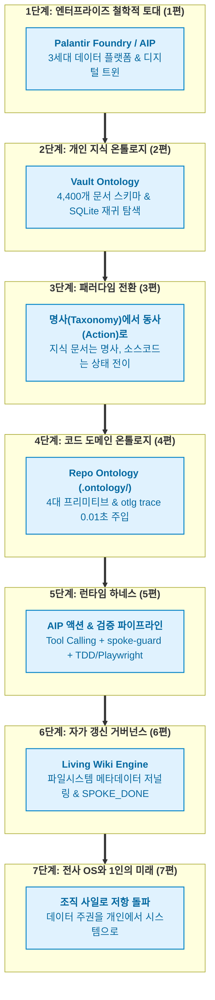

- table of contents
{:toc}

> "데이터는 쌓아둘수록 늪(Swamp)이 되지만, 온톨로지는 쌓일수록 시스템의 척추가 된다."
> 개인 지식베이스(Vault) 4,400개 문서의 엔트로피 통제부터, 39만 줄 코드베이스(Repo)에서 기억상실증 AI 에이전트의 코드 파괴를 방어하기까지.
> 팔란티어(Palantir Foundry / AIP)의 엔터프라이즈 온톨로지 철학을 1인 개발자의 시스템에 직접 이식하고 검증해낸 심층 탐구 기록.
{:.lead}

---

## 1. 프롤로그: 왜 온톨로지인가

*(토마토님 직접 집필 예정 영역: 프롬프트 엔지니어링의 한계, 에이전트 협업의 피로, 그리고 온톨로지를 만나 시스템의 척추를 세우게 된 배경 회고)*

---

## 2. 시리즈 로드맵: 지식 그래프에서 AI Agent OS까지

이 시리즈는 엔터프라이즈의 거대 데이터 철학에서 출발하여, 개인 지식의 그래프화, 그리고 코드베이스의 실행형 온톨로지와 자가 갱신형 거버넌스까지 총 7편에 걸쳐 실전 아키텍처를 해부합니다.

| 편수 | 제목 | 핵심 화두 |
|:---|:---|:---|
| **[1편]** | [[1편] 팔란티어는 왜 20년을 온톨로지에 바쳤는가](/tag-ontology-engineering/1-palantir-3rd-generation-platform/) | DW와 Data Lake의 늪을 지나 Enterprise OS와 AIP로 나아간 이유 (변우철 본부장 인터뷰 분석) |
| **[2편]** | [[2편] 4,400개의 흩어진 생각에 척추를 세우다: Vault 지식 온톨로지](/tag-ontology-engineering/2-vault-knowledge-ontology/) | 폴더 분류와 단순 RAG를 넘어 SQLite 재귀 CTE와 시험 문장으로 세운 개인 지식 온톨로지 |
| **[3편]** | [[3편] 지식은 명사지만 코드는 동사다: Vault에서 Repo로의 패러다임 전환](/tag-ontology-engineering/3-nouns-to-verbs-paradigm-shift/) | 정적 문서 분류(Taxonomy)의 자만을 깨부순 팔란티어 키노트와 상태 변경 명세(Action Spec)의 필요성 |
| **[4편]** | [[4편] 기억상실증 에이전트에게 0.01초 만에 뇌를 주입하다: Repo Ontology (otlg)](/tag-ontology-engineering/4-repo-ontology-primitives-and-trace/) | 4대 프리미티브(Objects, Links, Actions, Functions)와 AST 심볼 바인딩, `otlg trace`의 실체 |
| **[5편]** | [[5편] 온톨로지는 헌법이고 에이전트는 집행관이다: AIP 액션 철학과 SDLC 하네스](/tag-ontology-engineering/5-aip-action-and-sdlc-harness/) | Tool Calling과 사전 불변식, `spoke-guard` 훅과 TDD/Playwright가 결합된 물리적 가드레일 |
| **[6편]** | [[6편] 문서는 스스로 숨 쉰다: Living Wiki Engine과 메타데이터 저널링](/tag-ontology-engineering/6-living-wiki-and-metadata-journaling/) | 에이전트 작업 종료 직전 수행되는 4단계 자가 갱신 루프와 리눅스 저널링 파일시스템 대응 |
| **[7편]** | [[7편] 마치며: 전사 운영체제와 조직 저항, 그리고 1인 개발자의 미래](/tag-ontology-engineering/7-enterprise-os-and-solo-developer/) | 엑셀의 사일로를 부수는 엔터프라이즈의 투쟁과, 1인 개발자가 지켜낸 시스템 주권 |

---

---

### [시리즈의 다음 이야기]
첫 번째 글인 **[[1편] 팔란티어는 왜 20년을 온톨로지에 바쳤는가](/tag-ontology-engineering/1-palantir-3rd-generation-platform/)**에서는, 데이터 웨어하우스(DW)와 데이터 레이크(Data Lake)의 늪을 지나 엔터프라이즈 OS와 실행형 AI(AIP)로 나아간 팔란티어 20년의 궤적을 변우철 본부장의 통찰과 함께 살펴봅니다.
