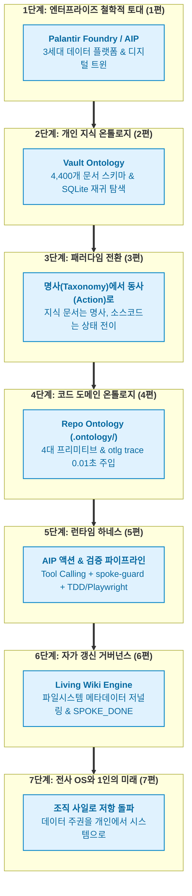

- table of contents
{:toc}

## 전체 시리즈 로드맵 안내 (1편 ~ 7편 정주행 가이드)

아래는 이 시리즈에서 다루는 <mark class="kw-term">온톨로지 엔지니어링</mark> 7편의 실전 아키텍처와 다루는 핵심 주제 안내이다. 관심 있는 주제부터 먼저 살펴보면 되겠다.

| 글 제목 | 핵심 화두 |
|:---|:---|
| [1편] 2천 년 전 그리스 철학이 현대 기업의 엑셀 지옥을 구원할 리가 없어 (발행 예정) | DW와 Data Lake의 늪을 지나 Enterprise OS와 AIP로 나아간 이유 (변우철 본부장 인터뷰 분석) |

<!--
| [[2편] 4,400개의 흩어진 생각에 척추를 세우다: Vault 지식 온톨로지](/tag-ontology-engineering/2-vault-knowledge-ontology/) | 폴더 분류와 단순 RAG를 넘어 SQLite 재귀 CTE와 시험 문장으로 세운 개인 지식 온톨로지 |
| [[3편] 테스형? 형이 만든 게 왜 내 레포지토리에서 터지고 있어: 명사에서 동사로](/tag-ontology-engineering/3-nouns-to-verbs-paradigm-shift/) | 정적 문서 분류(Taxonomy)의 자만을 깨부순 팔란티어 키노트와 상태 변경 명세(Action Spec)의 필요성 |
| [[4편] 기억상실증 에이전트에게 0.01초 만에 뇌를 주입하다: Repo Ontology (otlg)](/tag-ontology-engineering/4-repo-ontology-primitives-and-trace/) | 4대 프리미티브(Objects, Links, Actions, Functions)와 AST 심볼 바인딩, `otlg trace`의 실체 |
| [[5편] 온톨로지는 헌법이고 에이전트는 집행관이다: AIP 액션 철학과 SDLC 하네스](/tag-ontology-engineering/5-aip-action-and-sdlc-harness/) | Tool Calling과 사전 불변식, `spoke-guard` 훅과 TDD/Playwright가 결합된 물리적 가드레일 |
| [[6편] 문서는 스스로 숨 쉰다: Living Wiki Engine과 메타데이터 저널링](/tag-ontology-engineering/6-living-wiki-and-metadata-journaling/) | 에이전트 작업 종료 직전 수행되는 4단계 자가 갱신 루프와 리눅스 저널링 파일시스템 대응 |
| [[7편] 마치며: 전사 운영체제와 조직 저항, 그리고 1인 개발자의 미래](/tag-ontology-engineering/7-enterprise-os-and-solo-developer/) | 엑셀의 사일로를 부수는 엔터프라이즈의 투쟁과, 1인 개발자가 지켜낸 시스템 주권 |
-->

---

---

## 프롤로그: 왜 온톨로지인가

[AI OS 시리즈](/tag-ai-agent-architecture/)를 연재하면서 작년에 비해 최근에는 에이전트와 관련하여 딱히 큰 패러다임 시프트가 없는 것 같다고 이야기한 적이 있다. 실제 체감하기로도 큰 변화는 이뤄지지 않고 있는 것 같다만 내가 느끼기에 두 가지만 꼽아보자면 내가 AI OS 시리즈에서 다뤘던 각자의 <mark class="kw-term">워크플로우</mark>에 대한 것과, `Onotology`에 대해서이다.

워크플로우는 정말 춘추전국시대처럼 모두가 각자의 환경과 테이스트에 맞는 방향으로 진화를 시켜가는 것 같다. 내가 그러하였듯 말이다. 그래서 [11편](/tech/11-external-workflow-and-ai-os/)에서 이야기한 `Ralph` 창시자가 만드려고하는 <mark class="kw-term">AI OS</mark>가 가져올 반향이 기대가 되는 바이기도 하다.

나머지 한 축인 온톨로지는 정말 흥미롭다. 최근에 접한 온톨로지에 대한 개념들은 사람들이 왜 `Palantir`에 열광하는지 나로하여금 충분히 이해시켜주었다 ~~*(물론 주식때문인게 크겠지만, 엔지니어 사이에서도 화두이긴 하니까)*~~. 특히 <mark class="kw-devil">기록의 악마</mark>인 나는 온톨로지의 개념을 접하자마자 '`Obsidian Vault`의 시스템에 도입하여 유기적인 시스템으로 만들 수 있지 않을까?' 라는 질문을 던졌고 덕분에 더 발전된 `Vault`로 탈바꿈할 수 있었다. 이에 대한 내용은 [AI OS 10편](/tech/10-knowledge-ontology/)에서 간략하게 설명하고 있고, 추후에 [Vault OS 시리즈](/tag-vault-os/)를 연재하면 더 자세히 다뤄볼까 생각 중이다.

`Vault`에 `Ontology`의 개념을 도입한 것은, `Repository`의 관리 체계를 확고히해나감([AI OS 6편](/tech/6-repo-governance/), [7편](/tech/7-rule-pruning/))에 있어서 '이 두 개를 융합하면 어떨까?'라는 생각까지도 이어졌다. 그로부터 탄생한게 <mark class="kw-term">Repo Ontology</mark> 이며 이 시리즈의 내용이 되겠다.

{:width="700" loading="lazy"}

`otlg trace`로 비즈니스 액션과 연관 도메인 객체, 4대 불변식 규칙, 프론트엔드·백엔드 19개 소스 파일 경로를 반환해주는 실제 터미널 구동 화면
{:.figcaption}

---

첫 번째 글인 **[1편] 2천 년 전 그리스 철학이 현대 기업의 엑셀 지옥을 구원할 리가 없어**에서 온톨로지의 배경과 함께 데이터 웨어하우스(`DW`)와 데이터 레이크(Data Lake)의 늪을 지나 <mark class="kw-term">엔터프라이즈 OS</mark>와 실행형 AI(`AIP`)로 나아간 팔란티어 20년의 궤적을 변우철 본부장님의 통찰과 함께 살펴보자.
