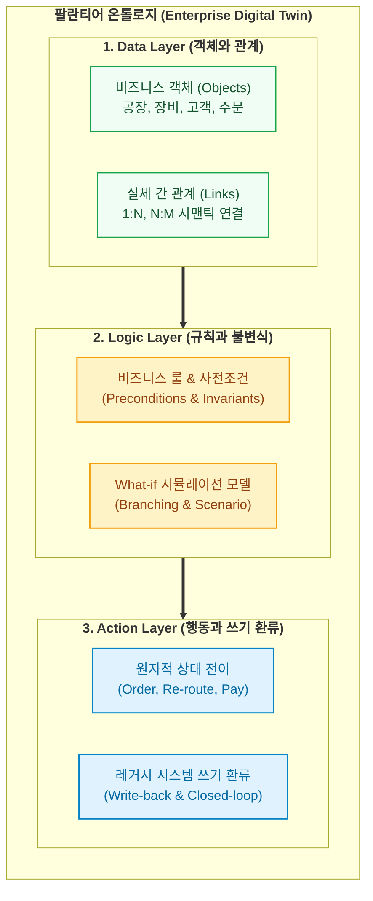

- table of contents
{:toc}

> "기업들은 수천억을 들여 거대한 데이터 호수(Data Lake)를 팠지만, 그 호수는 결국 아무도 원하는 데이터를 찾을 수 없는 '데이터의 늪(Data Swamp)'이 되었습니다."
> 엔터프라이즈 데이터 플랫폼 20년의 진화 과정과, 경쟁사들이 데이터 수집과 대시보드에 매달릴 때 팔란티어(Palantir)가 오직 '온톨로지'라는 한 우물만 판 이유.
> 변우철 본부장(KT 피테크 본부장)의 통찰을 통해 조명하는 3세대 엔터프라이즈 운영체제와 실행형 AI(AIP)의 본질.
{:.lead}

---

## 1. 데이터의 호수는 어떻게 늪(Swamp)이 되었는가

2000년대 초반부터 지금까지, 엔터프라이즈 IT 시장은 언제나 '데이터'를 외쳐왔다. 하지만 그 화려한 구호 뒤에서 현장의 실무자들이 겪은 현실은 냉혹했다. 변우철 본부장(KT 피테크 본부장, 《팔란티어의 시대가 온다》 저자)은 이 역사를 세 단계로 명쾌하게 정리한다.

```text
[1세대: DW (Data Warehouse, 2000년대 초반)]
- SAP BW, Oracle 등 정형 텍스트 데이터 중심.
- 도서관을 장르별(소설관, 수필관, 만화관)로 따로따로 지어놓은 형태.
- 부서 간 데이터 파편화가 극심했고, 비정형 데이터(로그, 이미지, 음성)를 전혀 담지 못함.

        │
        ▼
[2세대: Data Lake (2010년 전후)]
- Hadoop, 클라우드 오브젝트 스토리지(S3) 기반.
- "모든 데이터를 가리지 말고 일단 한곳에 다 모아라!"
- 거대한 호수에 온갖 형식의 원천 데이터를 파일 형태로 집적.
- 치명적 한계: 실무자가 원하는 데이터를 찾을 수 없음 (SQL과 빅데이터 언어 장벽).
- 결과: 실무자가 IT 부서에 엑셀 추출을 메일로 요청하는 병목 지속.
  호수는 악취가 나는 '데이터의 늪(Data Swamp)'으로 전락.

        │
        ▼
[2.5세대: Cloud DW & Lakehouse]
- Snowflake, Databricks.
- Raw → Cleaned → Object로 이어지는 세련된 정제 파이프라인.
- 수집과 파이프라인 성능은 극대화되었으나, 그 상위의 '온톨로지 계층' 부재.
- 여전히 "데이터를 모아서 예쁘게 조회하는 대시보드"에 머무름.

        │
        ▼
[3세대: Enterprise OS & AI Platform (Palantir Foundry / AIP)]
- 실무자가 직접 시스템에 들어와 데이터를 검색, 가공, 실행하는 셀프서비스 환경.
- 파편화된 테이블을 비즈니스 실체인 '온톨로지(Ontology)'로 승격.
- 조회를 넘어 실제 레거시 운영 시스템(ERP, CRM, SCM)의 상태를 변경하는 폐루프 액션(Closed-loop Action) 보장.
```

수많은 기업이 클라우드와 데이터 레이크를 구축했지만, 경영진이 아침마다 보는 화면은 며칠 전 수치로 고정된 정적 대시보드였고, 실무자들은 여전히 슬랙과 이메일로 엑셀 파일을 주고받으며 수작업을 반복했다. 데이터는 쌓였지만, **데이터가 시스템의 행동(Action)으로 이어지는 다리가 끊어져 있었기 때문**이다.

---

## 2. 팔란티어를 가르는 결정적 차이: 온톨로지 3대 레이어

팔란티어(Palantir Technologies)가 Snowflake나 Databricks 같은 쟁쟁한 데이터 기업들과 근본적으로 다른 궤적을 걷게 된 이유는 단 하나, **온톨로지(Ontology)라는 계층의 유무**다.

팔란티어가 정의하는 온톨로지는 학술적인 지식 그래프(Knowledge Graph)가 아니다. 기업의 현실 비즈니스를 컴퓨터 메모리 위에 1:1로 실시간 복제해내는 **디지털 트윈(Digital Twin)**이자 **전사 운영체제(Enterprise OS)**다.

팔란티어 온톨로지는 세 개의 층위가 톱니바퀴처럼 맞물려 돌아간다:



### 1) Data Layer (Objects & Links)
테이블과 컬럼이라는 데이터베이스의 물리적 명칭 대신, 현업 실무자가 일상에서 쓰는 비즈니스 실체(공장, 항공기, 부품, 결제 건)를 객체(Objects)로 모델링한다. 객체들은 서로 외래키가 아니라 현실의 의미론적 관계(Links)로 묶인다.

### 2) Logic Layer (Rules & Invariants)
데이터 위에 시스템 전역의 비즈니스 규칙과 불변식(Invariants)을 얹는다. "이 부품의 재고가 10개 미만일 때는 출고 승인이 날 수 없다", "위험 수치에 도달한 장비는 점검 상태로만 전이될 수 있다"와 같은 제약 조건과 시뮬레이션 모델이다.

### 3) Action Layer (Write-back & Closed-loop)
단순한 조회가 아니라, 실무자나 AI가 버튼을 눌렀을 때 실제 레거시 SAP, Oracle ERP의 데이터 상태를 변경하는 원자적 트랜잭션(Action)을 수행한다. 검증되지 않은 쓰기는 차단되며, 모든 실행은 불변 감사 로그(Audit Trail)를 남긴다.

---

## 3. LLM 시대의 역설: 왜 프롬프트가 아니라 온톨로지인가

2023년 거대 언어 모델(LLM)이 세상을 뒤흔들었을 때, 수많은 기업은 "이제 모든 인터페이스가 챗봇으로 대체될 것"이라며 환호했다. 하지만 프로덕션 현장에 LLM을 도입한 엔지니어들은 금세 거대한 벽에 부딪혔다.

- **할루시네이션(환각)**: 그럴듯하지만 완전히 잘못된 결정을 내린다.
- **불변식 파괴**: 시스템의 치명적인 비즈니스 규칙을 무시하고 데이터를 변조한다.
- **실행력 부재**: 말을 잘할 뿐, 실제 엔터프라이즈의 백엔드 시스템과 안전하게 결합하지 못한다.

팔란티어가 내놓은 해법인 **AIP(Artificial Intelligence Platform)**의 메커니즘은 매우 명쾌했다.

> **"LLM에게 데이터베이스를 통째로 보게 하거나, 임의의 코드를 실행하게 두지 마라. 대신 LLM에게 온톨로지의 Action Types를 도구(Tool)로 쥐여주어라."**

AIP에서 LLM은 자연어로 들어온 사용자의 의도를 해석하여, 온톨로지에 엄격히 정의된 `Action`을 호출하는 라우터 역할을 수행한다. 그 Action이 실행되기 전, 온톨로지의 `Logic Layer`가 사전조건과 권한을 기계적으로 검증한다. 조건이 충족되지 않으면 실행은 원천 차단된다.

자연어라는 비결정론적 인터페이스가 엔터프라이즈의 치명적인 물리 시스템과 만날 수 있는 유일한 통로는, 오직 **온톨로지라는 엄격하고 결정론적인 가드레일**뿐이었던 것이다.

---

## 4. 1인 개발자가 이 거대한 철학에서 발견한 것

수만 명의 임직원이 일하는 대기업의 전사 데이터 플랫폼 이야기를 들으며, 나는 깊은 전율과 함께 묘한 기시감을 느꼈다.

나 역시 사수 없는 환경에서 수천 개의 지식 노트와 수십만 줄의 코드베이스를 혼자 짊어지고 있었다. 그리고 매일 아침 기억을 잃고 백지상태로 깨어나는 AI 코딩 에이전트들과 협업하며, 대기업이 겪었던 것과 똑같은 고통을 겪고 있었다:
- 에이전트에게 장황한 자연어로 규칙을 적어줘도 슬그머니 규칙을 어겼다.
- 데이터베이스 ERD만 보고 코드를 짜게 했더니 비즈니스 불변식을 모조리 깨뜨렸다.
- 세션이 바뀔 때마다 프로젝트 전체 구조를 파악하느라 수만 토큰을 낭비했다.

변우철 본부장의 강의와 팔란티어 키노트는 내게 분명한 나침반을 쥐여주었다. 

**"문제는 AI의 지능이 아니라, AI가 발을 딛고 설 온톨로지(척추)가 내 시스템에 없다는 점이었다."**

그렇다면 이 거대한 엔터프라이즈 온톨로지 철학을, 1인 개발자는 어떻게 자신의 컴퓨터에 구체화할 수 있을까?
그 첫 번째 실험은 바로, 내 생각과 의사결정이 모여 있는 4,400개의 마크다운 지식 베이스(Vault)에서 시작되었다.

---

### [시리즈의 다음 이야기]
다음 글인 **[[2편] 4,400개의 흩어진 생각에 척추를 세우다: Vault 지식 온톨로지](/tech/2-vault-knowledge-ontology/)**에서는, 무분별하게 파편화되던 옵시디언 볼트에 13개 스키마와 2계층 관계망(구조 2종, 의미 7종), 그리고 SQLite 재귀 CTE를 결합하여 지식 엔트로피를 완벽히 통제해낸 '개인 지식 온톨로지' 구축기를 다룹니다.
