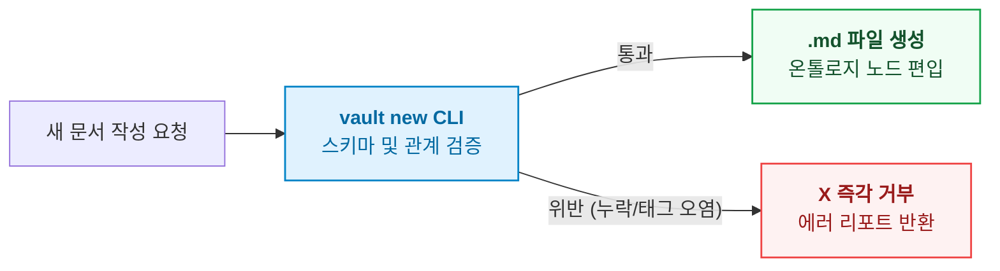

- table of contents
{:toc}

> "분류되지 않고, 검증되지 않으며, 연결되지 않은 마크다운 파일은 지식이 아니라 기술 부채다."
> 옵시디언(Obsidian) 볼트에 쌓인 4,400개의 비정형 메모와 의사결정 기록들.
> 13가지 정형 스키마, 2계층 온톨로지 관계망(구조 2종, 의미 7종), 그리고 SQLite 재귀 쿼리와 실측 비교를 통해 지식 엔트로피를 기계적으로 통제해낸 '개인 지식 온톨로지' 구축 뼈대.
{:.lead}

---

## 1. 4,400개 노트의 늪: 정리 강박의 파탄

- **[원천 사실 및 규모]**
  - 개발 초창기부터 이어진 지독한 기록 습관: 기술 메모, 아키텍처 결정, 장애 회고, 일상 일기 등 4,400개 이상의 로컬 마크다운 파일 집적.
  - 3,000개를 돌파하던 시점부터 닥쳐온 '지식의 늪(Knowledge Swamp)'.
- **[기존 체계 3대 파탄 요인]**
  - **1) 폴더의 한계 (상호 배타성 상실)**: 카테고리는 언제나 겹친다. "FastAPI 동시성 제어"는 Python인가, Backend인가, Architecture인가?
  - **2) 태그의 오염 (단어 구름의 무력화)**: `#concurrency`, `#async`, `#동시성`, `#lock`처럼 유사 태그가 제멋대로 증식하고, 본문 속 `#6B4E8C` 색상 코드까지 태그로 오인식.
  - **3) RAG(검색)의 한계**: 키워드나 벡터 유사도 검색은 비슷한 문서를 쏟아낼 뿐, "어떤 개념을 먼저 알아야 다음 개념을 이해할 수 있는가?"라는 **선행 관계(Prerequisite)**를 전혀 설명하지 못함.
- **[서술 포인트 / 말맛 가이드]**
  - 과거의 내가 쓴 노트를 미래의 내가 신뢰하지 못하는 불신의 악순환.
  - 새로 투입된 AI 에이전트가 고립된 노트를 제멋대로 읽고 환각을 증폭시키는 고통 묘사.

---

## 2. 지식 온톨로지의 뼈대: 13개 `type`과 정본 스키마

- **[핵심 설계 결정] 볼트 내 모든 문서를 엄격한 기계 가독형 객체(Entity)로 규정**
  - 감상이나 산문이 아닌, 시스템이 파싱할 수 있는 정본 프로파일 수립.
- **[13개 type 분류 체계]**
  - **핵심 판단 구간 (summary 80자 필수)**:
    - `concept`: 도메인 독립적 원리·이론 (ACID, CQS, CAP 정리).
    - `procedure`: 재현 가능한 절차·가이드 (Terraform 배포 파이프라인).
    - `reference`: 규격, 문법, 명령어 스펙 (Docker CLI 레퍼런스).
    - `case`: 구체적 실전 사건·장애 전말 (RDS 커넥션 풀 고갈 사건).
  - **거버넌스 및 실행 구간**:
    - `principle`: 팀과 개인의 판단 기준·불변 원칙 (299 Principles).
    - `decision`: 대안을 비교하고 결론을 내린 의사결정 (Decision Node).
    - `project-doc`: 특정 프로젝트 런타임 문서 (설계서, 로드맵).
    - 기타 `hub`, `meta`, `source` 등.
- **[frontmatter 불변식]**
  - `type:`(13값 중 택1), `created:`(YYYY-MM-DD), `summary:`(80자 이내, "열어보지 않고도 고를 수 있게").
  - `tags:`는 오직 frontmatter 하나뿐. 본문 인라인 태그 엄격 금지.

---

## 3. 2계층 온톨로지 관계망: 구조 관계와 의미 관계

- **[단순 위키링크([[...]])의 한계]**
  - 링크가 걸려 있어도 이것이 상위 개념인지, 파생인지, 반박인지 기계가 알 수 없음.
- **[구조 관계 2종: 학습 순서와 수명주기]**
  - **`builds_on` ("무엇을 먼저 읽어야 하는가?")**:
    - 지식의 선행 조건 선언. 직접 부모만 명시 (최대 3개).
    - A ➔ B ➔ C 관계에서 A에는 B만 적음. 상위 계보는 엔진이 이행 폐쇄(Transitive Closure)로 계산.
  - **`supersedes` ("과거의 무엇을 대체했는가?")**:
    - 기술 진화에 따른 옛 문서의 공식 폐기 및 대체 선언.
- **[의미 관계 7종과 '시험 문장(Test Sentence)' 판정법]**
  - 자의적이고 느슨한 연결을 원천 차단하기 위해, 한국어로 읽어서 참일 때만 부여하는 엄격한 시험 문장 도입:
    - `derived_from`: **"A는 B에서 나왔다"** (실전 장애 case ➔ 도출된 원칙 principle).
    - `contradicts`: **"A와 B는 둘 다 참일 수 없다"** (설계 원칙 간의 상충).
    - `diverges_from`: **"A는 B를 바탕으로 삼되 일부를 바꿨다"** (오픈소스 패턴의 로컬 변형).
    - `applies`: **"A는 B라는 원칙을 적용했다"** (실전 코드가 특정 원칙 채택).
    - `informed_by`: **"A는 B의 영향을 받았다"** (외부 서적, 키노트 영감).
    - `expresses`: **"A는 B라는 가치를 구현한다"** (구체적 도구가 철학을 대변).
    - `answered_by`: **"A라는 질문이 B에서 답을 얻는다"** (의문 노트 ➔ 해결 노트).

---

## 4. 그래프와 온톨로지의 경계 실측: SQLite vs RDF/OWL (볼트 211 구역의 결론)

- **[W3C 시맨틱 웹 실험과 실측 (Phase 1~9)]**
  - 볼트 데이터를 SQLite 그래프로 구축한 뒤, W3C 표준인 RDF/OWL 트리플(`.ttl`)로 두 번째 모델링하여 추론기(Reasoner)를 돌려봄.
  - **실측 결과: 추론기가 만들어낸 유용한 새 사실 = 0건.**
  - **이유**:
    - 열린 세계 가정(OWA): "적히지 않은 것은 거짓이 아니라 모름". 고아 노트나 결측치 탐색 불가.
    - 고유 이름 가정 부재(No UNA): 서로 다른 두 이름이 같은 대상일 수 있다는 가정으로 검증 복잡도 폭발.
    - SHACL 없이 OWL 공리만으로는 "필수 필드 누락" 검증 시 위반 0건 발생.
- **[역량 질문(Competency Questions)과 실용주의 안착]**
  - 온톨로지의 가치는 "무엇을 표현하는가"가 아니라 **"무슨 질문에 답하는가"**로 평가된다.
  - SQLite 재귀 CTE(`WITH RECURSIVE ConceptChain`)로 6대 핵심 질문을 0.5ms 만에 완벽히 해결:
    - `VPC 피어링` 질의 시: `서브넷` ➔ `CIDR` ➔ `라우팅 테이블` ➔ `VPC` ➔ `VPC 피어링`으로 이어지는 선행 개념 체인 0.5ms 즉시 추출.
  - **최종 아키텍처 포지셔닝**:
    - 일상 운영과 질의: SQLite 가상 테이블.
    - 스키마 검증과 하네스: Python CLI (`vault` 도구).
    - RDF/OWL/Turtle: 외부 상호운용과 지식 보관용 산출물.

```sql
WITH RECURSIVE ConceptChain AS (
    SELECT target_doc, parent_doc, 1 AS depth
    FROM doc_relations
    WHERE target_doc = 'VPC 피어링' AND relation_type = 'builds_on'
    UNION ALL
    SELECT r.target_doc, r.parent_doc, c.depth + 1
    FROM doc_relations r
    JOIN ConceptChain c ON r.target_doc = c.parent_doc
    WHERE r.relation_type = 'builds_on'
)
SELECT parent_doc, depth FROM ConceptChain ORDER BY depth DESC;
```

---

## 5. 기계적 하네스: `vault new` CLI 생성 게이트와 화이트리스트

- **[자연어 규칙의 실패]** "문서 생성 가이드라인을 아무리 잘 써놔도 인간과 AI는 반드시 어긴다."
- **[생성 게이트 구축]**
  - 볼트 내에 Write 도구로 `.md` 직접 작성 금지.
  - 오직 전역 CLI 명령어 `vault new`를 통해서만 파일 생성 허용.
  - CLI가 frontmatter 스키마, 필수 필드(`type`, `created`, `summary`), 태그 화이트리스트(`vault tags`)를 검사하여 위반 시 파일 생성을 즉각 거부하고 이유를 출력.
- **[사건 기반 정제 스킬 결합]**
  - 새 노트가 추가되면 정제 스킬(`experience-distill`, `knowledge-elevate`, `reflection-weave`)이 작동하여 상위 지식으로 승격시키는 능동적 대사 작용.



---

## 6. 성과, 그리고 맞닥뜨린 또 다른 벽: "명사는 완벽한데 코드는 왜 터지는가"

- **[개인 지식 온톨로지의 임팩트]**
  - 4,400개 문서의 엔트로피 제로화. AI 에이전트 온보딩 시간 단축, 인간의 직관과 완벽한 정렬.
- **[한계의 자각과 거대한 질문]**
  - 볼트 온톨로지는 어디까지나 생각과 개념의 계보를 다루는 **'명사(Taxonomy)의 세계'**.
  - 하지만 소프트웨어 엔지니어링 실전은 DB 행을 잠그고(`SELECT FOR UPDATE`), 테넌트를 격리하며, 상태를 전이해야 하는 **'동사(Action)와 런타임 물리 계층의 세계'**.
  - 문서가 아무리 완벽해도 에이전트는 코드베이스에 투입되는 순간 여전히 불변식을 깨뜨렸다.
- **[3편 예고]**
  - 명사의 안락함을 깨부수고, 코드의 상태 전이 명세로 무게중심을 옮긴 극적인 패러다임 전환: "지식은 명사지만 코드는 동사다".

---

### [시리즈의 다음 이야기]
다음 글인 **[[3편] 지식은 명사지만 코드는 동사다: Vault에서 Repo로의 패러다임 전환](/tag-ontology-engineering/3-nouns-to-verbs-paradigm-shift/)**에서는, 정적 지식 분류의 자만을 산산조각 낸 팔란티어 키노트의 충격과, 텍스트 문서에서 소스 코드의 상태 전이 명세로 무게중심을 옮기게 된 패러다임의 극적인 도약을 다룹니다.

