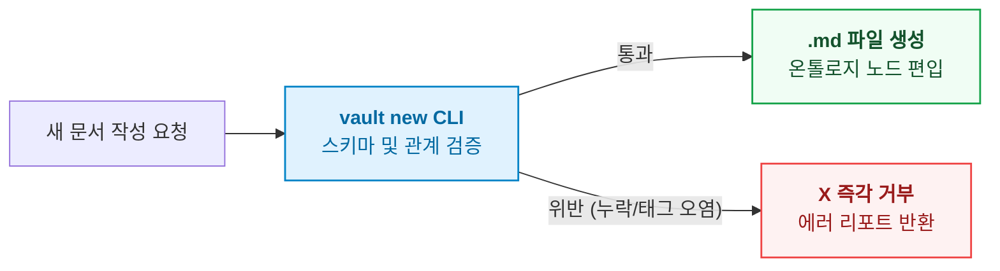

- table of contents
{:toc}

> "분류되지 않고, 검증되지 않으며, 연결되지 않은 마크다운 파일은 지식이 아니라 기술 부채다."
> 옵시디언(Obsidian) 볼트에 쌓인 4,400개의 비정형 메모와 의사결정 기록들.
> 13가지 정형 스키마, 2계층 온톨로지 관계망(구조 2종, 의미 7종), 그리고 SQLite 재귀 쿼리를 결합하여 지식의 엔트로피를 기계적으로 통제해낸 '개인 지식 온톨로지' 구축기.
{:.lead}

---

## 1. 4,400개 노트의 늪: 정리 강박의 파탄

개발을 시작한 이래 나는 지독한 기록광이었다. 기술 문서, 아키텍처 결정, 장애 회고, 독서 요약, 일상 일기까지 모든 것을 로컬 마크다운 파일로 기록했다. 그렇게 쌓인 노트가 어느덧 4,400개를 넘어섰다.

하지만 노트가 3천 개를 넘어가던 시점부터, 기록은 성장의 무기가 아니라 나를 짓누르는 거대한 늪이 되었다.
- **폴더의 한계**: 카테고리는 늘 겹쳤다. "FastAPI의 동시성 제어"는 `Python` 폴더에 넣어야 할까, `Architecture` 폴더에 넣어야 할까?
- **태그의 오염**: `#concurrency`, `#async`, `#동시성`, `#lock`처럼 비슷한 태그가 제멋대로 증식하여 무의미한 단어 구름이 되었다.
- **RAG(검색)의 한계**: 단순 키워드 검색이나 벡터 검색(RAG)을 돌리면 수십 개의 유사한 문서가 쏟아져 나왔지만, "어떤 문서를 먼저 읽어야 다음 문서를 이해할 수 있는가?"라는 **개념의 선후 관계**는 전혀 알 수 없었다.

기록이 많아질수록 미래의 나는 과거의 내가 쓴 문서를 신뢰하지 못하게 되었고, 새로 투입된 AI 에이전트는 맥락을 파악하지 못한 채 엉뚱한 노트를 참조해 환각을 쏟아냈다.

---

## 2. 지식 온톨로지의 뼈대: 13개 `type`과 정본 스키마

지식의 무질서(엔트로피)를 끝장내기 위해 내린 첫 번째 결단은, **볼트 안의 모든 문서를 엄격한 기계 가독형 객체(Entity)로 규정하는 것**이었다.

우리는 수천 개의 문서를 분석하여 지식의 역할을 단 **13개의 `type`**으로 고정했다:

| type | 정의 및 역할 | 필수 필드 |
|:---|:---|:---|
| **concept** | 도메인 독립적 원리·이론 (예: ACID, CQS, CAP 정리) | `type`, `created`, `summary` |
| **procedure** | 재현 가능한 절차·가이드 (예: Terraform 배포 파이프라인) | `type`, `created`, `summary` |
| **reference** | 규격, 문법, 명령어 스펙 (예: Docker CLI 치트시트) | `type`, `created`, `summary` |
| **case** | 구체적 실전 사건·장애 전말 (예: RDS 커넥션 풀 고갈 사건) | `type`, `created`, `summary` |
| **principle** | 팀과 개인의 판단 기준·불변 원칙 (299 Principles) | `type`, `created` |
| **project-doc** | 특정 프로젝트 런타임 문서 (설계서, 로드맵) | `type`, `created` |
| **decision** | 대안을 비교하고 결론을 내린 의사결정 (Decision Node) | `type`, `created` |

"미래의 내가 문서를 열지 않고도 고를 수 있게 한다"는 원칙에 따라, 핵심 판단 구간(concept, procedure, reference, case)에는 80자 이내의 `summary`를 필수화했다.

```yaml
---
type: concept
tags:
  - Stack/Database
  - Architecture/Concurrency
summary: 트랜잭션 격리 수준과 동시성 이상 현상의 이론적 상호작용
builds_on:
  - "[[트랜잭션 ACID 원칙]]"
created: 2026-08-10
---
```

---

## 3. 2계층 온톨로지 관계망: 구조 관계와 의미 관계

단순한 위키링크(`[[링크]]`)는 문서 간의 관계가 대등한지, 선후인지, 반박인지를 설명하지 못한다. 우리는 지식의 연결을 2계층으로 분리했다.

### 3.1. 구조 관계 2종: 읽는 순서와 폐기 선언

1. **`builds_on` ("무엇을 먼저 읽어야 하는가?")**:
   - 지식의 선행 조건을 정의한다. "A를 온전히 이해하기 위해 사전에 반드시 통과해야 하는 바탕 개념은 무엇인가?"
   - **직접 부모만 적는다 (최대 3개)**: A가 B를 필요로 하고 B가 C를 필요로 한다면, A에는 B만 적는다. 상위 개념은 그래프 엔진이 <mark class="kw-term">이행 폐쇄(Transitive Closure)</mark>를 타고 자동으로 계산한다.
2. **`supersedes` ("과거의 무엇을 대체했는가?")**:
   - 아키텍처가 바뀌고 기술이 진화하여 옛 문서를 폐기하거나 완전히 흡수했을 때 사용하는 공식 폐기 선언이다.

### 3.2. 의미 관계 7종과 '시험 문장' 판정법

관계 부여가 자의적으로 흐르는 것을 막기 위해, 사람이 읽어서 참과 거짓을 즉각 판정할 수 있는 **'<mark class="kw-term">시험 문장(Test Sentence)</mark>'**을 세웠다:

| 의미 관계 | 시험 문장 (이대로 읽어서 참일 때만 부여) | 실전 용례 |
|:---|:---|:---|
| **`derived_from`** | **"A는 B에서 나왔다"** | 실전 장애 사건(`case`)에서 도출된 설계 원칙 |
| **`contradicts`** | **"A와 B는 둘 다 참일 수 없다"** | 서로 다른 두 설계 원칙 간의 상충 |
| **`diverges_from`**| **"A는 B를 바탕으로 삼되 일부를 바꿨다"** | 표준 오픈소스 패턴을 우리 환경에 맞게 변형 |
| **`applies`** | **"A는 B라는 원칙을 적용했다"** | 실전 구현 코드가 특정 아키텍처 원칙을 채택 |
| **`informed_by`** | **"A는 B의 영향을 받았다"** | 사고의 틀에 깊은 영감을 준 외부 키노트나 서적 |
| **`expresses`** | **"A는 B라는 가치를 구현한다"** | 구체적 스크립트 도구가 추상적 엔지니어링 철학을 대변 |
| **`answered_by`** | **"A라는 질문이 B에서 답을 얻는다"** | 호기심이나 고민 노트가 해결 노트를 만났을 때 |

---

## 4. 기계적 강제: SQLite 재귀 CTE와 CLI 거부 게이트

온톨로지는 문서로 적어두는 것만으로는 지켜지지 않는다. 기계적 툴체인이 뒷받침되어야 한다.

### 1) SQLite 재귀 CTE를 통한 초고속 선행 계보 탐색
볼트의 모든 문서 메타데이터를 SQLite 가상 테이블로 색인하고, 재귀 공통 테이블 식(Recursive CTE)을 구축했다:

```sql
WITH RECURSIVE ConceptChain AS (
    -- Anchor: 타깃 문서의 직접 부모
    SELECT target_doc, parent_doc, 1 AS depth
    FROM doc_relations
    WHERE target_doc = 'VPC 피어링' AND relation_type = 'builds_on'

    UNION ALL

    -- Recursive: 상위 선행 개념 추적
    SELECT r.target_doc, r.parent_doc, c.depth + 1
    FROM doc_relations r
    JOIN ConceptChain c ON r.target_doc = c.parent_doc
    WHERE r.relation_type = 'builds_on'
)
SELECT parent_doc, depth FROM ConceptChain ORDER BY depth DESC;
```

터미널에서 `vault q path "VPC 피어링"`을 치면, 단 0.5ms 만에 `서브넷 마스크` ➔ `CIDR` ➔ `라우팅 테이블` ➔ `VPC` ➔ `VPC 피어링`으로 이어지는 완벽한 학습 경로가 출력된다. AI 에이전트에게 맥락을 주입할 때 이보다 명쾌한 순서는 없다.

### 2) `vault new` CLI 생성 게이트
우리는 AI 에이전트와 사람이 직접 볼트에 마크다운 파일을 생성하지 못하도록 막았다. 오직 전역 CLI 명령어인 `vault new`를 통해서만 파일이 생성되며, 필수 필드와 스키마를 통과하지 못하면 명령은 즉시 에러와 함께 거부된다.



---

## 5. 성과, 그리고 맞닥뜨린 또 다른 벽

이렇게 구축된 **Vault 지식 온톨로지**는 개인 지식 베이스의 엔트로피를 기적처럼 제로로 만들었다. 인간의 직관과 AI 에이전트의 탐색 속도가 완벽한 정렬을 이루었다.

하지만 바로 그 순간, 또 하나의 뼈아픈 한계가 수면 위로 떠올랐다.

볼트의 온톨로지는 지식의 계보와 개념의 참/거짓을 다루는 **'명사(Taxonomy)의 세계'**였다. 하지만 우리가 매일 씨름해야 하는 소프트웨어 프로덕션 현장은, DB의 행을 잠그고 결제를 승인하며 상태를 변경해야 하는 **'동사(Action)와 런타임 물리 계층의 세계'**였다.

문서의 온톨로지는 완벽한데, 왜 우리 코드베이스의 에이전트는 여전히 엉뚱한 코드를 짜고 불변식을 깨뜨리고 있는가? 바로 이 질문에서, 우리는 지식 온톨로지를 넘어 **코드베이스 도메인 온톨로지(Repo Ontology)**라는 거대한 패러다임 전환을 마주하게 된다.

---

### [시리즈의 다음 이야기]
다음 글인 **[[3편] 지식은 명사지만 코드는 동사다: Vault에서 Repo로의 패러다임 전환](/tech/3-nouns-to-verbs-paradigm-shift/)**에서는, 정적 지식 분류의 자만을 산산조각 낸 팔란티어 키노트의 충격과, 텍스트 문서에서 소스 코드의 상태 전이 명세로 무게중심을 옮기게 된 패러다임의 극적인 도약을 다룹니다.
