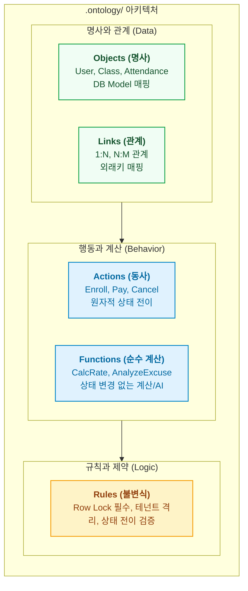

- table of contents
{:toc}

> 데이터베이스 ERD는 시스템의 명사(테이블)만 보여줄 뿐, 비즈니스가 어떻게 살아 숨 쉬는지(동사와 불변식)를 설명하지 못한다.
> 팔란티어(Palantir Foundry)의 핵심 프리미티브인 Objects, Links, Actions, Functions를 소프트웨어 저장소 규격으로 이식하고, 풀스택 코드를 1:1로 결합해낸 아키텍처.
> 기억상실증에 걸린 AI 에이전트에게 `otlg trace` 단 한 방으로 0.01초 만에 코드 경로와 사전 불변식을 주입하는 실전 메커니즘 뼈대.
{:.lead}

---

## 1. 기억상실증 에이전트와 매일 아침의 냉기 (Cold Start의 비극)

- **[원천 현상: 세션 리셋의 고통]**
  - AI 코딩 에이전트와 일할 때 겪는 본질적 한계: 새 세션, 새 워크트리를 열 때마다 에이전트는 과거의 모든 맥락을 잊는 완전한 백지상태로 투입됨.
  - "이 프로젝트의 수납 취소 로직을 수정해 줘" 한마디에 grep, find, 모델 탐색으로 수십 개 파일을 열고 닫으며 세션 초반 수만 토큰을 허공에 날리는 탐색 병목.
- **[치명적 위험: 불변식 누락]**
  - 탐색에 지친 에이전트가 가장 먼저 놓치는 것:
    - 동시성 행 잠금(`SELECT ... FOR UPDATE`) 누락 ➔ 이중 취소 버그 유발.
    - 멀티테넌트 격리(`tenant_id`) 제약 누락 ➔ 타 기관 데이터 침범.
    - 상태 전이 유효성(`PENDING`에서만 전이 가능) 무시.
- **[결단: 레포지토리 전용 온톨로지 구축]**
  - 자연어 프롬프트 지시를 버리고, 팔란티어의 온톨로지 스키마를 코드 레포에 직접 이식: `.ontology/` 표준 템플릿과 전역 CLI `otlg` 개발.

---

## 2. 4대 프리미티브: 명사, 관계, 동사, 그리고 계산

- **[팔란티어 4대 프리미티브의 코드베이스 이식 모델]**
  1. **Objects (명사)**: 비즈니스 도메인 실체 (User, Course, Attendance). DB 모델과 매핑되되 기술적 컬럼 대신 비즈니스 의미 속성 노출.
  2. **Links (관계)**: 객체 간의 의미론적 연결 (1:1, 1:N, N:M). 외래키 및 ORM 관계 정의.
  3. **Actions (동사)**: 시스템 상태를 변경하는 유일한 관문 (Enroll, Pay, Cancel, Grade). 원자적 상태 전이, 입출력 파라미터, 선행 불변식 명세.
  4. **Functions (순수 계산/AI)**: 상태 변경이 없는 순수 비즈니스 연산 (출석률 계산, 성적 산출, 사유서 AI 분석 파이프라인).
  5. **Rules (시스템 전역 불변식)**: 도메인 전반에 강제되는 보안·동시성·비즈니스 불변 규칙.



---

## 3. 실전 명세 스펙: 에듀테크 SaaS 예시 (`grade-submission.yml`)

- **[기계 가독형 YAML 스펙 구조]**
  - 자연어 문서가 아니라 정적 린터와 CLI가 직접 파싱하는 엄격한 계약서.
  - `action:` 액션명 및 비즈니스 설명.
  - `target_object:` 상태 전이 대상 객체.
  - `parameters:` 입력 파라미터 타입, 필수 여부, 범위 제약.
  - `preconditions:` 실행 전 기계가 검증해야 하는 선행 불변식 (상태 체크, 권한 체크, 행 잠금 필수 선언).
  - `code_bindings:` 백엔드(API, Service, Model), 프론트엔드(UI Component, API Client), 모바일(Screen) 소스코드 파일 및 메서드 심볼 1:1 매핑.

```yaml
action: GradeSubmission
target_object: AssignmentSubmission
parameters:
  submission_id: { type: integer, required: true }
  score: { type: float, required: true, minimum: 0.0, maximum: 100.0 }
preconditions:
  - rule: "제출물의 상태가 SUBMITTED여야 한다"
    expression: "submission.status == 'SUBMITTED'"
  - rule: "채점 권한: 해당 강의를 담당하는 강사 본인이어야 한다"
    expression: "auth.user_id == course.instructor_id"
  - rule: "동시 채점 방지를 위한 행 잠금 필수"
    expression: "requires_row_lock(submission_id)"
code_bindings:
  backend:
    api_endpoint: "POST /api/v1/assignments/submissions/{id}/grade"
    service_method: "backend.app.services.assignment:AssignmentService.grade"
    model_file: "backend.app.models.assignment:AssignmentSubmission"
  frontend:
    component: "frontend/src/features/assignment/ui/GradeModal.tsx"
    api_client: "frontend/src/shared/api/assignment.ts:gradeSubmission"
  mobile:
    screen: "mobile/lib/features/assignment/presentation/grade_screen.dart"
```

---

## 4. `otlg trace`: 0.01초 만에 뇌를 복원하는 기적

{:width="700" loading="lazy"}

- **[작업 착수 루프의 대변혁]**
  - 백지상태 에이전트에게 수만 자의 프로젝트 설명 프롬프트를 주입할 필요 없음.
  - 허브는 스포크 에이전트에게 단 한 줄의 명령만 전달:
    `$ otlg trace <ActionName>` (예: 결제 및 정산 비즈니스 액션)
- **[0.01초 터미널 인출 결과 (위 스크린샷 실측치)]**
  - Target 객체와 소속 비즈니스 도메인 즉시 확인.
  - 필수 사전조건(결제 금액 0 초과, 대상 식별자 일치, 조직 테넌트/슈퍼관리자 권한 제약) 선제 각인.
  - 4대 불변식 룰(`ORGANIZATION_DATA_ISOLATION`, `LEDGER_OVER_REFUND_INVARIANT`, `PAYMENT_DATE_ATTRIBUTION_SEPARATION`, `BILLING_STATUS_DERIVATION_SINGLETON`)과 연계 가드·원장 서비스 자동 인출.
  - 자신이 수정해야 할 백엔드 서비스/API/모델/스키마와 프론트엔드 API/모델/UI 페이지 등 총 19개 소스 파일 경로(`SOURCE PATHS`) 즉각 획득.
- **[엔지니어링 임팩트]**
  - 파일 탐색 시간 수십 분 ➔ 0.01초 단축.
  - 불필요한 탐색 토큰 낭비 제로화, 불변식 누락으로 인한 런타임 결함 원천 차단.

---

## 5. 코드 드리프트 방어: `otlg lint --strict`

- **[온톨로지의 부패(Drift) 위험]**
  - 코드가 리팩터링되거나 메서드명이 바뀌었는데 온톨로지 명세가 옛날 경로를 가리키면 온톨로지는 거짓말쟁이가 된다.
- **[기계적 정적 검증 파이프라인]**
  - `otlg lint --strict`가 전수 검사하는 3대 항목:
    1. **심볼 실재성 검증**: 명세에 적힌 `AssignmentService.grade` 메서드가 실제 파이썬 소스 코드 파일 안에 존재하는가?
    2. **엔드포인트 매핑 검증**: `POST /api/v1/assignments/...` 경로가 FastAPI 라우터에 실제로 등록되어 있는가?
    3. **파일시스템 경로 검증**: 프론트엔드와 모바일 컴포넌트 경로가 실제 파일시스템에 실재하는가?
  - 불일치 발생 시 즉각 에러와 함께 커밋 차단. 온톨로지를 단 하루도 썩지 않는 단일 진실 공급원(SSOT)으로 강제.

---

## 6. 명세는 갖추어졌다, 이제 누가 집행하는가

- **[완벽한 법전의 완성]**
  - 명사와 동사가 명확히 갈라졌고, 풀스택 소스코드가 1:1로 묶였으며, 에이전트는 0.01초 만에 컨텍스트를 복원한다.
- **[다음 질문으로의 전환: 엔지니어링 정직성]**
  - 온톨로지 명세는 '법전(Spec)'일 뿐, 법전 스스로가 코드를 짜거나 런타임 트랜잭션을 일으키지 않는다.
  - 그렇다면 이 법전을 바탕으로 실제 코드를 안전하게 집행하고 쓰기 환류(Write-back)를 완결 짓는 물리적 장치는 무엇인가?
- **[5편 예고]**
  - 온톨로지는 헌법이고 에이전트는 집행관이다: AIP 액션 철학과 SDLC 하네스(`spoke-guard`, TDD, Playwright).

---

### [시리즈의 다음 이야기]
다음 글인 **[[5편] 온톨로지는 헌법이고 에이전트는 집행관이다: AIP 액션 철학과 SDLC 하네스](/tag-ontology-engineering/5-aip-action-and-sdlc-harness/)**에서는, 팔란티어 AIP의 Tool Calling 철학을 소프트웨어 개발 라이프사이클에 이식하여, `spoke-guard` 훅과 TDD, Playwright 스냅샷이 결합하여 온톨로지 스펙을 안전하게 집행하는 런타임 하네스 체계를 해부합니다.

