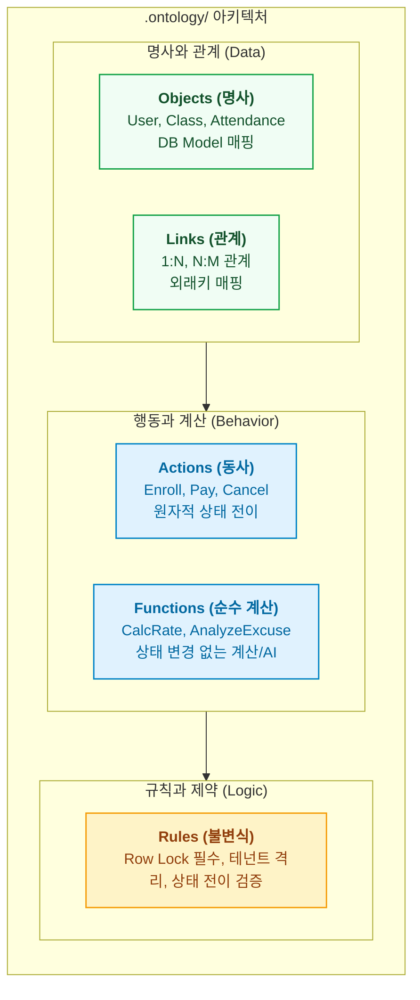

- table of contents
{:toc}

> 데이터베이스 ERD는 시스템의 명사(테이블)만 보여줄 뿐, 비즈니스가 어떻게 살아 숨 쉬는지(동사와 불변식)를 설명하지 못한다.
> 팔란티어(Palantir Foundry)의 핵심 프리미티브인 Objects, Links, Actions, Functions를 소프트웨어 저장소 규격으로 이식하고, 백엔드와 프론트엔드, 모바일 코드를 1:1로 결합해낸 아키텍처.
> 기억상실증에 걸린 AI 에이전트에게 `otlg trace` 단 한 방으로 0.01초 만에 풀스택 코드 경로와 사전 불변식을 주입하는 실전 메커니즘.
{:.lead}

---

## 1. 기억상실증 에이전트와 매일 아침의 냉기

AI 코딩 에이전트와 일해본 개발자라면 누구나 공감하는 뼈아픈 장면이 있다. 세션을 새로 열거나 워크트리를 띄울 때마다, 에이전트는 아무것도 기억하지 못하는 완전한 백지(Cold Start) 상태로 깨어난다.

*"이 프로젝트의 수납 취소 로직을 수정해 줘."*

이 한마디를 던지면 에이전트는 소스 트리를 뒤지며 수십 개의 파일을 열고 닫는다. `grep`을 치고, 모델 파일을 읽고, 라우터를 찾느라 세션 초반에만 수만 토큰을 날린다. 더 심각한 문제는 탐색 과정에서 지쳐버린 에이전트가 **비즈니스 불변식을 누락**한다는 점이다:
- "수납 취소 시 원천 결제 건의 행 잠금(`SELECT ... FOR UPDATE`)을 걸어야 한다"
- "학원 테넌트 격리(`tenant_id`) 제약을 먼저 검증해야 한다"
- "취소 상태는 `PENDING`에서만 전이될 수 있다"

이런 핵심 규칙을 에이전트가 놓치는 순간, 코드는 돌아가지만 프로덕션 DB에는 데이터 오염이라는 시한폭탄이 심긴다. 우리는 이 문제를 해결하기 위해 팔란티어의 온톨로지 구조체를 코드 레포지토리에 직접 이식하기로 결단했다. 그것이 바로 **`.ontology/` 표준 템플릿**과 전역 CLI **`otlg`**다.

---

## 2. 4대 프리미티브: 명사, 관계, 동사, 그리고 계산

우리는 코드베이스의 모든 지식을 팔란티어의 4대 프리미티브로 엄격히 분해하여 YAML 스펙으로 정의했다:



1. **Object Types (명사)**: 비즈니스 도메인 실체. DB 테이블과 1:1 매핑되지만, 기술적 컬럼 대신 비즈니스 속성을 노출한다.
2. **Link Types (관계)**: 객체 간의 의미론적 연결. 외래키 및 ORM 관계를 정의한다.
3. **Action Types (동사)**: 시스템 상태를 변경하는 유일한 관문. 입출력 파라미터, 선행조건, 대상 코드 경로를 선언한다.
4. **Function Types (계산/AI)**: 상태 변경이 없는 순수 비즈니스 계산 함수 및 도메인 전용 AI 연산 파이프라인.

---

## 3. 실전 명세 스펙: 에듀테크 SaaS 예시

실제 프로덕션 SaaS 프로젝트에 적용된 액션 스펙(`.ontology/actions/grade-submission.yml`)을 살펴보자:

```yaml
action: GradeSubmission
description: "강사가 학생의 과제 제출물을 채점하고 점수와 피드백을 기록한다"

target_object: AssignmentSubmission

parameters:
  submission_id:
    type: integer
    required: true
    description: "채점 대상 과제 제출 ID"
  score:
    type: float
    required: true
    minimum: 0.0
    maximum: 100.0
  feedback:
    type: string
    required: false

# 실행 전 기계가 반드시 검증해야 하는 선행 불변식
preconditions:
  - rule: "제출물의 상태가 SUBMITTED여야 한다"
    expression: "submission.status == 'SUBMITTED'"
  - rule: "채점 권한: 해당 강의를 담당하는 강사 본인이어야 한다"
    expression: "auth.user_id == course.instructor_id"
  - rule: "동시 채점 방지를 위한 행 잠금 필수"
    expression: "requires_row_lock(submission_id)"

# 다중 플랫폼 소스코드 1:1 바인딩
code_bindings:
  backend:
    api_endpoint: "POST /api/v1/assignments/submissions/{id}/grade"
    service_method: "backend.app.services.assignment:AssignmentService.grade"
    model_file: "backend.app.models.assignment:AssignmentSubmission"
  frontend:
    component: "frontend/src/features/assignment/ui/GradeModal.tsx"
    api_client: "frontend/src/shared/api/assignment.ts:gradeSubmission"
  mobile:
    screen: "mobile/lib/features/assignment/presentation/grade_screen.dart"
```

이 명세는 단순한 마크다운 문서가 아니다. 기계가 직접 파싱할 수 있는 엄격한 규격서다.

---

## 4. `otlg trace`: 0.01초 만에 뇌를 복원하는 기적

이제 세션이 새로 열린 백지상태 에이전트에게 장황한 프롬프트를 쏟아부을 필요가 없다. 

허브 에이전트는 스포크 에이전트의 워크트리를 띄운 뒤, 단 한 줄의 명령어를 실행하도록 지시한다:

```bash
$ otlg trace GradeSubmission
```

그러면 `otlg` CLI는 단 **0.01초** 만에 터미널에 다음과 같은 압축 지도를 쏟아낸다:

```text
[Action] GradeSubmission
Target: AssignmentSubmission (Table: assignment_submissions)

[Preconditions]
- submission.status == 'SUBMITTED'
- auth.user_id == course.instructor_id
- LOCK: requires_row_lock(submission_id) [CRITICAL]

[Full-Stack Code Bindings]
- Backend API : POST /api/v1/assignments/submissions/{id}/grade (router.py:42)
- Service     : AssignmentService.grade (assignment_service.py:118)
- DB Model    : AssignmentSubmission (assignment_model.py:15)
- Frontend UI : GradeModal.tsx (GradeModal.tsx:35)
- API Client  : gradeSubmission (assignment.ts:88)

[Related Objects & Links]
- Student (User) via student_id (1:N)
- Course via course_id (1:N)
```

에이전트는 수만 줄의 코드를 탐색할 필요가 없다. 
자신이 수정해야 할 백엔드 서비스의 정확한 파일 경로와 라인 번호, 프론트엔드 모달 컴포넌트, 그리고 **절대로 건드려서는 안 되는 선행조건(Row Lock, 상태 제약)**을 0.01초 만에 완벽하게 숙지하고 작업에 돌입한다.

---

## 5. 코드 드리프트 방어: `otlg lint --strict`

온톨로지 명세가 실제 소스 코드와 어긋나는(Drift) 순간, 온톨로지는 거짓말쟁이가 된다. 우리는 이를 막기 위해 정적 린터를 구축했다.

`otlg lint --strict` 명령은 다음을 기계적으로 전수 검사한다:
1. **심볼 실재성 검증**: 명세에 적힌 `AssignmentService.grade` 메서드가 실제 파이썬 소스 코드 파일 안에 존재하는가?
2. **엔드포인트 매핑 검증**: `POST /api/v1/assignments/...` 경로가 FastAPI 라우터에 실제로 등록되어 있는가?
3. **컴포넌트 경로 검증**: 프론트엔드와 모바일의 파일 경로가 실제 파일시스템에 존재하는가?

만약 개발자나 에이전트가 리팩터링을 하면서 메서드 이름을 바꾸거나 엔드포인트를 이동시켜 놓고 온톨로지를 갱신하지 않으면, CI 게이트와 로컬 린터가 즉각 빨간 불을 띄우며 커밋을 차단한다.

```bash
$ otlg lint --strict
ERROR: Symbol 'AssignmentService.grade' not found in backend/app/services/assignment_service.py
FAILED: 1 binding drift detected. Update .ontology/actions/grade-submission.yml
```

이 엄격한 정합성 검사 덕분에, 온톨로지는 코드가 변경되더라도 단 하루도 부패하지 않는 단일 진실 공급원(SSOT)으로 살아남는다.

---

## 6. 명세는 갖추어졌다, 이제 누가 집행하는가

이제 우리 손에는 완벽한 법전(Spec)이 쥐여졌다.
- 명사와 동사가 명확히 갈라졌고,
- 풀스택 소스코드가 1:1로 바인딩되었으며,
- 에이전트는 0.01초 만에 컨텍스트를 복원한다.

하지만 여기서 다시 가장 중요한 질문이 남는다.
**"온톨로지 자체가 코드를 실행하는가?"**
법전이 있다고 해서 법이 저절로 집행되지 않듯, 온톨로지 명세만으로는 코드가 안전하게 작성되거나 실행되지 않는다. 그렇다면 이 법전을 바탕으로 실제 코드를 집행하고 쓰기 환류(Write-back)를 완결 짓는 물리적 장치는 무엇인가?

---

### [시리즈의 다음 이야기]
다음 글인 **[[5편] 온톨로지는 헌법이고 에이전트는 집행관이다: AIP 액션 철학과 SDLC 하네스](/tag-ontology-engineering/5-aip-action-and-sdlc-harness/)**에서는, 팔란티어 AIP의 Tool Calling 철학을 소프트웨어 개발 라이프사이클에 이식하여, `spoke-guard` 훅과 TDD, Playwright 스냅샷이 결합하여 온톨로지 스펙을 안전하게 집행하는 런타임 하네스 체계를 해부합니다.
