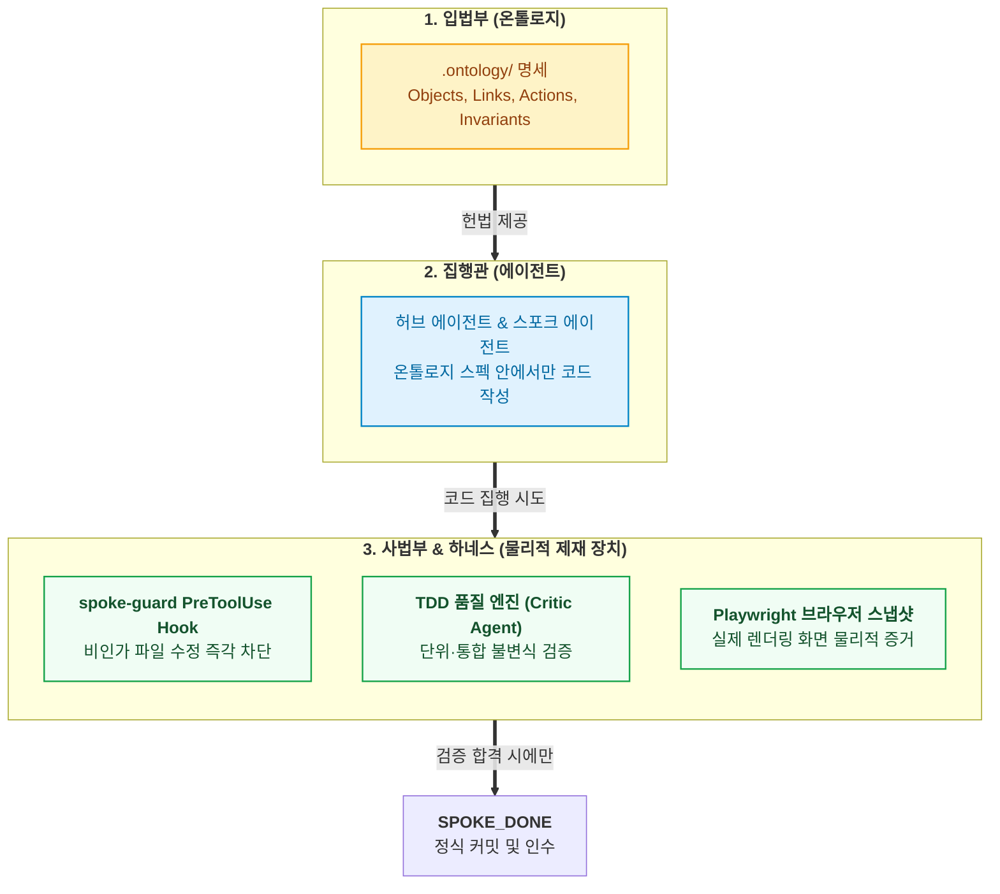

- table of contents
{:toc}

> "온톨로지는 엄격한 헌법(Spec)이고, AI 에이전트는 법률을 집행하는 집행관이며, 테스트 러너는 위헌 여부를 판정하는 사법부다."
> 팔란티어 AIP(Artificial Intelligence Platform)의 핵심 메커니즘을 소프트웨어 개발 라이프사이클(SDLC)에 이식한 실전 아키텍처.
> 에이전트에게 데이터베이스를 직접 주지 않고 Action을 Tool Calling으로 제한 노출하며, `spoke-guard` 훅과 TDD, Playwright 스냅샷으로 온톨로지 불변식을 물리적으로 강제하는 결합 구조.
{:.lead}

---

## 1. 헌법과 집행관: 엔지니어링의 분업

많은 이들이 온톨로지를 오해한다. 온톨로지 파일(`.ontology/`)만 작성해 두면, 시스템이 마법처럼 스스로 돌아갈 것이라 착각하는 것이다.

하지만 3편에서 밝혔듯, 냉정한 엔지니어링 현실에서 온톨로지는 코드를 직접 실행하는 마법의 엔진이 아니다. 온톨로지는 시스템의 객체와 상태 전이 규칙을 선언한 **'검증 가능한 접지 명세(Grounding Spec)'**이자 **'헌법(Constitution)'**이다.

법전이 책상 위에 놓여 있다고 해서 범죄가 저절로 예방되지 않는다. 법을 집행하는 경찰과 집행관이 있어야 하고, 법을 어겼을 때 물리적으로 손목에 수갑을 채우는 제재 장치가 있어야 한다.

소프트웨어 개발 라이프사이클(SDLC)에서 이 분업은 다음과 같이 명쾌하게 나뉜다:



- **온톨로지(입법부)**: 무엇이 합법적인 상태 전이이고, 어떤 불변식이 지켜져야 하는지 정의한다.
- **에이전트(행정부)**: 온톨로지가 허용한 좁은 가드레일 안에서 코드를 구현한다.
- **테스트 하네스와 훅(사법부)**: 에이전트의 자기보고를 불신하고, 기계적 종료코드와 브라우저 캡처 증거로 합법성을 판정한다.

---

## 2. AIP Tool Calling 철학의 이식: 에이전트에게 DB를 주지 마라

팔란티어 AIP가 엔터프라이즈에서 성공한 결정적 비결은, **LLM에게 로우 레벨 데이터베이스나 원천 파일시스템을 절대로 직접 건네지 않았다**는 점이다.

초보 개발자들은 AI 에이전트에게 DB 연결 정보를 넘겨주며 "알아서 SQL을 날려서 분석해"라고 지시한다. 이것은 총기 면허가 없는 사람에게 장전된 소총을 쥐여주는 것과 같다. 에이전트는 복잡한 락킹 규칙이나 권한을 고려하지 않고 임의의 `UPDATE`를 날려 시스템을 파괴한다.

팔란티어의 철학은 정반대다:
> **"LLM에게는 오직 온톨로지에 선언된 `Action Types`만을 함수 호출(Tool Calling) 인터페이스로 노출한다."**

우리 개발 하네스 역시 이 철학을 철저히 따른다. 
스포크 에이전트에게 "수납 취소 기능을 고쳐"라고 할 때, 에이전트에게 마음대로 스키마를 고칠 자유를 주지 않는다. 대신 `.ontology/actions/cancel-payment.yml`에 선언된 파라미터와 선행조건(Row Lock, 테넌트 검증)을 작업 지시서(Do & Don't)로 강제 주입한다.

에이전트는 백지를 헤매는 것이 아니라, 닫힌 형태의 액션 명세 안에서만 코드를 안전하게 집행한다.

---

## 3. 사법부의 3대 물리적 집행 장치

온톨로지 스펙을 에이전트가 현실 코드베이스에서 어기지 못하도록 강제하는 물리적 장치는 세 가지다.

### 1) 1차 방어선: 선제 Do & Don't 명세표
11편에서 다루었듯, 작업 시작 전 허브 에이전트가 스포크에게 온톨로지 바운더리를 명시한다.
- **Do**: `GradeSubmission` 액션에 명시된 서비스 메서드와 프론트 모달 컴포넌트만 수정할 것.
- **Don't**: 온톨로지에 정의되지 않은 공용 인증 미들웨어나 결제 모듈은 절대로 건드리지 말 것.

### 2) 2차 방어선: `spoke-guard` 셸 스크립트 훅
자연어 규칙은 샌다. 에이전트가 깜빡 잊고 공용 모듈을 편집하려 들면, 도구 호출 직전에 실행되는 `PreToolUse Hook`인 `spoke-guard`가 개입한다. 비인가 파일 경로를 수정하려는 시도가 감지되는 즉시 도구 호출은 거부되고 에러가 반환된다.

### 3) 3차 방어선: Playwright 브라우저 스냅샷 증거
4편에서 다루었듯, 백엔드 테스트가 전부 통과(`exit code 0`)했다고 해서 안심할 수 없다. 프론트엔드에서는 422 에러가 터지거나 하얀 빈 화면(Empty Screen)이 나올 수 있다.
우리는 에이전트가 종료 신호(`SPOKE_DONE`)를 생성하기 전, **실제 헤드리스 브라우저를 띄워 버튼을 클릭하고 조작한 뒤 결과 화면의 스크린샷 캡처를 물리적 증거 파일로 제출**하도록 강제했다.

---

## 4. 완결 파이프라인: 헌법이 지켜졌음을 입증하는 법

이 세 가지 장치가 결합하여, 에이전트는 비로소 하나의 완성된 라이프사이클을 통과한다:

```text
[1. 선제 기획 (Do & Don't)]
온톨로지 Action 스펙을 바탕으로 허브가 작업 스코프를 완전히 폐쇄

        │
        ▼
[2. TDD 구현 (spoke-guard)]
격리된 워크트리에서 spoke-guard 훅의 감시를 받으며 RED-GREEN-REFACTOR 사이클 완결

        │
        ▼
[3. 독립 검증 (Playwright QA)]
에이전트 자기보고 불신, 실제 브라우저 조작 스냅샷 증거 생성

        │
        ▼
[4. 위키 자동화 (Living Wiki)]
otlg lint 통과 + 기능 카탈로그 갱신 + 부채 라우팅 + WORKLOG 기록

        │
        ▼
[5. 완료 센티넬 (SPOKE_DONE)]
허브가 센티넬 파일과 커밋 존재를 확인하고 안전하게 머지 인수
```

온톨로지라는 헌법이 존재하고, 물리적 하네스라는 사법부가 엄격히 작동할 때, 1인 개발자는 수십 명의 병렬 에이전트를 마음 놓고 풀어놓을 수 있다. 

하지만 여기서 한 걸음 더 나아가야 한다. 에이전트들이 1시간 만에 서너 개의 기능 슬라이스를 쳐낼 때, 그 변경 사항을 문서에 반영하고 운영 대장을 갱신하는 일은 어떻게 자동화할 것인가?

---

### [시리즈의 다음 이야기]
다음 글인 **[[6편] 문서는 스스로 숨 쉰다: Living Wiki Engine과 메타데이터 저널링](/tag-ontology-engineering/6-living-wiki-and-metadata-journaling/)**에서는, 코드가 갱신되는 순간 저장소 거버넌스 문서들이 마치 리눅스 저널링 파일시스템(ext4)처럼 스스로 갱신되는 '자가 갱신형 거버넌스(Living Wiki Engine)'의 실체를 공개합니다.
