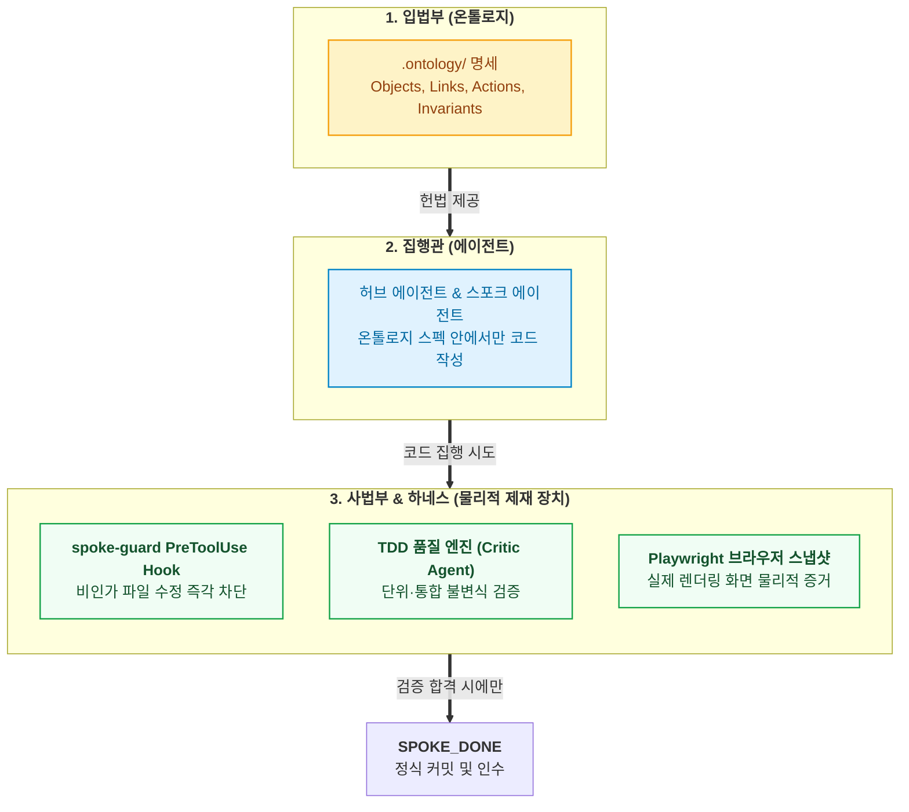

- table of contents
{:toc}

> "온톨로지는 엄격한 헌법(Spec)이고, AI 에이전트는 법률을 집행하는 집행관이며, 테스트 러너는 위헌 여부를 판정하는 사법부다."
> 팔란티어 AIP(Artificial Intelligence Platform)의 핵심 메커니즘을 소프트웨어 개발 라이프사이클(SDLC)에 이식한 실전 아키텍처.
> 에이전트에게 데이터베이스를 직접 주지 않고 Action을 Tool Calling으로 제한 노출하며, `spoke-guard` 훅과 TDD, Playwright 스냅샷으로 온톨로지 불변식을 물리적으로 강제하는 결합 구조 뼈대.
{:.lead}

---

## 1. 헌법과 집행관: 엔지니어링의 3권 분립

- **[온톨로지에 대한 흔한 환상과 실체]**
  - 환상: 온톨로지 파일(`.ontology/`)만 잘 써두면 시스템이 마법처럼 스스로 무결해질 것이라는 착각.
  - 실체: 온톨로지는 런타임에 직접 코드를 실행하는 주체가 아니라, 합법적인 상태 전이와 규칙을 선언한 **'헌법(Constitution)'**이자 **'검증 가능한 접지 명세(Grounding Spec)'**.
- **[엔지니어링 3권 분립 모델]**
  - **1) 입법부 (온톨로지)**: 도메인의 합법적인 객체, 관계, 동사, 그리고 결코 깨져서는 안 되는 불변식 선언.
  - **2) 행정부 / 집행관 (에이전트)**: 온톨로지가 허용한 좁은 경계 안에서만 코드를 작성하고 수정하는 실행 주체.
  - **3) 사법부 (테스트 하네스와 훅)**: 에이전트의 자기보고("다 고쳤습니다")를 절대 불신하고, 기계적 종료코드와 물리적 증거로 합법성을 심판하는 제재 장치.

---

## 2. AIP Tool Calling 철학의 이식: "에이전트에게 DB를 주지 마라"

- **[초보적 실수의 비유]**
  - 초보 엔지니어는 AI에게 DB 접속 정보를 넘기며 "알아서 SQL을 날려라"고 지시함.
  - 비유: 총기 면허가 없는 사람에게 장전된 소총을 쥐여주는 꼴. 복잡한 행 잠금이나 테넌트 격리를 무시하고 임의 업데이트를 날려 프로덕션 DB를 파괴함.
- **[팔란티어 AIP의 핵심 철학]**
  - "LLM에게는 오직 온톨로지에 엄격히 선언된 `Action Types`만을 도구 호출(Tool Calling) 인터페이스로 노출한다."
- **[SDLC 하네스 적용: 닫힌 형태의 작업 지시]**
  - 스포크 에이전트에게 자유자재로 코드를 고칠 권한을 주지 않음.
  - `.ontology/actions/`에 선언된 파라미터와 선행조건(Row Lock, 권한 검증)을 바탕으로 작업 경계를 완벽히 폐쇄한 선제 Do & Don't 주입.
  - 에이전트는 백지를 방황하지 않고, 온톨로지가 허락한 닫힌 액션 스펙 안에서만 코드를 안전하게 집행.

---

## 3. 사법부의 3대 물리적 집행 장치

- **1) 1차 방어선: 선제 Do & Don't 명세표**
  - 작업 시작 전 허브가 스포크에게 온톨로지 바운더리를 명시.
  - Do: 대상 액션(`GradeSubmission`)에 바인딩된 서비스 메서드와 UI 모달만 수정할 것.
  - Don't: 온톨로지에 정의되지 않은 공용 인증 미들웨어나 결제 모듈은 절대로 건드리지 말 것.
- **2) 2차 방어선: `spoke-guard` 셸 스크립트 훅**
  - "자연어 프롬프트 규칙은 반드시 샌다. 훅(Hook)은 새지 않는다."
  - 도구 호출 직전에 실행되는 `PreToolUse Hook`을 배치.
  - 에이전트가 깜빡 잊고 공용 모듈을 수정하려는 순간 도구 실행을 즉각 거부하고 에러를 뿜어냄.
- **3) 3차 방어선: Playwright 브라우저 스냅샷 증거**
  - 백엔드 테스트 통과(`11 passed`)에 속지 마라. 프론트엔드에서는 422 충돌이나 하얀 빈 화면(Empty Screen)이 나올 수 있음.
  - 에이전트가 완료 신호(`SPOKE_DONE`)를 남기기 전, 실제 헤드리스 브라우저를 띄워 UI를 조작하고 스크린샷 캡처를 물리적 증거 파일로 제출하도록 강제.

---

## 4. 완결 파이프라인: 헌법이 지켜졌음을 입증하는 5단계 라이프사이클

- **[1단계: 선제 기획 (Do & Don't)]**
  - 온톨로지 Action 스펙을 바탕으로 작업 스코프를 완전히 폐쇄.
- **[2단계: TDD 구현 (spoke-guard)]**
  - 격리된 Git 워크트리에서 spoke-guard 훅의 감시를 받으며 RED-GREEN-REFACTOR 사이클 완결.
- **[3단계: 독립 검증 (Playwright QA)]**
  - 에이전트 자기보고 불신, 실제 브라우저 조작 스냅샷 증거 생성.
- **[4단계: 위키 자동화 (Living Wiki)]**
  - `otlg lint --strict` 통과 + `docs/features/` 카탈로그 갱신 + 부채 라우팅 + WORKLOG 세션 판단 기록.
- **[5단계: 완료 센티넬 (SPOKE_DONE)]**
  - 모든 관문이 통과되었을 때만 센티넬 파일을 남기고, 허브가 이를 확인하여 안전하게 머지 인수.

---

## 5. 남겨진 과제: 코드가 바뀔 때 문서는 어떻게 동기화되는가

- **[개발 속도와 문서 부패의 모순]**
  - 1인 개발자가 병렬 에이전트를 가동해 하루에도 수십 개의 커밋과 기능 슬라이스를 쳐낼 때, 이를 설명하는 문서는 순식간에 과거의 유물이 됨.
- **[6편 예고]**
  - 코드가 갱신되는 순간 저장소 거버넌스 문서들이 마치 리눅스 저널링 파일시스템(ext4)처럼 스스로 갱신되는 '자가 갱신형 거버넌스(Living Wiki Engine)'의 실체를 공개합니다.

---

### [시리즈의 다음 이야기]
다음 글인 **[[6편] 문서는 스스로 숨 쉰다: Living Wiki Engine과 메타데이터 저널링](/tag-ontology-engineering/6-living-wiki-and-metadata-journaling/)**에서는, 코드가 갱신되는 순간 저장소 거버넌스 문서들이 마치 리눅스 저널링 파일시스템(ext4)처럼 스스로 갱신되는 '자가 갱신형 거버넌스(Living Wiki Engine)'의 실체를 공개합니다.

