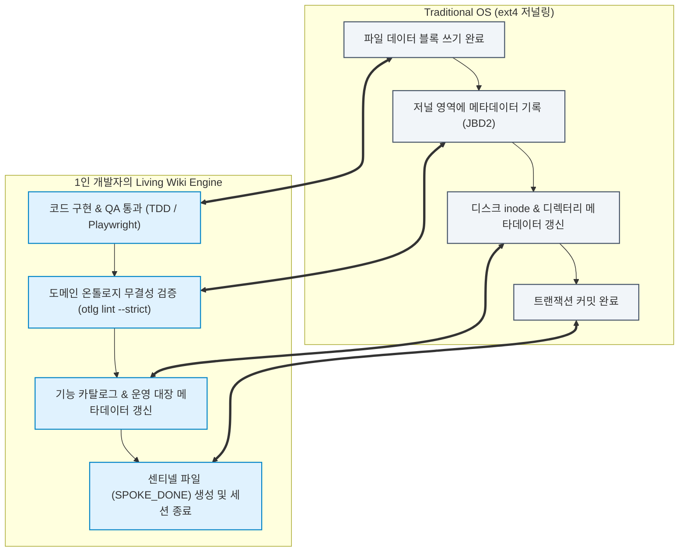
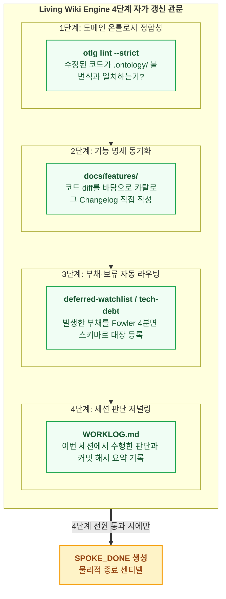

- table of contents
{:toc}

> "코드는 기계가 초당 수십 줄씩 찍어내는데, 그 뒤치다꺼리를 하느라 인간 테크 리드가 문서와 씨름하고 있다면 그것은 진정한 자동화가 아니다."
> 병렬 에이전트 생산성 폭발이 불러온 '문서화 동기화 피로'의 역설.
> 리눅스 커널의 저널링 파일시스템(ext4) 메커니즘을 저장소 거버넌스에 이식하여, 에이전트 작업 종료 직전 스스로 기능 카탈로그와 운영 대장을 갱신하고 완결 짓는 'Living Wiki Engine' 실전 구축 뼈대.
{:.lead}

---

## 1. 생산성의 역설: "코드는 기계가 짜고 뒷감당은 사람이 한다?"

- **[원천 배경: 다중 에이전트 병렬 생산성 폭발]**
  - 격리된 Git 워크트리에서 스포크 에이전트들이 1시간 만에 서너 개의 기능 슬라이스를 완결.
  - 2주 만에 475개의 검증된 원자적 커밋이 쏟아져 나오는 폭발적 산출량.
- **[테크 리드 1인 개발자의 병목과 피로]**
  - 코드가 바뀌는 속도를 인간의 문서화가 따라가지 못하는 역전 현상:
    1. `docs/features/` 아래 기능 카탈로그에 수정된 API 엔드포인트와 컴포넌트 바인딩, Changelog를 일일이 적어야 함.
    2. 개발 도중 발생한 타협점이나 미해결 이슈를 `deferred-watchlist.md`와 `tech-debt.md`에 분류 등록해야 함.
    3. 세션에서 내린 의사결정의 맥락을 `WORKLOG.md`에 기록해야 함.
- **[서술 포인트 / 말맛 가이드]**
  - "코드는 기계가 찍어내는데 뒷감당은 사람이 손으로 복사하고 싱크 맞추느라 지쳐 쓰러지는 참사."
  - 이 문서화 피로를 시스템으로 해결하지 못하면, 다중 에이전트 체계는 결국 문서의 불일치와 지식의 부패로 인해 자멸할 수밖에 없음을 고백.

---

## 2. 돌파구: 공식 라이프사이클 관문으로서의 위키 (우주초월 워크플로우의 충격)

- **[원천 계기: 유튜브 '우주초월' 실전 발표]**
  - 우주초월님의 회사 발표에서 발견한 패러다임 전환:
    > *"위키 갱신은 개발이 끝난 뒤 사람이 시간 날 때 쓰는 부가 작업이 아니라, 에이전트가 작업을 마치고 퇴장하기 전 반드시 거쳐야 하는 공식 생명주기(Lifecycle)의 마지막 관문이다."*
- **[온톨로지와 운영 대장의 결합]**
  - 우주초월식 라이프사이클 관문 + 팔란티어 온톨로지 명세 + 저장소 운영 대장 4종(`WORKLOG`, `deferred-watchlist`, `tech-debt`, `ADR`) 결합.
  - 에이전트 스스로 문서를 최신 상태로 되돌려놓고 퇴장하는 **자가 갱신형 거버넌스(Living Wiki Engine)** 구상.

---

## 3. 리눅스 커널의 메타데이터 저널링과 Living Wiki

- **[개념 유추: OS 저널링 파일시스템(ext4)과의 1:1 대응]**
  - 전통 OS (ext4 저널링):
    1. 파일 데이터 블록 쓰기 완료
    2. 저널 영역에 메타데이터 기록 (JBD2)
    3. 디스크 inode & 디렉터리 메타데이터 갱신
    4. 트랜잭션 커밋 완료
  - 에이전트 OS (Living Wiki Engine):
    1. 코드 구현 & QA 통과 (TDD / Playwright)
    2. 도메인 온톨로지 무결성 검증 (`otlg lint --strict`)
    3. 기능 카탈로그 & 운영 대장 메타데이터 갱신
    4. 센티넬 파일(`SPOKE_DONE`) 생성 및 세션 종료
- **[핵심 원리]**
  - 리눅스 커널이 파일 쓰기 트랜잭션을 마칠 때 inode를 백그라운드에서 자동 갱신하듯, 에이전트 OS 역시 작업이 끝나는 순간 거버넌스 메타데이터를 트랜잭션 단위로 스스로 갱신한다.

---

## 4. `SPOKE_DONE` 직전의 4단계 자가 갱신 관문

- **[스포크 에이전트 퇴장 직전 강제되는 4단계 루프]**
  1. **1단계: 도메인 온톨로지 무결성 검증 (`otlg lint --strict`)**
     - 자신이 수정한 코드가 `.ontology/`에 선언된 객체, 불변식, 액션 경로와 일치하는지 정적 린터로 검증. 드리프트 발견 시 반려.
  2. **2단계: 기능 카탈로그 자동 갱신 (`docs/features/`)**
     - 자신이 수정한 코드 diff와 사양을 바탕으로, 해당 기능 문서의 구현 상태, 엔드포인트/컴포넌트 바인딩, Changelog를 에이전트가 직접 갱신.
  3. **3단계: 부채와 보류 사항의 자동 라우팅 (`deferred-watchlist`, `tech-debt`)**
     - 구현 과정에서 불가피하게 발생한 타협점이나 미해결 이슈를 정해진 스키마(F-식별자, Fowler 4분면 분류, 상환 트리거)에 맞춰 대장에 스스로 등록.
  4. **4단계: 세션 저널링 (`WORKLOG.md`)**
     - 이번 세션에서 수행한 판단과 커밋 해시 요약을 저널에 기록한 뒤에야 비로소 센티넬 파일(`SPOKE_DONE`)을 남기고 퇴장.

---

## 5. 결과: 단 1초의 설명 없이 최신 뇌를 물려받는다

- **[영구 거버넌스 엔진의 완성]**
  - 인간이 일일이 문서를 복사하고 싱크를 맞출 필요가 완전히 소멸.
  - 저장소는 에이전트의 호흡과 함께 스스로 갱신되는 **살아 숨 쉬는 위키(Living Wiki)**가 됨.
- **[온보딩 비용 제로]**
  - 다음에 새로 투입되는 에이전트는, 인간의 단 1초의 설명 없이도 가장 완벽한 최신 상태의 뇌(온톨로지와 카탈로그)를 물려받고 즉시 작업 착수.
  - 2편의 개인 지식 온톨로지와 4편의 코드 도메인 온톨로지가 실전 개발 하네스와 만나 스스로 숨 쉬는 영구 기관으로 완성됨.

---

### [시리즈의 다음 이야기]
마지막 글인 **[[7편] 마치며: 전사 운영체제와 조직 저항, 그리고 1인 개발자의 미래](/tag-ontology-engineering/7-enterprise-os-and-solo-developer/)**에서는, 엑셀의 사일로를 부수며 전사 운영체제를 세우려 했던 팔란티어의 조직 저항 극복기와, 1인 개발자가 이 철학을 통해 시스템 주권을 쟁취해낸 의미를 돌아보며 시리즈의 대단원을 맺습니다.

