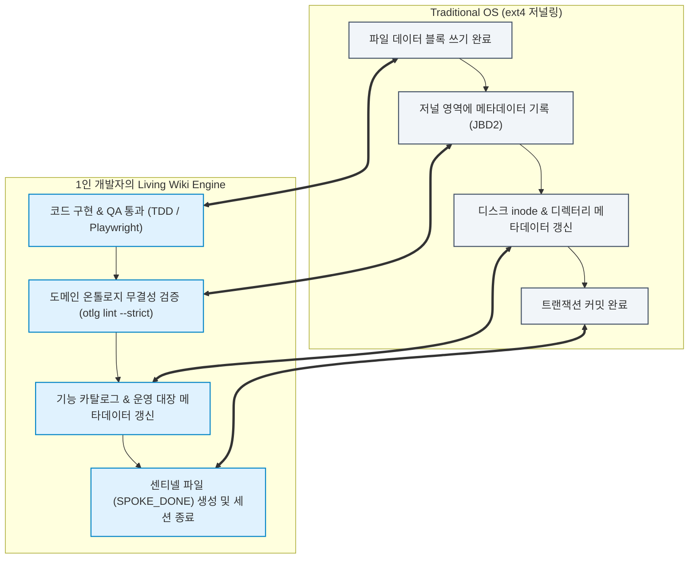
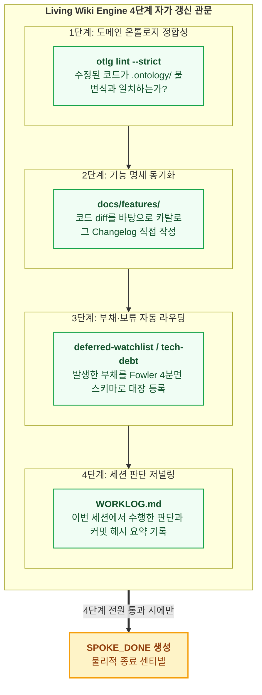

- table of contents
{:toc}

> "코드는 기계가 초당 수십 줄씩 찍어내는데, 그 뒤치다꺼리를 하느라 인간 테크 리드가 문서와 씨름하고 있다면 그것은 진정한 자동화가 아니다."
> 병렬 에이전트 생산성 폭발이 불러온 '문서화 동기화 피로'의 역설.
> 리눅스 커널의 저널링 파일시스템(ext4) 메커니즘을 저장소 거버넌스에 이식하여, 에이전트 작업 종료 직전 스스로 기능 카탈로그와 운영 대장을 갱신하고 완결 짓는 'Living Wiki Engine' 실전 구축기.
{:.lead}

---

## 1. 생산성의 역설: 코드는 기계가 짜고 뒷감당은 사람이 한다?

AI 에이전트 협업 체계가 고도화되면서 놀라운 생산성 향상이 일어났다. 독립된 워크트리에서 격리된 스포크 에이전트들은 1시간 만에 서너 개의 기능 슬라이스를 거뜬히 쳐냈다. 2주 만에 475개의 검증된 원자적 커밋이 쏟아져 나왔다.

하지만 바로 그 순간, 테크 리드이자 1인 개발자인 나에게 극심한 **문서화 동기화 병목**이 찾아왔다.

코드가 바뀌면 다음의 일들을 처리해야 했다:
1. `docs/features/` 아래의 기능 카탈로그에 수정된 API 엔드포인트와 컴포넌트 바인딩, 그리고 변경 이력(Changelog)을 일일이 적어야 했다.
2. 개발 도중 발생한 타협점이나 미해결 이슈를 `deferred-watchlist.md`와 `tech-debt.md`에 분류하여 등록해야 했다.
3. 세션에서 내린 의사결정의 맥락을 `WORKLOG.md`에 요약해야 했다.

에이전트의 속도가 빨라질수록, 인간이 문서를 복사하고 싱크를 맞추는 비용도 비례해서 폭발했다. **"코드는 기계가 짰는데 뒷감당은 사람이 하는 역전 현상"**이었다. 이 문서화 피로를 해결하지 못하면, 다중 에이전트 체계는 결국 문서의 불일치와 지식의 부패로 인해 스스로 무너질 수밖에 없었다.

---

## 2. 돌파구: 공식 라이프사이클 관문으로서의 위키

이 병목을 깰 수 있었던 결정적 계기는 유튜브 '우주초월'님의 실전 에이전트 워크플로우를 접했을 때였다. 우주초월님의 파이프라인에서 **'위키'는 개발이 끝난 뒤 사람이 시간 날 때 쓰는 부가 작업이 아니었다.**

> **"위키 갱신은 에이전트가 작업을 마치고 퇴장하기 전 반드시 거쳐야 하는 공식 생명주기(Lifecycle)의 마지막 관문이다."**

우리는 이 관문에 팔란티어 온톨로지 철학과 저장소 운영 대장 4종(`WORKLOG`, `deferred-watchlist`, `tech-debt`, `ADR`)을 결합했다. 

그 결과 탄생한 것이 바로 **자가 갱신형 거버넌스(Living Wiki Engine)**다.

---

## 3. 리눅스 커널의 메타데이터 저널링과 Living Wiki

이 구조는 전통적인 운영체제(OS)의 **저널링 파일시스템(Journaling File System, ext4)**과 완벽히 대응한다:

리눅스 커널이 파일 본문을 디스크에 쓴 직후 백그라운드에서 트랜잭션 단위로 inode와 디렉터리 메타데이터를 자동 갱신하듯, 에이전트 운영체제 역시 코드가 통과된 순간 저장소의 거버넌스 메타데이터를 스스로 갱신하고 트랜잭션을 완결 짓는 것이다.

---

## 4. `SPOKE_DONE` 직전의 4단계 자가 갱신 관문

스포크 에이전트가 TDD와 Playwright 브라우저 검증을 마치고 종료 신호(`SPOKE_DONE`)를 생성하기 직전, 시스템은 다음 네 단계를 에이전트 스스로 완결 짓도록 강제한다:

### 1) 도메인 온톨로지 무결성 검증 (`otlg lint --strict`)
자신이 수정한 코드가 `.ontology/`에 선언된 객체, 불변식, 액션 경로와 정확히 일치하는지 정적 린터로 검증한다. 드리프트가 발견되면 즉시 반려된다.

### 2) 기능 카탈로그 자동 갱신 (`docs/features/`)
자신이 수정한 코드 diff와 사양을 바탕으로, 해당 기능 문서의 구현 상태, 엔드포인트/컴포넌트 바인딩, 그리고 변경 이력(Changelog)을 에이전트가 직접 갱신한다.

### 3) 부채와 보류 사항의 자동 라우팅 (`deferred-watchlist`, `tech-debt`)
구현 과정에서 불가피하게 발생한 타협점이나 즉시 풀지 않은 이슈를 정해진 스키마(F-식별자, Fowler 4분면 분류, 상환 트리거)에 맞춰 대장에 스스로 등록한다.

### 4) 세션 저널링 (`WORKLOG.md`)
이번 세션에서 수행한 아키텍처 판단과 커밋 해시 요약을 저널에 기록한 뒤에야 비로소 센티넬 파일(`SPOKE_DONE`)을 남기고 세션을 종료한다.

---

## 5. 결과: 단 1초의 설명 없이 최신 뇌를 물려받는다

인간이 일일이 문서를 복사하고 싱크를 맞출 필요가 완전히 사라졌다.

저장소는 에이전트의 호흡과 함께 스스로 갱신되는 **살아 숨 쉬는 위키(Living Wiki)**가 되었다. 그리고 다음에 새로 투입되는 에이전트는, 인간의 단 1초의 설명 없이도 가장 완벽한 최신 상태의 뇌를 온톨로지와 카탈로그로부터 물려받는다.

2편의 개인 지식 온톨로지와 4편의 코드 도메인 온톨로지가, 실전 개발 하네스와 만나 스스로 숨 쉬는 영구 기관으로 완성된 순간이었다.

---

### [시리즈의 다음 이야기]
마지막 글인 **[[7편] 마치며: 전사 운영체제와 조직 저항, 그리고 1인 개발자의 미래](/tech/7-enterprise-os-and-solo-developer/)**에서는, 엑셀의 사일로를 부수며 전사 운영체제를 세우려 했던 팔란티어의 조직 저항 극복기와, 1인 개발자가 이 철학을 통해 시스템 주권을 쟁취해낸 의미를 돌아보며 시리즈의 대단원을 맺습니다.
