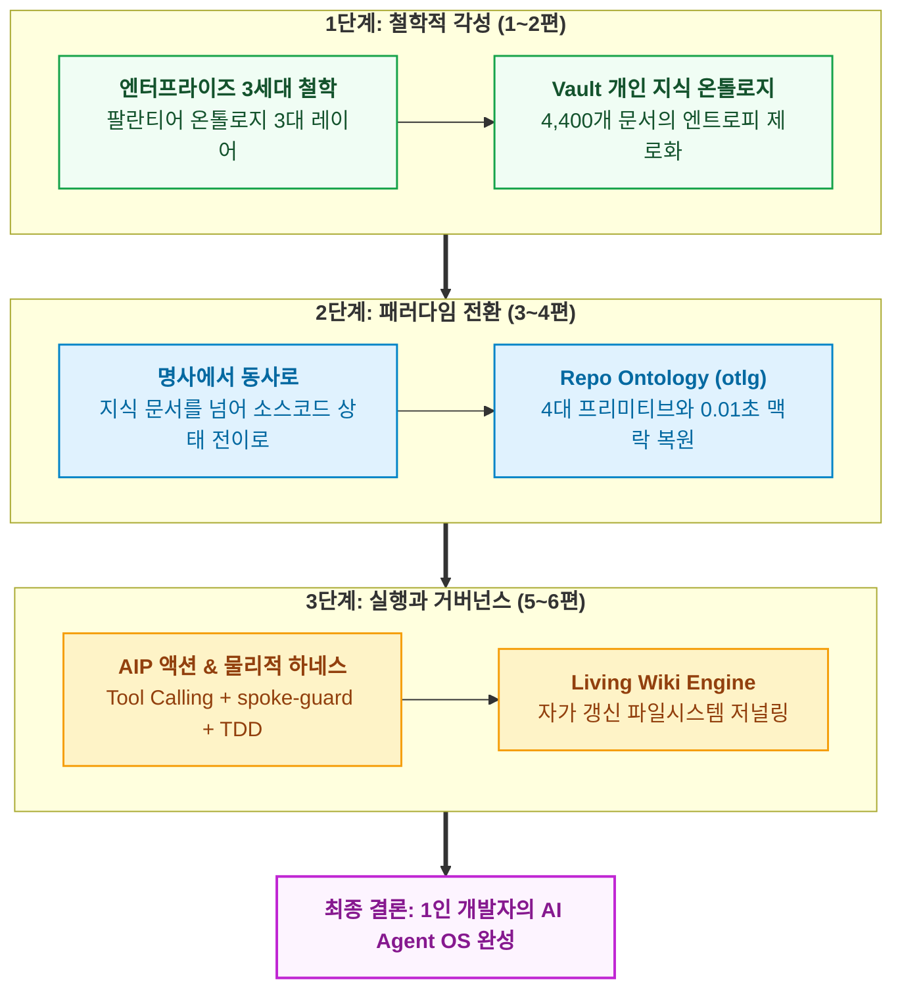

- table of contents
{:toc}

> "팔란티어 도입의 진짜 장벽은 기술의 부족이 아니었습니다. 자신의 엑셀 파일에 쥐고 있던 데이터 권력을 빼앗기지 않으려는 조직의 정치와 저항이었습니다."
> 거대 기업들이 데이터 사일로(Silo)를 부수며 전사 운영체제를 세우려 했던 치열한 투쟁.
> 그리고 1인 개발자가 개인 지식(Vault)과 저장소(Repo)에 온톨로지를 구축하여 스스로 시스템 주권을 쟁취해낸 여정의 완결 뼈대.
{:.lead}

---

## 1. 팔란티어는 왜 기술 회사가 아니라 '조직 변화의 회사'인가

- **[원천 증언: 변우철 본부장(KT 피테크 본부장)의 회고]**
  - 두산인프라코어, DL E&C 등 국내 굴지의 대기업에서 팔란티어 도입을 총괄했던 당시의 생생한 증언:
    > *"팔란티어를 전사에 도입할 때 가장 힘들었던 것은 데이터 정제나 파이프라인 개발이 아니었습니다. **'왜 내 데이터를 저 시스템에 다 넘겨야 하느냐'**라며 저항하는 각 부서장들과 실무자들의 반발이었습니다."*
- **[데이터 사일로와 조직 권력의 실체]**
  - 엔터프라이즈에서 데이터는 단순한 숫자가 아니라 부서의 **권력(Power)**이다.
    - 생산 부서는 자신들만의 엑셀 시트에 공장 가동률과 불량률을 숨김.
    - 영업 부서는 자신들만의 로컬 파일에 수주 잔고와 할인율을 감춤.
    - 회의 때마다 각자에게 유리한 숫자를 엑셀에서 뽑아와 정치를 벌임.
  - 팔란티어가 온톨로지를 통해 부수려 했던 것은 단순한 DB 파편화가 아니라 바로 이 **사일로(Silo)**였다.
  - 전사의 데이터를 단일한 비즈니스 객체(Objects)와 불변식(Logic)으로 통합하여, 전사 임직원과 AI가 단 하나의 투명한 진실 공급원(SSOT)을 바라보게 만드는 일.
- **[서술 포인트 / 말맛 가이드]**
  - 온톨로지는 단순한 데이터베이스 기술이 아니라, 조직의 일하는 방식과 권력 구조를 송두리째 재편하는 **전사 운영체제(Enterprise OS)**라는 점을 명쾌하게 강조.

---

## 2. 1인 개발자와 내면의 저항: 시스템에 주권을 넘기다

- **[1인 개발자의 거울: 내면의 저항]**
  - 1인 개발자에게는 싸워야 할 부서장이나 사내 정치는 없다.
  - 하지만 그보다 더 무서운 적: **"나 자신의 나태함과 순간적인 타협"**이라는 내면의 저항.
    - "이번 작업은 급하니까 스키마 검증 없이 대충 노트에 적어두자."
    - "이 버그는 간단하니까 온톨로지 액션 스펙 수정 없이 코드만 고쳐서 넘기자."
    - "테스트 스위트가 길어지니 일단 머지하고 나중에 정리하자."
  - 이 안일한 타협이 반복될 때마다, 1인 개발자의 시스템도 대기업의 파편화된 엑셀 시트처럼 썩어 들어갔다.
- **[시스템으로의 주권 이양]**
  - 내가 Vault에 `vault new`라는 거부 게이트를 세우고, Repo에 `otlg lint --strict`와 `spoke-guard` 훅이라는 사법부를 세운 진짜 이유:
    **"인간의 변덕스러운 의지력을 믿지 않았기 때문."**
  - 데이터와 규칙의 주권을 '인간 개인의 기억'에서 '기계적으로 강제되는 시스템(온톨로지)'으로 온전히 넘겨주는 것. 그것이 바로 1인 개발자가 수십만 줄의 코드베이스와 수천 개의 지식을 혼자서 온전히 방어할 수 있었던 유일한 생존 전략이었다.

---

## 3. 온톨로지 엔지니어링의 완결: 지식 그래프에서 AI Agent OS로

- **[시리즈 전체 3단계 진화의 조망]**
  1. **1단계: 철학적 각성과 지식의 척추 (1~2편)**
     - 엔터프라이즈 3세대 철학과 팔란티어 온톨로지 3대 레이어.
     - Vault 개인 지식 온톨로지: 13개 스키마와 2계층 관계망으로 4,400개 문서의 엔트로피 제로화.
  2. **2단계: 패러다임 전환과 코드의 척추 (3~4편)**
     - 명사(Taxonomy)에서 동사(Action)로의 극적인 도약.
     - Repo Ontology (otlg): 4대 프리미티브(Objects, Links, Actions, Functions)와 AST 심볼 바인딩으로 기억상실증 에이전트에게 0.01초 만에 풀스택 맥락 복원.
  3. **3단계: 실행과 거버넌스의 척추 (5~6편)**
     - 온톨로지는 헌법이고 에이전트는 집행관이다: AIP Tool Calling과 `spoke-guard` 훅, TDD, Playwright 브라우저 스냅샷의 물리적 가드레일.
     - Living Wiki Engine: 리눅스 커널 저널링 파일시스템처럼 작업 완료 시 거버넌스 문서를 자가 갱신하는 영구 기관.

- **[완성된 체계의 힘]**
  - 이 세 가지 척추가 결합할 때, 우리는 더 이상 AI의 환각에 휘둘리지 않는다.
  - 에이전트는 온톨로지라는 단단한 활주로 위에서 최고 속도로 질주하며, 인간은 사소한 뒤치다꺼리에서 벗어나 더 높은 차원의 아키텍처와 제품 가치에 집중할 수 있게 된다.

---

## 4. 에필로그: 곱연산의 시대, 이론이 도구를 이끈다

- **[우주초월 발표의 곱연산 공식 회고]**
  - "개인 역량 x AI 활용 능력 = 시너지".
- **[이론과 아키텍처 무용론에 대한 반박]**
  - 세상은 "프롬프트만 잘 치면 AI가 다 짜주는데 객체지향이나 온톨로지가 왜 필요한가?"라고 묻는다.
  - 하지만 지난 실전의 진실:
    - 객체지향 설계 이론(CQS, 값 객체, 경계 정합성)을 아는 엔지니어만이 에이전트에게 흔들리지 않는 가드레일을 쥐여줄 수 있었고,
    - 데이터 플랫폼의 역사와 온톨로지 철학을 깊이 이해한 엔지니어만이 에이전트의 코드 파괴를 막는 도메인 하네스를 설계할 수 있었다.
- **[마지막 결론]**
  - **온톨로지는 유행을 타는 특정 벤더의 도구가 아니다. 복잡성과 망각에 맞서 시스템의 영속성을 지켜내려는 엔지니어의 가장 깊은 사유이자 세계관이다.**
  - 우리는 각자의 컴퓨터 안에서 이미 자신만의 작은 운영체제를 짜고 있었다.
  - 그리고 그 운영체제의 가장 깊은 곳에는, 흔들리지 않는 척추로서 온톨로지가 조용히 숨 쉬고 있을 것이다.

