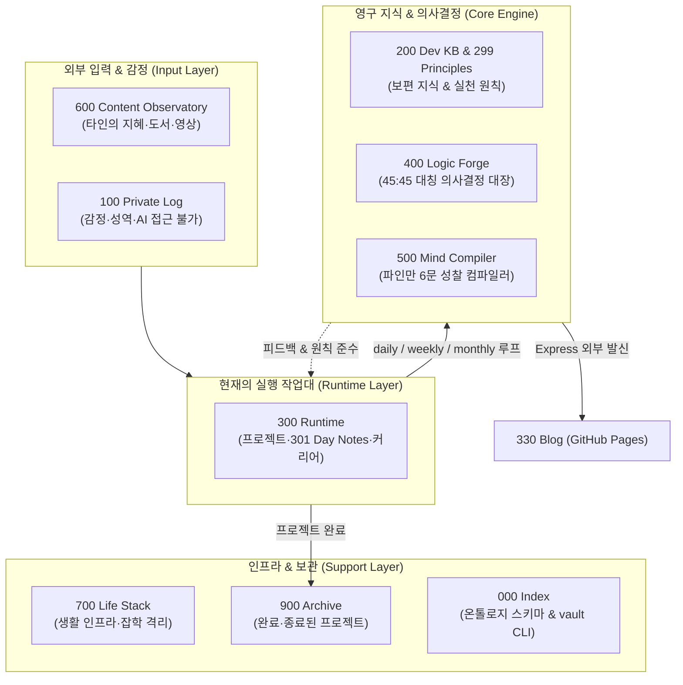

- table of contents
{:toc}

> "세상의 모든 도서관은 책을 보관하기 위해서가 아니라, 읽히기 위해 존재한다. 책을 쌓아두기만 하는 서고는 도서관이 아니라 지식의 묘지다."
> 에버노트의 무제한 스크랩에서 노션의 화려한 데이터베이스, 그리고 옵시디언의 제텔카스텐 미로를 거쳐 6,000개 노트의 파탄을 마주하기까지.
> 티아고 포르테의 《세컨드 브레인》이 던진 '정제(Distill)와 공유(Express)'의 충격을 흡수하고, 마크다운 텍스트를 실행형 운영체제로 탈바꿈시킨 1인 개발자의 지식 체계 진화기.
{:.lead}

---

## 1. 수집가의 무덤: 에버노트, 노션, 그리고 옵시디언

컴퓨터를 전공하지 않은 상태에서 개발의 세계에 뛰어들었을 때, 나를 지배했던 가장 큰 감정은 막막함과 불안이었다. 쏟아지는 새로운 기술, 프레임워크의 업데이트, 아키텍처 패턴, 복잡한 인프라 설정까지 머릿속에 담아야 할 지식은 끝이 없었다. 망각이 두려웠던 나는 닥치는 대로 기록하기 시작했다.

처음에는 **에버노트(Evernote)**였다. 웹 클리퍼로 인터넷의 좋은 기술 아티클을 클릭 한 번으로 통째로 긁어모았다. 태그를 덕지덕지 붙이고 폴더를 만들었다. 스크랩이 수천 개를 넘어가자 에버노트는 무거워졌고, 정작 버그가 터졌을 때 내가 스크랩해 둔 글을 검색하면 수십 개의 복사본 속에서 필요한 답을 찾는 데 더 많은 시간이 걸렸다.

다음은 **노션(Notion)**이었다. 깔끔한 UI와 관계형 데이터베이스 기능은 신세계처럼 보였다. '학습 대시보드', '프로젝트 인벤토리', '도서 DB'를 만들고 알록달록한 속성을 부여했다. 하지만 시스템을 가꾸는 재미에 빠져 정작 공부나 개발보다 노션 템플릿을 꾸미는 데 더 많은 시간을 쏟는 자신을 발견했다. 게다가 모든 데이터가 노션의 클라우드 서버에 갇혀 있었고, 오프라인에서는 열리지도 않았으며, 파이썬이나 쉘 스크립트로 내 데이터를 자유롭게 가공할 수도 없었다.

결국 나는 로컬 파일시스템 기반의 순수 마크다운 도구인 **옵시디언(Obsidian)**으로 망명했다. "File over App", 즉 도구는 바뀌어도 텍스트 파일은 영원히 내 컴퓨터에 남는다는 철학에 매료되었다.

하지만 도구를 바꾼다고 사람이 바뀌지는 않았다. 수집 강박은 옵시디언에서도 고스란히 반복되었다.

---

## 2. 제텔카스텐의 카고컬트: 무작위 링크가 낳은 거미줄 미로

옵시디언 커뮤니티에서 가장 뜨거운 화두는 독일 사회학자 니클라스 루만(Niklas Luhmann)의 **제텔카스텐(Zettelkasten)** 방법론이었다.

* "폴더를 만들지 마라. 폴더는 생각의 창발을 가로막는다."
* "노트를 원자적(Atomic)으로 쪼개고, 위키링크(`[[]]`)로 자유롭게 연결하라."
* "링크가 쌓이면 뇌처럼 연결된 지식 그래프가 스스로 말을 걸어올 것이다."

나는 열광했다. 새로운 책을 읽거나 기술을 배울 때마다 노트를 잘게 쪼갰고, 본문에 나오는 모든 주요 명사에 대괄호를 둘러 링크를 걸었다. 그래프 뷰(Graph View)에 수천 개의 동그라미(노드)가 밤하늘의 은하수처럼 반짝이는 모습을 보며 대단한 지식 체계를 짓고 있다는 착각에 빠졌다.

그 환상이 깨지는 데는 1년이 채 걸리지 않았다.

노트 수가 6,000개를 돌파했을 때 마주한 현실은 참담했다.
1. **무의미한 거미줄**: '파이썬'이라는 노드 하나에 수백 개의 링크가 방사형으로 꽂혀 있었지만, 정작 특정 비즈니스 로직을 어떻게 짜야 할지 맥락을 복원해 주는 연결은 단 하나도 없었다.
2. **깨진 링크의 늪**: 노트를 리팩터링하거나 삭제할 때마다 볼트 곳곳에서 수백 개의 미해결 링크(`unresolved link`)가 유령처럼 떠돌았다.
3. **태그의 인플레이션**: `#python`, `#Python`, `#파이썬`, `#python-tip`, 심지어 `#6B4E8C` 같은 hex 색상 코드까지 태그로 오인되어 태그 목록이 500개를 넘어섰다.

그래프 뷰의 반짝이는 별자리는 아름다웠지만, 그것은 지식의 우주가 아니라 통제 불능의 **디지털 쓰레기통**이었다.

---

## 3. 《세컨드 브레인》의 일갈: "모으기만 하지 말고 정제하고 공유하라"

방향을 잃고 시스템 붕괴 직전에 몰렸을 때, 티아고 포르테(Tiago Forte)의 **《세컨드 브레인(Building a Second Brain)》**을 읽게 되었다. 이 책이 던진 메시지는 망치로 머리를 맞은 듯한 충격이었다.

```
수집(Capture) ➔ 정리(Organize) ➔ 추출/정제(Distill) ➔ 표현/공유(Express)
```

저자는 수많은 사람이 세컨드 브레인 구축에 실패하는 이유를 정확히 꼬집었다:
> "대부분의 사람들은 정보를 수집(Capture)하고 분류(Organize)하는 데 90%의 에너지를 쏟는다. 하지만 정작 가장 중요한 **정제(Distill)**와 **표현(Express)**을 하지 않는다. 쓰이지 않는 정보는 가치가 없으며, 정제되지 않은 지식은 부채일 뿐이다."

이 문장을 읽는 순간, 내가 해온 짓이 무엇인지 똑똑히 깨달았다. 나는 지식을 흡수한 것이 아니라, 단지 남의 글을 내 하드디스크에 '복사'해 두고 안도감을 느끼는 **수집 중독**에 빠져 있었던 것이다.

책에서 얻은 가장 큰 두 가지 깨달음은 볼트의 척추를 완전히 뒤바꾸었다:

1. **정제(Distill)의 체계화**:
   - 하루의 개발 작업이 끝났을 때 작성한 날것의 작업 메모(Progress Note)를 프로젝트의 교훈(Learnings)으로 압축하지 않으면 그 메모는 다음 주면 아무도 읽지 않는 폐기물이 된다.
   - 지식은 저절로 승격되지 않는다. 매일의 정제(`daily-distill`), 매주의 성찰 직조(`weekly-weave`), 매월의 지식 승격(`monthly-elevate`)이라는 **신진대사 루프(Metabolism)**를 강제해야만 살아있는 지식이 된다.
2. **공유와 표현(Express)의 실천**:
   - 세컨드 브레인의 종착역은 혼자만의 만족이 아니라 외부로 발신되는 창작물(Output)이어야 한다.
   - 내가 겪은 삽질, 실패의 기록, 아키텍처의 의사결정을 정제하여 외부에 공개하는 **이 기술 블로그(`tomato-vault.github.io`)야말로 세컨드 브레인이 살아 숨 쉬게 만드는 궁극의 실천 창구**다.

---

## 4. 노트 앱이 아니라 운영체제(OS)다

지식의 정제와 공유를 실천하기 위해, 나는 옵시디언을 대하는 관점을 '노트 필기 앱'에서 컴퓨터의 **운영체제(Operating System)**로 전환했다.

운영체제의 핵심 요소들을 지식 관리 시스템에 1:1로 대응시켰다:

| 컴퓨터 OS 개념 | Vault OS 대응 요소 | 구현된 메커니즘 |
|---|---|---|
| **CPU (연산 장치)** | **AI Agent & 인간 사고** | Claude Code, Antigravity, 그리고 생각하는 나 |
| **RAM (휘발성 메모리)** | **300 Runtime (Day Notes, WIP)** | 오늘 하루만 살고 정제 후 비워지는 작업대 |
| **Disk Storage (영속 저장소)** | **200 Dev KB, 400 Logic Forge** | 검증과 승격을 거쳐 영구 보존되는 정제 자산 |
| **Kernel / File System** | **000 Index & vault CLI** | 13개 엄격한 type, 파일 생성 게이트, 전역 린트 |
| **System Daemon (백그라운드 잡)** | **3대 신진대사 루프** | daily-distill, weekly-weave, monthly-elevate |
| **I/O Device (외부 출력)** | **330 Blog (기술 블로그)** | 정제된 내부 지식을 세상과 나누는 Express 파이프라인 |

운영체제에서 프로세스 격리가 깨지면 메모리가 오염되어 블루스크린이 뜨듯, 지식 시스템에서도 주관적 감정과 객관적 기술 사실, 임시 작업 메모와 보편적 원칙이 한 공간에 뒤섞이면 시스템은 반드시 붕괴한다.

---

## 5. 전체 아키텍처 조망: 000부터 900까지의 단일 책임 공간

볼트의 디렉토리 번호는 단순한 폴더가 아니다. 도서관 십진분류법(Johnny Decimal)과 닉 밀로의 Atlas/LYT, 그리고 티아고 포르테의 PARA를 비판적으로 흡수하여 설계한 **9대 단일 책임 공간(Single Responsibility Directory)**이다.



* **100 Private Log**: 날것의 감정과 사유를 격리하는 공간. AI가 절대 침범하지 못하는 인간의 성역.
* **200 Dev Knowledge Base**: 보편적이고 객관적인 기술 사실들의 백과사전. 하위에 장애와 실전에서 길어 올린 `299 Principles`를 둔다.
* **300 Runtime**: "지금 현재 살아있는 것만 산다"는 원칙의 작업 공간. 오늘 하루의 사실만 기록하는 `301 Day Notes`, 현재 진행 중인 프로젝트들이 숨 쉰다.
* **400 Logic Forge**: "우리는 왜 그때 그런 결정을 내렸는가?"를 기록하는 의사결정 대장(Decision Node + Trade-offs).
* **500 Mind Compiler**: 《세컨드 브레인》의 파인만 질문에서 발전한 6대 질문 체계. AI를 비서가 아니라 '나의 모순을 찌르는 도발자'로 세워 가치관을 컴파일하는 공간.
* **600 Content Observatory**: 외부의 책과 영상을 단순 요약하지 않고, 내 질문의 근거와 반증 자료로 벼려내는 관측소.
* **700 Life Stack**: 개발 외적인 생활 인프라를 격리하여 기술 지식의 순도를 지키는 공간.
* **900 Archive**: 완료된 프로젝트와 낡은 프로세스가 잠드는 영구 보관소.
* **000 Index**: 볼트의 헌법과 커널. 스키마 정본, 화이트리스트 어휘, 그리고 `vault` CLI 엔진이 상주하는 관제탑.

---

## 6. 시리즈에서 다룰 이야기

이번 시리즈에서는 6,000개 마크다운 노트의 혼돈을 딛고, 4,400개 파일이 매일 자가 갱신되는 마크다운 지식 운영체제를 구축하기까지의 모든 시행착오와 엔지니어링 설계를 5편에 걸쳐 남김없이 공유한다.

* **[1편] 공간의 경계와 엑소더스: PARA를 버리고 9대 단일 책임 공간을 세우기까지**
  - PARA의 맹점(Area vs Resource 혼동)과 Zettelkasten의 평면성 극복.
  - 시간축(100 Log vs 301 Day Notes)의 분리와 2,245개 파일의 TRPG 엑소더스 사건.
* **[2편] 백과사전, 작업대, 그리고 캡스톤: 실측 데이터로 갈라낸 지식의 세 층위**
  - 200 Dev KB(백과사전), 210 Ops(작업대), 299 Principles(캡스톤)의 구조.
  - 실측 24.3회 수정의 법칙: 사건(Case)을 겪으며 갈고닦인 60개 원칙 체계.
* **[3편] 결정과 성찰의 컴파일러: 45쌍의 논리 대장과 도발하는 AI**
  - 400 Logic Forge: Decision Node와 Trade-offs의 45:45 대칭 구조(ADR 확장).
  - 500 Mind Compiler: 파인만 6문과 AI Provocateur의 모순 충돌 메커니즘.
* **[4편] 지식은 흐르지 않으면 썩는다: 매일, 매주, 매월의 3대 신진대사 루프**
  - daily-distill(깨진 링크 254건 방어와 supersedes), weekly-weave, monthly-elevate.
  - 정제(Distill)의 완성으로서의 기술 블로그 외부 발신(Express).
* **[5편] 자연어 규칙은 반드시 깨진다: 전용 CLI와 파이썬 스키마로 세운 철통 하네스**
  - `#6B4E8C` 색상 코드 태그 오염 사건과 프롬프트 지침의 한계.
  - `vault new` 강제 게이트, 13개 type과 타이브레이커, Git 857MB 다이어트, SQLite CTE 40ms 쿼리.

기록을 모으기만 하는 수집의 고통에서 벗어나, 지식이 매일 대사작용을 거쳐 나만의 무기가 되는 운영체제의 세계로 독자 여러분을 초대한다.

---

### [시리즈의 다음 이야기]
다음 글인 **[[1편] 공간의 경계와 엑소더스: PARA를 버리고 9대 단일 책임 공간을 세우기까지](/tag-vault-os/1-spatial-boundaries-and-exodus/)**에서는, 티아고 포르테의 PARA 시스템을 6개월 만에 버릴 수밖에 없었던 이유와, 볼트의 성능을 붕괴 직전까지 몰고 갔던 2,245개 파일의 TRPG 엑소더스 사건을 통해 세운 공간 격리 아키텍처를 다룬다.
