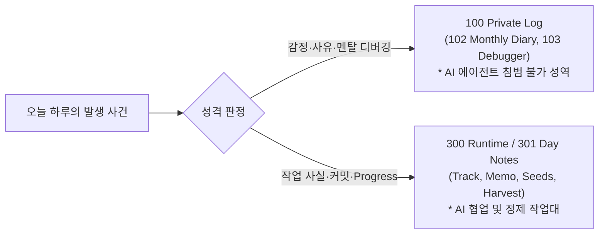

- table of contents
{:toc}

> "공간의 경계가 무너지면 지식은 쓰레기통이 된다. 노트를 작성할 때 '이걸 어디에 두어야 하지?'를 3초 이상 고민하는 순간, 시스템은 이미 죽어가고 있는 것이다."
> 수많은 생산성 유튜버들이 찬양하는 티아고 포르테의 PARA 시스템을 맹신하다가 겪은 6개월 만의 붕괴.
> 닉 밀로의 Atlas(MOC)와 도서관 십진분류법(Johnny Decimal)을 결합하고, 2,245개 파일을 도려내는 엑소더스를 감행하여 세운 9대 단일 책임 공간(Single Responsibility Directory)의 구축기.
{:.lead}

---

## 1. 생산성 유행의 배신: 왜 PARA는 6개월 만에 붕괴했는가

세컨드 브레인을 구축하려는 사람이라면 누구나 한 번쯤 티아고 포르테의 **PARA(Projects, Areas, Resources, Archives)** 시스템을 시도해 본다.

```
- Projects: 지금 진행 중인 마감일 있는 단기 작업
- Areas: 지속적으로 관리해야 하는 책임 영역 (건강, 재정 등)
- Resources: 관심 있는 주제의 학습 자료나 참고 문서
- Archives: 완료되거나 비활성화된 항목들
```

처음에는 완벽해 보였다. 분류 기준이 단 4개뿐이니 직관적이라 생각했다. 하지만 실제 개발 업무와 개인 학습이 맞물려 돌아가기 시작하자, 시스템은 서서히 균열을 일으켰다.

### Area와 Resource의 모호한 경계
가장 큰 재앙은 **"Area와 Resource의 모호함"**에서 비롯되었다.
예를 들어, 내가 회사 프로젝트를 위해 `FastAPI 비동기 처리`에 관한 문서를 작성했다고 치자.
* 이 문서는 현재 진행 중인 서비스 개발에 쓰이니 **Project**인가?
* 아니면 내가 백엔드 엔지니어로서 지속적으로 관리해야 할 전문성 영역이니 **Area**인가?
* 아니면 언젠가 다시 꺼내볼 비동기 프로그래밍 기술 자료이니 **Resource**인가?

노트를 쓸 때마다 이 세 폴더 사이에서 길을 잃었다. 결국 같은 주제의 노트가 Projects 폴더에도 있고, Areas 폴더에도 있고, Resources 폴더에도 파편화되어 흩어졌다. 검색을 하면 똑같은 키워드의 파편 3개가 서로 다른 버전으로 나타나 나를 비웃었다. 

외부 연구 통계에서도 검증된 사실이지만, PARA 시스템을 도입한 일반 사용자의 대다수가 **"Area와 Resource의 혼동을 끝내 극복하지 못하고 6개월 이내에 시스템을 포기"**한다. 실행 가능성(Actionability)이라는 주관적 잣대 하나로 모든 지식을 분류하려 했던 PARA는 근본적인 설계 결함을 안고 있었다.

---

## 2. 십진분류법과 Atlas(MOC)의 결합: 의도적 분류 체계의 선택

나는 두 가지 극단 사이에서 결단을 내려야 했다:
1. **극단적 평면 구조 (Zettelkasten / Steph Ango 방식)**: 폴더를 일체 만들지 않고 수천 개 노트를 루트 디렉토리에 쏟아부은 뒤 오직 링크로만 연결하는 방식.
2. **단순 계층 구조 (PARA / 전통적 폴더 방식)**: 주관적 카테고리로 층층이 폴더를 중첩하는 방식.

나는 닉 밀로(Nick Milo)의 **Atlas / LYT(Linking Your Thinking)** 방법론과 도서관 책 분류 체계인 **Johnny Decimal(십진분류법)**을 결합하는 제3의 길을 택했다.

앤디 마투샤크(Andy Matuschak) 같은 제텔카스텐 파워 유저들은 "계층적 분류(Taxonomy)는 생각의 창발을 가로막는다"고 주장하지만, 소프트웨어 엔지니어링의 세계에서는 정반대다. **객체지향 설계의 제1원칙이 단일 책임 원칙(SRP)이듯, 파일시스템 역시 각 구역이 명확한 단일 책임을 맡아야만 엔트로피가 통제된다.**

그래서 도입한 것이 **`000`부터 `900`까지의 10대 최상위 공간 번호 체계**였다:

```
000 Index              (시스템 메타 통제 및 온톨로지 관제탑)
100 Private Log        (감정과 자아의 격리실, AI 접근 불가 성역)
200 Dev Knowledge Base (보편적 개발 지식과 299 Principles 원칙)
300 Runtime            (지금 살아있는 실행 작업대, Day Notes, 프로젝트)
400 Logic Forge        (재현 가능한 의사결정 대장 ADR)
500 Mind Compiler      (가치 성찰 컴파일러, 파인만 6문)
600 Content Observatory(외부 지혜와 도서, 질문의 반증 관측소)
700 Life Stack         (생활 인프라, 세무, 건강, 잡학 격리)
800 [엑소더스 후 격리]   (과거 취미 서고, 메인 볼트에서 완전 분리)
900 Archive            (종료된 프로젝트와 낡은 프로세스의 무덤)
```

이 번호는 단순한 순서가 아니다. 지식이 외부에서 들어와(600, 100) ➔ 현재의 작업대에서 실행되고(300) ➔ 검증을 거쳐 영구 자산으로 승격되며(200, 400, 500) ➔ 수명이 다하면 퇴역하는(900) **지식의 물리적 라이프사이클 공간**이다.

---

## 3. 시간축과 공간축의 분리: 100 Private Log vs 301 Day Notes

메모 시스템이 붕괴하는 가장 흔한 원인은 **"나의 주관적 감정"과 "객관적인 작업 사실"이 한 문서에 뒤섞일 때**다.

많은 사람들이 데일리 노트(Daily Note) 하나를 켜두고, 아침에는 오늘 할 일 목록을 적고, 낮에는 코드 에러 로그를 붙여넣고, 저녁에는 "오늘 팀장님 때문에 너무 답답하고 우울했다"는 일기를 쓴다.

이것은 치명적인 실수다.
* 나중에 동일한 기술 에러를 겪어 데일리 노트를 검색하면, 과거의 우울한 감정과 사적인 넋두리가 함께 튀어나와 멘탈을 갉아먹는다.
* 반대로 내가 그 시절 어떤 고민을 했는지 돌아보려 하면, 수만 줄의 터미널 명령어와 SQL 쿼리 로그에 파묻혀 내 감정을 읽을 수 없다.

Vault OS는 이를 **시간축 수준에서 철저히 분리**했다:



### 100 Private Log: AI가 침범할 수 없는 인간의 성역
- **102 Monthly Diary**: 매월의 사건과 내면 상태를 기록하는 월간 일기.
- **103 Debugger**: 소프트웨어 디버거의 개념(self, breakpoint, watch, stack trace)을 차용하여 내면의 심리적 결함을 객관화하는 성찰 공간.
- **절대 규칙**: **AI 에이전트는 100번 디렉토리를 절대 읽거나 수정할 수 없다.** 이곳은 기계의 '친절한 요약'이나 '정제'가 닿아서는 안 되는, 오직 인간의 날것 그대로의 언어만 숨 쉬는 성역이다.

### 301 Day Notes: 팩트 중심의 실행 작업대
- 하루의 개발 작업, 배포 이력, 트러블슈팅 사실만 드라이하게 기록한다.
- 감정은 철저히 배제되며, 저녁이 되면 이 작업 기록은 `daily-distill` 파이프라인을 통해 지식으로 승격되고 원본은 비워진다.

---

## 4. 2,245개 파일의 TRPG 엑소더스 사건과 700 Life Stack 격리

2026년 초, 옵시디언 볼트는 심각한 성능 저하에 직면했다.
파일 검색창을 열면 1초 이상 딜레이가 생겼고, Git 커밋 크기는 눈덩이처럼 불어났으며, 그래프 뷰는 렉이 걸려 회전조차 되지 않았다.

원인을 분석해 보니 범인은 뜻밖에도 **TRPG 룰북과 시나리오 자료**였다. 취미로 즐기던 던전 앤 드래곤, 크툴루의 부름 등 룰북 PDF를 마크다운으로 변환해 둔 파일만 **2,245개**에 달했다. 

판타지 세계관의 주문 이름, 몬스터 스탯, 주사위 규칙들이 개발 기술 문서와 뒤섞여 전체 볼트의 50%가 넘는 용량을 차지하고 있었다. 파이썬이나 데이터베이스를 검색하면 게임 시나리오의 대사가 검색 결과 상단을 뒤덮었다.

나는 단호하게 **'TRPG 엑소더스'**를 단행했다:
1. 800번대 디렉토리의 TRPG 관련 파일 2,245개를 메인 볼트에서 완전히 분리하여 별도의 독립 볼트(`TRPG-Vault`)로 격리 추출했다.
2. 운동, 요리 레시피, 세무, 부동산 등 일상생활에 필수적인 데이터는 **`700 Life Stack`**이라는 단일 공간으로 몰아넣고 엄격한 격리벽을 세웠다.

엑소더스가 끝난 직후, 메인 볼트의 파일 수는 4,400개 수준으로 다이어트되었고, 인덱싱 속도와 검색 반응 속도는 5배 이상 빨라졌다. 

**"아무리 좋은 지식이라도 시스템의 목적과 섞이면 독이 된다."** 
이 사건을 통해 엔지니어링 지식베이스의 순도를 지키기 위한 공간 격리의 중요성을 뼈에 새겼다.

---

## 5. 300 Runtime: "지금 살아있는 것만 산다"

`300 Runtime`은 Vault OS에서 가장 역동적인 공간이다. 컴퓨터의 RAM(메모리)처럼, **"지금 현재 진행 중인 프로세스"**만 이 구역에 상주할 수 있다.

* `301 Day Notes`: 오늘의 작업대
* `302 Production Projects`: 현재 진행 중인 회사 프로덕션 프로젝트
* `303 Personal`: 현재 개발 중인 개인 사이드 프로젝트
* `330 Blog`: 세상과 소통하는 블로그 초안 및 발행 파이프라인

프로젝트가 성공적으로 론칭되거나 중단되면, 그 프로젝트는 300 Runtime에 1초도 더 머물 수 없다. 
핵심 교훈(Learnings)을 200 Dev KB로 승격시키고, 의사결정(ADR)을 400 Logic Forge에 박아 넣은 뒤, 프로젝트 디렉토리 전체는 미련 없이 **`900 Archive`**로 이동하여 영면한다.

작업 공간이 항상 가볍고 깨끗하게 유지되는 비결은 바로 이 냉정한 런타임 퇴역 규칙에 있다.

---

### [시리즈의 다음 이야기]
다음 글인 **[[2편] 백과사전, 작업대, 그리고 캡스톤: 실측 데이터로 갈라낸 지식의 세 층위](/tag-vault-os/2-three-tiers-of-knowledge/)**에서는, 단순한 기술 메모가 어떻게 24.3회의 수정을 거쳐 타협할 수 없는 실천 원칙(`299 Principles`)으로 완성되는지, 실측 데이터를 바탕으로 지식의 3층위 구조를 해부한다.
