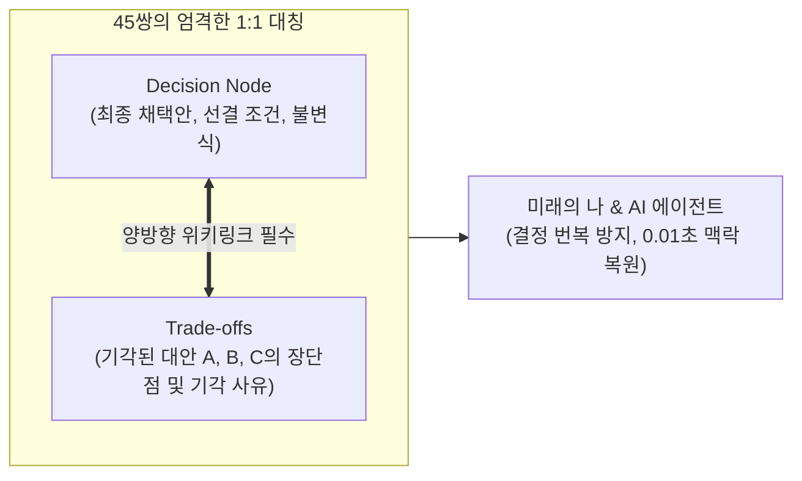
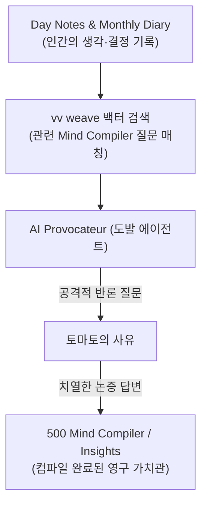

- table of contents
{:toc}

> "코드는 '어떻게(How)'를 말해주지만, '왜(Why)'를 말해주지 않는다. 왜 그 프레임워크를 버렸는지, 왜 그 라이브러리를 골랐는지 맥락이 사라진 결정은 6개월 뒤 반드시 번복되고 시스템을 퇴보시킨다."
> 소프트웨어 아키텍처 의사결정 기록(ADR)을 45쌍의 대칭 구조로 격상시킨 `400 Logic Forge`.
> 그리고 《세컨드 브레인》의 파인만 12문 철학을 계승하여, AI를 '친절한 비서'가 아닌 '나의 모순을 사정없이 찌르는 도발자(Provocateur)'로 마주 세운 `500 Mind Compiler`의 내부 아키텍처.
{:.lead}

---

## 1. 망각의 비용: "우리는 왜 그때 그런 결정을 내렸는가?"

소프트웨어 개발을 하다 보면 누구나 이런 경험을 한다:
"이 코드는 왜 이렇게 지저분하게 작성되어 있지? 깔끔하게 리팩터링하자!"
호기롭게 코드를 뜯어고친 뒤 배포하자마자, 잊고 있던 희귀한 엣지 케이스와 동시성 충돌이 터지며 서버가 마비된다.

그때서야 머리를 쥐어뜯으며 기억해 낸다:
"맞다, 6개월 전에 사파리 브라우저의 특정 버그 때문에 어쩔 수 없이 이렇게 우회 처리했던 거였지..."

결정의 결과(Code)는 남아있지만, 그 결정을 내리기까지 검토했던 **수많은 대안과 기각 사유, 트레이드오프의 맥락**이 사라졌기 때문에 벌어지는 비극이다.

1인 개발 환경에서는 이 문제가 더욱 치명적이다. 팀원이 없으니 왜 그런 결정을 내렸는지 물어볼 사람도 없고, 6개월 전의 내가 작성한 코드는 남이 짠 코드나 다름없다.

이 망각의 비용을 영구히 제거하기 위해 구축한 체계가 바로 **`400 Logic Forge`**다.

---

## 2. 400 Logic Forge: Decision Node와 Trade-offs의 45:45 대칭 구조

대부분의 개발자들이 작성하는 기술 검토 문서는 용두사미로 끝난다. 도입하고 싶은 기술의 장점만 잔뜩 나열하다가 "따라서 A를 도입한다"로 끝맺는다.

하지만 진정한 공학적 결정은 **"무엇을 얻고 무엇을 포기했는가"**를 정직하게 기록하는 것이다.

Vault OS의 Logic Forge는 모든 결정을 철저한 **1:1 대칭 쌍(Pair)**으로 관리한다:

```
400 Logic Forge/
  ├── Layer 2. Backend/Language & Framework Selection/
  │     ├── Decision Node - Backend Language Selection.md  (결정의 뼈대)
  │     └── Trade-offs - Python vs Go vs Rust.md           (대안들의 피비린내 나는 비교)
```



### 1) Decision Node: 결정의 선언
- 어떤 배경(Forces)에서 이 문제가 발생했는가?
- 최종적으로 채택된 설계와 그에 따른 후속 작업은 무엇인가?
- 이 결정이 유효하기 위한 전제 조건(Invariants)은 무엇인가?

### 2) Trade-offs: 대안의 묘지
- 검토했던 경쟁 대안들은 무엇이었는가? (예: Python FastAPI vs Go Gin vs Rust Axum)
- 각 대안의 생산성, 런타임 성능, 메모리 소비, 라이브러리 생태계 비교 매트릭스.
- **가장 중요한 섹션**: "왜 Go와 Rust를 기각하고 Python을 유지했는가?"에 대한 냉정한 반증 근거.

현재 Vault OS에는 아키텍처, 데이터베이스, 인프라 전반에 걸쳐 **45개의 Decision Node와 45개의 Trade-offs가 1:1로 완벽한 균형(90개 문서)**을 이루고 있다. 

이 대장이 존재하기에, 새로운 기능 구현을 지시받은 AI 에이전트도 이미 기각된 기술이나 패턴을 임의로 다시 들고나오는 헛발질을 원천 차단당한다.

---

## 3. 《세컨드 브레인》과 파인만 12문: 500 Mind Compiler의 기원

소프트웨어 아키텍처에 Logic Forge가 있다면, 한 인간으로서의 가치관과 사고방식에는 **`500 Mind Compiler`**가 있다.

이 시스템의 영감은 티아고 포르테의 《세컨드 브레인》 3장에 등장하는 물리학자 **리처드 파인만(Richard Feynman)의 이야기**에서 비롯되었다:

> "마음속에 항상 끊임없이 생각해야 할 **12가지 가장 좋아하는 질문(Favorite Questions)**을 품고 다녀라. 새로운 과학적 사실이나 아이디어를 접할 때마다 그 12가지 질문에 대입해 보라. 그러면 수많은 발견이 저절로 일어날 것이다."

나는 《세컨드 브레인》의 이 가르침을 받아들여, 내가 인생과 엔지니어링을 대하는 가장 본질적인 질문들을 벼려내어 **6대 질문 체계**로 정립했다:

* **Q1. System Sovereignty (시스템 주권)**: "어떻게 외부 플랫폼에 종속되지 않고 영구적인 나만의 시스템을 지킬 것인가?"
* **Q2. Knowledge Sharing (지식 체화와 공유)**: "어떻게 단순 암기를 넘어 지식을 행동으로 승격시키고 타인과 나눌 것인가?"
* **Q3. Focus & Agency (선택과 주도성)**: "쏟아지는 기술 유행 속에서 어떻게 본질적인 한 가지에 깊이 몰입할 것인가?"
* **Q4. Engineering Rigor (엔지니어링 엄밀함)**: "어떻게 감이나 운에 기대지 않고 결정론적 품질을 보장할 것인가?"
* **Q5. Autonomous AI Synergy (AI 공존)**: "어떻게 인간의 사고력을 외주 주지 않고 AI를 지적 외골격으로 삼을 것인가?"
* **Q6. Inner Resilience (내면 회복탄력성)**: "어떻게 번아웃과 불안을 다스리고 장기적인 성장을 지속할 것인가?"

그리고 이 질문들이 서로 교차하며 발견되는 상위 통찰을 묶는 **`Q7. Patterns & Synthesis`**를 두었다.

---

## 4. AI Provocateur: 비서가 아니라 '나의 모순을 찌르는 도발자'

많은 사람들이 AI에게 "내가 쓴 일기 요약해 줘", "내 아이디어 피드백해 줘"라고 부탁한다. 그러면 AI는 특유의 온화하고 친절한 어투로 칭찬과 동의 일색의 아첨을 늘어놓는다. 

이런 상호작용은 자아도취를 낳을 뿐, 생각을 단련하는 데 아무런 도움이 되지 않는다.

Mind Compiler에서 AI 에이전트의 역할은 비서가 아니다. **나의 전제를 의심하고, 모순을 찾아내며, 나를 불편하게 만드는 '도발자(Provocateur)'**다.



매주 주간 루프(`weekly-weave`)가 돌 때, AI는 벡터 검색 도구(`vv weave`)로 내가 지난 한 주 동안 남긴 메모들을 스캔하여 Mind Compiler의 질문들과 대조한다. 그리고 가차 없는 도발을 던진다:

> *"토마토님, 지난달 15일 Day Note에서는 '단순한 스크립트가 최고의 아키텍처'라고 적으셨습니다. 그런데 이번 주 작성하신 글에서는 왜 4단계 추상화 레이어를 도입하셨나요? 과거의 원칙이 게으름 때문에 타협된 것인가요, 아니면 새로운 제약이 생긴 것인가요? 근거를 제시하십시오."*

이 뼈아픈 질문을 마주했을 때, 나는 도망칠 수 없다.
내 과거의 결정과 현재의 행동을 정직하게 대면하고, 치열하게 논리를 세워 답변을 작성한다.

코드가 컴파일러를 통과해야 바이너리가 되듯, **인간의 날것 생각도 날카로운 반증과 충돌을 거쳐 컴파일되어야만 흔들리지 않는 가치관(Insights)이 된다.**

---

## 5. 600 Content Observatory: 타인의 지혜를 내 질문의 무기로 삼다

인터넷의 좋은 아티클이나 책을 읽었을 때, 그것을 단순 요약해 두면 아무런 힘이 없다.

Vault OS의 `600 Content Observatory`에 들어오는 모든 외부 콘텐츠는 단 하나의 엄격한 목적을 갖는다:
**"이 책의 주장은 500 Mind Compiler의 6가지 핵심 질문 중 어디를 지지하거나 반증하는가?"**

책을 읽고 감탄하는 데서 끝나지 않는다. 
저자의 통찰을 내 질문의 근거로 인용하여 내 생각의 무기로 편입시키거나, 반대로 저자의 허점을 내 실전 데이터로 반박하며 노트를 작성한다.

타인의 지혜를 소비하는 수동적 독자에서 벗어나, 고유한 질문을 품고 세상의 모든 텍스트를 내 운영체제의 입력값으로 사용하는 능동적 사유자로 거듭나는 공간이다.

---

### [시리즈의 다음 이야기]
다음 글인 **[[4편] 지식은 흐르지 않으면 썩는다: 매일, 매주, 매월의 3대 신진대사 루프](/tag-vault-os/4-knowledge-metabolism-loops/)**에서는, 《세컨드 브레인》의 핵심 교훈인 **정제(Distill)**를 기계적으로 실현한 3대 신진대사 루프(`daily-distill`, `weekly-weave`, `monthly-elevate`)와, 254건의 깨진 링크를 방어해 낸 실전 엔지니어링 메커니즘을 다룬다.
