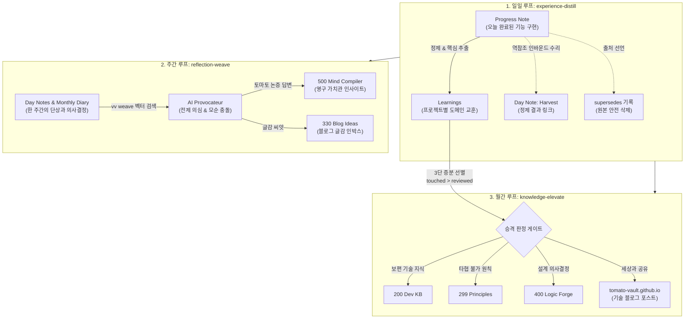

- table of contents
{:toc}

> "세상의 모든 생명체는 먹은 것을 분해하고 배설하는 신진대사(Metabolism)를 멈추는 순간 죽는다. 지식도 마찬가지다. 새로운 정보를 끊임없이 수집하면서도 그것을 압축하고 승격시키는 순환 루프가 없다면, 그 볼트는 지식의 생명체가 아니라 부패하는 시체들의 안치소다."
> 티아고 포르테의 《세컨드 브레인》이 던진 '정제(Distill)'의 화두를 기계적 워크플로우로 실현한 3대 대사작용 루프.
> 매일의 압축(`experience-distill`), 매주의 직조(`reflection-weave`), 매월의 승격(`knowledge-elevate`), 그리고 최종 출구인 기술 블로그(`tomato-vault.github.io`)로 이어지는 지식 순환 아키텍처.
{:.lead}

---

## 1. 정체의 늪: 왜 세컨드 브레인은 3개월 만에 멈추는가

세컨드 브레인을 처음 만들었을 때는 누구나 의욕이 넘친다.
책을 읽고 밑줄을 치고, 강의를 들으며 메모를 남긴다.
하지만 3개월쯤 지나면 대부분의 볼트는 정체된다.

왜일까? **"수집한 지식을 소화시키는 대사작용(Metabolism)"이 없기 때문이다.**

새로운 정보는 계속 들어오는데, 어제 작성한 메모는 어디론가 밀려나고, 지난달의 프로젝트 기록은 다시 열어보지도 않는다. 볼트는 점점 비대해지고, 노트를 열 때마다 "정리해야 하는데..."라는 죄책감만 쌓여가다가 결국 볼트 앱 자체를 열지 않게 된다.

《세컨드 브레인》의 핵심 교훈은 명확하다:
> **"정리(Organize)는 정제(Distill)를 위한 준비 단계일 뿐이다. 핵심을 찾아 추출하고, 그것을 새로운 창작물로 표현(Express)하라."**

Vault OS는 인간의 나약한 의지력에 기대지 않고, **매일, 매주, 매월 자동으로 동작하는 3단계 신진대사 파이프라인**을 구축하여 지식이 멈추지 않고 상위 계층으로 흐르도록 강제했다.

---

## 2. 3대 순환 루프 전체 조망

---

## 3. 제1 심장: daily-distill과 254건 깨진 링크의 비밀

`experience-distill`은 하루의 개발이 끝났을 때, 구현 과정에서 발생한 작업 노트(Progress Note)를 프로젝트의 영구 자산인 **`Learnings`**로 전환하는 일일 정제 의식이다.

### 1) 1:1 복사 금지와 압축
Progress Note는 작업 중의 시행착오, 터미널 로그, 임시 코드 스니펫 등 잡다한 부산물로 가득 차 있다. 이를 그대로 복사해 두면 아무도 다시 읽지 않는다.
* **도메인 진화(Domain Evolution)**: 한 기능이 v1 ➔ v2로 발전한 맥락을 단일 문서에 누적한다.
* **기술 패턴(Technical Pattern)**: 문제 ➔ 해결 패턴 ➔ 효과라는 3단 구조로 재사용 가능한 형태로 정제한다.

### 2) 254건 깨진 링크의 63%를 차지했던 참사의 해결
과거 볼트의 깨진 링크 254건을 전수 조사했을 때, 충격적인 사실이 드러났다.
**전체 깨진 링크의 63%(160건)가 작업 노트를 지우면서 발생했다는 점**이다!

낮에 Day Note에서 `[[Progress - 결제 API 연동]]`이라고 링크를 걸어두었는데, 저녁에 지식을 정제한답시고 그 노트를 지우거나 이름을 바꿔버리니, 과거의 Day Note들에 시뻘건 깨진 링크가 무더기로 발생했던 것이다.

Vault OS는 이를 두 가지 기계적 계약으로 해결했다:

1. **인바운드 수리 (역참조 갱신)**:
   - Progress Note를 삭제하기 **직전에**, Day Note가 걸어둔 위키링크를 새로 생성될 승격본 `Learnings`로 자동 치환한다.
2. **`supersedes` 메타데이터 선언**:
   - 승격된 Learnings의 frontmatter에 `supersedes: "[[Progress - 결제 API 연동]]"`을 명시하여, "내가 이전 노트를 대체하여 영구 승격된 정본"임을 선언한다.

이 계약이 세워진 이후, 볼트에서 원본 삭제로 인한 깨진 링크 발생률은 정확히 **0%**로 떨어졌다.

---

## 4. 제2 심장: weekly-weave (생각을 직조하는 주간 의식)

한 주가 끝나면, 그 주 동안 Day Notes에 흩뿌려진 파편화된 메모와 질문의 씨앗들을 수확하는 **`reflection-weave`**가 작동한다.

* **동작 메커니즘**:
  1. `vault-vector` (`vv`) 임베딩 검색 엔진을 구동하여, 최근 7일간 작성된 메모와 가장 밀접한 `500 Mind Compiler`의 질문을 찾아낸다.
  2. AI Provocateur가 그 질문과 이번 주의 작업 내용을 대조하여 도발적인 질문을 생성한다.
  3. 토마토의 답변을 거쳐 하나의 성찰(Insights)로 컴파일되고, 동시에 대외 발신할 매력적인 **블로그 글감 씨앗**으로 분기된다.

파편화된 생각들이 고립되어 사라지지 않고, 매주 한 번씩 나만의 가치관 그물망으로 엮여 들어가는 직조(Weave)의 시간이다.

---

## 5. 제3 심장: monthly-elevate (지식의 3단 증분 승격)

한 달이 지나면 프로젝트별로 수십 개의 `Learnings`가 쌓인다. 하지만 프로젝트 디렉토리에 갇힌 지식은 프로젝트가 끝나면 함께 잊힌다.

`knowledge-elevate`는 한 달 동안 축적된 지식을 상위 레벨로 격상시키는 **월간 지식 승격 파이프라인**이다.

### 3단 증분 선별 (Incremental Screening)
수백 개의 노트를 매월 전수 검토하는 것은 불가능하다. Vault OS는 3단계 증분 필터링을 거친다:
1. **touched (최근 변경)**: 지난 한 달간 실제로 수정되거나 살이 붙은 Learnings만 추출.
2. **reviewed (인간 검토)**: 일회성 버그 픽인지, 범용 패턴인지 인간이 판정.
3. **elevated (승격 확정)**:
   - 범용 기술 지식 ➔ **`200 Dev KB`** 백과사전으로 이동.
   - 타협할 수 없는 실천 철칙 ➔ **`299 Principles`**로 입성.
   - 아키텍처 결정 배경 ➔ **`400 Logic Forge`** ADR로 확정.

---

## 6. Express의 실천: 기술 블로그(tomato-vault.github.io)

《세컨드 브레인》의 마지막 단계인 **Express(표현과 공유)**는 이 3대 루프의 자연스러운 종착역이다.

매일의 정제(`daily-distill`), 매주의 성찰(`weekly-weave`), 매월의 승격(`monthly-elevate`)을 거치며 불순물이 걸러진 최상위 지식들은, 마침내 외부 세상을 향한 **기술 블로그 포스트(`tomato-vault.github.io`)**로 발행된다.

혼자 보려고 쓴 암호 같은 메모는 나조차 다시 읽지 않는다. 
하지만 "세상에 공개되어 다른 개발자의 시간을 아껴줄 수 있는 글"을 목표로 정제된 문장은, 가장 단단하고 명료한 나의 지적 자산이 된다.

**지식을 모으기만 하던 수집가는 죽었다. 이제 우리는 매일 대사작용을 거쳐 세상을 향해 가치를 발신하는 지식의 생산자다.**

---

### [시리즈의 다음 이야기]
다음 글인 **[[5편] 자연어 규칙은 반드시 깨진다: 전용 CLI와 파이썬 스키마로 세운 철통 하네스](/tag-vault-os/5-mechanical-harness-and-code-ontology/)**에서는, 프롬프트나 가이드라인에 적어둔 규칙이 왜 번번이 깨졌는지, 그리고 이를 기계적으로 틀어막기 위해 구축한 전용 CLI(`vault new`), 13개 type과 닫힌 화이트리스트 어휘, 그리고 SQLite CTE 기반 40ms 초고속 그래프 엔진의 내부를 공개한다.
