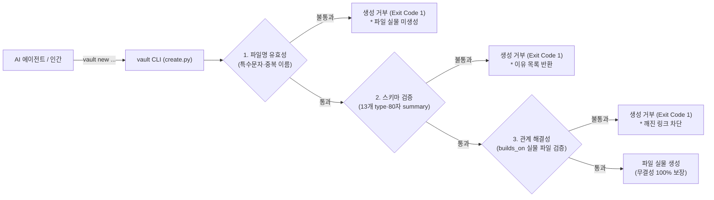

- table of contents
{:toc}

> "자연어 프롬프트는 잊혀지지만, 코드는 강제한다. '에이전트에게 규칙을 잘 설명하면 지키겠지'라는 순진한 기대는 반드시 배신당한다. 무결성은 도덕적 훈계가 아니라 컴파일러와 같은 기계적 하네스(Mechanical Harness)로만 지켜진다."
> `#6B4E8C` 색상 코드 태그 오염 사건과 프롬프트 지침의 파탄을 겪으며 세운 제1원칙.
> "에이전트는 Write 도구로 볼트에 문서를 직접 쓰지 못한다."
> 전용 CLI 관문(`vault new`), 엄격한 13개 type, 닫힌 화이트리스트 어휘, 그리고 4,400개 노트를 40ms 만에 탐색하는 SQLite CTE 그래프 엔진의 구축 실전기.
{:.lead}

---

## 1. 프롬프트 지침의 한계: 자연어 규칙은 반드시 깨진다

AI 에이전트(Claude Code, Antigravity, Codex 등)와 함께 지식베이스를 관리하기 시작했을 때, 나는 `AGENTS.md`에 수십 줄의 꼼꼼한 가이드라인을 적어두었다:
* "문서를 만들 때는 반드시 frontmatter에 `type`, `created`, `summary`를 적을 것."
* "태그는 기존 태그 목록에서만 골라 쓸 것."
* "문서 요약은 80자 이내로 간결하게 작성할 것."

결과는 어땠을까? **처참한 실패였다.**

세션이 길어지고 컨텍스트 윈도우가 차오르면, 에이전트는 어김없이 규칙을 잊어버렸다.
* `#Python`이 엄연히 존재하는데도 임의로 `#python-guide`, `#파이썬_팁` 같은 유사 태그를 마구잡이로 찍어내어 지식 그래프를 찢어놓았다.
* 심지어 본문에 마크다운으로 적어둔 hex 색상 코드 `#6B4E8C`나 이슈 번호 `#15`를 태그로 오인하여 볼트 전체 태그 목록에 오염물질로 등록해 버렸다.
* 파일명에 `:`나 `?` 같은 특수문자를 넣어 운영체제 간 파일 동기화를 깨뜨리기도 했다.

사람도 피곤하면 규칙을 어기듯, 확률적으로 텍스트를 생성하는 LLM에게 자연어로 "규칙을 지켜달라"고 부탁하는 것은 애초에 공학적으로 성립할 수 없는 기대였다.

규칙을 지키게 만드는 유일한 방법은 **규칙을 코드로 바꾸고, 기계적으로 강제하는 것(Hard Harness)**뿐이었다.

---

## 2. 제1원칙: "에이전트는 Write 도구로 볼트에 직접 문서를 만들지 못한다"

이 문제를 원천 차단하기 위해 세운 Vault OS의 철칙:
> **"인간이든 AI 에이전트든, 파일 생성 도구(Write Tool)로 볼트에 `.md` 파일을 직접 생성하는 것을 금지한다."**
> 새 문서는 오직 전용 CLI 도구인 **`vault new`** 관문을 통해서만 세상에 태어날 수 있다.



`vault new` 명령이 실행되면, 파이썬으로 작성된 스키마 검증 엔진(`validate_frontmatter`)이 먼저 구동된다.
스키마 조건을 단 하나라도 위반하면, **파일은 디스크에 쓰이지조차 않고 즉시 에러 코드(1)를 뱉으며 프로세스가 종료된다.**

에이전트는 파일 생성을 거부당한 뒤에야 자신이 무엇을 잘못 입력했는지를 깨닫고 올바른 메타데이터를 갖추어 재시도한다. 자연어 훈계 대신 **물리적 벽**을 세운 것이다.

---

## 3. 엄격한 13개 `type`과 닫힌 화이트리스트 어휘

### 1) 13개 고정 type과 타이브레이커(Tie-breaker)
Vault OS의 문서는 단 **13개의 `type`**으로만 분류된다. '기타(etc)'나 '임시' 같은 도피처는 존재하지 않는다:
* `concept`(개념), `procedure`(절차), `principle`(원칙), `decision`(결정), `tradeoff`(비교), `case`(장애 사건), `capture`(타인 글 필사), `review`(내 비평), `reflection`(성찰), `project-doc`(프로젝트 문서), `reference`(참조 사실), `log`(시간 기록), `hub`(인덱스).

경계가 모호할 때를 대비한 **타이브레이커 규칙**도 명문화되어 기계가 검증한다:
* *concept vs procedure*: 읽으면서 터미널이나 설정 화면을 여는가? 열면 `procedure`, 아니면 `concept`.
* *case vs procedure*: 시간 순서의 서사(Narrative)가 있으면 `case`, 재현 가능한 단계면 `procedure`.
* *hub 판정*: 본문에서 링크를 전부 지웠을 때 빈 껍데기만 남는다면 `hub`.

### 2) 닫힌 화이트리스트 어휘 (`vault tags`)
* AI 에이전트는 태그를 절대 창작할 수 없다.
* `vault tags` 명령이 출력하는 **읽기 전용 화이트리스트 어휘(250여 개)** 안에서만 선택할 수 있다.
* 목록에 없는 새 태그는 오직 사용자(토마토)에게 "제안"만 할 수 있으며, 지식 어휘의 확장은 철저히 인간의 주권으로 남겨두었다.

### 3) 생성과 검사의 단일 코드 공유 (`vault new`와 `vault lint`)
문서를 생성하는 `vault new`와, 볼트 전체 4,400개 문서를 전수 검사하는 `vault lint`는 완전히 동일한 파이썬 검증 함수를 호출한다.
생성 관문과 사후 검진의 기준이 같으므로, **"새로 생성된 문서는 동일한 조건의 lint를 무조건 100% 통과한다"**는 공리가 보장된다.

---

## 4. 물리적 인프라 통제: Git 857MB 다이어트와 iCloud 격리

지식베이스가 커지면 소프트웨어 엔지니어링 차원의 물리적 인프라 문제가 필연적으로 발생한다:

### 1) Git 857MB 바이너리 폭발 해결
과거 PDF 룰북과 대용량 스크린샷 이미지들이 마구잡이로 커밋되면서 볼트의 `.git` 폴더가 **857MB**까지 폭발했다. iCloud 동기화 속도가 바닥을 쳤고, 모바일 옵시디언 앱은 켜는 데 30초씩 걸렸다.
* **처방**: Git BFG Repo-Cleaner로 과거의 대용량 바이너리 히스토리를 전부 영구 삭제하고, 이미지는 `assets/`로 격리하여 LFS 또는 외부 CDN으로 분리했다.
* `.gitignore`에 iCloud 전용 메타데이터와 `.obsidian/workspace.json` 등 충돌을 유발하는 임시 설정 파일들을 등록하여 충돌을 원천 차단했다.

---

## 5. SQLite 재귀 CTE 기반 40ms 초고속 그래프 엔진

옵시디언의 기본 검색 기능은 4,000개가 넘는 마크다운 파일을 일일이 텍스트 스캔하므로 질의가 복잡해지면 느려진다.

Vault OS는 외부 의존성 제로(Python 표준 라이브러리 `sqlite3`, `pathlib`, `re`만 사용)의 **초고속 그래프 빌더**를 내장하고 있다:

```mermaid
flowchart LR
    MD["4,400개 .md 파일"] -->|vault build (0.8초)| DB["인메모리 SQLite DB<br/>(nodes, edges 테이블)"]
    DB -->|재귀 CTE 쿼리 (40ms)| QUERY["계보 추적 (builds_on 트리)<br/>고립 노드 탐색<br/>깨진 링크 전수 검출"]
```

* **빌드 속도**: 4,400개 마크다운 파일의 frontmatter와 위키링크를 파싱하여 SQLite DB로 인덱싱하는 데 걸리는 시간: **단 0.8초**.
* **질의 속도**: 특정 기술 문서가 의존하는 상위 선결 지식 트리를 재귀적으로 역추적(`WITH RECURSIVE`)하는 데 걸리는 시간: **단 40ms**.

이 초고속 그래프 엔진 덕분에 나와 AI 에이전트는 아무리 깊은 계보의 지식이라도 0.04초 만에 정확한 맥락을 불러와 작업할 수 있다.

---

## 6. 에필로그: 생각의 외골격을 입은 1인 개발자의 미래

수집 강박에 짓눌려 6,000개의 마크다운 노트가 쓰레기통이 되었던 시절을 돌아본다.
그때의 나는 지식을 모으기만 하면 똑똑해질 것이라 믿었던 철부지 수집가였다.

하지만 수많은 시행착오 끝에 세운 **Vault OS**는 나에게 단순한 메모장 이상의 존재가 되었다.
* 매일의 성취를 압축하는 신진대사 루프가 돌아가고,
* 45쌍의 의사결정 대장이 과거의 결정을 단단하게 받쳐주며,
* AI 에이전트가 나의 전제를 가차 없이 도발하고,
* 파이썬 스키마 하네스가 단 한 장의 오염된 문서도 허락하지 않는다.

2026년 1분기 진단에서 **상위 2% (93점)**의 건강한 지식 운영체제로 평가받았을 때, 나는 비로소 시스템 설계자에서 **'자신이 만든 시스템을 가장 사랑하고 잘 쓰는 운영자'**로 거듭났음을 느꼈다.

기록은 나를 가두는 부채가 아니라, 나를 더 높은 곳으로 밀어 올리는 가장 단단한 **생각의 외골격(Exoskeleton)**이다. 
우리는 매일 어제보다 더 단단한 지식의 성채를 짓는다.

---

### [시리즈를 마치며]
이것으로 **「Vault OS: 제텔카스텐과 PARA를 넘어 기계적 하네스로 지은 지식의 성채」** 시리즈 6부작을 마칩니다. 
수집의 무덤에서 벗어나 살아 숨 쉬는 지식 운영체제를 구축하고자 하는 모든 1인 개발자와 지식 노동자들에게 작은 나침반이 되기를 바랍니다.
